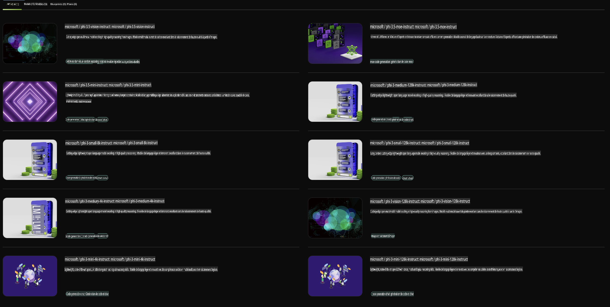

## Famille Phi dans NVIDIA NIM

NVIDIA NIM est un ensemble de microservices faciles à utiliser, conçus pour accélérer le déploiement de modèles d'IA générative dans le cloud, les centres de données et les stations de travail. Les NIM sont classés par famille de modèles et par modèle spécifique. Par exemple, NVIDIA NIM pour les grands modèles de langage (LLMs) apporte la puissance des LLMs de pointe aux applications d'entreprise, offrant des capacités inégalées de traitement et de compréhension du langage naturel.

NIM permet aux équipes IT et DevOps d'héberger elles-mêmes de grands modèles de langage (LLMs) dans leurs propres environnements gérés, tout en fournissant aux développeurs des API conformes aux normes de l'industrie, leur permettant de créer des copilotes, chatbots et assistants IA puissants qui peuvent transformer leur entreprise. En s'appuyant sur l'accélération GPU de pointe et le déploiement évolutif de NVIDIA, NIM offre le chemin le plus rapide vers l'inférence avec des performances inégalées.

Vous pouvez utiliser NVIDIA NIM pour effectuer des inférences avec les modèles de la famille Phi.



### **Exemples - Phi-3-Vision dans NVIDIA NIM**

Imaginez que vous avez une image (`demo.png`) et que vous souhaitez générer du code Python pour traiter cette image et en sauvegarder une nouvelle version (`phi-3-vision.jpg`).

Le code ci-dessus automatise ce processus en :

1. Configurant l'environnement et les paramètres nécessaires.
2. Créant une instruction qui demande au modèle de générer le code Python requis.
3. Envoyant cette instruction au modèle et collectant le code généré.
4. Extrayant et exécutant le code généré.
5. Affichant les images originale et traitée.

Cette approche exploite la puissance de l'IA pour automatiser les tâches de traitement d'image, les rendant plus simples et plus rapides à réaliser.

[Solution de Code Exemple](../../../../../code/06.E2E/E2E_Nvidia_NIM_Phi3_Vision.ipynb)

Analysons étape par étape ce que fait l'ensemble du code :

1. **Installer le package requis** :
    ```python
    !pip install langchain_nvidia_ai_endpoints -U
    ```
    Cette commande installe le package `langchain_nvidia_ai_endpoints`, en s'assurant qu'il s'agit de la version la plus récente.

2. **Importer les modules nécessaires** :
    ```python
    from langchain_nvidia_ai_endpoints import ChatNVIDIA
    import getpass
    import os
    import base64
    ```
    Ces importations permettent d'utiliser les modules nécessaires pour interagir avec les points de terminaison NVIDIA AI, gérer les mots de passe de manière sécurisée, interagir avec le système d'exploitation et encoder/décoder des données au format base64.

3. **Configurer la clé API** :
    ```python
    if not os.getenv("NVIDIA_API_KEY"):
        os.environ["NVIDIA_API_KEY"] = getpass.getpass("Enter your NVIDIA API key: ")
    ```
    Ce code vérifie si la variable d'environnement `NVIDIA_API_KEY` est définie. Sinon, il invite l'utilisateur à entrer sa clé API de manière sécurisée.

4. **Définir le modèle et le chemin de l'image** :
    ```python
    model = 'microsoft/phi-3-vision-128k-instruct'
    chat = ChatNVIDIA(model=model)
    img_path = './imgs/demo.png'
    ```
    Cela spécifie le modèle à utiliser, crée une instance de `ChatNVIDIA` avec le modèle indiqué et définit le chemin du fichier image.

5. **Créer une instruction textuelle** :
    ```python
    text = "Please create Python code for image, and use plt to save the new picture under imgs/ and name it phi-3-vision.jpg."
    ```
    Cela définit une instruction textuelle demandant au modèle de générer du code Python pour traiter une image.

6. **Encoder l'image en base64** :
    ```python
    with open(img_path, "rb") as f:
        image_b64 = base64.b64encode(f.read()).decode()
    image = f''
    ```
    Ce code lit le fichier image, l'encode en base64 et crée une balise HTML d'image avec les données encodées.

7. **Combiner le texte et l'image dans une instruction** :
    ```python
    prompt = f"{text} {image}"
    ```
    Cela combine l'instruction textuelle et la balise HTML d'image en une seule chaîne.

8. **Générer du code avec ChatNVIDIA** :
    ```python
    code = ""
    for chunk in chat.stream(prompt):
        print(chunk.content, end="")
        code += chunk.content
    ```
    Ce code envoie l'instruction à `ChatNVIDIA` model and collects the generated code in chunks, printing and appending each chunk to the `code` string.

9. **Extraire le code Python du contenu généré** :
    ```python
    begin = code.index('```python') + 9
    code = code[begin:]
    end = code.index('```')
    code = code[:end]
    ```
    Cela extrait le code Python réel du contenu généré en supprimant le formatage Markdown.

10. **Exécuter le code généré** :
    ```python
    import subprocess
    result = subprocess.run(["python", "-c", code], capture_output=True)
    ```
    Cela exécute le code Python extrait comme un sous-processus et capture sa sortie.

11. **Afficher les images** :
    ```python
    from IPython.display import Image, display
    display(Image(filename='./imgs/phi-3-vision.jpg'))
    display(Image(filename='./imgs/demo.png'))
    ```
    Ces lignes affichent les images à l'aide du module `IPython.display`.

**Avertissement** :  
Ce document a été traduit à l'aide de services de traduction basés sur l'intelligence artificielle. Bien que nous nous efforcions d'assurer l'exactitude, veuillez noter que les traductions automatisées peuvent contenir des erreurs ou des inexactitudes. Le document original dans sa langue d'origine doit être considéré comme la source faisant autorité. Pour des informations critiques, il est recommandé de faire appel à une traduction humaine professionnelle. Nous déclinons toute responsabilité en cas de malentendus ou de mauvaises interprétations résultant de l'utilisation de cette traduction.