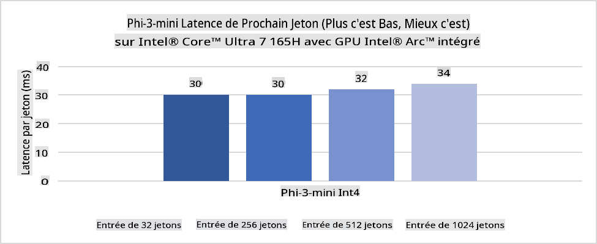
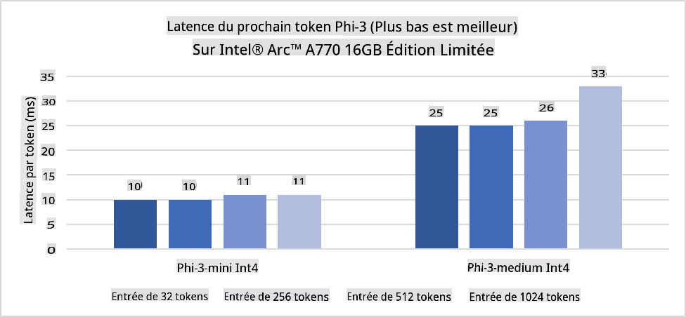
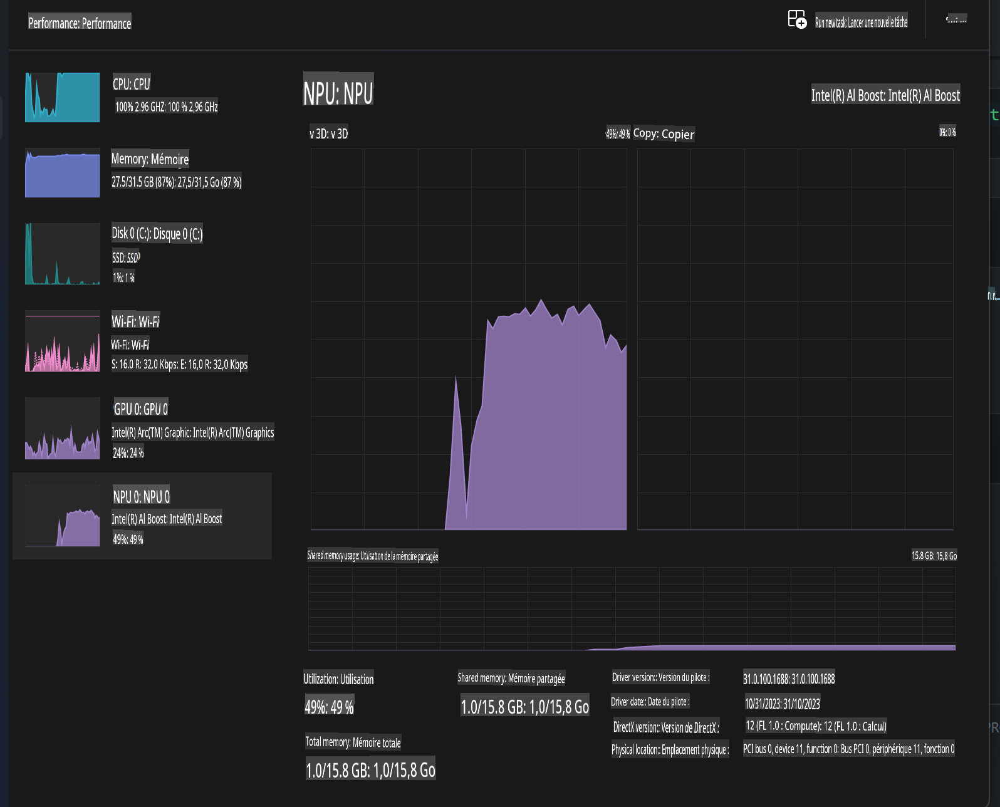
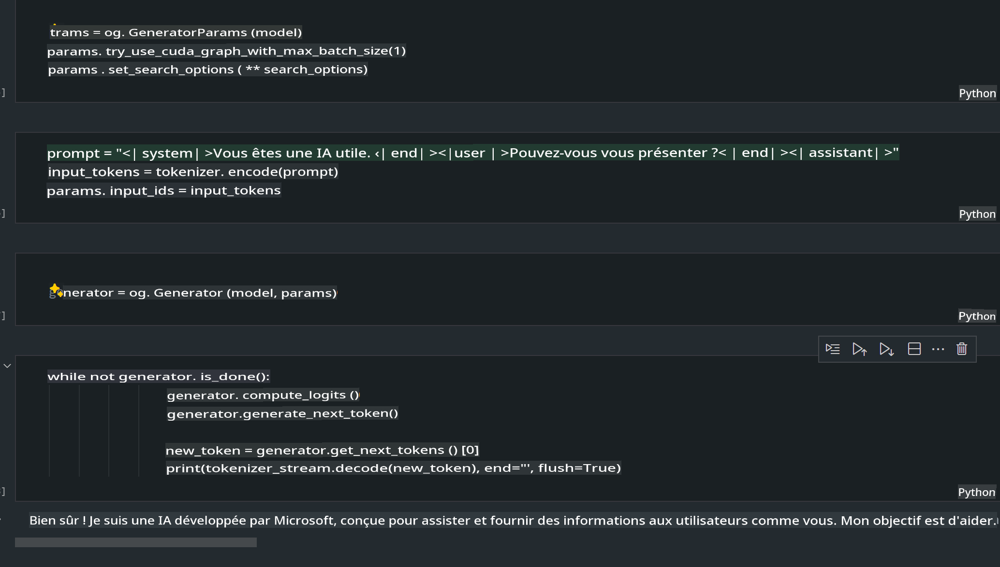
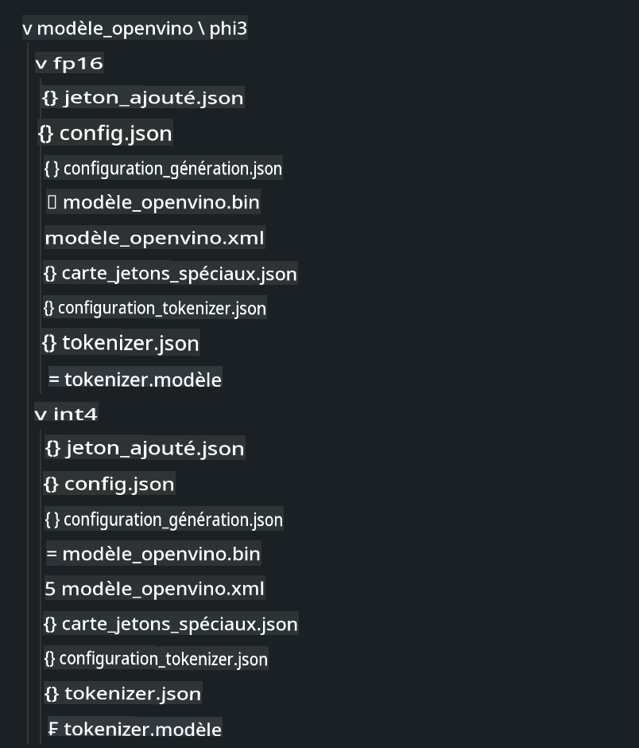
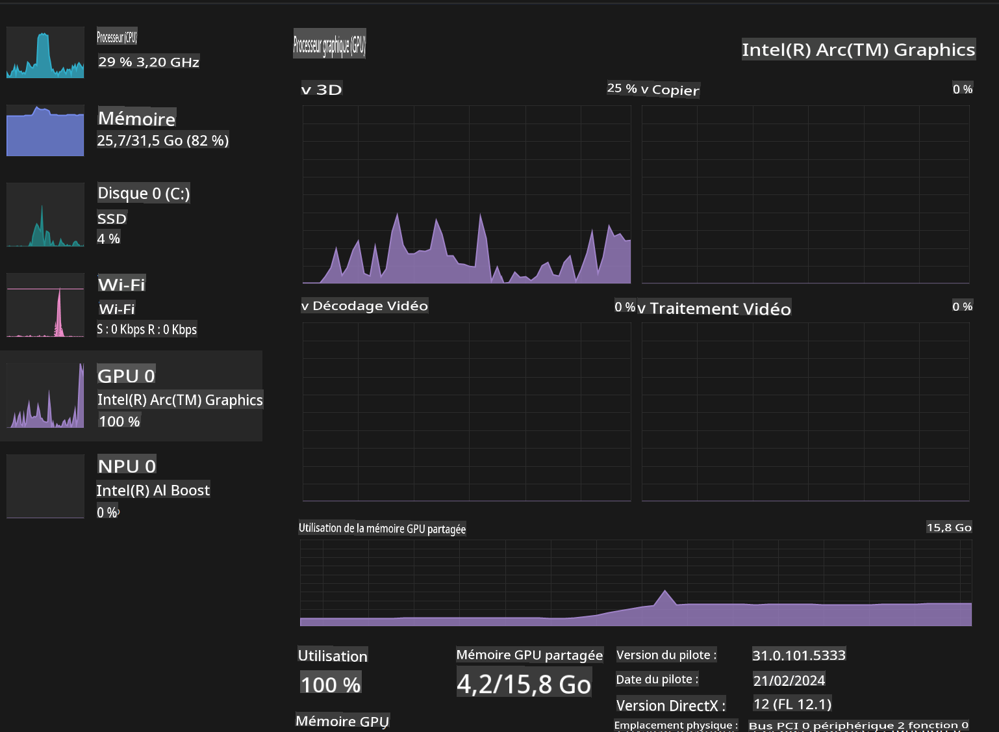

# **Inférence de Phi-3 sur un PC AI**

Avec l'avancée de l'IA générative et l'amélioration des capacités matérielles des appareils edge, de plus en plus de modèles d'IA générative peuvent désormais être intégrés aux appareils BYOD (Bring Your Own Device) des utilisateurs. Les PC AI font partie de ces modèles. À partir de 2024, Intel, AMD et Qualcomm collaborent avec les fabricants de PC pour introduire des PC AI permettant le déploiement de modèles d'IA générative localisés grâce à des modifications matérielles. Dans cette discussion, nous nous concentrerons sur les PC AI d'Intel et explorerons comment déployer Phi-3 sur un PC AI d'Intel.

### Qu'est-ce qu'un NPU ?

Un NPU (Neural Processing Unit) est un processeur ou une unité de traitement dédiée, intégrée dans un SoC plus grand, spécialement conçue pour accélérer les opérations des réseaux neuronaux et les tâches d'IA. Contrairement aux CPU et GPU généralistes, les NPU sont optimisés pour un calcul parallèle axé sur les données, ce qui les rend très efficaces pour traiter des données multimédias massives comme les vidéos et les images, ainsi que pour les données destinées aux réseaux neuronaux. Ils sont particulièrement performants pour les tâches liées à l'IA, comme la reconnaissance vocale, le floutage d'arrière-plan dans les appels vidéo, et les processus d'édition photo ou vidéo tels que la détection d'objets.

## NPU vs GPU

Bien que de nombreuses charges de travail d'IA et d'apprentissage automatique s'exécutent sur des GPU, il existe une distinction cruciale entre les GPU et les NPU.  
Les GPU sont réputés pour leurs capacités de calcul parallèle, mais tous les GPU ne sont pas également efficaces au-delà du traitement graphique. Les NPU, en revanche, sont conçus spécifiquement pour les calculs complexes impliqués dans les opérations des réseaux neuronaux, ce qui les rend extrêmement efficaces pour les tâches d'IA.

En résumé, les NPU sont les experts mathématiques qui accélèrent les calculs d'IA et jouent un rôle clé dans l'ère émergente des PC AI !

***Cet exemple est basé sur le dernier processeur Intel Core Ultra***

## **1. Utiliser le NPU pour exécuter le modèle Phi-3**

Le dispositif Intel® NPU est un accélérateur d'inférence d'IA intégré aux CPU clients d'Intel, à partir de la génération de CPU Intel® Core™ Ultra (anciennement connue sous le nom de Meteor Lake). Il permet une exécution écoénergétique des tâches des réseaux neuronaux artificiels.





**Bibliothèque d'accélération Intel NPU**

La bibliothèque d'accélération Intel NPU [https://github.com/intel/intel-npu-acceleration-library](https://github.com/intel/intel-npu-acceleration-library) est une bibliothèque Python conçue pour améliorer l'efficacité de vos applications en exploitant la puissance de l'Intel Neural Processing Unit (NPU) pour effectuer des calculs à grande vitesse sur du matériel compatible.

Exemple de Phi-3-mini sur un PC AI équipé de processeurs Intel® Core™ Ultra.


Installez la bibliothèque Python avec pip

```bash

   pip install intel-npu-acceleration-library

```

***Note*** Le projet est encore en cours de développement, mais le modèle de référence est déjà très complet.

### **Exécuter Phi-3 avec la bibliothèque d'accélération Intel NPU**

En utilisant l'accélération Intel NPU, cette bibliothèque n'affecte pas le processus d'encodage traditionnel. Il vous suffit d'utiliser cette bibliothèque pour quantifier le modèle Phi-3 original, comme FP16, INT8, INT4, par exemple :

```python
from transformers import AutoTokenizer, pipeline,TextStreamer
from intel_npu_acceleration_library import NPUModelForCausalLM, int4
from intel_npu_acceleration_library.compiler import CompilerConfig
import warnings

model_id = "microsoft/Phi-3-mini-4k-instruct"

compiler_conf = CompilerConfig(dtype=int4)
model = NPUModelForCausalLM.from_pretrained(
    model_id, use_cache=True, config=compiler_conf, attn_implementation="sdpa"
).eval()

tokenizer = AutoTokenizer.from_pretrained(model_id)

text_streamer = TextStreamer(tokenizer, skip_prompt=True)
```

Après la quantification réussie, poursuivez l'exécution pour appeler le NPU afin d'exécuter le modèle Phi-3.

```python
generation_args = {
   "max_new_tokens": 1024,
   "return_full_text": False,
   "temperature": 0.3,
   "do_sample": False,
   "streamer": text_streamer,
}

pipe = pipeline(
   "text-generation",
   model=model,
   tokenizer=tokenizer,
)

query = "<|system|>You are a helpful AI assistant.<|end|><|user|>Can you introduce yourself?<|end|><|assistant|>"

with warnings.catch_warnings():
    warnings.simplefilter("ignore")
    pipe(query, **generation_args)
```

Lors de l'exécution du code, nous pouvons consulter l'état d'exécution du NPU via le Gestionnaire des tâches.



***Exemples*** : [AIPC_NPU_DEMO.ipynb](../../../../../code/03.Inference/AIPC/AIPC_NPU_DEMO.ipynb)

## **2. Utiliser DirectML + ONNX Runtime pour exécuter le modèle Phi-3**

### **Qu'est-ce que DirectML**

[DirectML](https://github.com/microsoft/DirectML) est une bibliothèque DirectX 12 haute performance, accélérée par le matériel, pour l'apprentissage automatique. DirectML offre une accélération GPU pour les tâches d'apprentissage automatique courantes sur une large gamme de matériel et de pilotes compatibles, y compris tous les GPU compatibles DirectX 12 des fabricants tels qu'AMD, Intel, NVIDIA et Qualcomm.

Lorsqu'il est utilisé seul, l'API DirectML est une bibliothèque DirectX 12 de bas niveau, adaptée aux applications haute performance et à faible latence telles que les frameworks, les jeux et autres applications en temps réel. L'interopérabilité transparente de DirectML avec Direct3D 12, ainsi que sa faible surcharge et sa conformité sur différents matériels, en font une solution idéale pour accélérer l'apprentissage automatique lorsque des performances élevées et la fiabilité des résultats sur divers matériels sont essentielles.

***Note*** : La dernière version de DirectML prend déjà en charge les NPU (https://devblogs.microsoft.com/directx/introducing-neural-processor-unit-npu-support-in-directml-developer-preview/)

### DirectML et CUDA en termes de capacités et de performances :

**DirectML** est une bibliothèque d'apprentissage automatique développée par Microsoft. Elle est conçue pour accélérer les charges de travail d'apprentissage automatique sur les appareils Windows, y compris les ordinateurs de bureau, les ordinateurs portables et les appareils edge.  
- Basé sur DX12 : DirectML est construit sur DirectX 12 (DX12), offrant une large gamme de support matériel sur les GPU, y compris NVIDIA et AMD.  
- Support étendu : Puisqu'il s'appuie sur DX12, DirectML peut fonctionner avec n'importe quel GPU compatible DX12, même les GPU intégrés.  
- Traitement d'images : DirectML traite les images et autres données à l'aide de réseaux neuronaux, ce qui le rend adapté à des tâches telles que la reconnaissance d'images, la détection d'objets, etc.  
- Facilité d'installation : Configurer DirectML est simple et ne nécessite pas de SDK ou de bibliothèques spécifiques des fabricants de GPU.  
- Performances : Dans certains cas, DirectML offre de bonnes performances et peut être plus rapide que CUDA, notamment pour certaines charges de travail.  
- Limitations : Cependant, il existe des cas où DirectML peut être plus lent, en particulier pour les grandes tailles de lots float16.

**CUDA** est la plateforme de calcul parallèle et le modèle de programmation de NVIDIA. Elle permet aux développeurs d'exploiter la puissance des GPU NVIDIA pour des calculs généraux, y compris l'apprentissage automatique et les simulations scientifiques.  
- Spécifique à NVIDIA : CUDA est étroitement intégré aux GPU NVIDIA et spécialement conçu pour eux.  
- Hautement optimisé : Il offre d'excellentes performances pour les tâches accélérées par GPU, notamment avec les GPU NVIDIA.  
- Largement utilisé : De nombreux frameworks et bibliothèques d'apprentissage automatique (tels que TensorFlow et PyTorch) prennent en charge CUDA.  
- Personnalisation : Les développeurs peuvent ajuster les paramètres CUDA pour des tâches spécifiques, ce qui peut conduire à des performances optimales.  
- Limitations : Cependant, la dépendance de CUDA au matériel NVIDIA peut être limitante si vous souhaitez une compatibilité plus large avec différents GPU.

### Choisir entre DirectML et CUDA

Le choix entre DirectML et CUDA dépend de votre cas d'utilisation spécifique, de la disponibilité du matériel et de vos préférences.  
Si vous recherchez une compatibilité étendue et une facilité de configuration, DirectML pourrait être un bon choix. Cependant, si vous disposez de GPU NVIDIA et avez besoin de performances hautement optimisées, CUDA reste un choix solide. En résumé, DirectML et CUDA ont chacun leurs forces et leurs faiblesses, alors prenez en compte vos besoins et le matériel disponible pour prendre une décision.

### **IA générative avec ONNX Runtime**

À l'ère de l'IA, la portabilité des modèles d'IA est très importante. ONNX Runtime permet de déployer facilement des modèles entraînés sur différents appareils. Les développeurs n'ont pas besoin de se soucier du framework d'inférence et peuvent utiliser une API unifiée pour effectuer l'inférence des modèles. À l'ère de l'IA générative, ONNX Runtime a également effectué une optimisation du code (https://onnxruntime.ai/docs/genai/). Grâce à ONNX Runtime optimisé, le modèle d'IA générative quantifié peut être inféré sur différents terminaux. Avec ONNX Runtime, vous pouvez effectuer l'inférence des modèles d'IA via Python, C#, C / C++. Bien sûr, le déploiement sur iPhone peut tirer parti de l'API Generative AI avec ONNX Runtime en C++.

[Code Exemple](https://github.com/Azure-Samples/Phi-3MiniSamples/tree/main/onnx)

***Compiler l'IA générative avec la bibliothèque ONNX Runtime***

```bash

winget install --id=Kitware.CMake  -e

git clone https://github.com/microsoft/onnxruntime.git

cd .\onnxruntime\

./build.bat --build_shared_lib --skip_tests --parallel --use_dml --config Release

cd ../

git clone https://github.com/microsoft/onnxruntime-genai.git

cd .\onnxruntime-genai\

mkdir ort

cd ort

mkdir include

mkdir lib

copy ..\onnxruntime\include\onnxruntime\core\providers\dml\dml_provider_factory.h ort\include

copy ..\onnxruntime\include\onnxruntime\core\session\onnxruntime_c_api.h ort\include

copy ..\onnxruntime\build\Windows\Release\Release\*.dll ort\lib

copy ..\onnxruntime\build\Windows\Release\Release\onnxruntime.lib ort\lib

python build.py --use_dml


```

**Installer la bibliothèque**

```bash

pip install .\onnxruntime_genai_directml-0.3.0.dev0-cp310-cp310-win_amd64.whl

```

Voici le résultat d'exécution 



***Exemples*** : [AIPC_DirectML_DEMO.ipynb](../../../../../code/03.Inference/AIPC/AIPC_DirectML_DEMO.ipynb)

## **3. Utiliser Intel OpenVino pour exécuter le modèle Phi-3**

### **Qu'est-ce qu'OpenVINO**

[OpenVINO](https://github.com/openvinotoolkit/openvino) est un kit d'outils open-source pour optimiser et déployer des modèles d'apprentissage profond. Il offre des performances accrues pour les modèles de vision, d'audio et de langage issus de frameworks populaires comme TensorFlow, PyTorch, et plus encore. Commencez avec OpenVINO. OpenVINO peut également être utilisé en combinaison avec les CPU et GPU pour exécuter le modèle Phi-3.

***Note*** : Actuellement, OpenVINO ne prend pas en charge les NPU.

### **Installer la bibliothèque OpenVINO**

```bash

 pip install git+https://github.com/huggingface/optimum-intel.git

 pip install git+https://github.com/openvinotoolkit/nncf.git

 pip install openvino-nightly

```

### **Exécuter Phi-3 avec OpenVINO**

Comme pour le NPU, OpenVINO permet d'exécuter les modèles d'IA générative en utilisant des modèles quantifiés. Nous devons d'abord quantifier le modèle Phi-3 et effectuer la quantification du modèle via la ligne de commande avec optimum-cli.

**INT4**

```bash

optimum-cli export openvino --model "microsoft/Phi-3-mini-4k-instruct" --task text-generation-with-past --weight-format int4 --group-size 128 --ratio 0.6  --sym  --trust-remote-code ./openvinomodel/phi3/int4

```

**FP16**

```bash

optimum-cli export openvino --model "microsoft/Phi-3-mini-4k-instruct" --task text-generation-with-past --weight-format fp16 --trust-remote-code ./openvinomodel/phi3/fp16

```

Le format converti ressemble à ceci :



Chargez les chemins des modèles (model_dir), les configurations associées (ov_config = {"PERFORMANCE_HINT": "LATENCY", "NUM_STREAMS": "1", "CACHE_DIR": ""}), et les appareils accélérés par le matériel (GPU.0) via OVModelForCausalLM.

```python

ov_model = OVModelForCausalLM.from_pretrained(
     model_dir,
     device='GPU.0',
     ov_config=ov_config,
     config=AutoConfig.from_pretrained(model_dir, trust_remote_code=True),
     trust_remote_code=True,
)

```

Lors de l'exécution du code, nous pouvons consulter l'état d'exécution du GPU via le Gestionnaire des tâches.



***Exemples*** : [AIPC_OpenVino_Demo.ipynb](../../../../../code/03.Inference/AIPC/AIPC_OpenVino_Demo.ipynb)

### ***Note*** : Les trois méthodes mentionnées ci-dessus ont chacune leurs avantages, mais il est recommandé d'utiliser l'accélération NPU pour l'inférence sur PC AI.

**Avertissement** :  
Ce document a été traduit à l'aide de services de traduction automatique basés sur l'intelligence artificielle. Bien que nous fassions de notre mieux pour garantir l'exactitude, veuillez noter que les traductions automatiques peuvent contenir des erreurs ou des inexactitudes. Le document original dans sa langue d'origine doit être considéré comme la source faisant autorité. Pour des informations critiques, il est recommandé de recourir à une traduction humaine professionnelle. Nous déclinons toute responsabilité en cas de malentendus ou d'interprétations erronées résultant de l'utilisation de cette traduction.