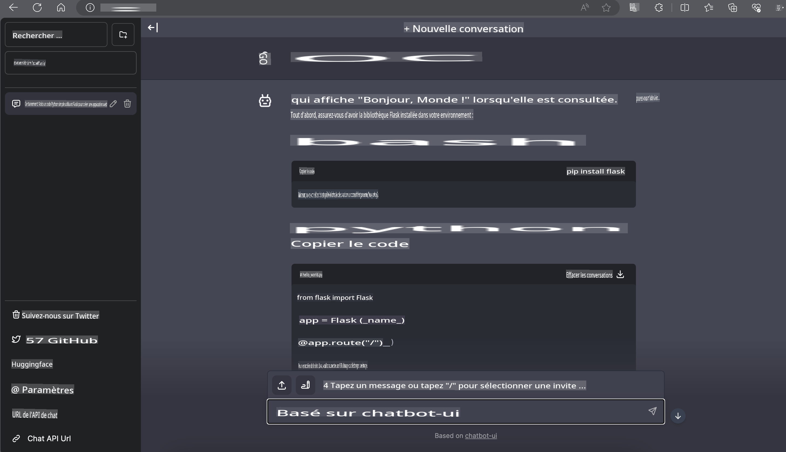

# **Inférence Phi-3 sur Nvidia Jetson**

Nvidia Jetson est une série de cartes informatiques embarquées développée par Nvidia. Les modèles Jetson TK1, TX1 et TX2 sont tous équipés d'un processeur Tegra (ou SoC) de Nvidia, intégrant un processeur central (CPU) basé sur l'architecture ARM. Jetson est un système à faible consommation énergétique conçu pour accélérer les applications d'apprentissage automatique. Nvidia Jetson est utilisé par des développeurs professionnels pour créer des produits d'IA révolutionnaires dans tous les secteurs, ainsi que par des étudiants et des passionnés pour apprendre l'IA de manière pratique et réaliser des projets impressionnants. SLM est déployé sur des appareils en périphérie, tels que Jetson, permettant une meilleure mise en œuvre des scénarios industriels d'applications génératives d'IA.

## Déploiement sur NVIDIA Jetson :
Les développeurs travaillant sur des robots autonomes et des appareils embarqués peuvent tirer parti de Phi-3 Mini. La taille relativement petite de Phi-3 en fait une solution idéale pour un déploiement en périphérie. Les paramètres ont été soigneusement ajustés pendant l'entraînement, garantissant une grande précision dans les réponses.

### Optimisation TensorRT-LLM :
La bibliothèque [TensorRT-LLM de NVIDIA](https://github.com/NVIDIA/TensorRT-LLM?WT.mc_id=aiml-138114-kinfeylo) optimise l'inférence des modèles de langage de grande taille. Elle prend en charge la fenêtre de contexte étendue de Phi-3 Mini, améliorant à la fois le débit et la latence. Les optimisations incluent des techniques comme LongRoPE, FP8 et le batching en vol.

### Disponibilité et Déploiement :
Les développeurs peuvent explorer Phi-3 Mini avec une fenêtre de contexte de 128K sur [l'IA de NVIDIA](https://www.nvidia.com/en-us/ai-data-science/generative-ai/). Il est fourni sous forme de NIM NVIDIA, un microservice avec une API standard pouvant être déployé partout. De plus, les [implémentations TensorRT-LLM sur GitHub](https://github.com/NVIDIA/TensorRT-LLM).

## **1. Préparation**

a. Jetson Orin NX / Jetson NX

b. JetPack 5.1.2+
   
c. Cuda 11.8
   
d. Python 3.8+

## **2. Exécution de Phi-3 sur Jetson**

Nous pouvons choisir [Ollama](https://ollama.com) ou [LlamaEdge](https://llamaedge.com).

Si vous souhaitez utiliser gguf à la fois dans le cloud et sur des appareils en périphérie, LlamaEdge peut être compris comme WasmEdge (WasmEdge est un environnement d'exécution WebAssembly léger, performant et évolutif, adapté aux applications natives pour le cloud, périphériques et décentralisées. Il prend en charge les applications serverless, les fonctions embarquées, les microservices, les contrats intelligents et les appareils IoT. Vous pouvez déployer le modèle quantifié de gguf sur des appareils en périphérie et dans le cloud via LlamaEdge).


Voici les étapes à suivre :

1. Installer et télécharger les bibliothèques et fichiers nécessaires

```bash

curl -sSf https://raw.githubusercontent.com/WasmEdge/WasmEdge/master/utils/install.sh | bash -s -- --plugin wasi_nn-ggml

curl -LO https://github.com/LlamaEdge/LlamaEdge/releases/latest/download/llama-api-server.wasm

curl -LO https://github.com/LlamaEdge/chatbot-ui/releases/latest/download/chatbot-ui.tar.gz

tar xzf chatbot-ui.tar.gz

```

**Note** : llama-api-server.wasm et chatbot-ui doivent être dans le même répertoire.

2. Exécuter les scripts dans le terminal

```bash

wasmedge --dir .:. --nn-preload default:GGML:AUTO:{Your gguf path} llama-api-server.wasm -p phi-3-chat

```

Voici le résultat de l'exécution :



***Exemple de code*** [Exemple de Notebook WASM Phi-3 Mini](https://github.com/Azure-Samples/Phi-3MiniSamples/tree/main/wasm)

En résumé, Phi-3 Mini représente une avancée majeure dans la modélisation linguistique, combinant efficacité, conscience du contexte et expertise en optimisation de NVIDIA. Que vous construisiez des robots ou des applications en périphérie, Phi-3 Mini est un outil puissant à connaître.

**Avertissement** :  
Ce document a été traduit à l'aide de services de traduction basés sur l'intelligence artificielle. Bien que nous fassions de notre mieux pour garantir l'exactitude, veuillez noter que les traductions automatisées peuvent contenir des erreurs ou des inexactitudes. Le document original dans sa langue d'origine doit être considéré comme la source faisant autorité. Pour des informations critiques, il est recommandé de faire appel à une traduction humaine professionnelle. Nous déclinons toute responsabilité en cas de malentendus ou d'interprétations erronées résultant de l'utilisation de cette traduction.