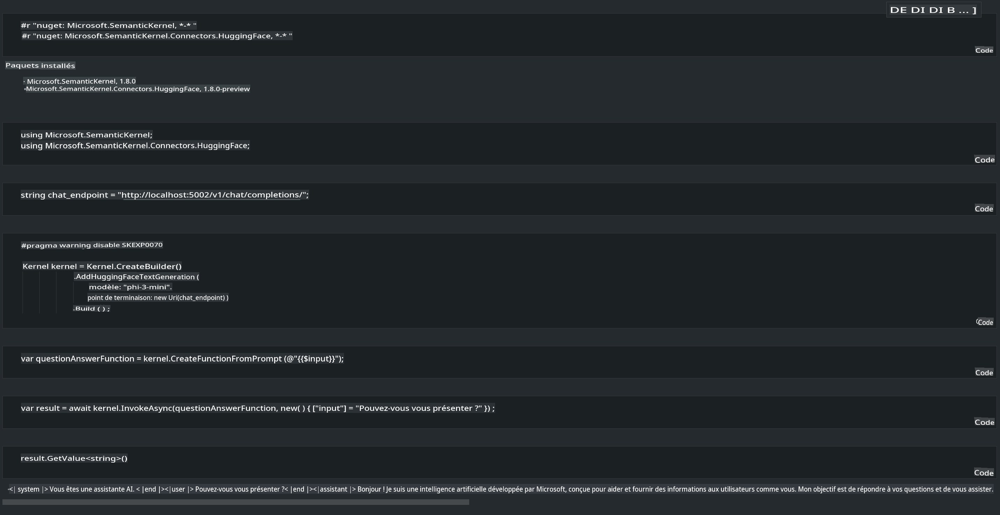

# **Inférence de Phi-3 sur un serveur local**

Nous pouvons déployer Phi-3 sur un serveur local. Les utilisateurs peuvent choisir les solutions [Ollama](https://ollama.com) ou [LM Studio](https://llamaedge.com), ou bien écrire leur propre code. Vous pouvez connecter les services locaux de Phi-3 via [Semantic Kernel](https://github.com/microsoft/semantic-kernel?WT.mc_id=aiml-138114-kinfeylo) ou [Langchain](https://www.langchain.com/) pour créer des applications Copilot.

## **Utiliser Semantic Kernel pour accéder à Phi-3-mini**

Dans l'application Copilot, nous créons des applications via Semantic Kernel / LangChain. Ce type de cadre applicatif est généralement compatible avec Azure OpenAI Service / les modèles OpenAI, et peut également prendre en charge les modèles open source sur Hugging Face ainsi que les modèles locaux. Que faire si nous voulons utiliser Semantic Kernel pour accéder à Phi-3-mini ? En utilisant .NET comme exemple, nous pouvons le combiner avec le connecteur Hugging Face dans Semantic Kernel. Par défaut, il peut correspondre à l'id du modèle sur Hugging Face (lors de la première utilisation, le modèle sera téléchargé depuis Hugging Face, ce qui peut prendre du temps). Vous pouvez également vous connecter au service local construit. Entre les deux options, nous recommandons d'utiliser la seconde, car elle offre un plus grand degré d'autonomie, en particulier dans les applications d'entreprise.

Comme le montre la figure, accéder aux services locaux via Semantic Kernel permet de se connecter facilement au serveur de modèle Phi-3-mini auto-hébergé. Voici le résultat de l'exécution.

***Code Exemple*** https://github.com/kinfey/Phi3MiniSamples/tree/main/semantickernel

**Avertissement** :  
Ce document a été traduit à l'aide de services de traduction basés sur l'intelligence artificielle. Bien que nous fassions de notre mieux pour garantir l'exactitude, veuillez noter que les traductions automatisées peuvent contenir des erreurs ou des inexactitudes. Le document original dans sa langue d'origine doit être considéré comme la source faisant autorité. Pour des informations critiques, il est recommandé de recourir à une traduction humaine professionnelle. Nous déclinons toute responsabilité en cas de malentendus ou de mauvaises interprétations découlant de l'utilisation de cette traduction.