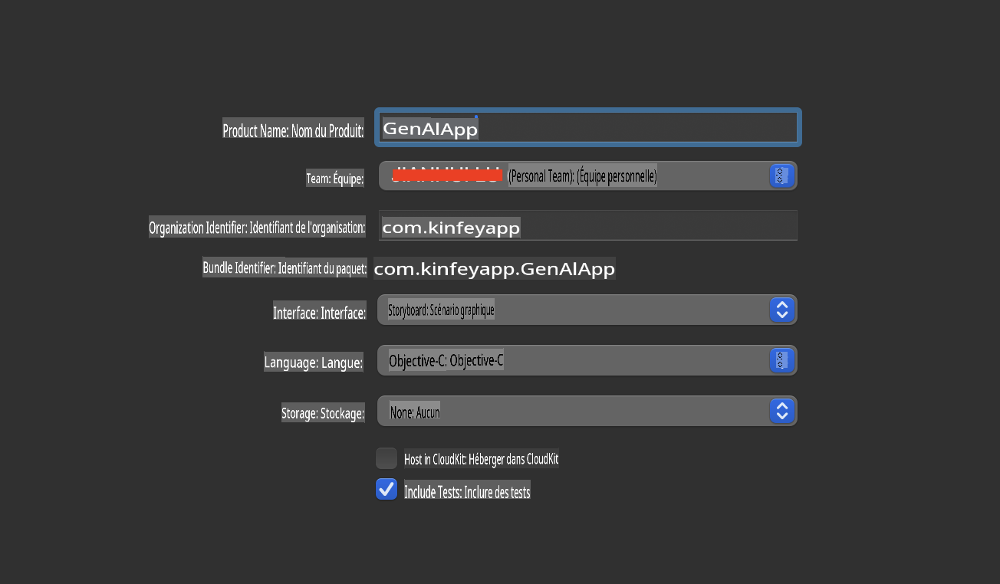
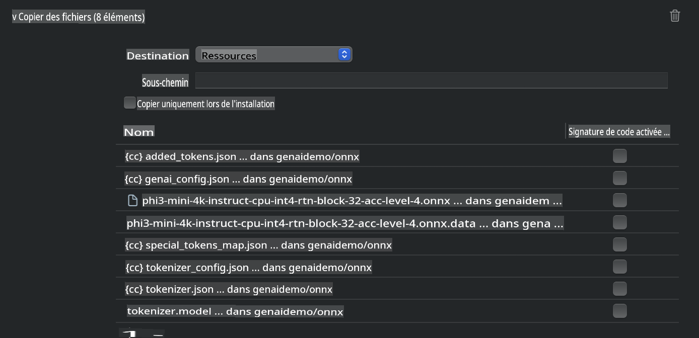
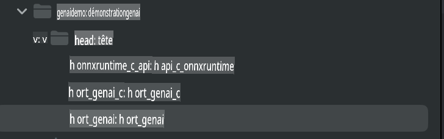
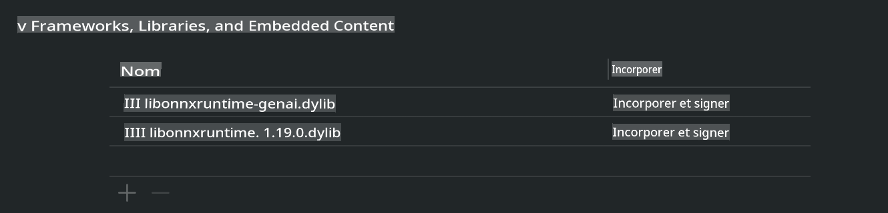
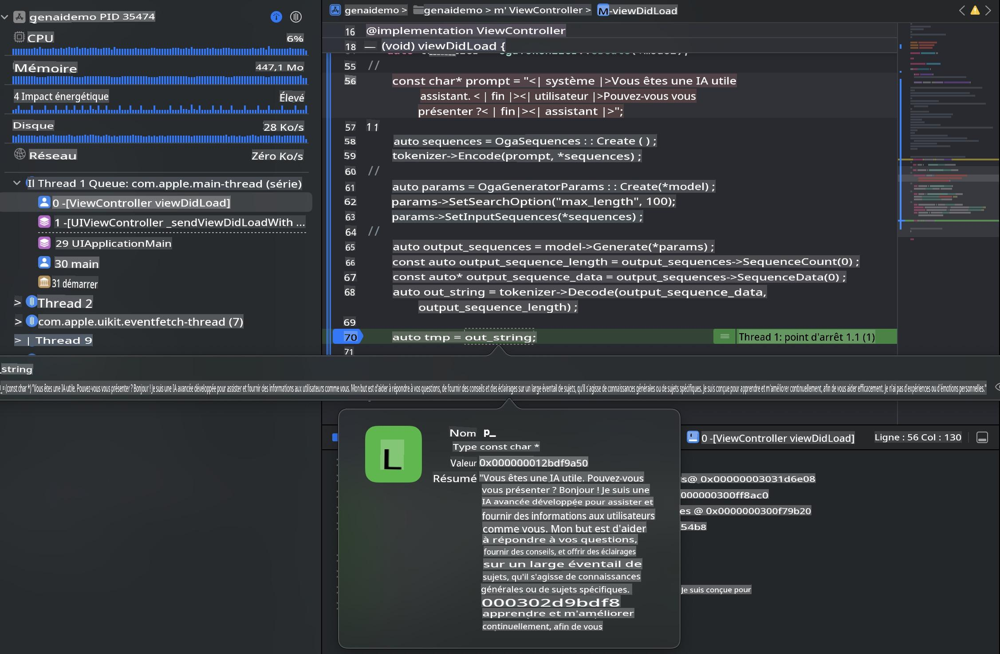

# **Inférence Phi-3 sur iOS**

Phi-3-mini est une nouvelle série de modèles de Microsoft permettant le déploiement de modèles de langage étendus (LLMs) sur des appareils edge et IoT. Phi-3-mini est disponible pour les déploiements sur iOS, Android et appareils edge, permettant de déployer l'IA générative dans des environnements BYOD. L'exemple suivant montre comment déployer Phi-3-mini sur iOS.

## **1. Préparation**

- **a.** macOS 14+  
- **b.** Xcode 15+  
- **c.** iOS SDK 17.x (iPhone 14 A16 ou supérieur)  
- **d.** Installer Python 3.10+ (Conda est recommandé)  
- **e.** Installer la bibliothèque Python : `python-flatbuffers`  
- **f.** Installer CMake  

### Semantic Kernel et inférence

Semantic Kernel est un framework applicatif qui permet de créer des applications compatibles avec Azure OpenAI Service, les modèles OpenAI et même des modèles locaux. L'accès aux services locaux via Semantic Kernel facilite l'intégration avec votre serveur de modèles Phi-3-mini auto-hébergé.

### Appel de modèles quantifiés avec Ollama ou LlamaEdge

De nombreux utilisateurs préfèrent utiliser des modèles quantifiés pour exécuter des modèles localement. [Ollama](https://ollama.com) et [LlamaEdge](https://llamaedge.com) permettent d'appeler différents modèles quantifiés :

#### **Ollama**

Vous pouvez exécuter `ollama run phi3` directement ou le configurer hors ligne. Créez un Modelfile avec le chemin vers votre fichier `gguf`. Exemple de code pour exécuter le modèle quantifié Phi-3-mini :

```gguf
FROM {Add your gguf file path}
TEMPLATE \"\"\"<|user|> .Prompt<|end|> <|assistant|>\"\"\"
PARAMETER stop <|end|>
PARAMETER num_ctx 4096
```

#### **LlamaEdge**

Si vous souhaitez utiliser `gguf` à la fois sur le cloud et sur des appareils edge simultanément, LlamaEdge est une excellente option.

## **2. Compilation d'ONNX Runtime pour iOS**

```bash

git clone https://github.com/microsoft/onnxruntime.git

cd onnxruntime

./build.sh --build_shared_lib --ios --skip_tests --parallel --build_dir ./build_ios --ios --apple_sysroot iphoneos --osx_arch arm64 --apple_deploy_target 17.5 --cmake_generator Xcode --config Release

cd ../

```

### **Remarques**

- **a.** Avant de compiler, assurez-vous que Xcode est correctement configuré et définissez-le comme répertoire de développement actif dans le terminal :

    ```bash
    sudo xcode-select -switch /Applications/Xcode.app/Contents/Developer
    ```

- **b.** ONNX Runtime doit être compilé pour différentes plateformes. Pour iOS, vous pouvez compiler pour `arm64` or `x86_64`.

- **c.** Il est recommandé d'utiliser la dernière version du SDK iOS pour la compilation. Cependant, vous pouvez également utiliser une version antérieure si vous avez besoin de compatibilité avec des SDK plus anciens.

## **3. Compilation de l'IA générative avec ONNX Runtime pour iOS**

> **Note :** Comme l'IA générative avec ONNX Runtime est en aperçu, veuillez noter qu'il pourrait y avoir des changements.

```bash

git clone https://github.com/microsoft/onnxruntime-genai
 
cd onnxruntime-genai
 
mkdir ort
 
cd ort
 
mkdir include
 
mkdir lib
 
cd ../
 
cp ../onnxruntime/include/onnxruntime/core/session/onnxruntime_c_api.h ort/include
 
cp ../onnxruntime/build_ios/Release/Release-iphoneos/libonnxruntime*.dylib* ort/lib
 
export OPENCV_SKIP_XCODEBUILD_FORCE_TRYCOMPILE_DEBUG=1
 
python3 build.py --parallel --build_dir ./build_ios --ios --ios_sysroot iphoneos --ios_arch arm64 --ios_deployment_target 17.5 --cmake_generator Xcode --cmake_extra_defines CMAKE_XCODE_ATTRIBUTE_CODE_SIGNING_ALLOWED=NO

```

## **4. Créer une application App dans Xcode**

J'ai choisi Objective-C comme méthode de développement de l'application, car en utilisant l'IA générative avec l'API C++ d'ONNX Runtime, Objective-C est mieux compatible. Bien sûr, vous pouvez également effectuer les appels associés via un pontage Swift.



## **5. Copier le modèle quantifié INT4 ONNX dans le projet d'application**

Nous devons importer le modèle de quantification INT4 au format ONNX, qui doit d'abord être téléchargé.


Après le téléchargement, vous devez l'ajouter au répertoire Resources du projet dans Xcode.



## **6. Ajouter l'API C++ dans les ViewControllers**

> **Remarques :**

- **a.** Ajoutez les fichiers d'en-tête C++ correspondants au projet.

  

- **b.** Incluez `onnxruntime-genai` dynamic library in Xcode.

  

- **c.** Use the C Samples code for testing. You can also add additional features like ChatUI for more functionality.

- **d.** Since you need to use C++ in your project, rename `ViewController.m` to `ViewController.mm` pour activer la prise en charge de l'Objective-C++.

```objc

    NSString *llmPath = [[NSBundle mainBundle] resourcePath];
    char const *modelPath = llmPath.cString;

    auto model =  OgaModel::Create(modelPath);

    auto tokenizer = OgaTokenizer::Create(*model);

    const char* prompt = "<|system|>You are a helpful AI assistant.<|end|><|user|>Can you introduce yourself?<|end|><|assistant|>";

    auto sequences = OgaSequences::Create();
    tokenizer->Encode(prompt, *sequences);

    auto params = OgaGeneratorParams::Create(*model);
    params->SetSearchOption("max_length", 100);
    params->SetInputSequences(*sequences);

    auto output_sequences = model->Generate(*params);
    const auto output_sequence_length = output_sequences->SequenceCount(0);
    const auto* output_sequence_data = output_sequences->SequenceData(0);
    auto out_string = tokenizer->Decode(output_sequence_data, output_sequence_length);
    
    auto tmp = out_string;

```

## **7. Exécuter l'application**

Une fois la configuration terminée, vous pouvez exécuter l'application pour voir les résultats de l'inférence du modèle Phi-3-mini.



Pour plus de code d'exemple et d'instructions détaillées, consultez le [dépôt Phi-3 Mini Samples](https://github.com/Azure-Samples/Phi-3MiniSamples/tree/main/ios).

**Avertissement** :  
Ce document a été traduit à l'aide de services de traduction automatique basés sur l'intelligence artificielle. Bien que nous nous efforcions d'assurer l'exactitude, veuillez noter que les traductions automatiques peuvent contenir des erreurs ou des inexactitudes. Le document original dans sa langue d'origine doit être considéré comme la source faisant autorité. Pour des informations critiques, il est recommandé de recourir à une traduction professionnelle réalisée par un humain. Nous déclinons toute responsabilité en cas de malentendus ou d'interprétations erronées résultant de l'utilisation de cette traduction.