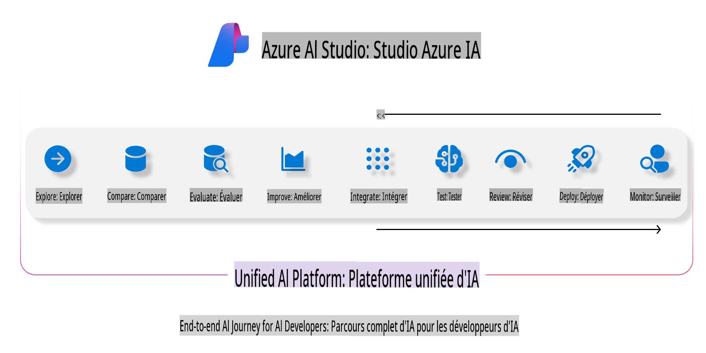
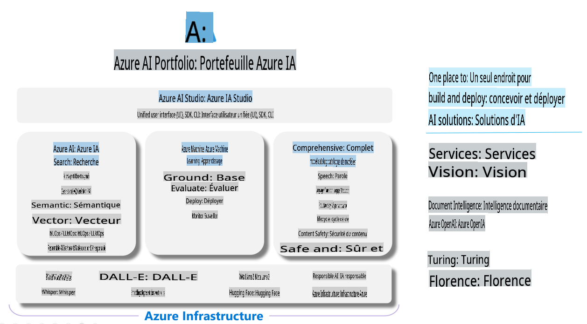

# **Utilisation d'Azure AI Foundry pour l'évaluation**

Comment évaluer votre application d'IA générative à l'aide de [Azure AI Foundry](https://ai.azure.com?WT.mc_id=aiml-138114-kinfeylo). Que vous évaluiez des conversations à un seul échange ou à plusieurs échanges, Azure AI Foundry fournit des outils pour analyser les performances et la sécurité des modèles.

## Comment évaluer des applications d'IA générative avec Azure AI Foundry
Pour des instructions plus détaillées, consultez la [documentation Azure AI Foundry](https://learn.microsoft.com/azure/ai-studio/how-to/evaluate-generative-ai-app?WT.mc_id=aiml-138114-kinfeylo).

Voici les étapes pour commencer :

## Évaluation des modèles d'IA générative dans Azure AI Foundry

**Prérequis**

- Un jeu de données de test au format CSV ou JSON.
- Un modèle d'IA générative déployé (comme les modèles Phi-3, GPT 3.5, GPT 4 ou Davinci).
- Un runtime avec une instance de calcul pour exécuter l'évaluation.

## Métriques d'évaluation intégrées

Azure AI Foundry vous permet d'évaluer à la fois des conversations simples à un seul échange et des conversations complexes à plusieurs échanges.  
Pour les scénarios de génération augmentée par récupération (RAG), où le modèle s'appuie sur des données spécifiques, vous pouvez évaluer les performances à l'aide de métriques d'évaluation intégrées.  
De plus, vous pouvez analyser des scénarios généraux de questions-réponses à un seul échange (non-RAG).

## Création d'une exécution d'évaluation

Depuis l'interface utilisateur d'Azure AI Foundry, accédez à la page Évaluer ou à la page Flux d'invite.  
Suivez l'assistant de création d'évaluation pour configurer une exécution d'évaluation. Fournissez un nom facultatif pour votre évaluation.  
Sélectionnez le scénario qui correspond aux objectifs de votre application.  
Choisissez une ou plusieurs métriques d'évaluation pour analyser les résultats du modèle.

## Flux d'évaluation personnalisé (optionnel)

Pour une plus grande flexibilité, vous pouvez établir un flux d'évaluation personnalisé. Adaptez le processus d'évaluation à vos besoins spécifiques.

## Consultation des résultats

Après avoir exécuté l'évaluation, enregistrez, consultez et analysez les métriques d'évaluation détaillées dans Azure AI Foundry. Obtenez des informations sur les capacités et les limites de votre application.

**Note** Azure AI Foundry est actuellement en aperçu public, il est donc recommandé de l'utiliser à des fins d'expérimentation et de développement. Pour des charges de travail en production, envisagez d'autres options. Explorez la [documentation officielle AI Foundry](https://learn.microsoft.com/azure/ai-studio/?WT.mc_id=aiml-138114-kinfeylo) pour plus de détails et des instructions étape par étape.

**Avertissement** :  
Ce document a été traduit à l'aide de services de traduction automatisés basés sur l'intelligence artificielle. Bien que nous nous efforcions d'assurer l'exactitude, veuillez noter que les traductions automatiques peuvent contenir des erreurs ou des inexactitudes. Le document original dans sa langue d'origine doit être considéré comme la source faisant autorité. Pour des informations critiques, il est recommandé de faire appel à une traduction humaine professionnelle. Nous déclinons toute responsabilité en cas de malentendus ou d'interprétations erronées résultant de l'utilisation de cette traduction.