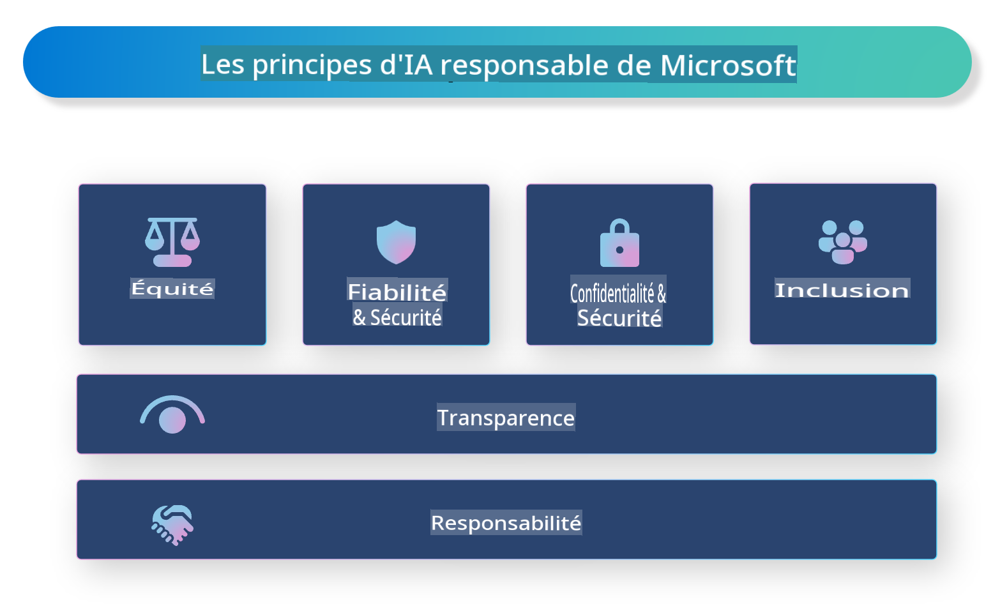

# **Introduction à l'IA Responsable**

[Microsoft Responsible AI](https://www.microsoft.com/ai/responsible-ai?WT.mc_id=aiml-138114-kinfeylo) est une initiative visant à aider les développeurs et les organisations à créer des systèmes d'IA transparents, fiables et responsables. Cette initiative fournit des conseils et des ressources pour développer des solutions d'IA responsables alignées sur des principes éthiques, tels que la confidentialité, l'équité et la transparence. Nous examinerons également certains des défis et des bonnes pratiques associés à la création de systèmes d'IA responsables.

## Vue d'ensemble de Microsoft Responsible AI 

**Principes éthiques** 

Microsoft Responsible AI s'appuie sur un ensemble de principes éthiques, tels que la confidentialité, l'équité, la transparence, la responsabilité et la sécurité. Ces principes visent à garantir que les systèmes d'IA sont développés de manière éthique et responsable.

**IA transparente**

Microsoft Responsible AI met l'accent sur l'importance de la transparence dans les systèmes d'IA. Cela inclut la fourniture d'explications claires sur le fonctionnement des modèles d'IA, ainsi que la garantie que les sources de données et les algorithmes soient accessibles publiquement.

**IA responsable** 

[Microsoft Responsible AI](https://www.microsoft.com/ai/responsible-ai?WT.mc_id=aiml-138114-kinfeylo) encourage le développement de systèmes d'IA responsables, capables de fournir des informations sur la manière dont les modèles d'IA prennent des décisions. Cela peut aider les utilisateurs à comprendre et à faire confiance aux résultats des systèmes d'IA.

**Inclusivité** 

Les systèmes d'IA doivent être conçus pour bénéficier à tout le monde. Microsoft vise à créer une IA inclusive qui prend en compte des perspectives diverses et évite les biais ou discriminations.

**Fiabilité et sécurité**

Garantir que les systèmes d'IA sont fiables et sûrs est essentiel. Microsoft se concentre sur la création de modèles robustes qui fonctionnent de manière cohérente et évitent les résultats nuisibles.

**Équité dans l'IA** 

Microsoft Responsible AI reconnaît que les systèmes d'IA peuvent perpétuer des biais s'ils sont formés sur des données ou des algorithmes biaisés. L'initiative fournit des conseils pour développer des systèmes d'IA équitables qui ne discriminent pas en fonction de facteurs tels que la race, le genre ou l'âge.

**Confidentialité et sécurité** 

Microsoft Responsible AI met l'accent sur l'importance de protéger la confidentialité des utilisateurs et la sécurité des données dans les systèmes d'IA. Cela inclut la mise en œuvre d'un chiffrement des données robuste et de contrôles d'accès, ainsi que des audits réguliers pour détecter les vulnérabilités.

**Responsabilité et redevabilité** 

Microsoft Responsible AI promeut la responsabilité et la redevabilité dans le développement et le déploiement de l'IA. Cela inclut de s'assurer que les développeurs et les organisations sont conscients des risques potentiels associés aux systèmes d'IA et prennent des mesures pour atténuer ces risques.

## Bonnes pratiques pour construire des systèmes d'IA responsables

**Développer des modèles d'IA à l'aide de jeux de données diversifiés** 

Pour éviter les biais dans les systèmes d'IA, il est important d'utiliser des jeux de données diversifiés qui représentent une variété de perspectives et d'expériences.

**Utiliser des techniques d'IA explicable** 

Les techniques d'IA explicable peuvent aider les utilisateurs à comprendre comment les modèles d'IA prennent des décisions, ce qui peut renforcer la confiance dans le système.

**Auditer régulièrement les systèmes d'IA pour détecter les vulnérabilités** 

Les audits réguliers des systèmes d'IA peuvent aider à identifier les risques et vulnérabilités potentiels qui doivent être corrigés.

**Mettre en œuvre un chiffrement des données et des contrôles d'accès robustes** 

Le chiffrement des données et les contrôles d'accès peuvent aider à protéger la confidentialité et la sécurité des utilisateurs dans les systèmes d'IA.

**Suivre des principes éthiques dans le développement de l'IA** 

Adopter des principes éthiques, tels que l'équité, la transparence et la responsabilité, peut aider à instaurer la confiance dans les systèmes d'IA et garantir qu'ils sont développés de manière responsable.

## Utilisation d'AI Foundry pour une IA Responsable 

[Azure AI Foundry](https://ai.azure.com?WT.mc_id=aiml-138114-kinfeylo) est une plateforme puissante qui permet aux développeurs et aux organisations de créer rapidement des applications intelligentes, innovantes, prêtes pour le marché et responsables. Voici quelques fonctionnalités et capacités clés d'Azure AI Foundry :

**API et modèles prêts à l'emploi** 

Azure AI Foundry propose des API et des modèles préconstruits et personnalisables. Ceux-ci couvrent un large éventail de tâches d'IA, y compris l'IA générative, le traitement du langage naturel pour les conversations, la recherche, la surveillance, la traduction, la reconnaissance vocale, la vision et la prise de décision.

**Prompt Flow** 

Prompt Flow dans Azure AI Foundry vous permet de créer des expériences d'IA conversationnelle. Il facilite la conception et la gestion de flux conversationnels, rendant plus simple la création de chatbots, d'assistants virtuels et d'autres applications interactives.

**Génération augmentée par la récupération (RAG)** 

RAG est une technique qui combine des approches basées sur la récupération et la génération. Elle améliore la qualité des réponses générées en exploitant à la fois des connaissances préexistantes (récupération) et la génération créative (génération).

**Évaluation et suivi des métriques pour l'IA générative** 

Azure AI Foundry propose des outils pour évaluer et surveiller les modèles d'IA générative. Vous pouvez analyser leurs performances, leur équité et d'autres métriques importantes pour garantir un déploiement responsable. De plus, si vous avez créé un tableau de bord, vous pouvez utiliser l'interface sans code dans Azure Machine Learning Studio pour personnaliser et générer un tableau de bord d'IA Responsable et une fiche d'évaluation associée basée sur les bibliothèques Python du [Responsible AI Toolbox](https://responsibleaitoolbox.ai/?WT.mc_id=aiml-138114-kinfeylo). Cette fiche d'évaluation permet de partager des informations clés liées à l'équité, à l'importance des caractéristiques et à d'autres considérations de déploiement responsable avec des parties prenantes techniques et non techniques.

Pour utiliser AI Foundry avec une IA responsable, vous pouvez suivre ces bonnes pratiques :

**Définir le problème et les objectifs de votre système d'IA**

Avant de commencer le processus de développement, il est important de définir clairement le problème ou l'objectif que votre système d'IA vise à résoudre. Cela vous aidera à identifier les données, les algorithmes et les ressources nécessaires pour construire un modèle efficace.

**Collecter et prétraiter des données pertinentes** 

La qualité et la quantité des données utilisées pour former un système d'IA peuvent avoir un impact significatif sur ses performances. Il est donc essentiel de collecter des données pertinentes, de les nettoyer, de les prétraiter et de s'assurer qu'elles sont représentatives de la population ou du problème que vous essayez de résoudre.

**Choisir une évaluation appropriée** 

Il existe divers algorithmes d'évaluation disponibles. Il est important de choisir l'algorithme le plus adapté à vos données et à votre problème.

**Évaluer et interpréter le modèle** 

Une fois que vous avez construit un modèle d'IA, il est important d'évaluer ses performances à l'aide de métriques appropriées et d'interpréter les résultats de manière transparente. Cela vous aidera à identifier d'éventuels biais ou limitations du modèle et à apporter des améliorations si nécessaire.

**Garantir la transparence et l'explicabilité** 

Les systèmes d'IA doivent être transparents et explicables pour que les utilisateurs puissent comprendre leur fonctionnement et la manière dont les décisions sont prises. Cela est particulièrement important pour les applications ayant un impact significatif sur la vie humaine, telles que les soins de santé, la finance et les systèmes juridiques.

**Surveiller et mettre à jour le modèle** 

Les systèmes d'IA doivent être surveillés et mis à jour en continu pour garantir qu'ils restent précis et efficaces au fil du temps. Cela nécessite une maintenance, des tests et un réentraînement réguliers du modèle.

En conclusion, Microsoft Responsible AI est une initiative visant à aider les développeurs et les organisations à construire des systèmes d'IA transparents, fiables et responsables. Rappelez-vous que la mise en œuvre d'une IA responsable est cruciale, et Azure AI Foundry vise à la rendre pratique pour les organisations. En suivant des principes éthiques et des bonnes pratiques, nous pouvons garantir que les systèmes d'IA sont développés et déployés de manière responsable, au bénéfice de la société dans son ensemble.

**Avertissement** :  
Ce document a été traduit à l'aide de services de traduction automatisée par intelligence artificielle. Bien que nous nous efforcions d'assurer l'exactitude, veuillez noter que les traductions automatiques peuvent contenir des erreurs ou des inexactitudes. Le document original dans sa langue d'origine doit être considéré comme la source faisant autorité. Pour des informations critiques, il est recommandé de faire appel à une traduction humaine professionnelle. Nous déclinons toute responsabilité en cas de malentendus ou d'interprétations erronées résultant de l'utilisation de cette traduction.