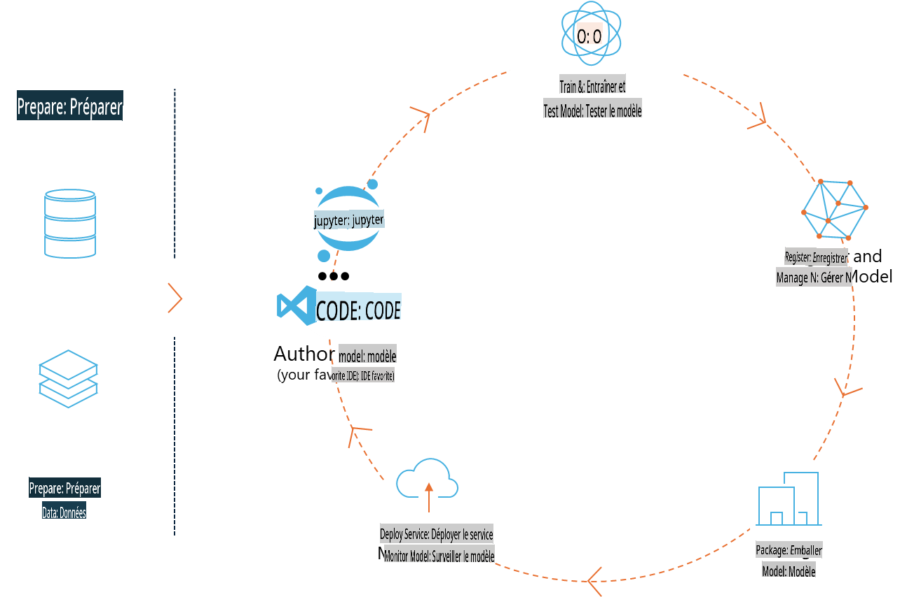
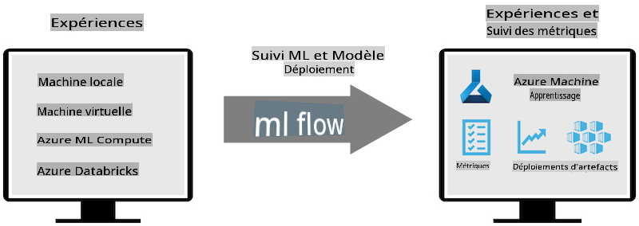
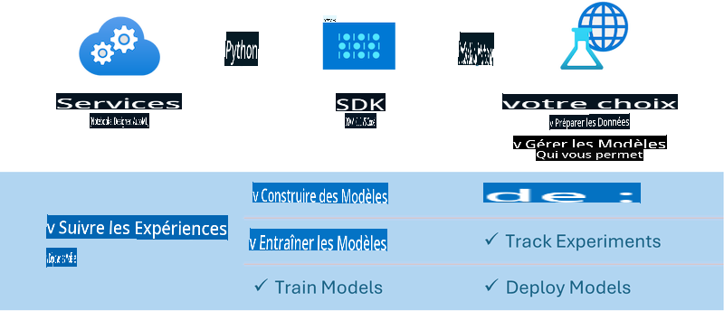

# MLflow

[MLflow](https://mlflow.org/) est une plateforme open-source conçue pour gérer le cycle de vie complet de l'apprentissage automatique.



MLFlow est utilisé pour gérer le cycle de vie du machine learning, y compris l'expérimentation, la reproductibilité, le déploiement et un registre centralisé de modèles. MLFlow propose actuellement quatre composants principaux :

- **MLflow Tracking :** Enregistrer et interroger les expériences, le code, la configuration des données et les résultats.
- **MLflow Projects :** Emballer le code de science des données dans un format permettant de reproduire les exécutions sur n'importe quelle plateforme.
- **MLflow Models :** Déployer des modèles de machine learning dans divers environnements de service.
- **Model Registry :** Stocker, annoter et gérer les modèles dans un dépôt centralisé.

Il comprend des fonctionnalités pour suivre les expériences, emballer le code dans des exécutions reproductibles, partager et déployer des modèles. MLFlow est intégré à Databricks et prend en charge une variété de bibliothèques de machine learning, ce qui le rend indépendant de toute bibliothèque spécifique. Il peut être utilisé avec n'importe quelle bibliothèque de machine learning et dans n'importe quel langage de programmation, grâce à une API REST et une CLI pour plus de commodité.



Les principales fonctionnalités de MLFlow incluent :

- **Suivi des expériences :** Enregistrer et comparer les paramètres et les résultats.
- **Gestion des modèles :** Déployer des modèles sur différentes plateformes de service et d'inférence.
- **Registre de modèles :** Gérer collaborativement le cycle de vie des modèles MLFlow, y compris la gestion des versions et des annotations.
- **Projets :** Emballer le code ML pour le partage ou l'utilisation en production.

MLFlow prend également en charge la boucle MLOps, qui inclut la préparation des données, l'enregistrement et la gestion des modèles, l'emballage des modèles pour l'exécution, le déploiement des services et la surveillance des modèles. Il vise à simplifier le passage d'un prototype à un workflow de production, en particulier dans les environnements cloud et edge.

## Scénario E2E - Construire un wrapper et utiliser Phi-3 comme modèle MLFlow

Dans cet exemple E2E, nous allons démontrer deux approches différentes pour construire un wrapper autour du modèle de langage Phi-3 (SLM) et l'exécuter ensuite en tant que modèle MLFlow, soit localement, soit dans le cloud, par exemple dans un espace de travail Azure Machine Learning.



| Projet | Description | Emplacement |
| ------------ | ----------- | -------- |
| Pipeline Transformer | Le pipeline Transformer est l'option la plus simple pour construire un wrapper si vous souhaitez utiliser un modèle HuggingFace avec la saveur expérimentale transformers de MLFlow. | [**TransformerPipeline.ipynb**](../../../../../../code/06.E2E/E2E_Phi-3-MLflow_TransformerPipeline.ipynb) |
| Wrapper Python personnalisé | Au moment de la rédaction, le pipeline transformer ne prenait pas en charge la génération de wrappers MLFlow pour les modèles HuggingFace au format ONNX, même avec le package Python expérimental optimum. Pour ces cas, vous pouvez construire votre propre wrapper Python personnalisé pour le mode MLFlow. | [**CustomPythonWrapper.ipynb**](../../../../../../code/06.E2E/E2E_Phi-3-MLflow_CustomPythonWrapper.ipynb) |

## Projet : Pipeline Transformer

1. Vous aurez besoin des packages Python pertinents de MLFlow et HuggingFace :

    ``` Python
    import mlflow
    import transformers
    ```

2. Ensuite, vous devez initier un pipeline transformer en vous référant au modèle cible Phi-3 dans le registre HuggingFace. Comme indiqué dans la fiche du modèle _Phi-3-mini-4k-instruct_, sa tâche est de type "Génération de texte" :

    ``` Python
    pipeline = transformers.pipeline(
        task = "text-generation",
        model = "microsoft/Phi-3-mini-4k-instruct"
    )
    ```

3. Vous pouvez maintenant sauvegarder le pipeline transformer de votre modèle Phi-3 au format MLFlow et fournir des détails supplémentaires tels que le chemin des artefacts cibles, les paramètres spécifiques de configuration du modèle et le type d'API d'inférence :

    ``` Python
    model_info = mlflow.transformers.log_model(
        transformers_model = pipeline,
        artifact_path = "phi3-mlflow-model",
        model_config = model_config,
        task = "llm/v1/chat"
    )
    ```

## Projet : Wrapper Python personnalisé

1. Nous pouvons utiliser ici l'[API generate() de Microsoft ONNX Runtime](https://github.com/microsoft/onnxruntime-genai) pour l'inférence du modèle ONNX et le codage/décodage des tokens. Vous devez choisir le package _onnxruntime_genai_ pour votre calcul cible, avec l'exemple ci-dessous ciblant le CPU :

    ``` Python
    import mlflow
    from mlflow.models import infer_signature
    import onnxruntime_genai as og
    ```

2. Notre classe personnalisée implémente deux méthodes : _load_context()_ pour initialiser le **modèle ONNX** de Phi-3 Mini 4K Instruct, les **paramètres du générateur** et le **tokenizer** ; et _predict()_ pour générer des tokens de sortie pour l'invite fournie :

    ``` Python
    class Phi3Model(mlflow.pyfunc.PythonModel):
        def load_context(self, context):
            # Retrieving model from the artifacts
            model_path = context.artifacts["phi3-mini-onnx"]
            model_options = {
                 "max_length": 300,
                 "temperature": 0.2,         
            }
        
            # Defining the model
            self.phi3_model = og.Model(model_path)
            self.params = og.GeneratorParams(self.phi3_model)
            self.params.set_search_options(**model_options)
            
            # Defining the tokenizer
            self.tokenizer = og.Tokenizer(self.phi3_model)
    
        def predict(self, context, model_input):
            # Retrieving prompt from the input
            prompt = model_input["prompt"][0]
            self.params.input_ids = self.tokenizer.encode(prompt)
    
            # Generating the model's response
            response = self.phi3_model.generate(self.params)
    
            return self.tokenizer.decode(response[0][len(self.params.input_ids):])
    ```

3. Vous pouvez maintenant utiliser la fonction _mlflow.pyfunc.log_model()_ pour générer un wrapper Python personnalisé (au format pickle) pour le modèle Phi-3, ainsi que le modèle ONNX original et les dépendances requises :

    ``` Python
    model_info = mlflow.pyfunc.log_model(
        artifact_path = artifact_path,
        python_model = Phi3Model(),
        artifacts = {
            "phi3-mini-onnx": "cpu_and_mobile/cpu-int4-rtn-block-32-acc-level-4",
        },
        input_example = input_example,
        signature = infer_signature(input_example, ["Run"]),
        extra_pip_requirements = ["torch", "onnxruntime_genai", "numpy"],
    )
    ```

## Signatures des modèles MLFlow générés

1. Dans l'étape 3 du projet Pipeline Transformer ci-dessus, nous avons défini la tâche du modèle MLFlow sur "_llm/v1/chat_". Cette instruction génère un wrapper d'API pour le modèle, compatible avec l'API Chat d'OpenAI, comme illustré ci-dessous :

    ``` Python
    {inputs: 
      ['messages': Array({content: string (required), name: string (optional), role: string (required)}) (required), 'temperature': double (optional), 'max_tokens': long (optional), 'stop': Array(string) (optional), 'n': long (optional), 'stream': boolean (optional)],
    outputs: 
      ['id': string (required), 'object': string (required), 'created': long (required), 'model': string (required), 'choices': Array({finish_reason: string (required), index: long (required), message: {content: string (required), name: string (optional), role: string (required)} (required)}) (required), 'usage': {completion_tokens: long (required), prompt_tokens: long (required), total_tokens: long (required)} (required)],
    params: 
      None}
    ```

2. En conséquence, vous pouvez soumettre votre invite dans le format suivant :

    ``` Python
    messages = [{"role": "user", "content": "What is the capital of Spain?"}]
    ```

3. Ensuite, utilisez le post-traitement compatible avec l'API OpenAI, par exemple _response[0][‘choices’][0][‘message’][‘content’]_, pour embellir votre sortie comme suit :

    ``` JSON
    Question: What is the capital of Spain?
    
    Answer: The capital of Spain is Madrid. It is the largest city in Spain and serves as the political, economic, and cultural center of the country. Madrid is located in the center of the Iberian Peninsula and is known for its rich history, art, and architecture, including the Royal Palace, the Prado Museum, and the Plaza Mayor.
    
    Usage: {'prompt_tokens': 11, 'completion_tokens': 73, 'total_tokens': 84}
    ```

4. Dans l'étape 3 du projet Wrapper Python personnalisé ci-dessus, nous permettons au package MLFlow de générer la signature du modèle à partir d'un exemple d'entrée donné. La signature du wrapper MLFlow ressemblera à ceci :

    ``` Python
    {inputs: 
      ['prompt': string (required)],
    outputs: 
      [string (required)],
    params: 
      None}
    ```

5. Ainsi, notre invite devra contenir la clé de dictionnaire "prompt", similaire à ceci :

    ``` Python
    {"prompt": "<|system|>You are a stand-up comedian.<|end|><|user|>Tell me a joke about atom<|end|><|assistant|>",}
    ```

6. La sortie du modèle sera alors fournie au format chaîne de caractères :

    ``` JSON
    Alright, here's a little atom-related joke for you!
    
    Why don't electrons ever play hide and seek with protons?
    
    Because good luck finding them when they're always "sharing" their electrons!
    
    Remember, this is all in good fun, and we're just having a little atomic-level humor!
    ```

**Avertissement** :  
Ce document a été traduit à l'aide de services de traduction automatisés basés sur l'intelligence artificielle. Bien que nous fassions de notre mieux pour garantir l'exactitude, veuillez noter que les traductions automatiques peuvent contenir des erreurs ou des inexactitudes. Le document original dans sa langue d'origine doit être considéré comme la source faisant autorité. Pour des informations critiques, il est recommandé de recourir à une traduction humaine professionnelle. Nous déclinons toute responsabilité en cas de malentendus ou d'interprétations erronées résultant de l'utilisation de cette traduction.