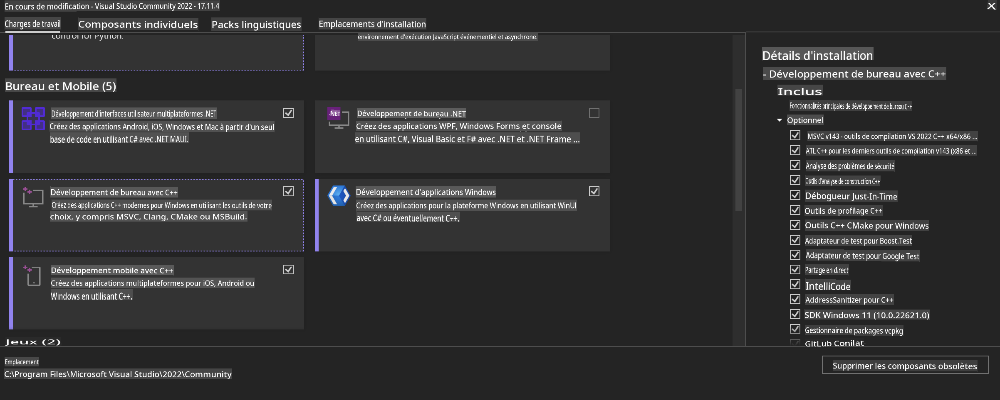

# **Guide pour OnnxRuntime GenAI Windows GPU**

Ce guide fournit les étapes pour configurer et utiliser ONNX Runtime (ORT) avec des GPU sous Windows. Il est conçu pour vous aider à exploiter l'accélération GPU pour vos modèles, améliorant ainsi les performances et l'efficacité.

Le document offre des conseils sur :

- Configuration de l'environnement : Instructions pour installer les dépendances nécessaires comme CUDA, cuDNN et ONNX Runtime.
- Configuration : Comment configurer l'environnement et ONNX Runtime pour utiliser efficacement les ressources GPU.
- Conseils d'optimisation : Suggestions pour ajuster vos paramètres GPU afin d'obtenir des performances optimales.

### **1. Python 3.10.x /3.11.8**

   ***Remarque*** Nous vous suggérons d'utiliser [miniforge](https://github.com/conda-forge/miniforge/releases/latest/download/Miniforge3-Windows-x86_64.exe) comme environnement Python.

   ```bash

   conda create -n pydev python==3.11.8

   conda activate pydev

   ```

   ***Rappel*** Si vous avez déjà installé une bibliothèque Python ONNX, veuillez la désinstaller.

### **2. Installer CMake avec winget**

   ```bash

   winget install -e --id Kitware.CMake

   ```

### **3. Installer Visual Studio 2022 - Développement Desktop avec C++**

   ***Remarque*** Si vous ne souhaitez pas compiler, vous pouvez ignorer cette étape.



### **4. Installer le pilote NVIDIA**

1. **Pilote GPU NVIDIA**  [https://www.nvidia.com/en-us/drivers/](https://www.nvidia.com/en-us/drivers/)

2. **NVIDIA CUDA 12.4** [https://developer.nvidia.com/cuda-12-4-0-download-archive](https://developer.nvidia.com/cuda-12-4-0-download-archive)

3. **NVIDIA CUDNN 9.4**  [https://developer.nvidia.com/cudnn-downloads](https://developer.nvidia.com/cudnn-downloads)

***Rappel*** Veuillez utiliser les paramètres par défaut lors du processus d'installation.

### **5. Configurer l'environnement NVIDIA**

Copiez les fichiers lib, bin, include de NVIDIA CUDNN 9.4 vers les dossiers correspondants de NVIDIA CUDA 12.4.

- Copiez les fichiers de *'C:\Program Files\NVIDIA\CUDNN\v9.4\bin\12.6'* vers *'C:\Program Files\NVIDIA GPU Computing Toolkit\CUDA\v12.4\bin'*

- Copiez les fichiers de *'C:\Program Files\NVIDIA\CUDNN\v9.4\include\12.6'* vers *'C:\Program Files\NVIDIA GPU Computing Toolkit\CUDA\v12.4\include'*

- Copiez les fichiers de *'C:\Program Files\NVIDIA\CUDNN\v9.4\lib\12.6'* vers *'C:\Program Files\NVIDIA GPU Computing Toolkit\CUDA\v12.4\lib\x64'*

### **6. Télécharger Phi-3.5-mini-instruct-onnx**

   ```bash

   winget install -e --id Git.Git

   winget install -e --id GitHub.GitLFS

   git lfs install

   git clone https://huggingface.co/microsoft/Phi-3.5-mini-instruct-onnx

   ```

### **7. Exécuter InferencePhi35Instruct.ipynb**

   Ouvrez [Notebook](../../../../../../code/09.UpdateSamples/Aug/ortgpu-phi35-instruct.ipynb) et exécutez-le.


### **8. Compiler ORT GenAI GPU**

   ***Remarque***

   1. Veuillez d'abord désinstaller toutes les bibliothèques liées à onnx, onnxruntime et onnxruntime-genai.

   ```bash

   pip list 
   
   ```

   Ensuite, désinstallez toutes les bibliothèques onnxruntime, par exemple :

   ```bash

   pip uninstall onnxruntime

   pip uninstall onnxruntime-genai

   pip uninstall onnxruntume-genai-cuda
   
   ```

   2. Vérifiez la prise en charge des extensions Visual Studio.

   Vérifiez dans C:\Program Files\NVIDIA GPU Computing Toolkit\CUDA\v12.4\extras que le dossier C:\Program Files\NVIDIA GPU Computing Toolkit\CUDA\v12.4\extras\visual_studio_integration est présent.

   S'il n'est pas trouvé, vérifiez d'autres dossiers du pilote CUDA Toolkit et copiez le dossier visual_studio_integration et son contenu dans C:\Program Files\NVIDIA GPU Computing Toolkit\CUDA\v12.4\extras\visual_studio_integration.

   - Si vous ne souhaitez pas compiler, vous pouvez ignorer cette étape.

   ```bash

   git clone https://github.com/microsoft/onnxruntime-genai

   ```

   - Téléchargez [https://github.com/microsoft/onnxruntime/releases/download/v1.19.2/onnxruntime-win-x64-gpu-1.19.2.zip](https://github.com/microsoft/onnxruntime/releases/download/v1.19.2/onnxruntime-win-x64-gpu-1.19.2.zip)

   - Décompressez onnxruntime-win-x64-gpu-1.19.2.zip, renommez-le en **ort**, et copiez le dossier ort dans onnxruntime-genai.

   - À l'aide de Windows Terminal, accédez à l'invite de commande pour développeurs de VS 2022 et naviguez jusqu'à onnxruntime-genai.


   - Compilez-le avec votre environnement Python.

   ```bash

   cd onnxruntime-genai

   python build.py --use_cuda  --cuda_home "C:\Program Files\NVIDIA GPU Computing Toolkit\CUDA\v12.4" --config Release
 

   cd build/Windows/Release/Wheel

   pip install .whl

   ```

**Avertissement** :  
Ce document a été traduit à l'aide de services de traduction automatisée basés sur l'intelligence artificielle. Bien que nous fassions de notre mieux pour garantir l'exactitude, veuillez noter que les traductions automatiques peuvent contenir des erreurs ou des inexactitudes. Le document original dans sa langue d'origine doit être considéré comme la source faisant autorité. Pour des informations cruciales, il est recommandé de recourir à une traduction humaine professionnelle. Nous déclinons toute responsabilité en cas de malentendus ou d'interprétations erronées résultant de l'utilisation de cette traduction.