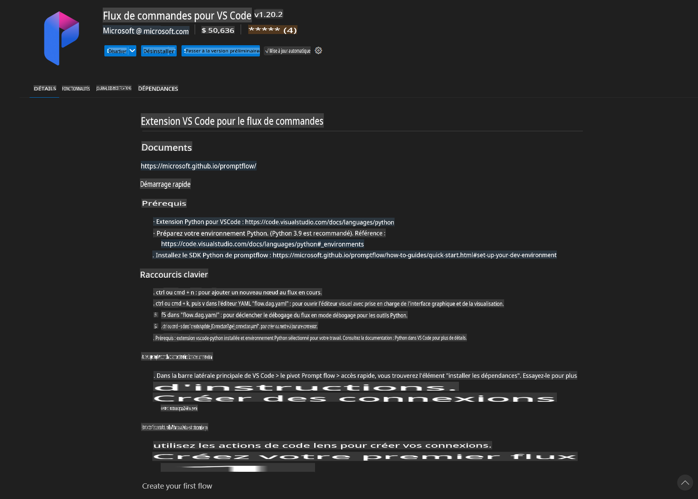
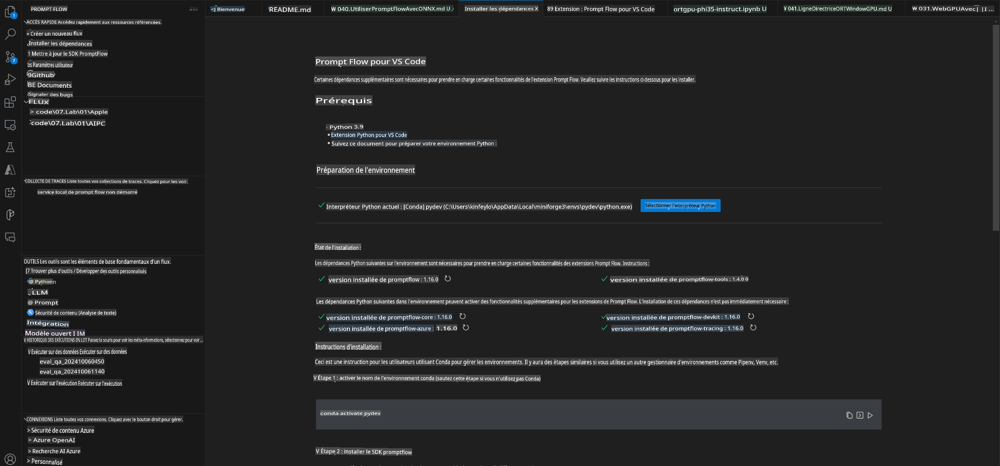
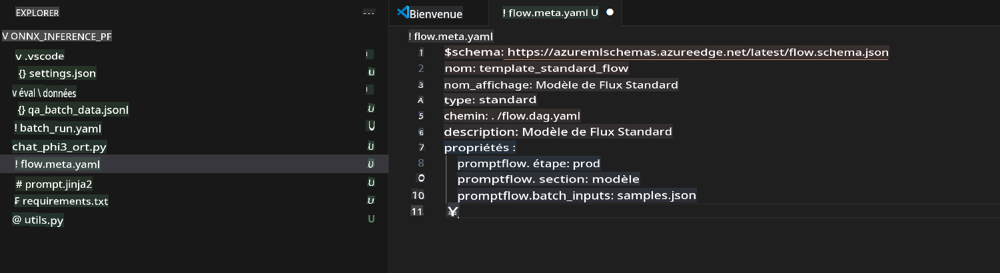
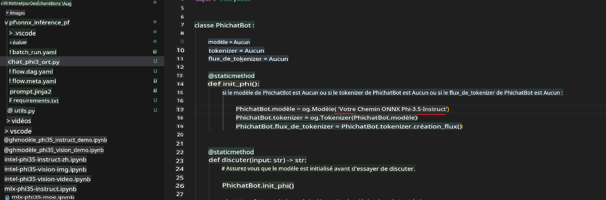
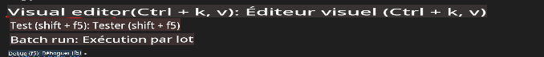
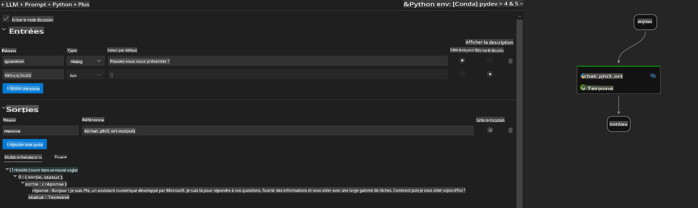
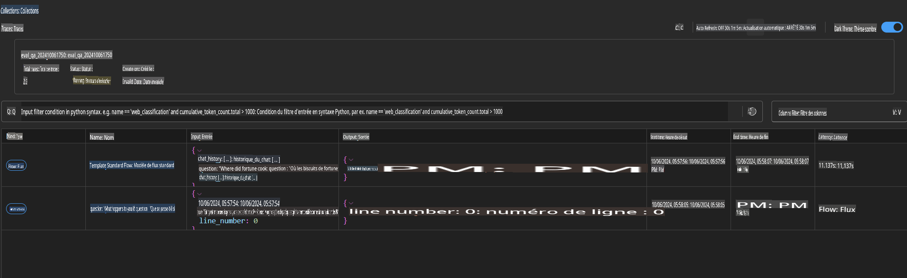

# Utiliser le GPU Windows pour créer une solution Prompt Flow avec Phi-3.5-Instruct ONNX 

Le document suivant est un exemple d'utilisation de PromptFlow avec ONNX (Open Neural Network Exchange) pour développer des applications d'IA basées sur les modèles Phi-3.

PromptFlow est une suite d'outils de développement conçue pour simplifier le cycle de développement complet des applications d'IA basées sur des modèles de langage de grande taille (LLM), depuis l'idéation et le prototypage jusqu'aux phases de test et d'évaluation.

En intégrant PromptFlow avec ONNX, les développeurs peuvent :

- **Optimiser les performances du modèle** : Exploitez ONNX pour une inférence et un déploiement efficaces des modèles.
- **Simplifier le développement** : Utilisez PromptFlow pour gérer les flux de travail et automatiser les tâches répétitives.
- **Améliorer la collaboration** : Facilitez la collaboration entre les membres de l'équipe grâce à un environnement de développement unifié.

**Prompt Flow** est une suite d'outils de développement conçue pour simplifier le cycle de développement complet des applications d'IA basées sur des LLM, depuis l'idéation, le prototypage, les tests, l'évaluation, jusqu'au déploiement en production et au suivi. Il facilite l'ingénierie des prompts et permet de créer des applications LLM de qualité production.

Prompt Flow peut se connecter à OpenAI, Azure OpenAI Service et à des modèles personnalisables (Huggingface, LLM/SLM locaux). Nous espérons déployer le modèle ONNX quantifié de Phi-3.5 dans des applications locales. Prompt Flow peut nous aider à mieux planifier nos activités et à réaliser des solutions locales basées sur Phi-3.5. Dans cet exemple, nous combinerons la bibliothèque ONNX Runtime GenAI pour compléter la solution Prompt Flow sur un GPU Windows.

## **Installation**

### **ONNX Runtime GenAI pour GPU Windows**

Lisez ce guide pour configurer ONNX Runtime GenAI pour GPU Windows [cliquez ici](./ORTWindowGPUGuideline.md)

### **Configurer Prompt Flow dans VSCode**

1. Installez l'extension VS Code Prompt Flow.



2. Après avoir installé l'extension VS Code Prompt Flow, cliquez sur l'extension et choisissez **Installation dependencies**. Suivez ce guide pour installer le SDK Prompt Flow dans votre environnement.



3. Téléchargez [le code exemple](../../../../../../code/09.UpdateSamples/Aug/pf/onnx_inference_pf) et utilisez VS Code pour ouvrir cet exemple.



4. Ouvrez **flow.dag.yaml** pour choisir votre environnement Python.


   Ouvrez **chat_phi3_ort.py** pour modifier l'emplacement de votre modèle Phi-3.5-Instruct ONNX.



5. Exécutez votre Prompt Flow pour effectuer des tests.

Ouvrez **flow.dag.yaml** et cliquez sur l'éditeur visuel.



Après avoir cliqué, exécutez-le pour tester.



1. Vous pouvez exécuter un lot dans le terminal pour vérifier plus de résultats.

```bash

pf run create --file batch_run.yaml --stream --name 'Your eval qa name'    

```

Vous pouvez consulter les résultats dans votre navigateur par défaut.



**Avertissement** :  
Ce document a été traduit à l'aide de services de traduction automatisée basés sur l'intelligence artificielle. Bien que nous fassions de notre mieux pour garantir l'exactitude, veuillez noter que les traductions automatisées peuvent contenir des erreurs ou des inexactitudes. Le document original dans sa langue d'origine doit être considéré comme la source faisant autorité. Pour des informations critiques, il est recommandé de recourir à une traduction professionnelle effectuée par un humain. Nous déclinons toute responsabilité en cas de malentendus ou d'interprétations erronées résultant de l'utilisation de cette traduction.