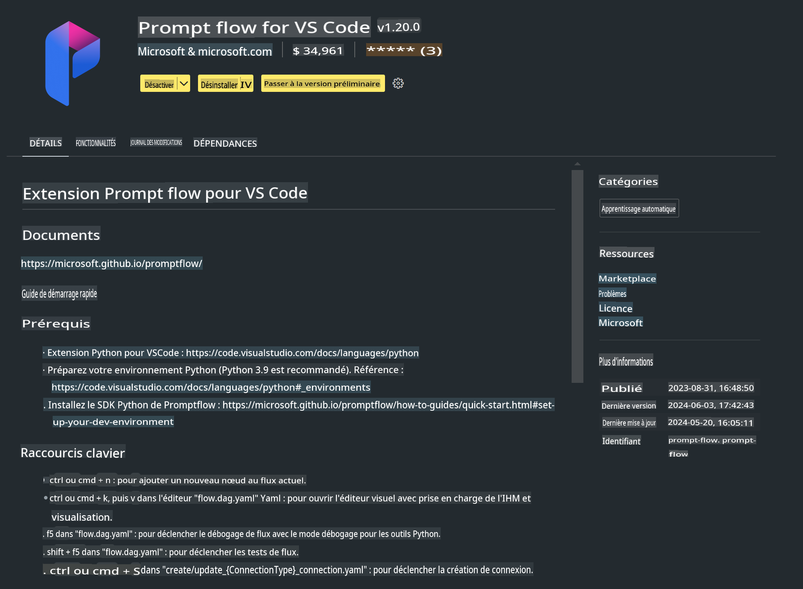

# **Lab 0 - Installation**

Lorsque nous entrons dans le Lab, nous devons configurer l'environnement approprié :

### **1. Python 3.11+**

Il est recommandé d'utiliser miniforge pour configurer votre environnement Python.

Pour configurer miniforge, veuillez consulter [https://github.com/conda-forge/miniforge](https://github.com/conda-forge/miniforge)

Après avoir configuré miniforge, exécutez la commande suivante dans Power Shell :

```bash

conda create -n pyenv python==3.11.8 -y

conda activate pyenv

```

### **2. Installer le SDK Prompt flow**

Dans le Lab 1, nous utilisons Prompt flow, vous devez donc configurer le SDK Prompt flow.

```bash

pip install promptflow --upgrade

```

Vous pouvez vérifier le SDK promptflow avec cette commande :

```bash

pf --version

```

### **3. Installer l'extension Visual Studio Code Prompt flow**



### **4. Framework MLX d'Apple**

MLX est un framework de tableaux pour la recherche en apprentissage automatique sur les puces Apple Silicon, développé par l'équipe de recherche en apprentissage automatique d'Apple. Vous pouvez utiliser le **framework Apple MLX** pour accélérer les modèles LLM / SLM avec Apple Silicon. Si vous souhaitez en savoir plus, vous pouvez lire [https://github.com/microsoft/PhiCookBook/blob/main/md/01.Introduction/03/MLX_Inference.md](https://github.com/microsoft/PhiCookBook/blob/main/md/01.Introduction/03/MLX_Inference.md).

Installez la bibliothèque du framework MLX dans bash :

```bash

pip install mlx-lm

```

### **5. Autres bibliothèques Python**

Créez un fichier requirements.txt et ajoutez-y ce contenu :

```txt

notebook
numpy 
scipy 
scikit-learn 
matplotlib 
pandas 
pillow 
graphviz

```

### **6. Installer NVM**

Installez nvm dans Powershell :

```bash

brew install nvm

```

Installez nodejs 18.20 :

```bash

nvm install 18.20.0

nvm use 18.20.0

```

### **7. Installer le support de développement pour Visual Studio Code**

```bash

npm install --global yo generator-code

```

Félicitations ! Vous avez configuré avec succès le SDK. Passez maintenant aux étapes pratiques.

**Avertissement** :  
Ce document a été traduit à l'aide de services de traduction automatisée basés sur l'intelligence artificielle. Bien que nous nous efforcions d'assurer l'exactitude, veuillez noter que les traductions automatiques peuvent contenir des erreurs ou des inexactitudes. Le document original dans sa langue d'origine doit être considéré comme la source faisant autorité. Pour des informations critiques, il est recommandé de faire appel à une traduction humaine professionnelle. Nous déclinons toute responsabilité en cas de malentendus ou d'interprétations erronées résultant de l'utilisation de cette traduction.