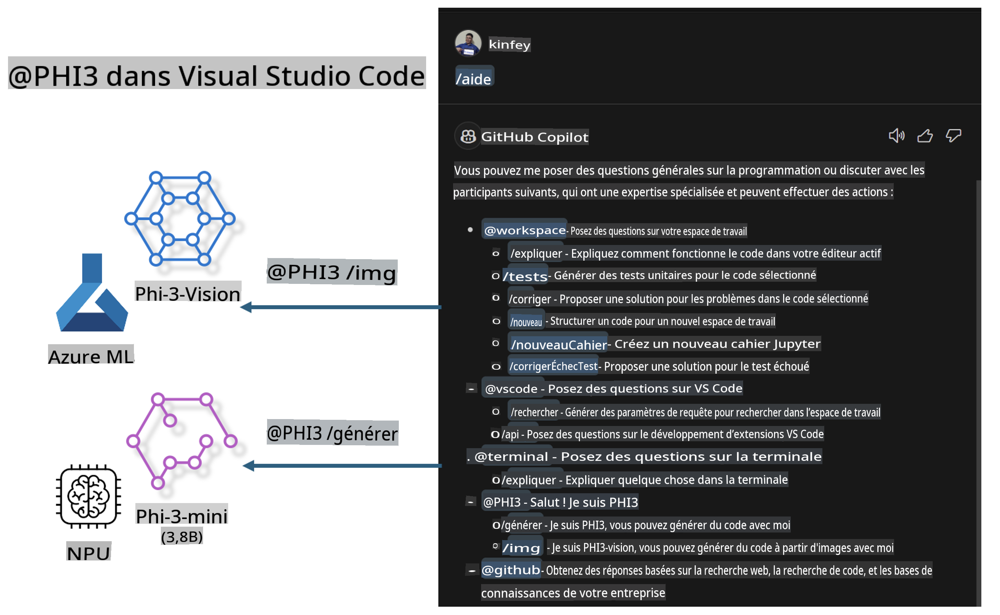

# **Créez votre propre agent GitHub Copilot Chat dans Visual Studio Code avec la famille Microsoft Phi-3**

Avez-vous utilisé l'agent workspace dans GitHub Copilot Chat ? Souhaitez-vous créer un agent de code pour votre propre équipe ? Ce laboratoire pratique vise à combiner un modèle open source pour construire un agent de code d'entreprise.

## **Fondation**

### **Pourquoi choisir Microsoft Phi-3**

Phi-3 est une série de modèles comprenant phi-3-mini, phi-3-small et phi-3-medium, basés sur différents paramètres d'entraînement pour la génération de texte, la complétion de dialogues et la génération de code. Il existe également phi-3-vision, basé sur Vision. Ces modèles sont adaptés aux entreprises ou à des équipes spécifiques pour créer des solutions d'IA générative hors ligne.

Lien recommandé : [https://github.com/microsoft/PhiCookBook/blob/main/md/01.Introduction/01/01.PhiFamily.md](https://github.com/microsoft/PhiCookBook/blob/main/md/01.Introduction/01/01.PhiFamily.md)

### **Microsoft GitHub Copilot Chat**

L'extension GitHub Copilot Chat vous offre une interface de discussion qui vous permet d'interagir avec GitHub Copilot et de recevoir des réponses à vos questions liées au code directement dans VS Code, sans avoir besoin de consulter la documentation ou de chercher dans les forums en ligne.

Copilot Chat peut utiliser des fonctionnalités telles que la coloration syntaxique, l'indentation et d'autres formats pour clarifier les réponses générées. Selon le type de question posée par l'utilisateur, le résultat peut inclure des liens vers les contextes utilisés par Copilot pour générer une réponse, comme des fichiers source ou de la documentation, ou des boutons pour accéder aux fonctionnalités de VS Code.

- Copilot Chat s'intègre dans votre flux de développement et vous aide là où vous en avez besoin :

- Démarrez une conversation directement depuis l'éditeur ou le terminal pour obtenir de l'aide pendant que vous codez.

- Utilisez la vue Chat pour avoir un assistant IA à vos côtés à tout moment.

- Lancez Quick Chat pour poser une question rapide et revenir à votre travail.

Vous pouvez utiliser GitHub Copilot Chat dans divers scénarios, tels que :

- Répondre à des questions de codage sur la meilleure manière de résoudre un problème.

- Expliquer le code de quelqu'un d'autre et proposer des améliorations.

- Proposer des corrections de code.

- Générer des cas de test unitaires.

- Générer de la documentation de code.

Lien recommandé : [https://code.visualstudio.com/docs/copilot/copilot-chat](https://code.visualstudio.com/docs/copilot/copilot-chat?WT.mc_id=aiml-137032-kinfeylo)

### **Microsoft GitHub Copilot Chat @workspace**

En faisant référence à **@workspace** dans Copilot Chat, vous pouvez poser des questions sur l'ensemble de votre codebase. Selon la question, Copilot récupère intelligemment les fichiers et symboles pertinents, qu'il utilise ensuite dans sa réponse sous forme de liens et d'exemples de code.

Pour répondre à votre question, **@workspace** effectue des recherches dans les mêmes sources qu'un développeur utiliserait en naviguant dans une codebase dans VS Code :

- Tous les fichiers du workspace, sauf ceux ignorés par un fichier .gitignore.

- La structure des répertoires avec les noms des dossiers et fichiers imbriqués.

- L'index de recherche de code de GitHub, si le workspace est un dépôt GitHub indexé par la recherche de code.

- Les symboles et définitions dans le workspace.

- Le texte actuellement sélectionné ou visible dans l'éditeur actif.

Remarque : .gitignore est contourné si vous avez un fichier ouvert ou si vous avez sélectionné du texte dans un fichier ignoré.

Lien recommandé : [https://code.visualstudio.com/docs/copilot/workspace-context](https://code.visualstudio.com/docs/copilot/workspace-context?WT.mc_id=aiml-137032-kinfeylo)

## **En savoir plus sur ce laboratoire**

GitHub Copilot a considérablement amélioré l'efficacité de programmation des entreprises, et chaque entreprise souhaite personnaliser les fonctionnalités pertinentes de GitHub Copilot. De nombreuses entreprises ont créé des extensions similaires à GitHub Copilot en fonction de leurs propres scénarios métier et modèles open source. Pour les entreprises, les extensions personnalisées sont plus faciles à contrôler, mais cela peut également affecter l'expérience utilisateur. Après tout, GitHub Copilot est plus performant pour traiter des scénarios généraux et professionnels. Si l'expérience peut rester cohérente, il serait préférable de personnaliser l'extension de l'entreprise. GitHub Copilot Chat fournit des API pertinentes permettant aux entreprises d'étendre l'expérience Chat. Maintenir une expérience cohérente tout en ayant des fonctionnalités personnalisées offre une meilleure expérience utilisateur.

Ce laboratoire utilise principalement le modèle Phi-3 combiné au NPU local et à Azure hybride pour créer un agent personnalisé dans GitHub Copilot Chat ***@PHI3*** afin d'aider les développeurs d'entreprise à générer du code ***(@PHI3 /gen)*** et à créer du code basé sur des images ***(@PHI3 /img)***.

### ***Remarque :***

Ce laboratoire est actuellement implémenté sur les processeurs Intel CPU avec AIPC et sur Apple Silicon. Nous continuerons à mettre à jour la version Qualcomm du NPU.

## **Laboratoire**

| Nom | Description | AIPC | Apple |
| ------------ | ----------- | -------- |-------- |
| Lab0 - Installations(✅) | Configurer et installer les environnements et outils nécessaires | [Go](./HOL/AIPC/01.Installations.md) |[Go](./HOL/Apple/01.Installations.md) |
| Lab1 - Exécuter Prompt flow avec Phi-3-mini (✅) | Combiné avec AIPC / Apple Silicon, utiliser le NPU local pour générer du code via Phi-3-mini | [Go](./HOL/AIPC/02.PromptflowWithNPU.md) |  [Go](./HOL/Apple/02.PromptflowWithMLX.md) |
| Lab2 - Déployer Phi-3-vision sur Azure Machine Learning Service(✅) | Générer du code en déployant Phi-3-vision via le catalogue de modèles d'Azure Machine Learning Service | [Go](./HOL/AIPC/03.DeployPhi3VisionOnAzure.md) |[Go](./HOL/Apple/03.DeployPhi3VisionOnAzure.md) |
| Lab3 - Créer un agent @phi-3 dans GitHub Copilot Chat(✅)  | Créer un agent Phi-3 personnalisé dans GitHub Copilot Chat pour générer du code, créer des graphiques, RAG, etc. | [Go](./HOL/AIPC/04.CreatePhi3AgentInVSCode.md) | [Go](./HOL/Apple/04.CreatePhi3AgentInVSCode.md) |
| Code Exemple (✅)  | Télécharger le code exemple | [Go](../../../../../../../code/07.Lab/01/AIPC) | [Go](../../../../../../../code/07.Lab/01/Apple) |

## **Ressources**

1. Phi-3 Cookbook [https://github.com/microsoft/Phi-3CookBook](https://github.com/microsoft/Phi-3CookBook)

2. En savoir plus sur GitHub Copilot [https://learn.microsoft.com/training/paths/copilot/](https://learn.microsoft.com/training/paths/copilot/?WT.mc_id=aiml-137032-kinfeylo)

3. En savoir plus sur GitHub Copilot Chat [https://learn.microsoft.com/training/paths/accelerate-app-development-using-github-copilot/](https://learn.microsoft.com/training/paths/accelerate-app-development-using-github-copilot/?WT.mc_id=aiml-137032-kinfeylo)

4. En savoir plus sur l'API GitHub Copilot Chat [https://code.visualstudio.com/api/extension-guides/chat](https://code.visualstudio.com/api/extension-guides/chat?WT.mc_id=aiml-137032-kinfeylo)

5. En savoir plus sur Azure AI Foundry [https://learn.microsoft.com/training/paths/create-custom-copilots-ai-studio/](https://learn.microsoft.com/training/paths/create-custom-copilots-ai-studio/?WT.mc_id=aiml-137032-kinfeylo)

6. En savoir plus sur le catalogue de modèles d'Azure AI Foundry [https://learn.microsoft.com/azure/ai-studio/how-to/model-catalog-overview](https://learn.microsoft.com/azure/ai-studio/how-to/model-catalog-overview)

**Avertissement** :  
Ce document a été traduit à l'aide de services de traduction automatisée basés sur l'intelligence artificielle. Bien que nous nous efforcions d'assurer l'exactitude, veuillez noter que les traductions automatiques peuvent contenir des erreurs ou des inexactitudes. Le document original dans sa langue d'origine doit être considéré comme la source faisant autorité. Pour des informations critiques, il est recommandé de recourir à une traduction humaine professionnelle. Nous déclinons toute responsabilité en cas de malentendus ou d'interprétations erronées résultant de l'utilisation de cette traduction.