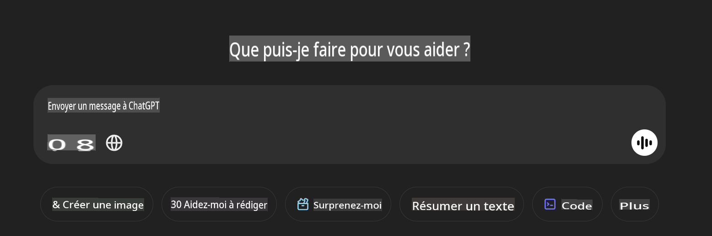

## **Utiliser Phi-4-multimodal pour lire des images et générer du code**

Phi-4-multimodal possède de solides capacités de lecture d'images. Essayons d'utiliser Python pour implémenter les fonctions suivantes. L'image est une page de ChatGPT.



### **Exemple de Code**

```python

import requests
import torch
from PIL import Image
import soundfile
from transformers import AutoModelForCausalLM, AutoProcessor, GenerationConfig,pipeline,AutoTokenizer

model_path = 'Your Phi-4-multimodal location'

kwargs = {}
kwargs['torch_dtype'] = torch.bfloat16

processor = AutoProcessor.from_pretrained(model_path, trust_remote_code=True)

model = AutoModelForCausalLM.from_pretrained(
    model_path,
    trust_remote_code=True,
    torch_dtype='auto',
    _attn_implementation='flash_attention_2',
).cuda()

generation_config = GenerationConfig.from_pretrained(model_path, 'generation_config.json')

user_prompt = '<|user|>'
assistant_prompt = '<|assistant|>'
prompt_suffix = '<|end|>'

prompt = f'{user_prompt}Can you generate HTML + JS code about this image <|image_1|> ? Please step by step {prompt_suffix}{assistant_prompt}'

image = Image.open("./demo.png")

inputs = processor(text=prompt, images=[image], return_tensors='pt').to('cuda:0')

generate_ids = model.generate(
    **inputs,
    max_new_tokens=4096,
    generation_config=generation_config,
)

generate_ids = generate_ids[:, inputs['input_ids'].shape[1] :]

response = processor.batch_decode(
    generate_ids, skip_special_tokens=True, clean_up_tokenization_spaces=False
)[0]

print(response)

```

**Avertissement** :  
Ce document a été traduit à l'aide de services de traduction automatique basés sur l'intelligence artificielle. Bien que nous nous efforcions d'assurer l'exactitude, veuillez noter que les traductions automatisées peuvent contenir des erreurs ou des inexactitudes. Le document original dans sa langue d'origine doit être considéré comme la source faisant autorité. Pour des informations critiques, il est recommandé de recourir à une traduction humaine professionnelle. Nous déclinons toute responsabilité en cas de malentendus ou d'interprétations erronées résultant de l'utilisation de cette traduction.