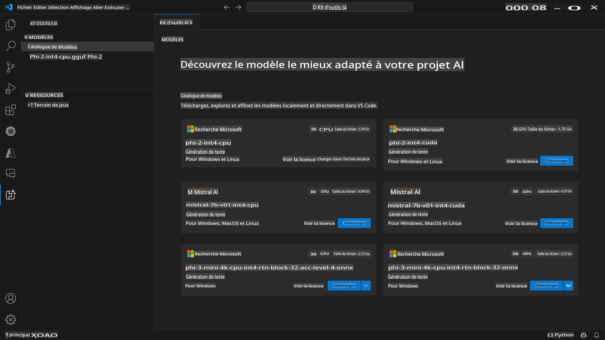
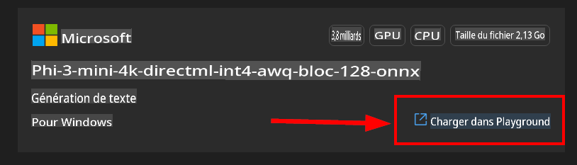

# Kit d'outils AI pour VScode (Windows)

[AI Toolkit for VS Code](https://marketplace.visualstudio.com/items?itemName=ms-windows-ai-studio.windows-ai-studio) simplifie le développement d'applications AI génératives en rassemblant des outils et modèles de pointe provenant du catalogue Azure AI Studio et d'autres catalogues comme Hugging Face. Vous pourrez parcourir le catalogue de modèles AI alimenté par Azure ML et Hugging Face, les télécharger localement, les ajuster, les tester et les utiliser dans votre application.

La prévisualisation du Kit d'outils AI fonctionnera localement. Selon le modèle que vous avez sélectionné, certaines tâches ne sont prises en charge que sous Windows et Linux.

Pour l'inférence locale ou l'ajustement, selon le modèle que vous avez sélectionné, vous pourriez avoir besoin d'un GPU tel qu'un NVIDIA CUDA GPU.

Si vous exécutez à distance, la ressource cloud doit avoir un GPU, veuillez vous assurer de vérifier votre environnement. Pour une exécution locale sous Windows + WSL, la distribution WSL Ubuntu 18.4 ou supérieure doit être installée et définie par défaut avant d'utiliser le Kit d'outils AI.

## Pour Commencer

[En savoir plus sur l'installation du sous-système Windows pour Linux](https://learn.microsoft.com/windows/wsl/install?WT.mc_id=aiml-137032-kinfeylo)

et [changer la distribution par défaut](https://learn.microsoft.com/windows/wsl/install#change-the-default-linux-distribution-installed).

[Repo GitHub du Kit d'outils AI](https://github.com/microsoft/vscode-ai-toolkit/)

- Windows ou Linux.
- **Support pour MacOS bientôt disponible**
- Pour l'ajustement sur Windows et Linux, vous aurez besoin d'un GPU Nvidia. De plus, **Windows** nécessite le sous-système pour Linux avec la distribution Ubuntu 18.4 ou supérieure. [En savoir plus sur l'installation du sous-système Windows pour Linux](https://learn.microsoft.com/windows/wsl/install) et [changer la distribution par défaut](https://learn.microsoft.com/windows/wsl/install#change-the-default-linux-distribution-installed).

### Installer le Kit d'outils AI

Le Kit d'outils AI est fourni sous forme d'[extension Visual Studio Code](https://code.visualstudio.com/docs/setup/additional-components#_vs-code-extensions), donc vous devez d'abord installer [VS Code](https://code.visualstudio.com/docs/setup/windows?WT.mc_id=aiml-137032-kinfeylo) et télécharger le Kit d'outils AI depuis le [VS Marketplace](https://marketplace.visualstudio.com/items?itemName=ms-windows-ai-studio.windows-ai-studio).
Le [Kit d'outils AI est disponible sur le Visual Studio Marketplace](https://marketplace.visualstudio.com/items?itemName=ms-windows-ai-studio.windows-ai-studio) et peut être installé comme toute autre extension VS Code.

Si vous n'êtes pas familier avec l'installation des extensions VS Code, suivez ces étapes :

### Se Connecter

1. Dans la barre d'activités de VS Code, sélectionnez **Extensions**
1. Dans la barre de recherche des extensions, tapez "AI Toolkit"
1. Sélectionnez "AI Toolkit for Visual Studio code"
1. Sélectionnez **Installer**

Vous êtes maintenant prêt à utiliser l'extension !

Vous serez invité à vous connecter à GitHub, cliquez donc sur "Autoriser" pour continuer. Vous serez redirigé vers la page de connexion GitHub.

Veuillez vous connecter et suivre les étapes du processus. Après avoir terminé avec succès, vous serez redirigé vers VS Code.

Une fois l'extension installée, vous verrez l'icône du Kit d'outils AI apparaître dans votre barre d'activités.

Explorons les actions disponibles !

### Actions Disponibles

La barre latérale principale du Kit d'outils AI est organisée en  

- **Modèles**
- **Ressources**
- **Playground**  
- **Ajustement**

Sont disponibles dans la section Ressources. Pour commencer, sélectionnez **Catalogue de Modèles**.

### Télécharger un modèle depuis le catalogue

En lançant le Kit d'outils AI depuis la barre latérale de VS Code, vous pouvez sélectionner parmi les options suivantes :



- Trouver un modèle pris en charge dans **Catalogue de Modèles** et le télécharger localement
- Tester l'inférence du modèle dans le **Model Playground**
- Ajuster le modèle localement ou à distance dans **Model Fine-tuning**
- Déployer des modèles ajustés dans le cloud via la palette de commandes pour le Kit d'outils AI

> [!NOTE]
>
> **GPU Vs CPU**
>
> Vous remarquerez que les cartes de modèles affichent la taille du modèle, la plateforme et le type d'accélérateur (CPU, GPU). Pour des performances optimisées sur **les appareils Windows ayant au moins un GPU**, sélectionnez des versions de modèles qui ne ciblent que Windows.
>
> Cela garantit que vous avez un modèle optimisé pour l'accélérateur DirectML.
>
> Les noms des modèles sont au format
>
> - `{model_name}-{accelerator}-{quantization}-{format}`.
>
>Pour vérifier si vous avez un GPU sur votre appareil Windows, ouvrez **Gestionnaire des tâches** puis sélectionnez l'onglet **Performances**. Si vous avez des GPU, ils seront listés sous des noms comme "GPU 0" ou "GPU 1".

### Exécuter le modèle dans le playground

Après avoir configuré tous les paramètres, cliquez sur **Générer le Projet**.

Une fois votre modèle téléchargé, sélectionnez **Charger dans le Playground** sur la carte du modèle dans le catalogue :

- Initier le téléchargement du modèle
- Installer tous les prérequis et dépendances
- Créer l'espace de travail VS Code



Lorsque le modèle est téléchargé, vous pouvez lancer le projet depuis le Kit d'outils AI.

> ***Note*** Si vous souhaitez essayer la fonctionnalité de prévisualisation pour faire de l'inférence ou de l'ajustement à distance, veuillez suivre [ce guide](https://aka.ms/previewFinetune)

### Modèles Optimisés pour Windows

Vous devriez voir la réponse du modèle diffusée en retour :

Le Kit d'outils AI offre une collection de modèles AI disponibles publiquement déjà optimisés pour Windows. Les modèles sont stockés dans différents emplacements, y compris Hugging Face, GitHub et d'autres, mais vous pouvez parcourir les modèles et les trouver tous en un seul endroit prêts à être téléchargés et utilisés dans votre application Windows.


### Sélections de Modèles

Si vous **n'avez pas** de **GPU** disponible sur votre appareil *Windows* mais que vous avez sélectionné le

- modèle Phi-3-mini-4k-**directml**-int4-awq-block-128-onnx

la réponse du modèle sera *très lente*.

Vous devriez plutôt télécharger la version optimisée pour CPU :

- Phi-3-mini-4k-**cpu**-int4-rtn-block-32-acc-level-4-onnx.

Il est également possible de changer :

**Instructions de Contexte :** Aidez le modèle à comprendre la vue d'ensemble de votre demande. Cela pourrait être des informations de base, des exemples/démonstrations de ce que vous voulez ou expliquer le but de votre tâche.

**Paramètres d'inférence :**

- *Longueur maximale de la réponse*: Le nombre maximum de tokens que le modèle renverra.
- *Température*: La température du modèle est un paramètre qui contrôle la variabilité de la sortie d'un modèle de langage. Une température plus élevée signifie que le modèle prend plus de risques, vous offrant un mélange diversifié de mots. En revanche, une température plus basse rend le modèle plus prudent, adhérant à des réponses plus ciblées et prévisibles.
- *Top P*: Également connu sous le nom de sampling nucleus, est un paramètre qui contrôle combien de mots ou phrases possibles le modèle de langage considère lorsqu'il prédit le mot suivant.
- *Pénalité de fréquence*: Ce paramètre influence la fréquence à laquelle le modèle répète des mots ou des phrases dans sa sortie. Une valeur plus élevée (plus proche de 1.0) encourage le modèle à *éviter* de répéter des mots ou des phrases.
- *Pénalité de présence*: Ce paramètre est utilisé dans les modèles AI génératifs pour encourager la diversité et la spécificité dans le texte généré. Une valeur plus élevée (plus proche de 1.0) encourage le modèle à inclure plus de tokens nouveaux et divers. Une valeur plus basse est plus susceptible de générer des phrases communes ou clichés.

### Utiliser l'API REST dans votre application 

Le Kit d'outils AI est livré avec un serveur web API REST local **sur le port 5272** qui utilise le [format de complétions de chat OpenAI](https://platform.openai.com/docs/api-reference/chat/create).

Cela vous permet de tester votre application localement sans avoir à dépendre d'un service de modèle AI cloud. Par exemple, le fichier JSON suivant montre comment configurer le corps de la requête :

```json
{
    "model": "Phi-3-mini-4k-directml-int4-awq-block-128-onnx",
    "messages": [
        {
            "role": "user",
            "content": "what is the golden ratio?"
        }
    ],
    "temperature": 0.7,
    "top_p": 1,
    "top_k": 10,
    "max_tokens": 100,
    "stream": true
}
```

Vous pouvez tester l'API REST en utilisant (par exemple) [Postman](https://www.postman.com/) ou l'utilitaire CURL (Client URL) :

```bash
curl -vX POST http://127.0.0.1:5272/v1/chat/completions -H 'Content-Type: application/json' -d @body.json
```

### Utiliser la bibliothèque client OpenAI pour Python

```python
from openai import OpenAI

client = OpenAI(
    base_url="http://127.0.0.1:5272/v1/", 
    api_key="x" # requis pour l'API mais non utilisé
)

chat_completion = client.chat.completions.create(
    messages=[
        {
            "role": "user",
            "content": "what is the golden ratio?",
        }
    ],
    model="Phi-3-mini-4k-cuda-int4-onnx",
)

print(chat_completion.choices[0].message.content)
```

### Utiliser la bibliothèque client Azure OpenAI pour .NET

Ajoutez la [bibliothèque client Azure OpenAI pour .NET](https://www.nuget.org/packages/Azure.AI.OpenAI/) à votre projet en utilisant NuGet :

```bash
dotnet add {project_name} package Azure.AI.OpenAI --version 1.0.0-beta.17
```

Ajoutez un fichier C# appelé **OverridePolicy.cs** à votre projet et collez le code suivant :

```csharp
// OverridePolicy.cs
using Azure.Core.Pipeline;
using Azure.Core;

internal partial class OverrideRequestUriPolicy(Uri overrideUri)
    : HttpPipelineSynchronousPolicy
{
    private readonly Uri _overrideUri = overrideUri;

    public override void OnSendingRequest(HttpMessage message)
    {
        message.Request.Uri.Reset(_overrideUri);
    }
}
```

Ensuite, collez le code suivant dans votre fichier **Program.cs** :

```csharp
// Program.cs
using Azure.AI.OpenAI;

Uri localhostUri = new("http://localhost:5272/v1/chat/completions");

OpenAIClientOptions clientOptions = new();
clientOptions.AddPolicy(
    new OverrideRequestUriPolicy(localhostUri),
    Azure.Core.HttpPipelinePosition.BeforeTransport);
OpenAIClient client = new(openAIApiKey: "unused", clientOptions);

ChatCompletionsOptions options = new()
{
    DeploymentName = "Phi-3-mini-4k-directml-int4-awq-block-128-onnx",
    Messages =
    {
        new ChatRequestSystemMessage("You are a helpful assistant. Be brief and succinct."),
        new ChatRequestUserMessage("What is the golden ratio?"),
    }
};

StreamingResponse<StreamingChatCompletionsUpdate> streamingChatResponse
    = await client.GetChatCompletionsStreamingAsync(options);

await foreach (StreamingChatCompletionsUpdate chatChunk in streamingChatResponse)
{
    Console.Write(chatChunk.ContentUpdate);
}
```

## Ajustement avec le Kit d'outils AI

- Commencez avec la découverte de modèles et le playground.
- Ajustement de modèles et inférence en utilisant des ressources de calcul locales.
- Ajustement à distance et inférence en utilisant des ressources Azure

[Ajustement avec le Kit d'outils AI](../04.Fine-tuning/Finetuning_VSCodeaitoolkit.md)

## Ressources Q&A du Kit d'outils AI

Veuillez vous référer à notre [page Q&A](https://github.com/microsoft/vscode-ai-toolkit/blob/main/QA.md) pour les problèmes les plus courants et leurs résolutions

Avertissement : La traduction a été réalisée à partir de l'original par un modèle d'IA et peut ne pas être parfaite. Veuillez examiner le résultat et apporter les corrections nécessaires.