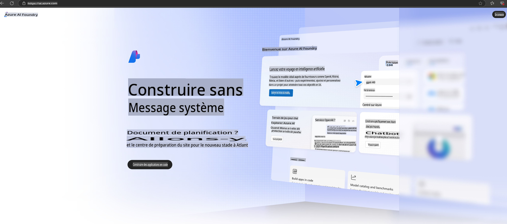

# **Utilisation de Phi-3 dans Azure AI Foundry**

Avec le développement de l'IA générative, nous souhaitons utiliser une plateforme unifiée pour gérer différents LLM et SLM, intégrer les données d'entreprise, effectuer des opérations de fine-tuning/RAG, évaluer diverses activités d'entreprise après l'intégration des LLM et SLM, etc., afin que les applications intelligentes basées sur l'IA générative soient mieux mises en œuvre. [Azure AI Foundry](https://ai.azure.com) est une plateforme d'applications d'IA générative au niveau entreprise.

Avec Azure AI Foundry, vous pouvez évaluer les réponses des grands modèles de langage (LLM) et orchestrer les composants d'application de prompt grâce à Prompt Flow pour de meilleures performances. La plateforme facilite l'évolutivité pour transformer des preuves de concept en solutions complètes de production en toute simplicité. Une surveillance et un raffinement continus soutiennent le succès à long terme.

Nous pouvons déployer rapidement le modèle Phi-3 sur Azure AI Foundry en quelques étapes simples, puis utiliser Azure AI Foundry pour effectuer des tâches liées à Phi-3 telles que Playground/Chat, le fine-tuning, l'évaluation, et d'autres travaux associés.

## **1. Préparation**

Si vous avez déjà installé le [CLI pour développeurs Azure](https://learn.microsoft.com/azure/developer/azure-developer-cli/overview?WT.mc_id=aiml-138114-kinfeylo) sur votre machine, utiliser ce modèle est aussi simple que de lancer cette commande dans un nouveau répertoire.

## Création manuelle

Créer un projet et un hub Microsoft Azure AI Foundry est un excellent moyen d'organiser et de gérer vos travaux en IA. Voici un guide étape par étape pour commencer :

### Création d’un projet dans Azure AI Foundry

1. **Accédez à Azure AI Foundry** : Connectez-vous au portail Azure AI Foundry.
2. **Créez un projet** :
   - Si vous êtes dans un projet, sélectionnez "Azure AI Foundry" en haut à gauche de la page pour accéder à la page d'accueil.
   - Sélectionnez "+ Créer un projet".
   - Entrez un nom pour le projet.
   - Si vous avez un hub, il sera sélectionné par défaut. Si vous avez accès à plusieurs hubs, vous pouvez en sélectionner un autre dans le menu déroulant. Si vous souhaitez créer un nouveau hub, sélectionnez "Créer un nouveau hub" et fournissez un nom.
   - Sélectionnez "Créer".

### Création d’un hub dans Azure AI Foundry

1. **Accédez à Azure AI Foundry** : Connectez-vous avec votre compte Azure.
2. **Créez un hub** :
   - Sélectionnez le Centre de gestion dans le menu de gauche.
   - Sélectionnez "Tous les ressources", puis la flèche vers le bas à côté de "+ Nouveau projet" et sélectionnez "+ Nouveau hub".
   - Dans la boîte de dialogue "Créer un nouveau hub", entrez un nom pour votre hub (par exemple, contoso-hub) et modifiez les autres champs si nécessaire.
   - Sélectionnez "Suivant", vérifiez les informations, puis sélectionnez "Créer".

Pour des instructions plus détaillées, vous pouvez consulter la [documentation officielle de Microsoft](https://learn.microsoft.com/azure/ai-studio/how-to/create-projects).

Une fois la création réussie, vous pouvez accéder au studio que vous avez créé via [ai.azure.com](https://ai.azure.com/).

Il peut y avoir plusieurs projets sur une AI Foundry. Créez un projet dans AI Foundry pour vous préparer.

Créer des [QuickStarts Azure AI Foundry](https://learn.microsoft.com/azure/ai-studio/quickstarts/get-started-code).

## **2. Déployer un modèle Phi dans Azure AI Foundry**

Cliquez sur l'option Explorer du projet pour entrer dans le catalogue de modèles et sélectionnez Phi-3.

Sélectionnez Phi-3-mini-4k-instruct.

Cliquez sur "Déployer" pour déployer le modèle Phi-3-mini-4k-instruct.

> [!NOTE]
>
> Vous pouvez sélectionner la puissance de calcul lors du déploiement.

## **3. Playground Chat Phi dans Azure AI Foundry**

Accédez à la page de déploiement, sélectionnez Playground, et discutez avec Phi-3 sur Azure AI Foundry.

## **4. Déploiement du modèle depuis Azure AI Foundry**

Pour déployer un modèle depuis le catalogue de modèles Azure, vous pouvez suivre ces étapes :

- Connectez-vous à Azure AI Foundry.
- Choisissez le modèle que vous souhaitez déployer dans le catalogue de modèles Azure AI Foundry.
- Sur la page Détails du modèle, sélectionnez Déployer, puis choisissez API sans serveur avec Azure AI Content Safety.
- Sélectionnez le projet dans lequel vous souhaitez déployer vos modèles. Pour utiliser l'offre API sans serveur, votre espace de travail doit appartenir à la région East US 2 ou Sweden Central. Vous pouvez personnaliser le nom du déploiement.
- Dans l'assistant de déploiement, sélectionnez Tarification et conditions pour en savoir plus sur les prix et les conditions d'utilisation.
- Sélectionnez Déployer. Attendez que le déploiement soit prêt et que vous soyez redirigé vers la page Déploiements.
- Sélectionnez Ouvrir dans le Playground pour commencer à interagir avec le modèle.
- Vous pouvez retourner à la page Déploiements, sélectionner le déploiement, et noter l'URL cible de l'endpoint et la clé secrète, que vous pouvez utiliser pour appeler le déploiement et générer des réponses.
- Vous pouvez toujours retrouver les détails de l'endpoint, l'URL et les clés d'accès en naviguant vers l'onglet Build et en sélectionnant Déploiements dans la section Composants.

> [!NOTE]
> Veuillez noter que votre compte doit avoir les permissions de rôle Développeur Azure AI sur le groupe de ressources pour effectuer ces étapes.

## **5. Utilisation de l'API Phi dans Azure AI Foundry**

Vous pouvez accéder à https://{Votre nom de projet}.region.inference.ml.azure.com/swagger.json via une requête GET dans Postman et le combiner avec une clé pour découvrir les interfaces disponibles.

Vous pouvez obtenir très facilement les paramètres de requête ainsi que les paramètres de réponse.

**Avertissement** :  
Ce document a été traduit à l'aide de services de traduction basés sur l'intelligence artificielle. Bien que nous nous efforcions d'assurer l'exactitude, veuillez noter que les traductions automatiques peuvent contenir des erreurs ou des inexactitudes. Le document original dans sa langue d'origine doit être considéré comme la source faisant autorité. Pour des informations critiques, il est recommandé de recourir à une traduction humaine professionnelle. Nous déclinons toute responsabilité en cas de malentendus ou d'interprétations erronées résultant de l'utilisation de cette traduction.