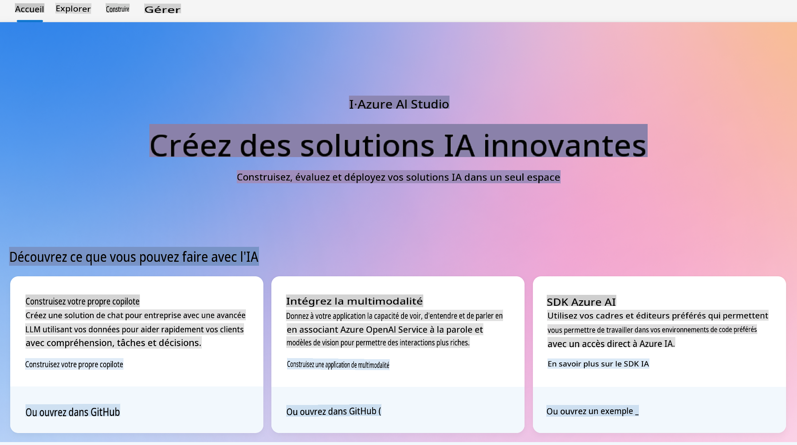
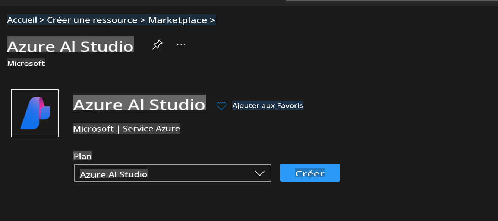
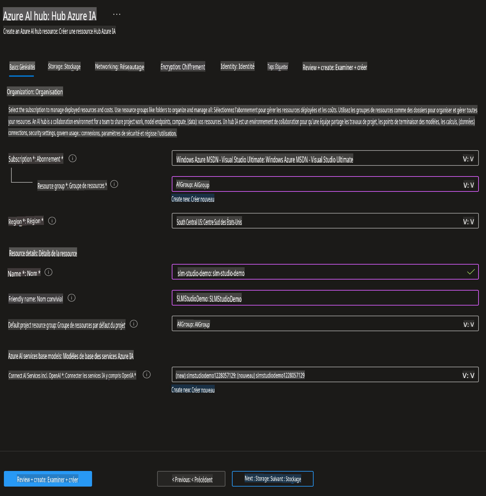
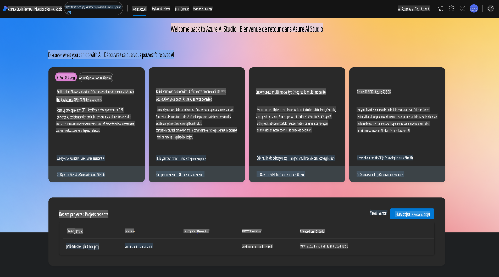
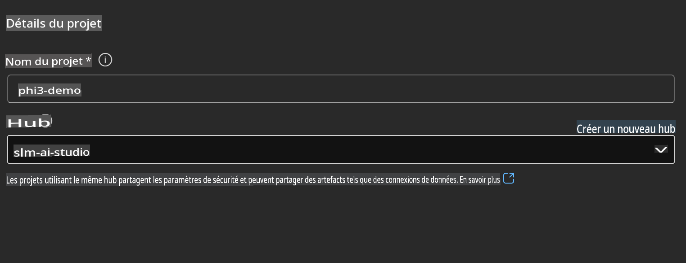
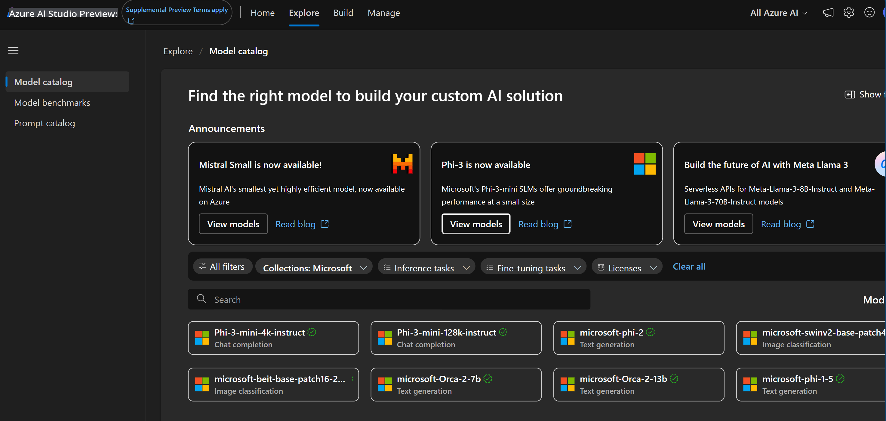
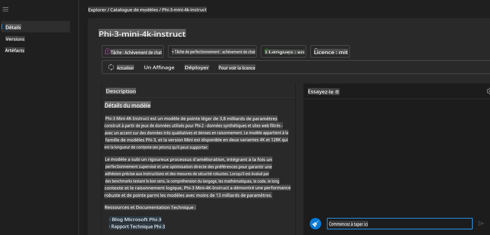
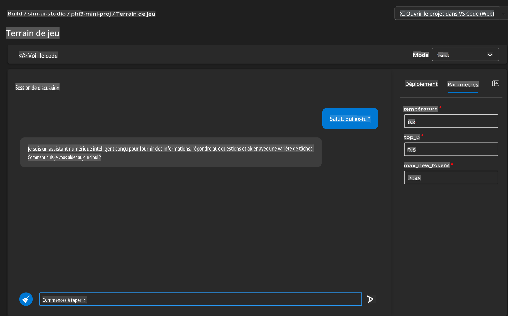
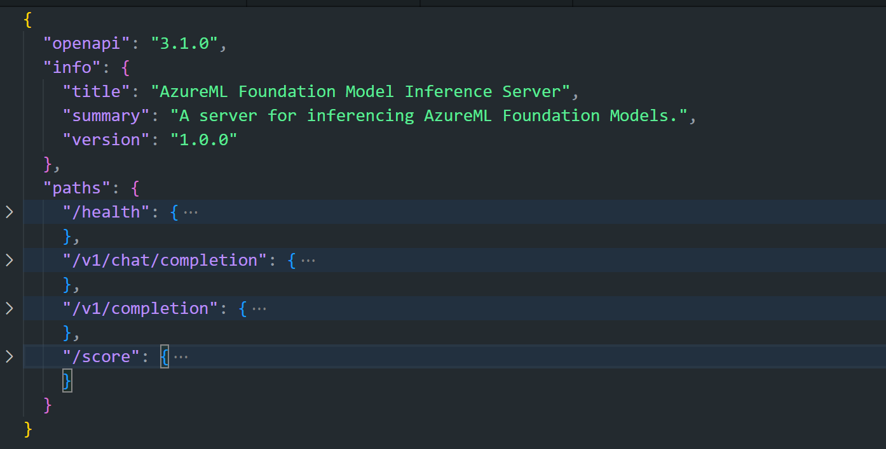
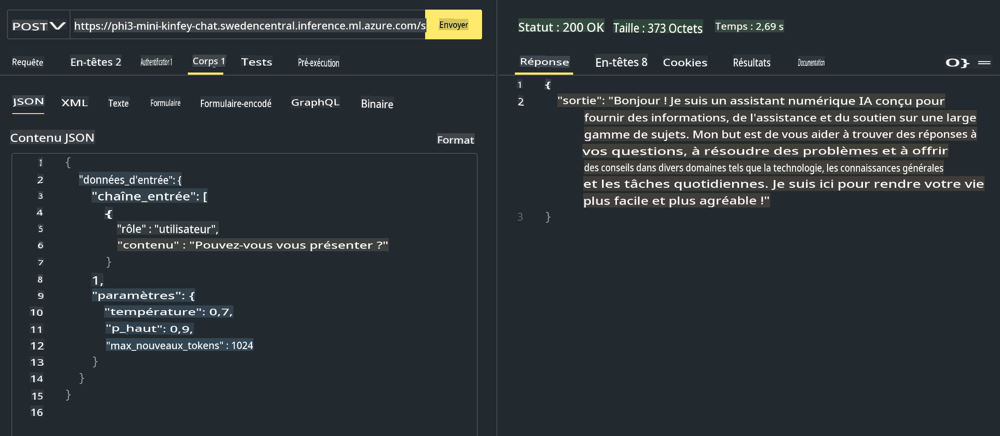

# **Utilisation de Phi-3 dans Azure AI Studio**

Avec le développement de l'IA générative, nous espérons utiliser une plateforme unifiée pour gérer différents LLM et SLM, intégrer les données d'entreprise, effectuer des opérations de fine-tuning/RAG, et évaluer les différentes activités d'entreprise après intégration des LLM et SLM, etc., afin que les applications intelligentes de l'IA générative soient mieux mises en œuvre. [Azure AI Studio](https://ai.azure.com) est une plateforme d'application d'IA générative de niveau entreprise.



Avec Azure AI Studio, vous pouvez évaluer les réponses des grands modèles de langage (LLM) et orchestrer les composants d'application de prompt avec le flux de prompt pour de meilleures performances. La plateforme facilite l'évolutivité pour transformer les preuves de concept en production complète avec facilité. La surveillance continue et le raffinement soutiennent le succès à long terme.

Nous pouvons déployer rapidement le modèle Phi-3 sur Azure AI Studio en quelques étapes simples, puis utiliser Azure AI Studio pour effectuer des travaux liés à Phi-3 tels que Playground/Chat, Fine-tuning, évaluation, etc.

## **1. Préparation**

## [AZD AI Studio Starter Template](https://azure.github.io/awesome-azd/?name=AI+Studio)

### Azure AI Studio Starter

Ceci est un template Bicep qui déploie tout ce dont vous avez besoin pour commencer avec Azure AI Studio. Comprend AI Hub avec des ressources dépendantes, un projet AI, des services AI et un endpoint en ligne.

### Utilisation Rapide

Si vous avez déjà installé le [Azure Developer CLI](https://learn.microsoft.com/azure/developer/azure-developer-cli/overview?WT.mc_id=aiml-138114-kinfeylo) sur votre machine, utiliser ce template est aussi simple que de lancer cette commande dans un nouveau répertoire.

### Commande Terminal

```bash
azd init -t azd-aistudio-starter
```

Ou
Si vous utilisez l'extension azd pour VS Code, vous pouvez coller cette URL dans le terminal de commande de VS Code.

### URL Terminal

```bash
azd-aistudio-starter
```

## Création Manuelle

Créez Azure AI Studio sur [Azure Portal](https://portal.azure.com?WT.mc_id=aiml-138114-kinfeylo)



Après avoir complété le nommage du studio et réglé la région, vous pouvez le créer.



Après une création réussie, vous pouvez accéder au studio que vous avez créé via [ai.azure.com](https://ai.azure.com/)



Il peut y avoir plusieurs projets sur un AI Studio. Créez un projet dans AI Studio pour vous préparer.



## **2. Déployer le modèle Phi-3 dans Azure AI Studio**

Cliquez sur l'option Explorer du projet pour entrer dans le Catalogue de Modèles et sélectionnez Phi-3.



Sélectionnez Phi-3-mini-4k-instruct.



Cliquez sur 'Déployer' pour déployer le modèle Phi-3-mini-4k-instruct.

> [!NOTE]
>
> Vous pouvez sélectionner la puissance de calcul lors du déploiement.

## **3. Playground Chat Phi-3 dans Azure AI Studio**

Accédez à la page de déploiement, sélectionnez Playground, et discutez avec Phi-3 d'Azure AI Studio.



## **4. Déploiement du Modèle depuis Azure AI Studio**

Pour déployer un modèle depuis le Catalogue de Modèles Azure, vous pouvez suivre ces étapes :

- Connectez-vous à Azure AI Studio.
- Choisissez le modèle que vous souhaitez déployer depuis le catalogue de modèles Azure AI Studio.
- Sur la page de détails du modèle, sélectionnez Déployer puis sélectionnez API sans serveur avec Azure AI Content Safety.
- Sélectionnez le projet dans lequel vous souhaitez déployer vos modèles. Pour utiliser l'offre API sans serveur, votre workspace doit appartenir à la région East US 2 ou Sweden Central. Vous pouvez personnaliser le nom du déploiement.
- Sur l'assistant de déploiement, sélectionnez les Tarifs et conditions pour en savoir plus sur les tarifs et les conditions d'utilisation.
- Sélectionnez Déployer. Attendez que le déploiement soit prêt et que vous soyez redirigé vers la page Déploiements.
- Sélectionnez Ouvrir dans le playground pour commencer à interagir avec le modèle.
- Vous pouvez retourner à la page Déploiements, sélectionner le déploiement, et noter l'URL cible du endpoint et la clé secrète, que vous pouvez utiliser pour appeler le déploiement et générer des complétions.
- Vous pouvez toujours trouver les détails du endpoint, l'URL et les clés d'accès en naviguant vers l'onglet Build et en sélectionnant Déploiements dans la section Composants.

> [!NOTE]
> Veuillez noter que votre compte doit avoir les permissions du rôle Développeur Azure AI sur le groupe de ressources pour effectuer ces étapes.

## **5. Utilisation de l'API Phi-3 dans Azure AI Studio**

Vous pouvez accéder à https://{Votre nom de projet}.region.inference.ml.azure.com/swagger.json via Postman GET et le combiner avec la clé pour en savoir plus sur les interfaces fournies.



comme accéder à l'API de score


Vous pouvez obtenir très facilement les paramètres de requête, ainsi que les paramètres de réponse. Voici le résultat de Postman.



