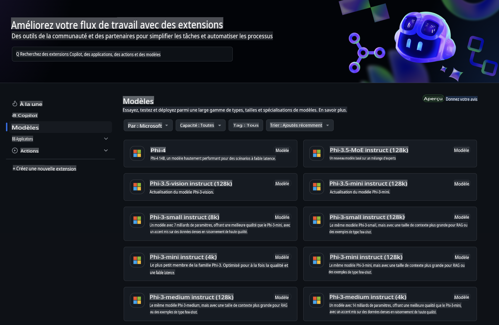
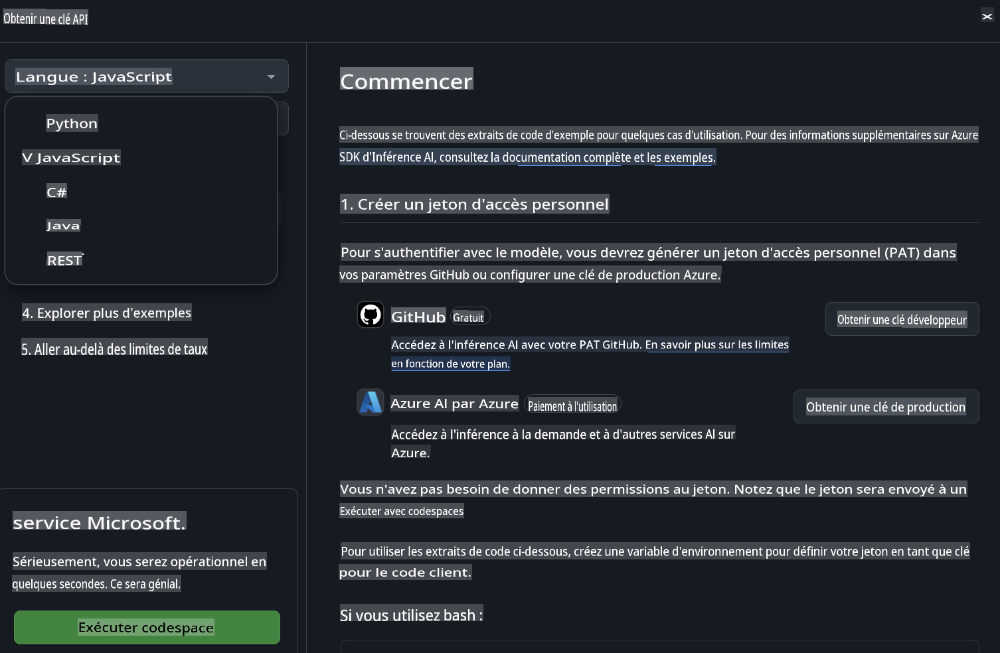
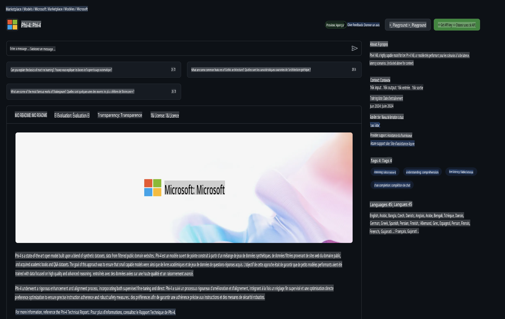

## Modèles GitHub - Bêta publique limitée

Bienvenue sur [Modèles GitHub](https://github.com/marketplace/models) ! Tout est prêt pour que vous exploriez les modèles d'IA hébergés sur Azure AI.



Pour plus d'informations sur les modèles disponibles sur Modèles GitHub, consultez le [GitHub Model Marketplace](https://github.com/marketplace/models).

## Modèles disponibles

Chaque modèle dispose d'un espace de test dédié et d'exemples de code.


### Modèles Phi-3 dans le catalogue de modèles GitHub

[Phi-3-Medium-128k-Instruct](https://github.com/marketplace/models/azureml/Phi-3-medium-128k-instruct)

[Phi-3-medium-4k-instruct](https://github.com/marketplace/models/azureml/Phi-3-medium-4k-instruct)

[Phi-3-mini-128k-instruct](https://github.com/marketplace/models/azureml/Phi-3-mini-128k-instruct)

[Phi-3-mini-4k-instruct](https://github.com/marketplace/models/azureml/Phi-3-mini-4k-instruct)

[Phi-3-small-128k-instruct](https://github.com/marketplace/models/azureml/Phi-3-small-128k-instruct)

[Phi-3-small-8k-instruct](https://github.com/marketplace/models/azureml/Phi-3-small-8k-instruct)

## Premiers pas

Quelques exemples simples sont prêts à être exécutés. Vous pouvez les trouver dans le répertoire des exemples. Si vous souhaitez passer directement à votre langage préféré, vous pouvez trouver les exemples dans les langages suivants :

- Python  
- JavaScript  
- cURL  

Un environnement Codespaces dédié est également disponible pour exécuter les exemples et modèles.



## Exemple de code

Voici des extraits de code pour quelques cas d'utilisation. Pour plus d'informations sur Azure AI Inference SDK, consultez la documentation complète et les exemples.

## Configuration

1. Créez un jeton d'accès personnel  
Vous n'avez pas besoin d'accorder des permissions au jeton. Notez que le jeton sera envoyé à un service Microsoft.

Pour utiliser les extraits de code ci-dessous, créez une variable d'environnement pour définir votre jeton comme clé pour le code client.

Si vous utilisez bash :  
```
export GITHUB_TOKEN="<your-github-token-goes-here>"
```  
Si vous êtes sur PowerShell :  

```
$Env:GITHUB_TOKEN="<your-github-token-goes-here>"
```  

Si vous utilisez l'invite de commande Windows :  

```
set GITHUB_TOKEN=<your-github-token-goes-here>
```  

## Exemple Python

### Installer les dépendances  
Installez le SDK Azure AI Inference avec pip (Requis : Python >=3.8) :  

```
pip install azure-ai-inference
```  

### Exécuter un exemple de code basique  

Cet exemple démontre un appel basique à l'API de complétion de chat. Il utilise le point de terminaison d'inférence des modèles GitHub AI et votre jeton GitHub. L'appel est synchrone.  

```
import os
from azure.ai.inference import ChatCompletionsClient
from azure.ai.inference.models import SystemMessage, UserMessage
from azure.core.credentials import AzureKeyCredential

endpoint = "https://models.inference.ai.azure.com"
# Replace Model_Name 
model_name = "Phi-3-small-8k-instruct"
token = os.environ["GITHUB_TOKEN"]

client = ChatCompletionsClient(
    endpoint=endpoint,
    credential=AzureKeyCredential(token),
)

response = client.complete(
    messages=[
        SystemMessage(content="You are a helpful assistant."),
        UserMessage(content="What is the capital of France?"),
    ],
    model=model_name,
    temperature=1.,
    max_tokens=1000,
    top_p=1.
)

print(response.choices[0].message.content)
```  

### Exécuter une conversation multi-tours  

Cet exemple montre une conversation multi-tours avec l'API de complétion de chat. Lors de l'utilisation du modèle pour une application de chat, vous devrez gérer l'historique de la conversation et envoyer les derniers messages au modèle.  

```
import os
from azure.ai.inference import ChatCompletionsClient
from azure.ai.inference.models import AssistantMessage, SystemMessage, UserMessage
from azure.core.credentials import AzureKeyCredential

token = os.environ["GITHUB_TOKEN"]
endpoint = "https://models.inference.ai.azure.com"
# Replace Model_Name
model_name = "Phi-3-small-8k-instruct"

client = ChatCompletionsClient(
    endpoint=endpoint,
    credential=AzureKeyCredential(token),
)

messages = [
    SystemMessage(content="You are a helpful assistant."),
    UserMessage(content="What is the capital of France?"),
    AssistantMessage(content="The capital of France is Paris."),
    UserMessage(content="What about Spain?"),
]

response = client.complete(messages=messages, model=model_name)

print(response.choices[0].message.content)
```  

### Diffuser la sortie  

Pour une meilleure expérience utilisateur, vous voudrez diffuser la réponse du modèle afin que le premier token apparaisse rapidement et que vous évitiez d'attendre des réponses longues.  

```
import os
from azure.ai.inference import ChatCompletionsClient
from azure.ai.inference.models import SystemMessage, UserMessage
from azure.core.credentials import AzureKeyCredential

token = os.environ["GITHUB_TOKEN"]
endpoint = "https://models.inference.ai.azure.com"
# Replace Model_Name
model_name = "Phi-3-small-8k-instruct"

client = ChatCompletionsClient(
    endpoint=endpoint,
    credential=AzureKeyCredential(token),
)

response = client.complete(
    stream=True,
    messages=[
        SystemMessage(content="You are a helpful assistant."),
        UserMessage(content="Give me 5 good reasons why I should exercise every day."),
    ],
    model=model_name,
)

for update in response:
    if update.choices:
        print(update.choices[0].delta.content or "", end="")

client.close()
```  

## JavaScript  

### Installer les dépendances  

Installez Node.js.  

Copiez les lignes suivantes dans un fichier nommé package.json dans votre dossier.  

```
{
  "type": "module",
  "dependencies": {
    "@azure-rest/ai-inference": "latest",
    "@azure/core-auth": "latest",
    "@azure/core-sse": "latest"
  }
}
```  

Note : @azure/core-sse est uniquement nécessaire si vous diffusez la réponse des complétions de chat.  

Ouvrez une fenêtre de terminal dans ce dossier et exécutez npm install.  

Pour chaque extrait de code ci-dessous, copiez le contenu dans un fichier nommé sample.js et exécutez-le avec node sample.js.  

### Exécuter un exemple de code basique  

Cet exemple démontre un appel basique à l'API de complétion de chat. Il utilise le point de terminaison d'inférence des modèles GitHub AI et votre jeton GitHub. L'appel est synchrone.  

```
import ModelClient from "@azure-rest/ai-inference";
import { AzureKeyCredential } from "@azure/core-auth";

const token = process.env["GITHUB_TOKEN"];
const endpoint = "https://models.inference.ai.azure.com";
// Update your modelname
const modelName = "Phi-3-small-8k-instruct";

export async function main() {

  const client = new ModelClient(endpoint, new AzureKeyCredential(token));

  const response = await client.path("/chat/completions").post({
    body: {
      messages: [
        { role:"system", content: "You are a helpful assistant." },
        { role:"user", content: "What is the capital of France?" }
      ],
      model: modelName,
      temperature: 1.,
      max_tokens: 1000,
      top_p: 1.
    }
  });

  if (response.status !== "200") {
    throw response.body.error;
  }
  console.log(response.body.choices[0].message.content);
}

main().catch((err) => {
  console.error("The sample encountered an error:", err);
});
```  

### Exécuter une conversation multi-tours  

Cet exemple montre une conversation multi-tours avec l'API de complétion de chat. Lors de l'utilisation du modèle pour une application de chat, vous devrez gérer l'historique de la conversation et envoyer les derniers messages au modèle.  

```
import ModelClient from "@azure-rest/ai-inference";
import { AzureKeyCredential } from "@azure/core-auth";

const token = process.env["GITHUB_TOKEN"];
const endpoint = "https://models.inference.ai.azure.com";
// Update your modelname
const modelName = "Phi-3-small-8k-instruct";

export async function main() {

  const client = new ModelClient(endpoint, new AzureKeyCredential(token));

  const response = await client.path("/chat/completions").post({
    body: {
      messages: [
        { role: "system", content: "You are a helpful assistant." },
        { role: "user", content: "What is the capital of France?" },
        { role: "assistant", content: "The capital of France is Paris." },
        { role: "user", content: "What about Spain?" },
      ],
      model: modelName,
    }
  });

  if (response.status !== "200") {
    throw response.body.error;
  }

  for (const choice of response.body.choices) {
    console.log(choice.message.content);
  }
}

main().catch((err) => {
  console.error("The sample encountered an error:", err);
});
```  

### Diffuser la sortie  
Pour une meilleure expérience utilisateur, vous voudrez diffuser la réponse du modèle afin que le premier token apparaisse rapidement et que vous évitiez d'attendre des réponses longues.  

```
import ModelClient from "@azure-rest/ai-inference";
import { AzureKeyCredential } from "@azure/core-auth";
import { createSseStream } from "@azure/core-sse";

const token = process.env["GITHUB_TOKEN"];
const endpoint = "https://models.inference.ai.azure.com";
// Update your modelname
const modelName = "Phi-3-small-8k-instruct";

export async function main() {

  const client = new ModelClient(endpoint, new AzureKeyCredential(token));

  const response = await client.path("/chat/completions").post({
    body: {
      messages: [
        { role: "system", content: "You are a helpful assistant." },
        { role: "user", content: "Give me 5 good reasons why I should exercise every day." },
      ],
      model: modelName,
      stream: true
    }
  }).asNodeStream();

  const stream = response.body;
  if (!stream) {
    throw new Error("The response stream is undefined");
  }

  if (response.status !== "200") {
    stream.destroy();
    throw new Error(`Failed to get chat completions, http operation failed with ${response.status} code`);
  }

  const sseStream = createSseStream(stream);

  for await (const event of sseStream) {
    if (event.data === "[DONE]") {
      return;
    }
    for (const choice of (JSON.parse(event.data)).choices) {
        process.stdout.write(choice.delta?.content ?? ``);
    }
  }
}

main().catch((err) => {
  console.error("The sample encountered an error:", err);
});
```  

## REST  

### Exécuter un exemple de code basique  

Collez ce qui suit dans un shell :  

```
curl -X POST "https://models.inference.ai.azure.com/chat/completions" \
    -H "Content-Type: application/json" \
    -H "Authorization: Bearer $GITHUB_TOKEN" \
    -d '{
        "messages": [
            {
                "role": "system",
                "content": "You are a helpful assistant."
            },
            {
                "role": "user",
                "content": "What is the capital of France?"
            }
        ],
        "model": "Phi-3-small-8k-instruct"
    }'
```  

### Exécuter une conversation multi-tours  

Appelez l'API de complétion de chat et passez l'historique du chat :  

```
curl -X POST "https://models.inference.ai.azure.com/chat/completions" \
    -H "Content-Type: application/json" \
    -H "Authorization: Bearer $GITHUB_TOKEN" \
    -d '{
        "messages": [
            {
                "role": "system",
                "content": "You are a helpful assistant."
            },
            {
                "role": "user",
                "content": "What is the capital of France?"
            },
            {
                "role": "assistant",
                "content": "The capital of France is Paris."
            },
            {
                "role": "user",
                "content": "What about Spain?"
            }
        ],
        "model": "Phi-3-small-8k-instruct"
    }'
```  

### Diffuser la sortie  

Voici un exemple d'appel au point de terminaison et de diffusion de la réponse.  

```
curl -X POST "https://models.inference.ai.azure.com/chat/completions" \
    -H "Content-Type: application/json" \
    -H "Authorization: Bearer $GITHUB_TOKEN" \
    -d '{
        "messages": [
            {
                "role": "system",
                "content": "You are a helpful assistant."
            },
            {
                "role": "user",
                "content": "Give me 5 good reasons why I should exercise every day."
            }
        ],
        "stream": true,
        "model": "Phi-3-small-8k-instruct"
    }'
```  

## Utilisation GRATUITE et limites de débit pour les modèles GitHub  



Les [limites de débit pour l'espace de test et l'utilisation gratuite de l'API](https://docs.github.com/en/github-models/prototyping-with-ai-models#rate-limits) sont conçues pour vous aider à expérimenter avec les modèles et à prototyper votre application d'IA. Pour une utilisation au-delà de ces limites, et pour faire évoluer votre application, vous devez provisionner des ressources depuis un compte Azure et vous authentifier depuis celui-ci au lieu d'utiliser votre jeton d'accès personnel GitHub. Vous n'avez pas besoin de modifier quoi que ce soit d'autre dans votre code. Utilisez ce lien pour découvrir comment dépasser les limites de la version gratuite sur Azure AI.  

### Informations importantes  

Rappelez-vous qu'en interagissant avec un modèle, vous expérimentez avec l'IA, donc des erreurs de contenu sont possibles.  

La fonctionnalité est soumise à diverses limites (y compris les requêtes par minute, les requêtes par jour, les tokens par requête et les requêtes simultanées) et n'est pas conçue pour des cas d'utilisation en production.  

Modèles GitHub utilise Azure AI Content Safety. Ces filtres ne peuvent pas être désactivés dans le cadre de l'expérience Modèles GitHub. Si vous décidez d'utiliser les modèles via un service payant, veuillez configurer vos filtres de contenu pour répondre à vos exigences.  

Ce service est soumis aux conditions préliminaires de GitHub.  

**Avertissement** :  
Ce document a été traduit à l'aide de services de traduction automatisés basés sur l'intelligence artificielle. Bien que nous nous efforcions d'assurer l'exactitude, veuillez noter que les traductions automatisées peuvent contenir des erreurs ou des inexactitudes. Le document original dans sa langue d'origine doit être considéré comme la source faisant autorité. Pour des informations critiques, il est recommandé de recourir à une traduction humaine professionnelle. Nous déclinons toute responsabilité en cas de malentendus ou d'interprétations erronées résultant de l'utilisation de cette traduction.