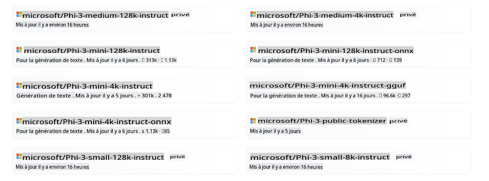
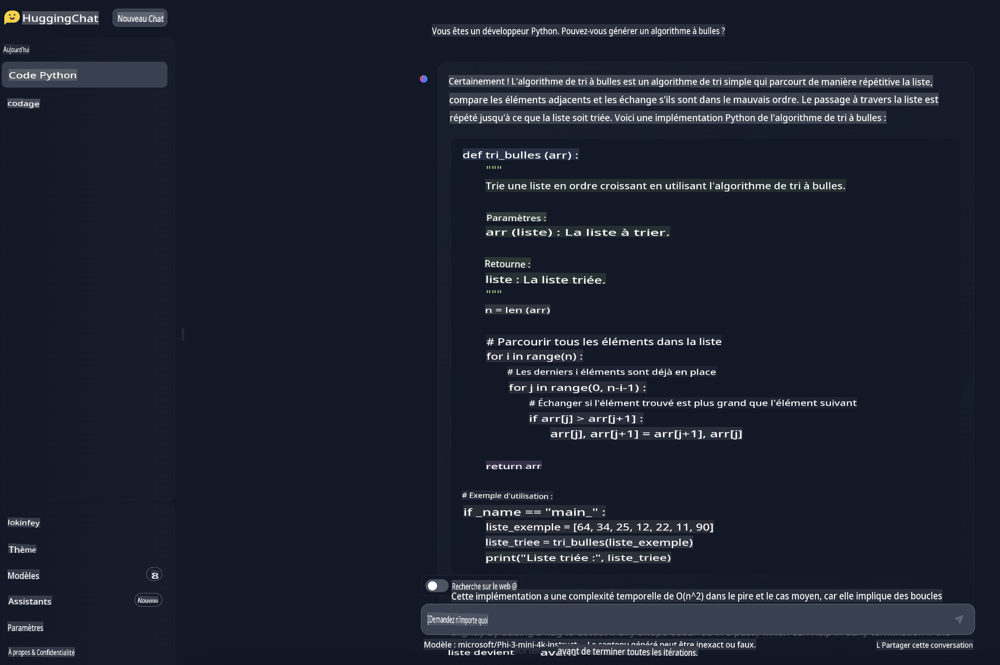

# **Utiliser Phi-3 dans Hugging Face**

[Hugging Face](https://huggingface.co/) est une communauté AI très populaire avec des données riches et des ressources de modèles open source. Différents fabricants publient des LLM et SLM open source via Hugging Face, tels que Microsoft, Meta, Mistral, Apple, Google, etc.



Microsoft Phi-3 a été publié sur Hugging Face. Les développeurs peuvent télécharger le modèle Phi-3 correspondant en fonction des scénarios et des besoins commerciaux. En plus de déployer des modèles Pytorch Phi-3 sur Hugging Face, nous avons également publié des modèles quantifiés, utilisant les formats GGUF et ONNX pour offrir un choix aux utilisateurs finaux.


## **1. Télécharger Phi-3 depuis Hugging Face**

```bash

git lfs install 

git clone https://huggingface.co/microsoft/Phi-3-mini-4k-instruct

```

## **2. En savoir plus sur le modèle de prompt de Phi-3**

Il existe un modèle de données spécifique lors de l'entraînement de Phi-3, donc lors de l'utilisation de Phi-3, l'envoi de prompt doit être configuré via le modèle. Lors du fine-tuning, les données doivent également être étendues selon le modèle.

Le modèle a trois rôles, y compris système, utilisateur et assistant.

```txt

<|system|>
Votre rôle<|end|>
<|user|>
Votre question?<|end|>
<|assistant|>

```

par exemple

```txt

<|system|>
Vous êtes un développeur python.<|end|>
<|user|>
Aidez-moi à générer un algorithme à bulles<|end|>
<|assistant|>

```

## **3. Faire des inférences avec Phi-3 en Python**

Les inférences avec Phi-3 se réfèrent au processus d'utilisation des modèles Phi-3 pour générer des prédictions ou des sorties basées sur des données d'entrée. Les modèles Phi-3 sont une famille de petits modèles de langage (SLM) qui incluent des variantes comme Phi-3-Mini, Phi-3-Small, et Phi-3-Medium, chacun conçu pour différents scénarios d'application et avec des tailles de paramètres variées. Ces modèles ont été entraînés sur des données de haute qualité et sont affinés pour les capacités de chat, l'alignement, la robustesse et la sécurité. Ils peuvent être déployés sur des plateformes en périphérie et dans le cloud en utilisant ONNX et TensorFlow Lite, et sont développés conformément aux principes de l'IA Responsable de Microsoft.

Par exemple, le Phi-3-Mini est un modèle open source léger, à la pointe de la technologie, avec 3,8 milliards de paramètres, adapté aux prompts utilisant le format de chat et prenant en charge une longueur de contexte allant jusqu'à 128K tokens. C'est le premier modèle dans sa catégorie de poids à supporter un contexte aussi long.

Les modèles Phi-3 sont disponibles sur des plateformes comme Azure AI MaaS, HuggingFace, NVIDIA, Ollama, ONNX, et peuvent être utilisés pour diverses applications, y compris les interactions en temps réel, les systèmes autonomes, et les applications nécessitant une faible latence.

Il existe de nombreuses façons de référencer Phi-3. Vous pouvez utiliser différents langages de programmation pour référencer le modèle.

Voici un exemple en Python.

```python

import torch
from transformers import AutoModelForCausalLM, AutoTokenizer, pipeline

torch.random.manual_seed(0)

model = AutoModelForCausalLM.from_pretrained(
    "microsoft/Phi-3-mini-4k-instruct", 
    device_map="cuda", 
    torch_dtype="auto", 
    trust_remote_code=True, 
)
tokenizer = AutoTokenizer.from_pretrained("microsoft/Phi-3-mini-4k-instruct")

messages = [
    {"role": "system", "content": "Vous êtes un développeur python."},
    {"role": "user", "content": "Aidez-moi à générer un algorithme à bulles"},
]

pipe = pipeline(
    "text-generation",
    model=model,
    tokenizer=tokenizer,
)

generation_args = {
    "max_new_tokens": 600,
    "return_full_text": False,
    "temperature": 0.3,
    "do_sample": False,
}

output = pipe(messages, **generation_args)
print(output[0]['generated_text'])


```

> [!NOTE]
> Vous pouvez voir si ce résultat est cohérent avec le résultat dans votre esprit

## **4. Faire des inférences avec Phi-3 en C#**

Voici un exemple dans une application console .NET.

Le projet C# doit ajouter les packages suivants :

```bash
dotnet add package Microsoft.ML.OnnxRuntime --version 1.18.0
dotnet add package Microsoft.ML.OnnxRuntimeGenAI --version 0.3.0-rc2
dotnet add package Microsoft.ML.OnnxRuntimeGenAI.Cuda --version 0.3.0-rc2
```

Voici le code C#.

```csharp
using System;
using Microsoft.ML.OnnxRuntimeGenAI;


// emplacement du dossier du fichier modèle ONNX
var modelPath = @"..\models\Phi-3-mini-4k-instruct-onnx";
var model = new Model(modelPath);
var tokenizer = new Tokenizer(model);

var systemPrompt = "Vous êtes un assistant AI qui aide les gens à trouver des informations. Répondez aux questions de manière directe. Ne partagez pas plus d'informations que celles demandées par les utilisateurs.";

// démarrage du chat
Console.WriteLine(@"Posez votre question. Tapez une chaîne vide pour quitter.");


// boucle de chat
while (true)
{
    // Obtenez la question de l'utilisateur
    Console.WriteLine();
    Console.Write(@"Q: ");
    var userQ = Console.ReadLine();    
    if (string.IsNullOrEmpty(userQ))
    {
        break;
    }

    // affichez la réponse de phi3
    Console.Write("Phi3: ");
    var fullPrompt = $"<|system|>{systemPrompt}<|end|><|user|>{userQ}<|end|><|assistant|>";
    var tokens = tokenizer.Encode(fullPrompt);

    var generatorParams = new GeneratorParams(model);
    generatorParams.SetSearchOption("max_length", 2048);
    generatorParams.SetSearchOption("past_present_share_buffer", false);
    generatorParams.SetInputSequences(tokens);

    var generator = new Generator(model, generatorParams);
    while (!generator.IsDone())
    {
        generator.ComputeLogits();
        generator.GenerateNextToken();
        var outputTokens = generator.GetSequence(0);
        var newToken = outputTokens.Slice(outputTokens.Length - 1, 1);
        var output = tokenizer.Decode(newToken);
        Console.Write(output);
    }
    Console.WriteLine();
}
```

La démonstration en cours d'exécution est similaire à celle-ci :


***Note:** il y a une faute de frappe dans la première question, Phi-3 est assez cool pour partager la réponse correcte !*

## **5. Utiliser Phi-3 dans Hugging Face Chat**

Hugging Face chat offre une expérience liée. Entrez [ici pour essayer le chat Phi-3](https://huggingface.co/chat/models/microsoft/Phi-3-mini-4k-instruct) dans votre navigateur pour l'essayer.



Avertissement : La traduction a été réalisée à partir de son texte original par un modèle d'IA et peut ne pas être parfaite. 
Veuillez examiner le résultat et apporter les corrections nécessaires.