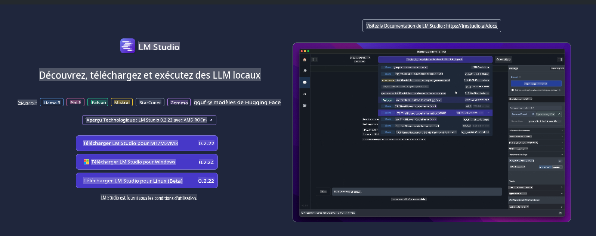
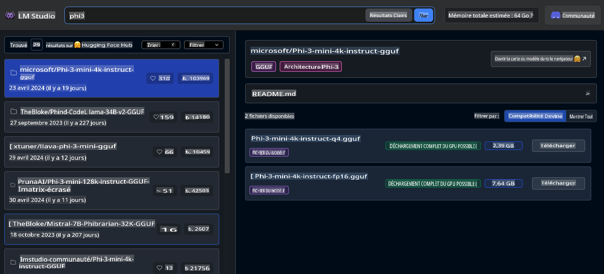
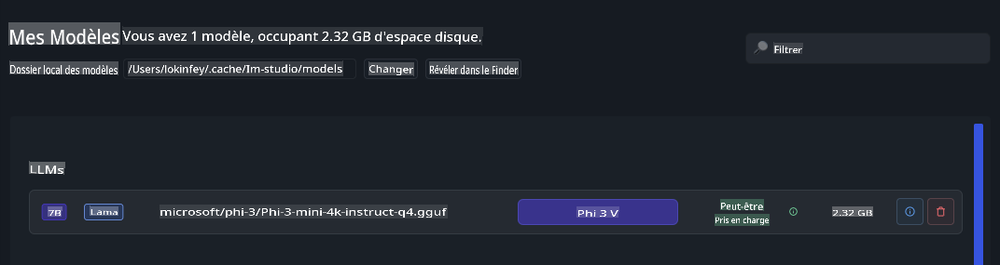
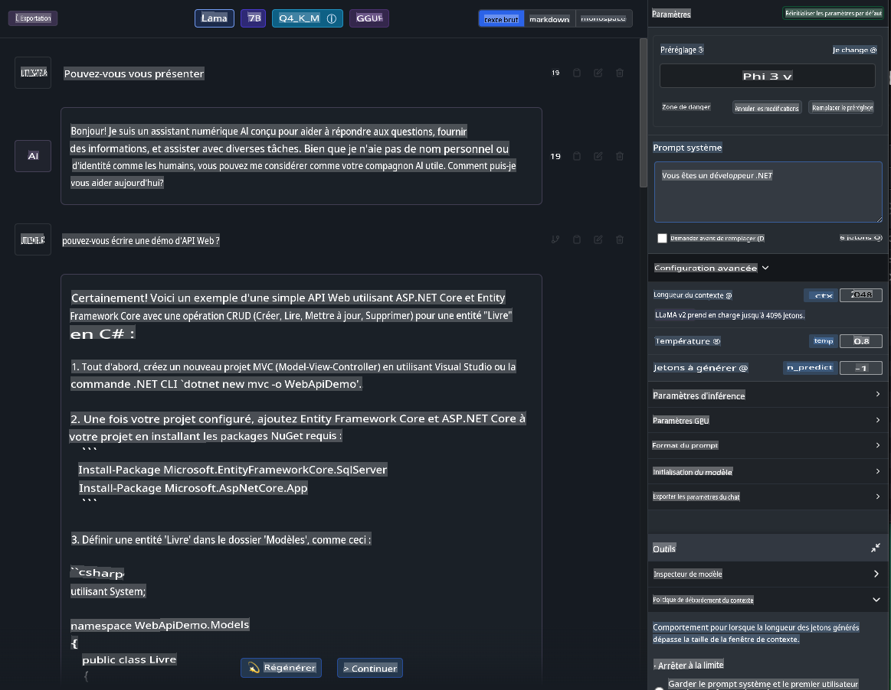
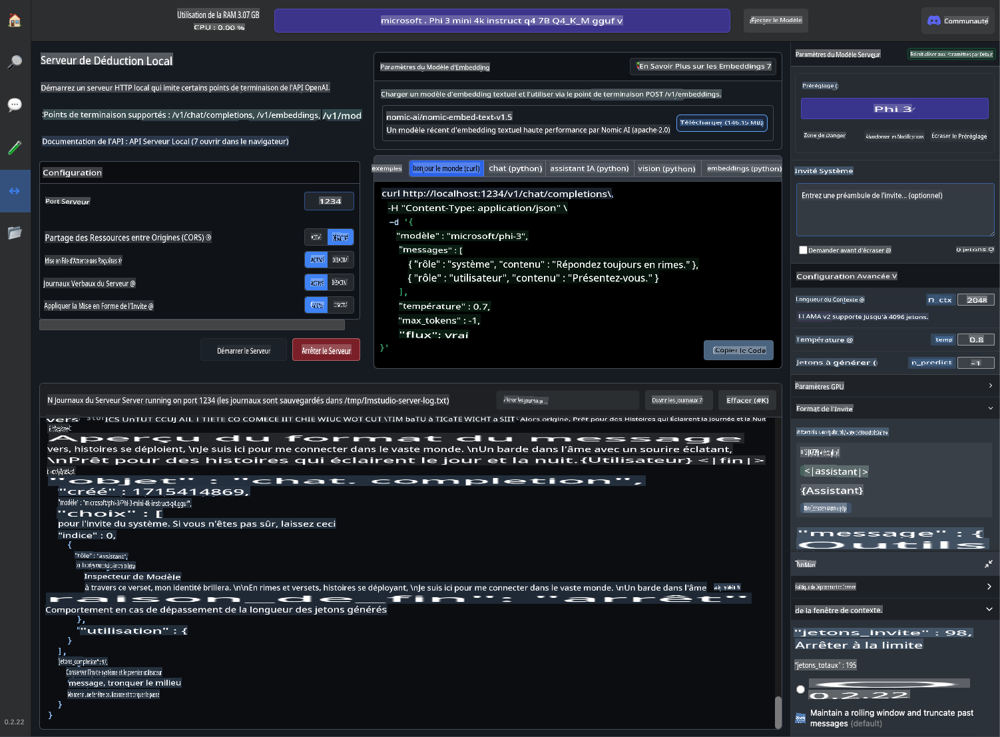
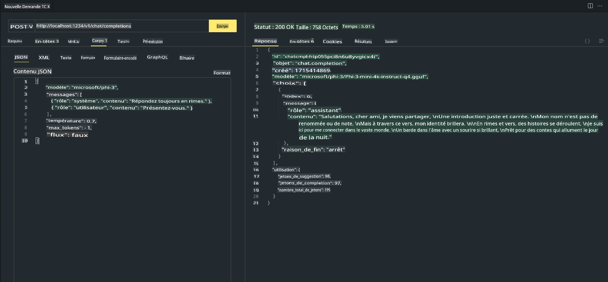

# **Utiliser Phi-3 dans LM Studio**

[LM Studio](https://lmstudio.ai) est une application pour appeler SLM et LLM dans une application de bureau locale. Elle permet aux utilisateurs d'utiliser facilement différents modèles et prend en charge le calcul accéléré en utilisant les GPU NVIDIA/AMD/Apple Silicon. Grâce à LM Studio, les utilisateurs peuvent télécharger, installer et exécuter divers LLM et SLM open source basés sur Hugging Face pour tester les performances des modèles localement sans coder.

## **1. Installation**

Vous pouvez choisir d'installer sur Windows, Linux, macOS via le site web de LM Studio [https://lmstudio.ai/](https://lmstudio.ai/)

## **2. Télécharger Phi-3 dans LM Studio**

LM Studio appelle des modèles open source au format gguf quantifié. Vous pouvez le télécharger directement depuis la plateforme fournie par l'interface de recherche de LM Studio, ou vous pouvez le télécharger vous-même et le spécifier pour être appelé dans le répertoire approprié.

***Nous recherchons Phi3 dans la recherche de LM Studio et téléchargeons le modèle gguf de Phi-3***

***Gérer les modèles téléchargés via LM Studio***

## **3. Discuter avec Phi-3 dans LM Studio**

Nous sélectionnons Phi-3 dans LM Studio Chat et configurons le modèle de chat (Preset - Phi3) pour commencer à discuter localement avec Phi-3

***Note***:

a. Vous pouvez définir les paramètres via la configuration avancée dans le panneau de contrôle de LM Studio

b. Parce que Phi-3 a des exigences spécifiques pour le modèle de chat, Phi-3 doit être sélectionné dans Preset

c. Vous pouvez également définir différents paramètres, tels que l'utilisation du GPU, etc.

## **4. Appeler l'API Phi-3 depuis LM Studio**

LM Studio prend en charge le déploiement rapide de services locaux, et vous pouvez créer des services de modèles sans coder.

Voici le résultat dans Postman

**Avertissement**: 
Ce document a été traduit à l'aide de services de traduction automatique basés sur l'IA. Bien que nous nous efforcions d'assurer l'exactitude, veuillez noter que les traductions automatisées peuvent contenir des erreurs ou des inexactitudes. Le document original dans sa langue d'origine doit être considéré comme la source faisant autorité. Pour des informations critiques, il est recommandé de recourir à une traduction humaine professionnelle. Nous ne sommes pas responsables des malentendus ou des interprétations erronées résultant de l'utilisation de cette traduction.