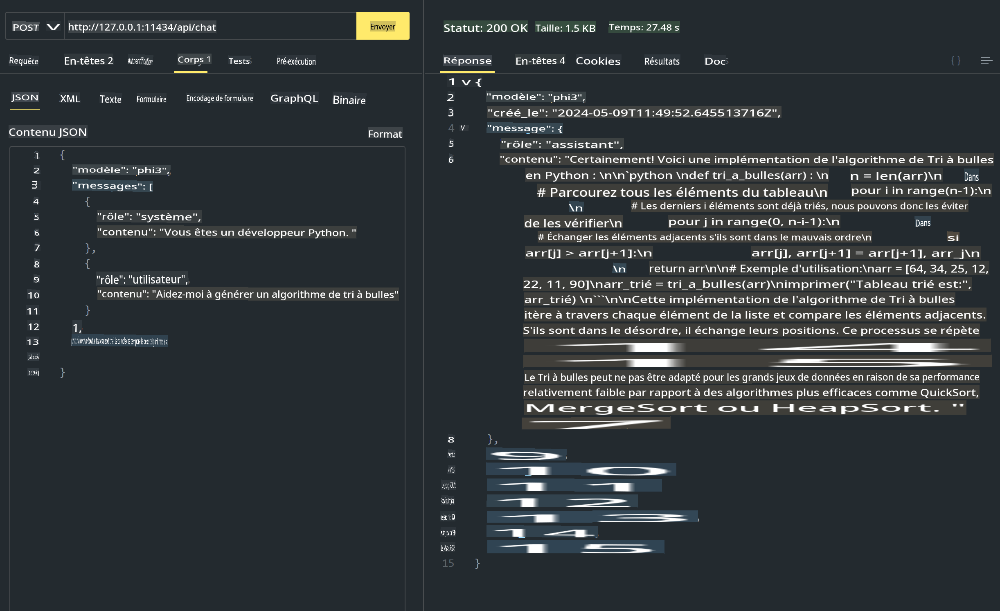
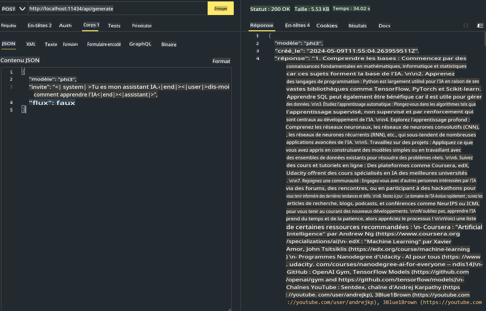

# **Utiliser Phi-3 dans Ollama**

[Ollama](https://ollama.com) permet à plus de personnes de déployer directement des LLM ou SLM open source via des scripts simples, et peut également construire des API pour aider les scénarios d'application Copilot locaux.

## **1. Installation**

Ollama est compatible avec Windows, macOS et Linux. Vous pouvez installer Ollama via ce lien ([https://ollama.com/download](https://ollama.com/download)). Après une installation réussie, vous pouvez utiliser directement le script Ollama pour appeler Phi-3 via une fenêtre de terminal. Vous pouvez voir toutes les [bibliothèques disponibles dans Ollama](https://ollama.com/library). Si vous ouvrez ce dépôt dans un Codespace, Ollama sera déjà installé.

```bash

ollama run phi3

```

> [!NOTE]
> Le modèle sera téléchargé lors de la première exécution. Bien sûr, vous pouvez également spécifier directement le modèle Phi-3 téléchargé. Nous prenons WSL comme exemple pour exécuter la commande. Après le téléchargement réussi du modèle, vous pouvez interagir directement sur le terminal.


## **2. Appeler l'API phi-3 depuis Ollama**

Si vous souhaitez appeler l'API Phi-3 générée par Ollama, vous pouvez utiliser cette commande dans le terminal pour démarrer le serveur Ollama.

```bash

ollama serve

```

> [!NOTE]
> Si vous utilisez MacOS ou Linux, notez que vous pouvez rencontrer l'erreur suivante **"Error: listen tcp 127.0.0.1:11434: bind: address already in use"**. Vous pouvez obtenir cette erreur en exécutant la commande. Vous pouvez soit ignorer cette erreur, car elle indique généralement que le serveur est déjà en cours d'exécution, soit arrêter et redémarrer Ollama :

**macOS**

```bash

brew services restart ollama

```

**Linux**

```bash

sudo systemctl stop ollama

```

Ollama prend en charge deux API : generate et chat. Vous pouvez appeler l'API du modèle fournie par Ollama selon vos besoins, en envoyant des requêtes au service local fonctionnant sur le port 11434.

**Chat**

```bash

curl http://127.0.0.1:11434/api/chat -d '{
  "model": "phi3",
  "messages": [
    {
      "role": "system",
      "content": "Vous êtes un développeur Python."
    },
    {
      "role": "user",
      "content": "Aidez-moi à générer un algorithme à bulles"
    }
  ],
  "stream": false
  
}'

```

Voici le résultat dans Postman



```bash

curl http://127.0.0.1:11434/api/generate -d '{
  "model": "phi3",
  "prompt": "<|system|>Vous êtes mon assistant IA.<|end|><|user|>Dites-moi comment apprendre l'IA<|end|><|assistant|>",
  "stream": false
}'

```

Voici le résultat dans Postman



## Ressources supplémentaires

Consultez la liste des modèles disponibles dans Ollama dans [leur bibliothèque](https://ollama.com/library).

Récupérez votre modèle depuis le serveur Ollama en utilisant cette commande

```bash
ollama pull phi3
```

Exécutez le modèle en utilisant cette commande

```bash
ollama run phi3
```

***Note:*** Visitez ce lien [https://github.com/ollama/ollama/blob/main/docs/api.md](https://github.com/ollama/ollama/blob/main/docs/api.md) pour en savoir plus

## Appeler Ollama depuis Python

Vous pouvez utiliser `requests` ou `urllib3` pour faire des requêtes aux points de terminaison du serveur local utilisés ci-dessus. Cependant, une façon populaire d'utiliser Ollama en Python est via le SDK [openai](https://pypi.org/project/openai/), car Ollama fournit également des points de terminaison de serveur compatibles avec OpenAI.

Voici un exemple pour phi3-mini :

```python
import openai

client = openai.OpenAI(
    base_url="http://localhost:11434/v1",
    api_key="nokeyneeded",
)

response = client.chat.completions.create(
    model="phi3",
    temperature=0.7,
    n=1,
    messages=[
        {"role": "system", "content": "Vous êtes un assistant utile."},
        {"role": "user", "content": "Écrivez un haïku sur un chat affamé"},
    ],
)

print("Response:")
print(response.choices[0].message.content)
```

## Appeler Ollama depuis JavaScript 

```javascript
// Exemple de résumé d'un fichier avec Phi-3
script({
    model: "ollama:phi3",
    title: "Résumé avec Phi-3",
    system: ["system"],
})

// Exemple de résumé
const file = def("FILE", env.files)
$`Résumez ${file} en un seul paragraphe.`
```

## Appeler Ollama depuis C#

Créez une nouvelle application Console C# et ajoutez le package NuGet suivant :

```bash
dotnet add package Microsoft.SemanticKernel --version 1.13.0
```

Ensuite, remplacez ce code dans le fichier `Program.cs`

```csharp
using Microsoft.SemanticKernel;
using Microsoft.SemanticKernel.ChatCompletion;

// ajouter le service de complétion de chat en utilisant le point de terminaison du serveur local ollama
#pragma warning disable SKEXP0001, SKEXP0003, SKEXP0010, SKEXP0011, SKEXP0050, SKEXP0052
builder.AddOpenAIChatCompletion(
    modelId: "phi3.5",
    endpoint: new Uri("http://localhost:11434/"),
    apiKey: "non required");

// invoquer une simple invite au service de chat
string prompt = "Écrivez une blague sur les chatons";
var response = await kernel.InvokePromptAsync(prompt);
Console.WriteLine(response.GetValue<string>());
```

Exécutez l'application avec la commande :

```bash
dotnet run
```

Avertissement : La traduction a été réalisée à partir de l'original par un modèle d'IA et peut ne pas être parfaite. 
Veuillez examiner le résultat et apporter les corrections nécessaires.