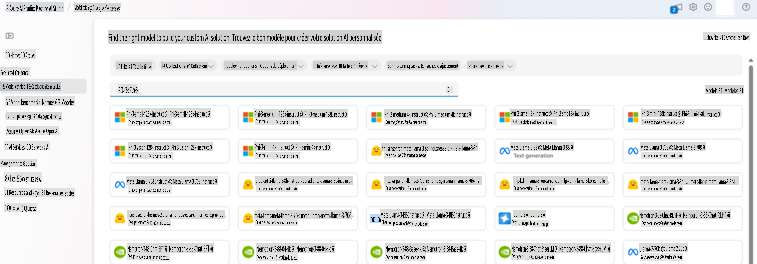
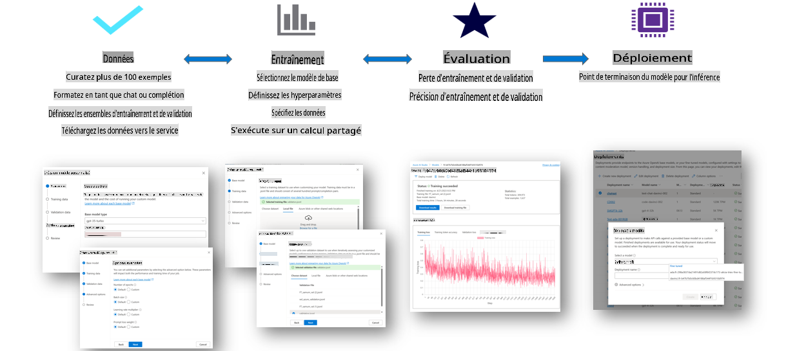
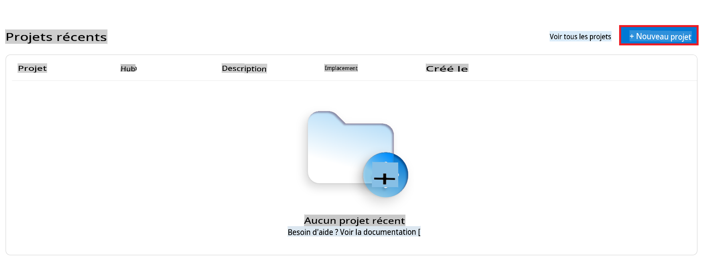
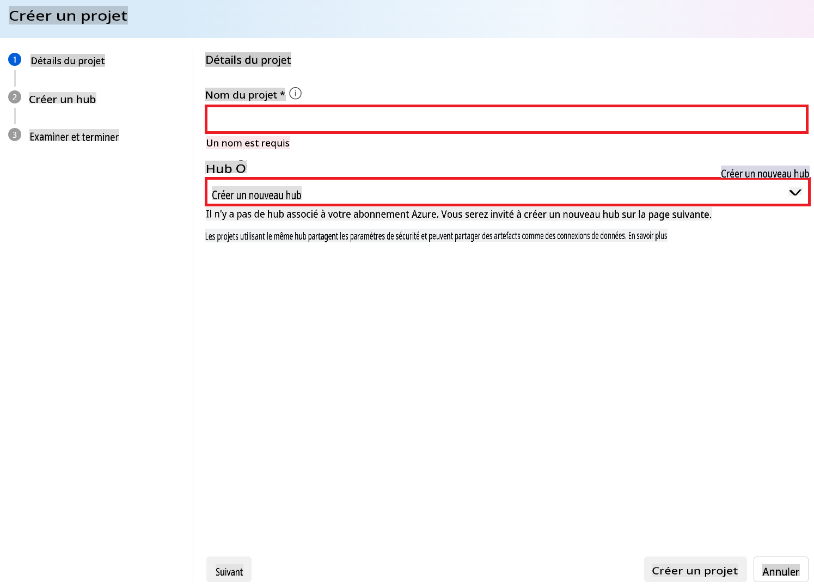
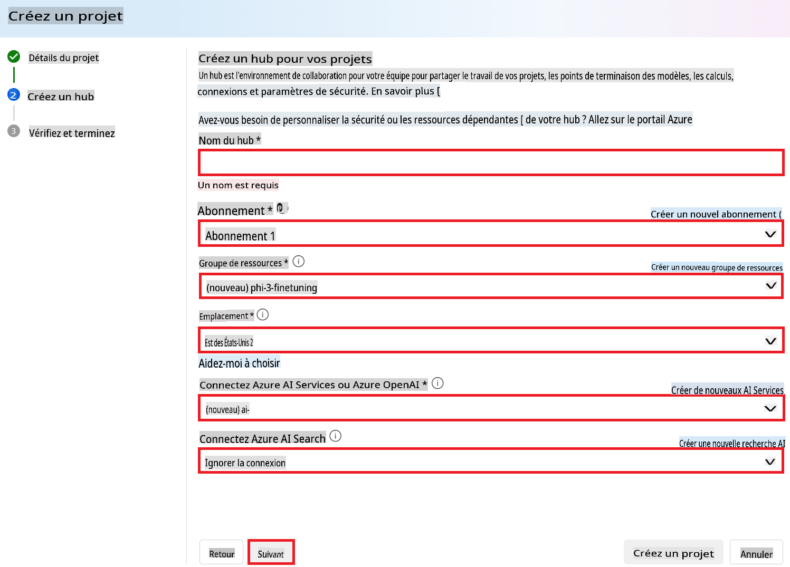
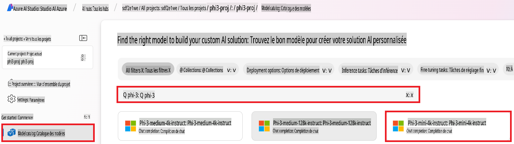
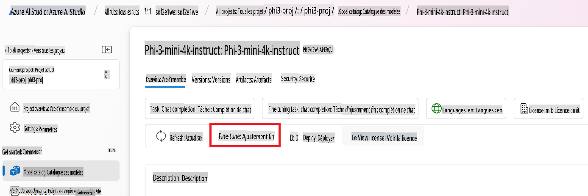
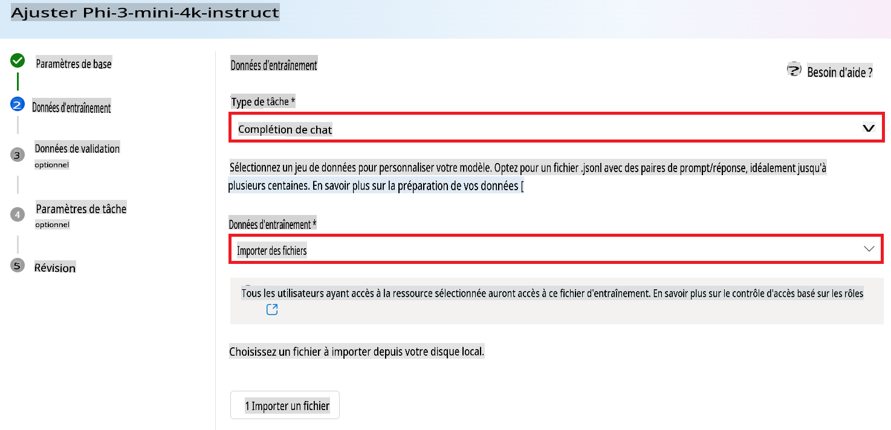
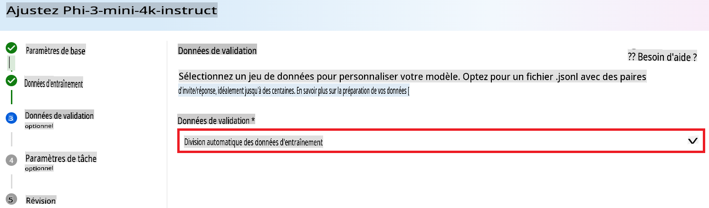
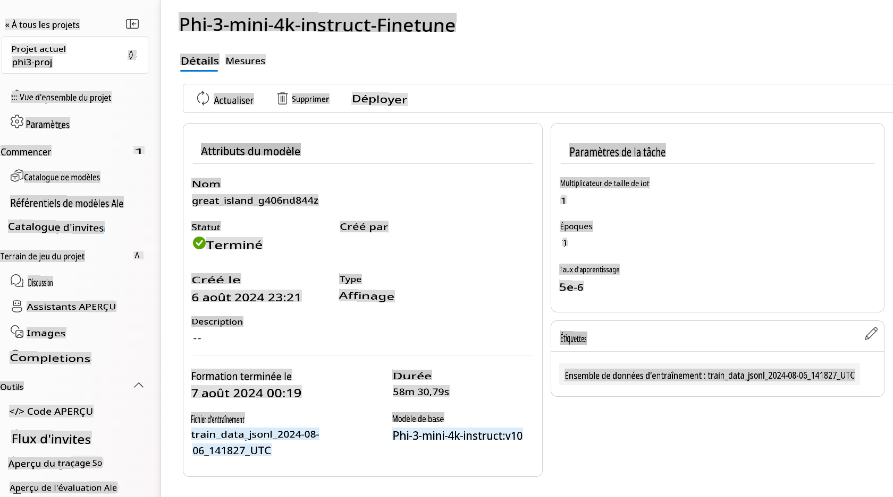

# Affinage de Phi-3 avec Azure AI Foundry

Explorons comment affiner le modèle de langage Phi-3 Mini de Microsoft en utilisant Azure AI Foundry. L’affinage vous permet d’adapter Phi-3 Mini à des tâches spécifiques, le rendant encore plus puissant et pertinent.

## Considérations

- **Capacités :** Quels modèles peuvent être affinés ? Que peut-on faire avec le modèle de base une fois affiné ?
- **Coût :** Quel est le modèle de tarification pour l’affinage ?
- **Personnalisation :** Dans quelle mesure puis-je modifier le modèle de base – et de quelles manières ?
- **Praticité :** Comment se déroule réellement l’affinage – dois-je écrire du code personnalisé ? Dois-je fournir ma propre infrastructure ?
- **Sécurité :** Les modèles affinés peuvent présenter des risques en matière de sécurité – y a-t-il des mesures de protection en place pour éviter des dommages involontaires ?



## Préparation pour l’affinage

### Prérequis

> [!NOTE]
> Pour les modèles de la famille Phi-3, l'offre d’affinage avec facturation à l’usage est uniquement disponible pour les hubs créés dans les régions **East US 2**.

- Une souscription Azure. Si vous n’avez pas encore de souscription Azure, créez un [compte Azure payant](https://azure.microsoft.com/pricing/purchase-options/pay-as-you-go) pour commencer.

- Un [projet AI Foundry](https://ai.azure.com?WT.mc_id=aiml-138114-kinfeylo).
- Les contrôles d'accès basés sur les rôles Azure (Azure RBAC) sont utilisés pour accorder l'accès aux opérations dans Azure AI Foundry. Pour effectuer les étapes de cet article, votre compte utilisateur doit être affecté au rôle __Développeur Azure AI__ sur le groupe de ressources.

### Enregistrement du fournisseur de souscription

Vérifiez que la souscription est enregistrée auprès du fournisseur de ressources `Microsoft.Network`.

1. Connectez-vous au [portail Azure](https://portal.azure.com).
1. Sélectionnez **Souscriptions** dans le menu de gauche.
1. Sélectionnez la souscription que vous souhaitez utiliser.
1. Sélectionnez **Paramètres du projet AI** > **Fournisseurs de ressources** dans le menu de gauche.
1. Confirmez que **Microsoft.Network** figure dans la liste des fournisseurs de ressources. Sinon, ajoutez-le.

### Préparation des données

Préparez vos données d'entraînement et de validation pour affiner votre modèle. Vos ensembles de données d'entraînement et de validation doivent contenir des exemples d’entrée et de sortie correspondant à la manière dont vous souhaitez que le modèle fonctionne.

Assurez-vous que tous vos exemples d'entraînement respectent le format attendu pour l'inférence. Pour affiner efficacement les modèles, veillez à disposer d'un jeu de données équilibré et diversifié.

Cela implique de maintenir un équilibre des données, d’inclure divers scénarios et de raffiner périodiquement les données d’entraînement pour s’aligner sur les attentes du monde réel, ce qui conduit à des réponses de modèle plus précises et équilibrées.

Différents types de modèles nécessitent des formats de données d’entraînement différents.

### Complétions de conversation

Les données d'entraînement et de validation que vous utilisez **doivent** être formatées en tant que document JSON Lines (JSONL). Pour `Phi-3-mini-128k-instruct`, le jeu de données d’affinage doit être formaté dans le format conversationnel utilisé par l’API de complétions de conversation.

### Exemple de format de fichier

```json
    {"messages": [{"role": "system", "content": "You are an Xbox customer support agent whose primary goal is to help users with issues they are experiencing with their Xbox devices. You are friendly and concise. You only provide factual answers to queries, and do not provide answers that are not related to Xbox."}, {"role": "user", "content": "Is Xbox better than PlayStation?"}, {"role": "assistant", "content": "I apologize, but I cannot provide personal opinions. My primary job is to assist you with any issues related to your Xbox device. Do you have any Xbox-related issues that need addressing?"}]}
    {"messages": [{"role": "system", "content": "You are an Xbox customer support agent whose primary goal is to help users with issues they are experiencing with their Xbox devices. You are friendly and concise. You only provide factual answers to queries, and do not provide answers that are not related to Xbox."}, {"role": "user", "content": "Can I play PC games on my Xbox?"}, {"role": "assistant", "content": "While Xbox consoles don't natively support PC games, they can play an array of Xbox games, many of which are also available on PC. Can I assist you with finding games compatible with your Xbox device?"}]}
    {"messages": [{"role": "system", "content": "You are an Xbox customer support agent whose primary goal is to help users with issues they are experiencing with their Xbox devices. You are friendly and concise. You only provide factual answers to queries, and do not provide answers that are not related to Xbox."}, {"role": "user", "content": "I'm having trouble connecting my Xbox to the Wi-Fi."}, {"role": "assistant", "content": "No worries, let's go through the network settings on your Xbox. Can you please tell me what happens when you try to connect it to the Wi-Fi?"}]}
```

Le type de fichier pris en charge est JSON Lines. Les fichiers sont téléchargés dans le magasin de données par défaut et mis à disposition dans votre projet.

## Affinage de Phi-3 avec Azure AI Foundry

Azure AI Foundry vous permet d’adapter des modèles de langage de grande taille à vos propres ensembles de données en utilisant un processus appelé affinage. L’affinage apporte une valeur significative en permettant la personnalisation et l’optimisation pour des tâches et des applications spécifiques. Cela conduit à une amélioration des performances, une meilleure efficacité des coûts, une latence réduite et des résultats sur mesure.



### Créer un nouveau projet

1. Connectez-vous à [Azure AI Foundry](https://ai.azure.com).

1. Sélectionnez **+Nouveau projet** pour créer un nouveau projet dans Azure AI Foundry.

    

1. Effectuez les tâches suivantes :

    - Nom du **Hub de projet**. Il doit être unique.
    - Sélectionnez le **Hub** à utiliser (créez-en un nouveau si nécessaire).

    

1. Effectuez les tâches suivantes pour créer un nouveau hub :

    - Entrez le **Nom du hub**. Il doit être unique.
    - Sélectionnez votre **Souscription Azure**.
    - Sélectionnez le **Groupe de ressources** à utiliser (créez-en un nouveau si nécessaire).
    - Sélectionnez la **Localisation** que vous souhaitez utiliser.
    - Sélectionnez **Connecter les services Azure AI** à utiliser (créez-en un nouveau si nécessaire).
    - Sélectionnez **Connecter Azure AI Search** pour **Ignorer la connexion**.

    

1. Sélectionnez **Suivant**.
1. Sélectionnez **Créer un projet**.

### Préparation des données

Avant d’affiner, rassemblez ou créez un ensemble de données pertinent pour votre tâche, tel que des instructions de chat, des paires question-réponse ou tout autre texte pertinent. Nettoyez et prétraitez ces données en supprimant le bruit, en traitant les valeurs manquantes et en tokenisant le texte.

### Affiner les modèles Phi-3 dans Azure AI Foundry

> [!NOTE]
> L’affinage des modèles Phi-3 est actuellement pris en charge dans les projets situés dans East US 2.

1. Sélectionnez **Catalogue de modèles** dans le menu latéral.

1. Tapez *phi-3* dans la **barre de recherche** et sélectionnez le modèle phi-3 que vous souhaitez utiliser.

    

1. Sélectionnez **Affiner**.

    

1. Entrez le **Nom du modèle affiné**.

    

1. Sélectionnez **Suivant**.

1. Effectuez les tâches suivantes :

    - Sélectionnez le **Type de tâche** sur **Complétions de conversation**.
    - Sélectionnez les **Données d'entraînement** que vous souhaitez utiliser. Vous pouvez les télécharger via Azure AI Foundry ou depuis votre environnement local.

    

1. Sélectionnez **Suivant**.

1. Téléchargez les **Données de validation** que vous souhaitez utiliser, ou sélectionnez **Division automatique des données d'entraînement**.

    

1. Sélectionnez **Suivant**.

1. Effectuez les tâches suivantes :

    - Sélectionnez le **Multiplicateur de taille de lot** que vous souhaitez utiliser.
    - Sélectionnez le **Taux d’apprentissage** que vous souhaitez utiliser.
    - Sélectionnez le **Nombre d’époques** que vous souhaitez utiliser.

    

1. Sélectionnez **Soumettre** pour démarrer le processus d’affinage.

    

1. Une fois votre modèle affiné, son statut s’affichera comme **Terminé**, comme montré dans l’image ci-dessous. Vous pouvez maintenant déployer le modèle et l’utiliser dans votre propre application, dans le playground ou dans un flux de prompts. Pour plus d’informations, consultez [Comment déployer les modèles de la famille Phi-3 avec Azure AI Foundry](https://learn.microsoft.com/azure/ai-studio/how-to/deploy-models-phi-3?tabs=phi-3-5&pivots=programming-language-python).

    

> [!NOTE]
> Pour des informations plus détaillées sur l’affinage de Phi-3, visitez [Affiner les modèles Phi-3 dans Azure AI Foundry](https://learn.microsoft.com/azure/ai-studio/how-to/fine-tune-phi-3?tabs=phi-3-mini).

## Nettoyage de vos modèles affinés

Vous pouvez supprimer un modèle affiné depuis la liste des modèles d’affinage dans [Azure AI Foundry](https://ai.azure.com) ou depuis la page des détails du modèle. Sélectionnez le modèle affiné à supprimer depuis la page d’affinage, puis cliquez sur le bouton Supprimer pour le supprimer.

> [!NOTE]
> Vous ne pouvez pas supprimer un modèle personnalisé s’il a un déploiement existant. Vous devez d’abord supprimer le déploiement avant de pouvoir supprimer votre modèle personnalisé.

## Coût et quotas

### Considérations sur le coût et les quotas pour les modèles Phi-3 affinés en tant que service

Les modèles Phi affinés en tant que service sont proposés par Microsoft et intégrés à Azure AI Foundry. Vous pouvez consulter les tarifs lors du [déploiement](https://learn.microsoft.com/azure/ai-studio/how-to/deploy-models-phi-3?tabs=phi-3-5&pivots=programming-language-python) ou de l’affinage des modèles sous l’onglet Tarification et conditions dans l’assistant de déploiement.

## Filtrage de contenu

Les modèles déployés en tant que service avec facturation à l’usage sont protégés par Azure AI Content Safety. Lorsqu’ils sont déployés sur des points de terminaison en temps réel, vous pouvez désactiver cette fonctionnalité. Avec Azure AI Content Safety activé, à la fois l’invite et la réponse passent par un ensemble de modèles de classification visant à détecter et prévenir la production de contenu nuisible. Le système de filtrage de contenu détecte et agit sur des catégories spécifiques de contenu potentiellement nuisible dans les invites et les réponses. En savoir plus sur [Azure AI Content Safety](https://learn.microsoft.com/azure/ai-studio/concepts/content-filtering).

**Configuration de l’affinage**

Hyperparamètres : Définissez des hyperparamètres tels que le taux d’apprentissage, la taille des lots et le nombre d’époques d’entraînement.

**Fonction de perte**

Choisissez une fonction de perte adaptée à votre tâche (par ex., entropie croisée).

**Optimiseur**

Sélectionnez un optimiseur (par ex., Adam) pour les mises à jour de gradient pendant l’entraînement.

**Processus d’affinage**

- Charger le modèle pré-entraîné : Chargez le point de contrôle Phi-3 Mini.
- Ajouter des couches personnalisées : Ajoutez des couches spécifiques à la tâche (par ex., tête de classification pour les instructions de chat).

**Entraîner le modèle**
Affinez le modèle en utilisant votre jeu de données préparé. Surveillez les progrès de l’entraînement et ajustez les hyperparamètres si nécessaire.

**Évaluation et validation**

Jeu de validation : Divisez vos données en ensembles d’entraînement et de validation.

**Évaluer les performances**

Utilisez des métriques comme la précision, le score F1 ou la perplexité pour évaluer les performances du modèle.

## Sauvegarder le modèle affiné

**Point de contrôle**
Sauvegardez le point de contrôle du modèle affiné pour une utilisation future.

## Déploiement

- Déployez en tant que service web : Déployez votre modèle affiné en tant que service web dans Azure AI Foundry.
- Testez le point de terminaison : Envoyez des requêtes de test au point de terminaison déployé pour vérifier son bon fonctionnement.

## Itérer et améliorer

Itération : Si les performances ne sont pas satisfaisantes, itérez en ajustant les hyperparamètres, en ajoutant plus de données ou en affinant sur davantage d’époques.

## Surveiller et affiner

Surveillez continuellement le comportement du modèle et affinez-le au besoin.

## Personnaliser et étendre

Tâches personnalisées : Phi-3 Mini peut être affiné pour diverses tâches au-delà des instructions de chat. Explorez d’autres cas d’utilisation !
Expérimentation : Essayez différentes architectures, combinaisons de couches et techniques pour améliorer les performances.

> [!NOTE]
> L’affinage est un processus itératif. Expérimentez, apprenez et adaptez votre modèle pour obtenir les meilleurs résultats pour votre tâche spécifique !

**Avertissement** :  
Ce document a été traduit à l'aide de services de traduction automatisés basés sur l'intelligence artificielle. Bien que nous nous efforcions d'assurer l'exactitude, veuillez noter que les traductions automatiques peuvent contenir des erreurs ou des inexactitudes. Le document original dans sa langue d'origine doit être considéré comme la source faisant autorité. Pour des informations critiques, il est recommandé de recourir à une traduction humaine professionnelle. Nous déclinons toute responsabilité en cas de malentendus ou d'interprétations erronées résultant de l'utilisation de cette traduction.