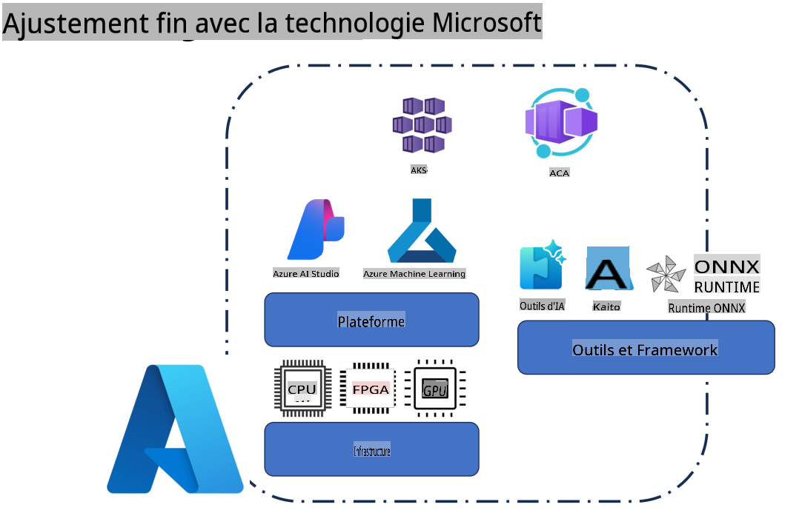
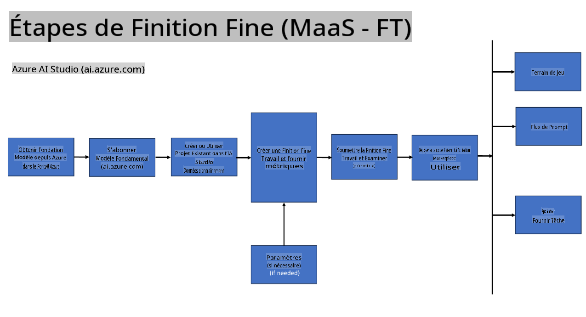
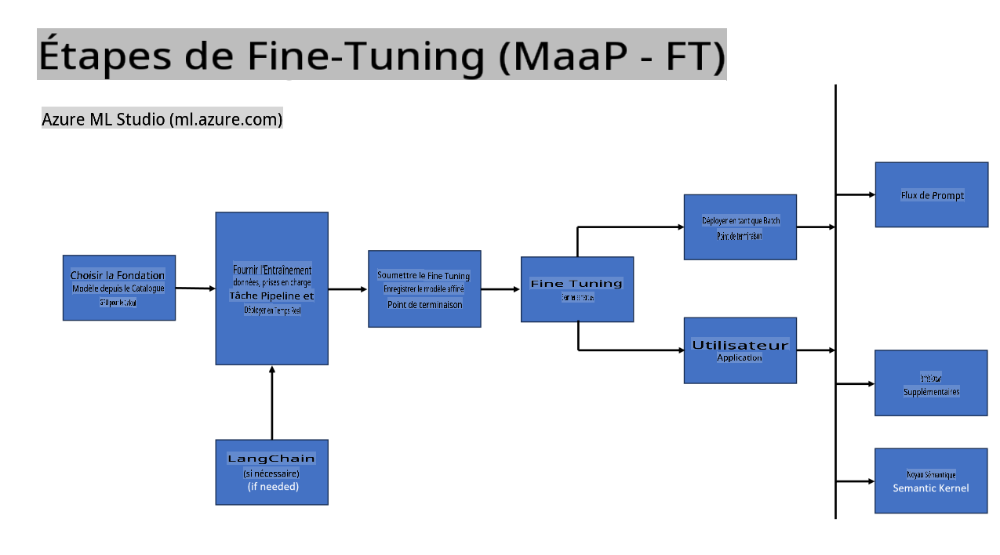
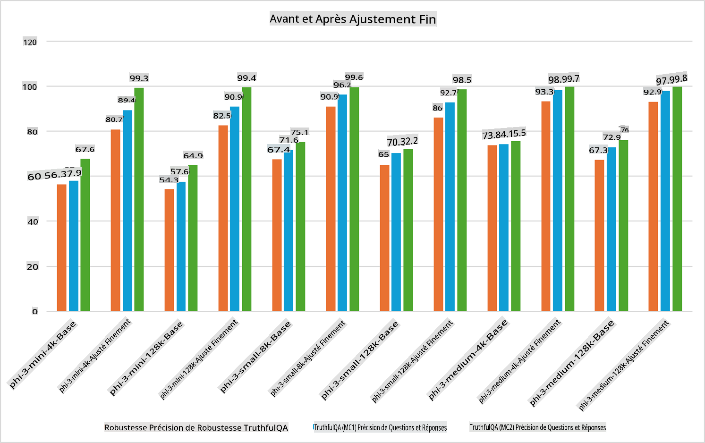

## Scénarios de réglage fin

**Plateforme** Cela inclut diverses technologies telles que Azure AI Foundry, Azure Machine Learning, AI Tools, Kaito, et ONNX Runtime.

**Infrastructure** Cela inclut le CPU et le FPGA, qui sont essentiels pour le processus de réglage fin. Laissez-moi vous montrer les icônes pour chacune de ces technologies.

**Outils & Frameworks** Cela inclut ONNX Runtime et ONNX Runtime. Laissez-moi vous montrer les icônes pour chacune de ces technologies.  
[Insérez les icônes pour ONNX Runtime et ONNX Runtime]

Le processus de réglage fin avec les technologies Microsoft implique divers composants et outils. En comprenant et en utilisant ces technologies, nous pouvons affiner efficacement nos applications et créer de meilleures solutions.

## Modèle en tant que Service

Affinez le modèle en utilisant un réglage fin hébergé, sans avoir besoin de créer et de gérer des ressources de calcul.

Le réglage fin sans serveur est disponible pour les modèles Phi-3-mini et Phi-3-medium, permettant aux développeurs de personnaliser rapidement et facilement les modèles pour des scénarios cloud et edge sans avoir à gérer des ressources de calcul. Nous avons également annoncé que le modèle Phi-3-small est désormais disponible via notre offre Modèles-en-tant-que-Service, permettant aux développeurs de se lancer rapidement et facilement dans le développement d'IA sans avoir à gérer l'infrastructure sous-jacente.

## Modèle en tant que Plateforme

Les utilisateurs gèrent leurs propres ressources de calcul pour affiner leurs modèles.

[Exemple de réglage fin](https://github.com/Azure/azureml-examples/blob/main/sdk/python/foundation-models/system/finetune/chat-completion/chat-completion.ipynb)

## Scénarios de réglage fin

| | | | | | | |
|-|-|-|-|-|-|-|
|Scénario|LoRA|QLoRA|PEFT|DeepSpeed|ZeRO|DORA|
|Adapter des LLM pré-entraînés à des tâches ou domaines spécifiques|Oui|Oui|Oui|Oui|Oui|Oui|
|Réglage fin pour des tâches NLP comme la classification de texte, la reconnaissance d'entités nommées et la traduction automatique|Oui|Oui|Oui|Oui|Oui|Oui|
|Réglage fin pour des tâches de QA|Oui|Oui|Oui|Oui|Oui|Oui|
|Réglage fin pour générer des réponses humaines dans des chatbots|Oui|Oui|Oui|Oui|Oui|Oui|
|Réglage fin pour générer de la musique, de l'art ou d'autres formes de créativité|Oui|Oui|Oui|Oui|Oui|Oui|
|Réduction des coûts computationnels et financiers|Oui|Oui|Non|Oui|Oui|Non|
|Réduction de l'utilisation de la mémoire|Non|Oui|Non|Oui|Oui|Oui|
|Utilisation de moins de paramètres pour un réglage fin efficace|Non|Oui|Oui|Non|Non|Oui|
|Forme de parallélisme de données efficace en mémoire qui donne accès à la mémoire GPU agrégée de tous les appareils GPU disponibles|Non|Non|Non|Oui|Oui|Oui|

## Exemples de performances de réglage fin

**Avertissement** :  
Ce document a été traduit à l'aide de services de traduction automatique basés sur l'intelligence artificielle. Bien que nous nous efforcions d'assurer l'exactitude, veuillez noter que les traductions automatisées peuvent contenir des erreurs ou des inexactitudes. Le document original dans sa langue d'origine doit être considéré comme la source faisant autorité. Pour des informations critiques, il est recommandé de recourir à une traduction humaine professionnelle. Nous déclinons toute responsabilité en cas de malentendus ou d'interprétations erronées découlant de l'utilisation de cette traduction.