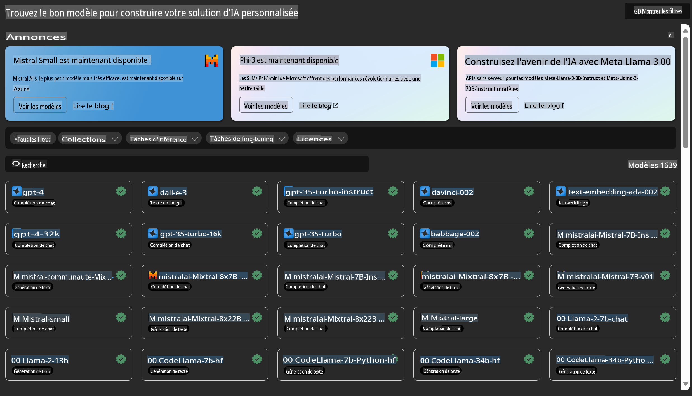
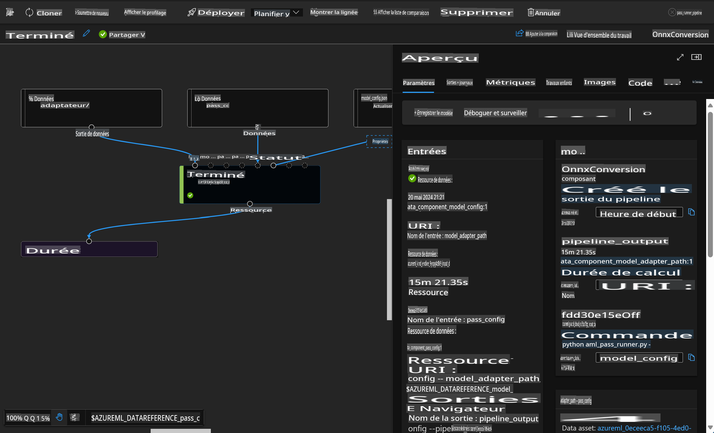

# **Présentation du service Azure Machine Learning**

[Azure Machine Learning](https://ml.azure.com?WT.mc_id=aiml-138114-kinfeylo) est un service cloud conçu pour accélérer et gérer le cycle de vie des projets de machine learning (ML).

Les professionnels du ML, les data scientists et les ingénieurs peuvent l'utiliser dans leurs workflows quotidiens pour :

- Entraîner et déployer des modèles.
- Gérer les opérations de machine learning (MLOps).
- Vous pouvez créer un modèle dans Azure Machine Learning ou utiliser un modèle développé sur une plateforme open-source, comme PyTorch, TensorFlow ou scikit-learn.
- Les outils MLOps vous aident à surveiller, réentraîner et redéployer les modèles.

## À qui s'adresse Azure Machine Learning ?

**Data Scientists et ingénieurs ML**

Ils peuvent utiliser des outils pour accélérer et automatiser leurs workflows quotidiens.  
Azure ML offre des fonctionnalités pour l'équité, l'explicabilité, le suivi et l'auditabilité.

**Développeurs d'applications**

Ils peuvent intégrer des modèles dans des applications ou services en toute transparence.

**Développeurs de plateformes**

Ils ont accès à un ensemble d'outils robustes soutenus par des APIs durables d'Azure Resource Manager.  
Ces outils permettent de construire des outils ML avancés.

**Entreprises**

En travaillant dans le cloud Microsoft Azure, les entreprises bénéficient de mesures de sécurité familières et d'un contrôle d'accès basé sur les rôles.  
Elles peuvent configurer des projets pour contrôler l'accès aux données protégées et à des opérations spécifiques.

## Productivité pour toute l'équipe

Les projets ML nécessitent souvent une équipe aux compétences variées pour les construire et les maintenir.

Azure ML propose des outils permettant de :
- Collaborer avec votre équipe via des notebooks partagés, des ressources de calcul, des calculs serverless, des données et des environnements.
- Développer des modèles avec des fonctionnalités d'équité, d'explicabilité, de suivi et d'auditabilité pour répondre aux exigences de traçabilité et de conformité.
- Déployer rapidement et facilement des modèles ML à grande échelle, et les gérer efficacement grâce à MLOps.
- Exécuter des charges de travail de machine learning partout avec une gouvernance, une sécurité et une conformité intégrées.

## Outils de plateforme compatibles

Tout membre d'une équipe ML peut utiliser ses outils préférés pour accomplir ses tâches.  
Que vous meniez des expériences rapides, ajustiez des hyperparamètres, construisiez des pipelines ou gériez des inférences, vous pouvez utiliser des interfaces familières telles que :
- Azure Machine Learning Studio
- Python SDK (v2)
- Azure CLI (v2)
- APIs REST d'Azure Resource Manager

Au fur et à mesure que vous affinez vos modèles et collaborez tout au long du cycle de développement, vous pouvez partager et retrouver des actifs, des ressources et des métriques dans l'interface utilisateur d'Azure Machine Learning Studio.

## **LLM/SLM dans Azure ML**

Azure ML a ajouté de nombreuses fonctionnalités liées aux LLM/SLM, combinant LLMOps et SLMOps pour créer une plateforme technologique d'intelligence artificielle générative à l'échelle de l'entreprise.

### **Catalogue de modèles**

Les utilisateurs en entreprise peuvent déployer différents modèles en fonction de scénarios métiers variés via le Catalogue de modèles et fournir des services sous forme de Model as Service, permettant aux développeurs ou utilisateurs d'entreprise d'y accéder.

Le Catalogue de modèles dans Azure Machine Learning Studio est le centre pour découvrir et utiliser une large gamme de modèles permettant de construire des applications d'IA générative. Ce catalogue propose des centaines de modèles provenant de fournisseurs tels qu'Azure OpenAI Service, Mistral, Meta, Cohere, Nvidia, Hugging Face, ainsi que des modèles entraînés par Microsoft. Les modèles de fournisseurs autres que Microsoft sont considérés comme des Produits Non-Microsoft, tels que définis dans les Conditions des produits Microsoft, et soumis aux conditions associées à ces modèles.

### **Pipeline de tâches**

Le cœur d'un pipeline de machine learning consiste à diviser une tâche complète de ML en un workflow multi-étapes. Chaque étape est un composant gérable qui peut être développé, optimisé, configuré et automatisé individuellement. Les étapes sont connectées via des interfaces bien définies. Le service de pipeline Azure Machine Learning orchestre automatiquement toutes les dépendances entre les étapes du pipeline.

Lors du fine-tuning des SLM / LLM, nous pouvons gérer nos processus de données, d'entraînement et de génération via le Pipeline.

### **Flux de prompts**

#### Avantages de l'utilisation du flux de prompts d'Azure Machine Learning

Le flux de prompts d'Azure Machine Learning offre une gamme d'avantages qui aident les utilisateurs à passer de l'idéation à l'expérimentation, puis à des applications prêtes pour la production basées sur des LLM :

**Agilité en ingénierie de prompts**

- Expérience interactive d'édition : Le flux de prompts d'Azure Machine Learning fournit une représentation visuelle de la structure du flux, permettant aux utilisateurs de comprendre et de naviguer facilement dans leurs projets. Il offre également une expérience de codage similaire à un notebook pour un développement et un débogage efficaces.
- Variantes pour l'ajustement des prompts : Les utilisateurs peuvent créer et comparer plusieurs variantes de prompts, facilitant un processus de raffinement itératif.
- Évaluation : Les flux d'évaluation intégrés permettent aux utilisateurs d'évaluer la qualité et l'efficacité de leurs prompts et flux.
- Ressources complètes : Le flux de prompts d'Azure Machine Learning inclut une bibliothèque d'outils intégrés, d'exemples et de modèles qui servent de point de départ pour le développement, inspirant la créativité et accélérant le processus.

**Prêt pour l'entreprise pour les applications basées sur des LLM**

- Collaboration : Le flux de prompts d'Azure Machine Learning prend en charge la collaboration en équipe, permettant à plusieurs utilisateurs de travailler ensemble sur des projets d'ingénierie de prompts, de partager leurs connaissances et de maintenir un contrôle des versions.
- Plateforme tout-en-un : Le flux de prompts d'Azure Machine Learning rationalise l'ensemble du processus d'ingénierie de prompts, du développement et de l'évaluation au déploiement et au suivi. Les utilisateurs peuvent déployer leurs flux en tant que points de terminaison Azure Machine Learning et surveiller leurs performances en temps réel, garantissant un fonctionnement optimal et une amélioration continue.
- Solutions de préparation d'entreprise d'Azure Machine Learning : Le flux de prompts s'appuie sur les solutions robustes d'Azure Machine Learning pour la préparation d'entreprise, offrant une base sécurisée, évolutive et fiable pour le développement, l'expérimentation et le déploiement des flux.

Avec le flux de prompts d'Azure Machine Learning, les utilisateurs peuvent libérer leur agilité en ingénierie de prompts, collaborer efficacement et tirer parti de solutions de niveau entreprise pour développer et déployer avec succès des applications basées sur des LLM.

En combinant la puissance de calcul, les données et les différents composants d'Azure ML, les développeurs d'entreprise peuvent facilement créer leurs propres applications d'intelligence artificielle.

**Avertissement** :  
Ce document a été traduit à l'aide de services de traduction automatisés basés sur l'intelligence artificielle. Bien que nous nous efforcions d'assurer l'exactitude, veuillez noter que les traductions automatiques peuvent contenir des erreurs ou des inexactitudes. Le document original dans sa langue d'origine doit être considéré comme la source faisant autorité. Pour des informations critiques, il est recommandé de faire appel à une traduction humaine professionnelle. Nous déclinons toute responsabilité en cas de malentendus ou d'interprétations erronées résultant de l'utilisation de cette traduction.