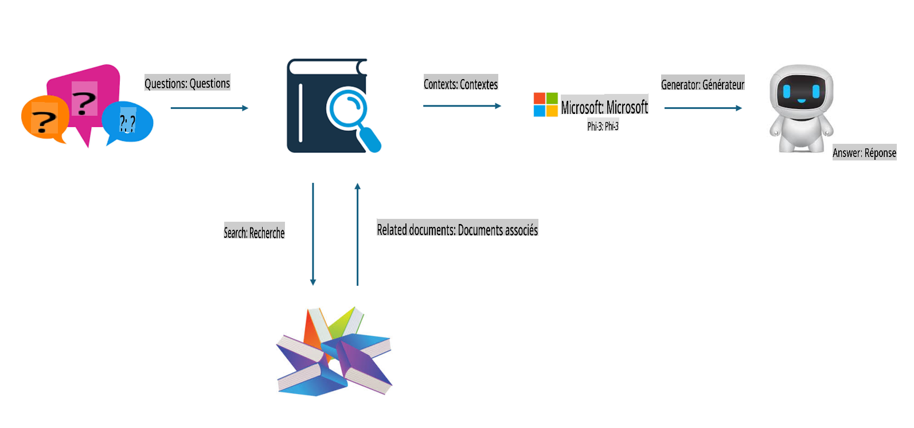
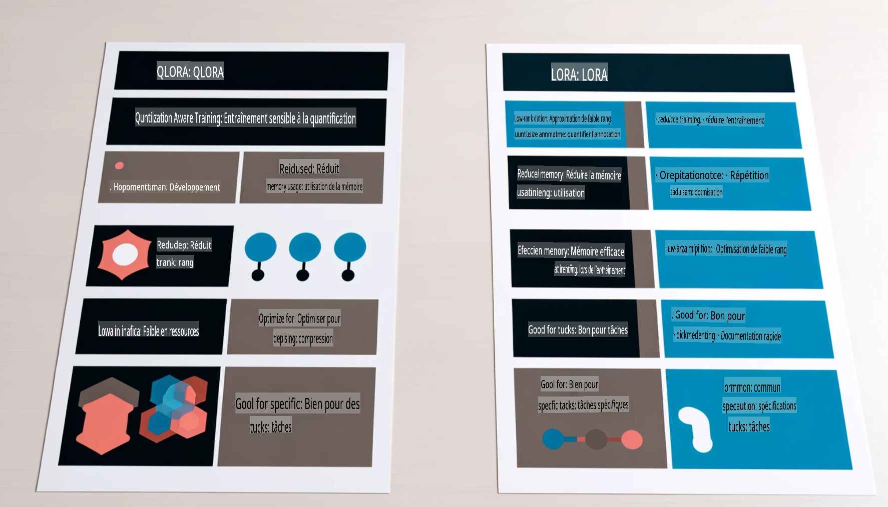

# **Faire de Phi-3 un expert dans son domaine**

Pour intégrer le modèle Phi-3 dans une industrie, il est nécessaire d'ajouter des données métier spécifiques à ce modèle. Deux options s'offrent à nous : RAG (Retrieval Augmented Generation) et Fine Tuning.

## **RAG vs Fine-Tuning**

### **Retrieval Augmented Generation**

RAG combine la récupération de données et la génération de texte. Les données structurées et non structurées de l’entreprise sont stockées dans une base de données vectorielle. Lors de la recherche de contenu pertinent, un résumé et du contenu associés sont extraits pour former un contexte, et la capacité de complétion textuelle de LLM/SLM est utilisée pour générer du contenu.

### **Fine-tuning**

Le Fine-tuning repose sur l'amélioration d'un modèle existant. Il ne nécessite pas de repartir de l’algorithme de base, mais demande une accumulation continue de données. Si vous avez besoin d’une terminologie précise et d’une expression adaptée aux applications industrielles, le Fine-tuning est une meilleure option. Cependant, si vos données évoluent fréquemment, le Fine-tuning peut devenir complexe.

### **Comment choisir**

1. Si notre réponse nécessite l’intégration de données externes, RAG est le meilleur choix.

2. Si vous devez produire des connaissances industrielles stables et précises, le Fine-tuning est une bonne option. RAG privilégie l'extraction de contenu pertinent mais peut manquer de nuances spécialisées.

3. Le Fine-tuning nécessite un jeu de données de haute qualité, et si les données concernent un domaine restreint, cela n’aura pas beaucoup d’impact. RAG est plus flexible.

4. Le Fine-tuning est une boîte noire, une approche métaphysique, et il est difficile d’en comprendre le mécanisme interne. RAG, en revanche, facilite l’identification de la source des données, permettant ainsi de corriger efficacement les hallucinations ou les erreurs de contenu et d’offrir une meilleure transparence.

### **Scénarios**

1. Les industries verticales nécessitant un vocabulaire et des expressions professionnels spécifiques, ***Fine-tuning*** sera le meilleur choix.

2. Les systèmes de questions-réponses, impliquant la synthèse de différents points de connaissance, ***RAG*** sera le meilleur choix.

3. La combinaison de flux métier automatisés ***RAG + Fine-tuning*** est le meilleur choix.

## **Comment utiliser RAG**

Une base de données vectorielle est une collection de données stockées sous forme mathématique. Ces bases permettent aux modèles d’apprentissage automatique de se souvenir des entrées précédentes, rendant possible des cas d’usage comme la recherche, les recommandations et la génération de texte. Les données peuvent être identifiées sur la base de mesures de similarité plutôt que d’une correspondance exacte, ce qui permet aux modèles informatiques de comprendre le contexte des données.

La base de données vectorielle est essentielle pour implémenter RAG. Nous pouvons convertir les données en stockage vectoriel à l’aide de modèles vectoriels tels que text-embedding-3, jina-ai-embedding, etc.

En savoir plus sur la création d'une application RAG : [https://github.com/microsoft/Phi-3CookBook](https://github.com/microsoft/Phi-3CookBook?WT.mc_id=aiml-138114-kinfeylo)

## **Comment utiliser le Fine-tuning**

Les algorithmes les plus couramment utilisés dans le Fine-tuning sont Lora et QLora. Comment choisir ?
- [En savoir plus avec cet exemple de notebook](../../../../code/04.Finetuning/Phi_3_Inference_Finetuning.ipynb)
- [Exemple de script Python pour le Fine-tuning](../../../../code/04.Finetuning/FineTrainingScript.py)

### **Lora et QLora**

LoRA (Low-Rank Adaptation) et QLoRA (Quantized Low-Rank Adaptation) sont deux techniques utilisées pour affiner les grands modèles linguistiques (LLMs) via le Fine-tuning efficace en paramètres (PEFT). Ces techniques sont conçues pour entraîner les modèles plus efficacement que les méthodes traditionnelles.

LoRA est une méthode autonome de Fine-tuning qui réduit l’empreinte mémoire en appliquant une approximation de bas rang à la matrice de mise à jour des poids. Elle offre des temps d’entraînement rapides tout en maintenant des performances proches des méthodes de Fine-tuning traditionnelles.

QLoRA est une version étendue de LoRA qui intègre des techniques de quantification pour réduire encore davantage l’utilisation de la mémoire. QLoRA quantifie la précision des paramètres de poids du modèle pré-entraîné à une précision de 4 bits, ce qui est plus économe en mémoire que LoRA. Cependant, l’entraînement avec QLoRA est environ 30 % plus lent que celui avec LoRA en raison des étapes supplémentaires de quantification et de déquantification.

QLoRA utilise LoRA comme un complément pour corriger les erreurs introduites lors de la quantification. QLoRA permet le Fine-tuning de modèles massifs avec des milliards de paramètres sur des GPU relativement modestes et largement disponibles. Par exemple, QLoRA peut affiner un modèle de 70 milliards de paramètres nécessitant 36 GPU avec seulement 2.

**Avertissement** :  
Ce document a été traduit à l'aide de services de traduction basés sur l'intelligence artificielle. Bien que nous nous efforcions d'assurer l'exactitude, veuillez noter que les traductions automatisées peuvent contenir des erreurs ou des inexactitudes. Le document original dans sa langue d'origine doit être considéré comme la source faisant autorité. Pour des informations critiques, il est recommandé de faire appel à une traduction humaine professionnelle. Nous déclinons toute responsabilité en cas de malentendus ou d'interprétations erronées résultant de l'utilisation de cette traduction.