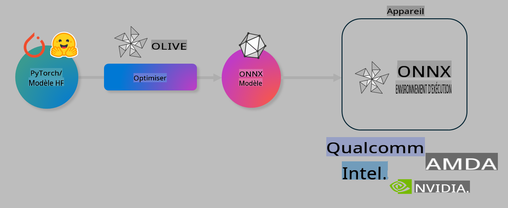

# Lab. Optimiser des modèles d'IA pour l'inférence embarquée

## Introduction 

> [!IMPORTANT]
> Ce laboratoire nécessite un **GPU Nvidia A10 ou A100** avec les pilotes associés et le toolkit CUDA (version 12+) installés.

> [!NOTE]
> Ce laboratoire de **35 minutes** vous offrira une introduction pratique aux concepts fondamentaux de l'optimisation des modèles pour l'inférence embarquée en utilisant OLIVE.

## Objectifs d'apprentissage

À la fin de ce laboratoire, vous serez capable d'utiliser OLIVE pour :

- Quantifier un modèle d'IA en utilisant la méthode de quantification AWQ.
- Ajuster un modèle d'IA pour une tâche spécifique.
- Générer des adaptateurs LoRA (modèle ajusté) pour une inférence embarquée efficace sur ONNX Runtime.

### Qu'est-ce qu'Olive

Olive (*O*NNX *live*) est un outil d'optimisation de modèles avec une interface en ligne de commande (CLI) qui vous permet de déployer des modèles pour ONNX runtime +++https://onnxruntime.ai+++ avec qualité et performance.



L'entrée d'Olive est généralement un modèle PyTorch ou Hugging Face, et la sortie est un modèle ONNX optimisé, exécuté sur un appareil (cible de déploiement) utilisant ONNX runtime. Olive optimise le modèle pour l'accélérateur d'IA de la cible de déploiement (NPU, GPU, CPU) fourni par un fabricant de matériel tel que Qualcomm, AMD, Nvidia ou Intel.

Olive exécute un *workflow*, qui est une séquence ordonnée de tâches individuelles d'optimisation de modèles appelées *passes*. Des exemples de passes incluent : compression de modèle, capture de graphe, quantification, optimisation de graphe. Chaque passe possède un ensemble de paramètres ajustables pour atteindre les meilleurs résultats en termes de métriques, comme la précision et la latence, évaluées par l'évaluateur respectif. Olive utilise une stratégie de recherche qui applique un algorithme pour ajuster automatiquement chaque passe, individuellement ou en groupes.

#### Avantages d'Olive

- **Réduisez la frustration et le temps** liés aux expérimentations manuelles par essais-erreurs avec diverses techniques d'optimisation de graphe, de compression et de quantification. Définissez vos contraintes de qualité et de performance, et laissez Olive trouver automatiquement le meilleur modèle pour vous.
- **Plus de 40 composants d'optimisation intégrés** couvrant les techniques de pointe en matière de quantification, compression, optimisation de graphe et ajustement.
- **CLI facile à utiliser** pour les tâches courantes d'optimisation de modèles. Par exemple : olive quantize, olive auto-opt, olive finetune.
- Intégration du packaging et du déploiement de modèles.
- Prend en charge la génération de modèles pour **Multi LoRA serving**.
- Construction de workflows en utilisant YAML/JSON pour orchestrer les tâches d'optimisation et de déploiement de modèles.
- Intégration avec **Hugging Face** et **Azure AI**.
- Mécanisme de **caching intégré** pour **réduire les coûts**.

## Instructions du laboratoire
> [!NOTE]
> Assurez-vous d'avoir configuré votre Azure AI Hub et votre projet, ainsi que votre instance A100, comme indiqué dans le laboratoire 1.

### Étape 0 : Connectez-vous à votre Azure AI Compute

Vous vous connecterez à l'instance Azure AI Compute en utilisant la fonctionnalité de connexion à distance dans **VS Code.** 

1. Ouvrez votre application de bureau **VS Code** :
1. Ouvrez la **palette de commandes** avec **Shift+Ctrl+P**.
1. Dans la palette de commandes, recherchez **AzureML - remote: Connect to compute instance in New Window**.
1. Suivez les instructions à l'écran pour vous connecter à l'instance de calcul. Cela impliquera de sélectionner votre abonnement Azure, votre groupe de ressources, votre projet et le nom de l'instance de calcul que vous avez configurée dans le laboratoire 1.
1. Une fois connecté à votre nœud Azure ML Compute, cela sera affiché en **bas à gauche de Visual Code** `><Azure ML: Compute Name`.

### Étape 1 : Clonez ce dépôt

Dans VS Code, ouvrez un nouveau terminal avec **Ctrl+J** et clonez ce dépôt :

Dans le terminal, vous devriez voir l'invite suivante :

```
azureuser@computername:~/cloudfiles/code$ 
```
Clonez la solution :

```bash
cd ~/localfiles
git clone https://github.com/microsoft/phi-3cookbook.git
```

### Étape 2 : Ouvrez le dossier dans VS Code

Pour ouvrir VS Code dans le dossier pertinent, exécutez la commande suivante dans le terminal, ce qui ouvrira une nouvelle fenêtre :

```bash
code phi-3cookbook/code/04.Finetuning/Olive-lab
```

Sinon, vous pouvez ouvrir le dossier en sélectionnant **File** > **Open Folder**.

### Étape 3 : Dépendances

Ouvrez une fenêtre de terminal dans VS Code sur votre instance Azure AI Compute (astuce : **Ctrl+J**) et exécutez les commandes suivantes pour installer les dépendances :

```bash
conda create -n olive-ai python=3.11 -y
conda activate olive-ai
pip install -r requirements.txt
az extension remove -n azure-cli-ml
az extension add -n ml
```

> [!NOTE]
> L'installation de toutes les dépendances prendra environ 5 minutes.

Dans ce laboratoire, vous téléchargerez et téléverserez des modèles dans le catalogue de modèles Azure AI. Pour accéder au catalogue de modèles, vous devrez vous connecter à Azure en utilisant :

```bash
az login
```

> [!NOTE]
> Lors de la connexion, vous serez invité à sélectionner votre abonnement. Assurez-vous de définir l'abonnement fourni pour ce laboratoire.

### Étape 4 : Exécutez les commandes Olive 

Ouvrez une fenêtre de terminal dans VS Code sur votre instance Azure AI Compute (astuce : **Ctrl+J**) et assurez-vous que l'environnement `olive-ai` conda est activé :

```bash
conda activate olive-ai
```

Ensuite, exécutez les commandes Olive suivantes dans la ligne de commande.

1. **Inspectez les données :** Dans cet exemple, vous allez ajuster le modèle Phi-3.5-Mini afin qu'il se spécialise dans les réponses aux questions liées aux voyages. Le code ci-dessous affiche les premières entrées du jeu de données, qui sont au format JSON lines :

    ```bash
    head data/data_sample_travel.jsonl
    ```
1. **Quantifiez le modèle :** Avant d'entraîner le modèle, commencez par le quantifier en utilisant la commande suivante, qui applique une technique appelée Quantification Active Aware (AWQ) +++https://arxiv.org/abs/2306.00978+++. AWQ quantifie les poids d'un modèle en tenant compte des activations produites lors de l'inférence. Cela signifie que le processus de quantification prend en compte la distribution réelle des données dans les activations, ce qui permet de mieux préserver la précision du modèle par rapport aux méthodes traditionnelles de quantification des poids.

    ```bash
    olive quantize \
       --model_name_or_path microsoft/Phi-3.5-mini-instruct \
       --trust_remote_code \
       --algorithm awq \
       --output_path models/phi/awq \
       --log_level 1
    ```
    
    Cela prend environ **8 minutes** pour compléter la quantification AWQ, ce qui **réduit la taille du modèle de ~7,5 Go à ~2,5 Go**.
   
   Dans ce laboratoire, nous vous montrons comment importer des modèles depuis Hugging Face (par exemple : `microsoft/Phi-3.5-mini-instruct`). However, Olive also allows you to input models from the Azure AI catalog by updating the `model_name_or_path` argument to an Azure AI asset ID (for example:  `azureml://registries/azureml/models/Phi-3.5-mini-instruct/versions/4`). 

1. **Train the model:** Next, the `olive finetune` pour ajuster le modèle quantifié. Quantifier le modèle *avant* l'ajustement plutôt qu'après donne de meilleurs résultats, car le processus d'ajustement récupère une partie de la perte due à la quantification.

    ```bash
    olive finetune \
        --method lora \
        --model_name_or_path models/phi/awq \
        --data_files "data/data_sample_travel.jsonl" \
        --data_name "json" \
        --text_template "<|user|>\n{prompt}<|end|>\n<|assistant|>\n{response}<|end|>" \
        --max_steps 100 \
        --output_path ./models/phi/ft \
        --log_level 1
    ```
    
    Cela prend environ **6 minutes** pour compléter l'ajustement (avec 100 étapes).

1. **Optimisez :** Une fois le modèle ajusté, vous pouvez l'optimiser en utilisant la commande `auto-opt` command, which will capture the ONNX graph and automatically perform a number of optimizations to improve the model performance for CPU by compressing the model and doing fusions. It should be noted, that you can also optimize for other devices such as NPU or GPU by just updating the `--device` and `--provider` d'Olive - mais pour les besoins de ce laboratoire, nous utiliserons le CPU.

    ```bash
    olive auto-opt \
       --model_name_or_path models/phi/ft/model \
       --adapter_path models/phi/ft/adapter \
       --device cpu \
       --provider CPUExecutionProvider \
       --use_ort_genai \
       --output_path models/phi/onnx-ao \
       --log_level 1
    ```
    
    Cela prend environ **5 minutes** pour compléter l'optimisation.

### Étape 5 : Test rapide d'inférence du modèle

Pour tester l'inférence du modèle, créez un fichier Python dans votre dossier appelé **app.py** et copiez-collez le code suivant :

```python
import onnxruntime_genai as og
import numpy as np

print("loading model and adapters...", end="", flush=True)
model = og.Model("models/phi/onnx-ao/model")
adapters = og.Adapters(model)
adapters.load("models/phi/onnx-ao/model/adapter_weights.onnx_adapter", "travel")
print("DONE!")

tokenizer = og.Tokenizer(model)
tokenizer_stream = tokenizer.create_stream()

params = og.GeneratorParams(model)
params.set_search_options(max_length=100, past_present_share_buffer=False)
user_input = "what is the best thing to see in chicago"
params.input_ids = tokenizer.encode(f"<|user|>\n{user_input}<|end|>\n<|assistant|>\n")

generator = og.Generator(model, params)

generator.set_active_adapter(adapters, "travel")

print(f"{user_input}")

while not generator.is_done():
    generator.compute_logits()
    generator.generate_next_token()

    new_token = generator.get_next_tokens()[0]
    print(tokenizer_stream.decode(new_token), end='', flush=True)

print("\n")
```

Exécutez le code en utilisant :

```bash
python app.py
```

### Étape 6 : Téléversez le modèle sur Azure AI

Téléverser le modèle dans un référentiel de modèles Azure AI permet de le partager avec d'autres membres de votre équipe de développement et gère également le contrôle des versions du modèle. Pour téléverser le modèle, exécutez la commande suivante :

> [!NOTE]
> Mettez à jour les champs `{}` avec le nom de votre `resourceGroup` et le nom de votre projet Azure AI, puis exécutez la commande suivante :

```
az ml workspace show
```

Ou en accédant à +++ai.azure.com+++ et en sélectionnant **management center** **project** **overview**.

Mettez à jour les champs `{}` avec le nom de votre groupe de ressources et celui de votre projet Azure AI.

```bash
az ml model create \
    --name ft-for-travel \
    --version 1 \
    --path ./models/phi/onnx-ao \
    --resource-group {RESOURCE_GROUP_NAME} \
    --workspace-name {PROJECT_NAME}
```
Vous pourrez ensuite voir votre modèle téléversé et le déployer sur https://ml.azure.com/model/list

**Avertissement** :  
Ce document a été traduit à l'aide de services de traduction automatisée basés sur l'intelligence artificielle. Bien que nous nous efforcions d'assurer l'exactitude, veuillez noter que les traductions automatisées peuvent contenir des erreurs ou des inexactitudes. Le document original dans sa langue d'origine doit être considéré comme la source faisant autorité. Pour des informations critiques, il est recommandé de recourir à une traduction humaine professionnelle. Nous déclinons toute responsabilité en cas de malentendus ou d'interprétations erronées résultant de l'utilisation de cette traduction.