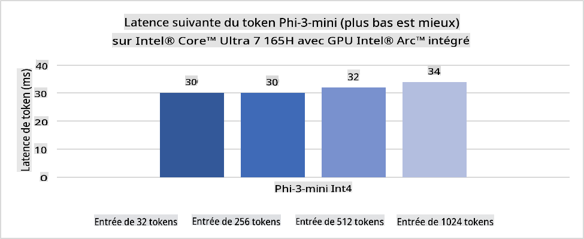
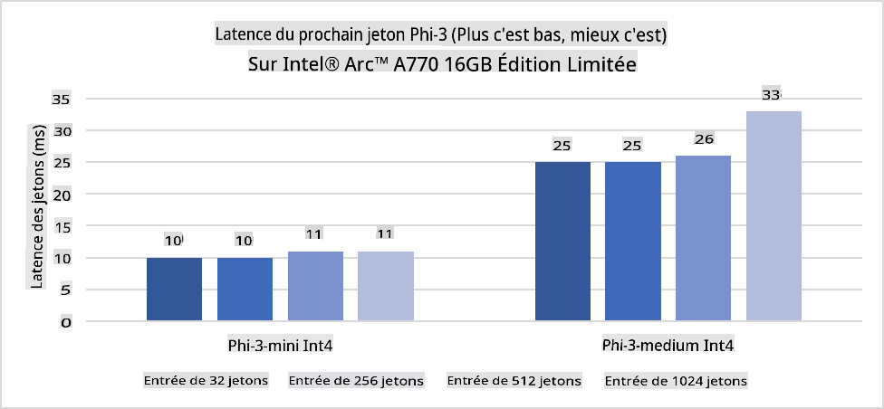
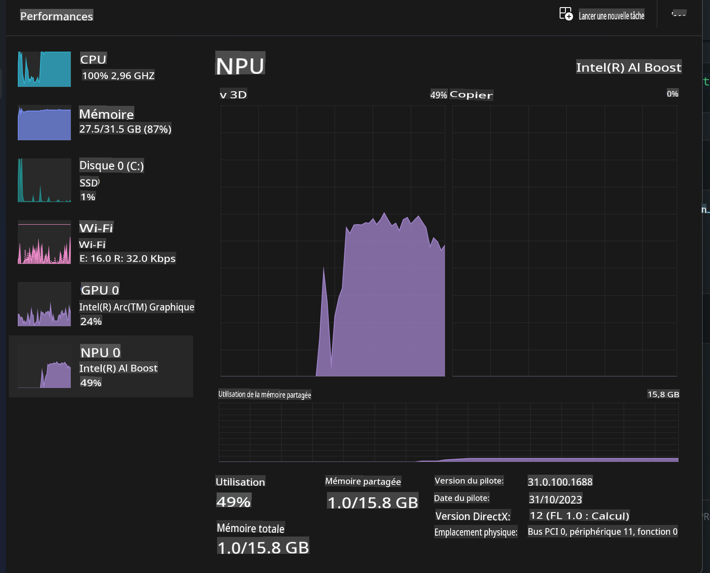
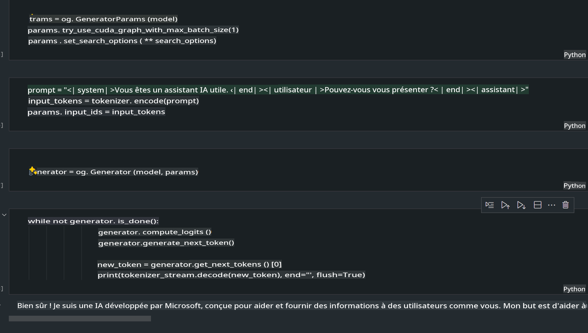
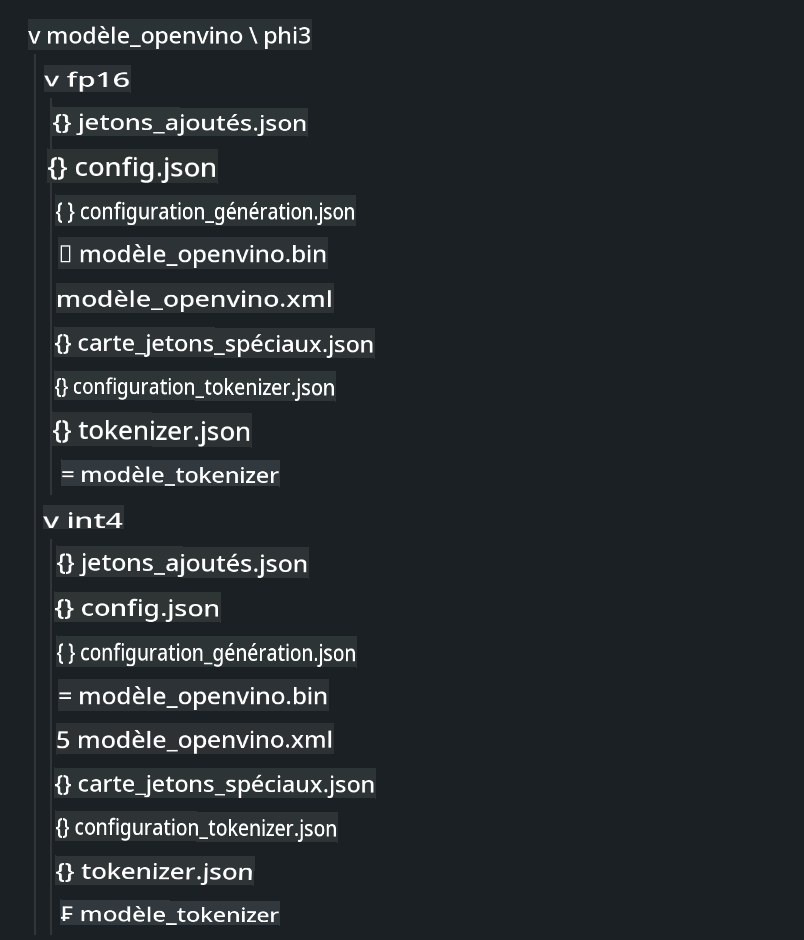
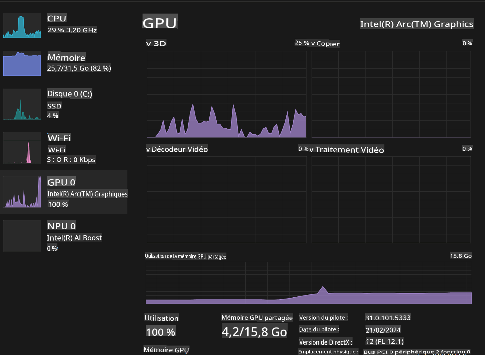

# **Inférence Phi-3 sur un PC IA**

Avec l'avancement de l'IA générative et l'amélioration des capacités matérielles des appareils périphériques, un nombre croissant de modèles d'IA générative peuvent désormais être intégrés aux appareils Bring Your Own Device (BYOD) des utilisateurs. Les PC IA font partie de ces modèles. À partir de 2024, Intel, AMD et Qualcomm se sont associés aux fabricants de PC pour introduire des PC IA qui facilitent le déploiement de modèles d'IA générative localisés grâce à des modifications matérielles. Dans cette discussion, nous nous concentrerons sur les PC IA d'Intel et explorerons comment déployer Phi-3 sur un PC IA d'Intel.

### **Qu'est-ce qu'un NPU**

Un NPU (Neural Processing Unit) est un processeur ou une unité de traitement dédiée sur un SoC plus grand, conçu spécifiquement pour accélérer les opérations de réseaux neuronaux et les tâches d'IA. Contrairement aux CPU et GPU polyvalents, les NPU sont optimisés pour un calcul parallèle axé sur les données, ce qui les rend très efficaces pour traiter des données multimédia massives comme des vidéos et des images et pour traiter des données pour les réseaux neuronaux. Ils sont particulièrement habiles pour gérer des tâches liées à l'IA, telles que la reconnaissance vocale, le floutage de l'arrière-plan lors des appels vidéo, et les processus de montage photo ou vidéo comme la détection d'objets.

## **NPU vs GPU** 
Bien que de nombreuses charges de travail d'IA et d'apprentissage automatique s'exécutent sur des GPU, il y a une distinction cruciale entre les GPU et les NPU.
Les GPU sont connus pour leurs capacités de calcul parallèle, mais tous les GPU ne sont pas également efficaces au-delà du traitement graphique. Les NPU, en revanche, sont conçus spécifiquement pour les calculs complexes impliqués dans les opérations de réseaux neuronaux, ce qui les rend très efficaces pour les tâches d'IA.

En résumé, les NPU sont les as des maths qui boostent les calculs d'IA, et ils jouent un rôle clé dans l'ère émergente des PC IA !

***Cet exemple est basé sur le dernier processeur Intel Core Ultra***

## **1. Utiliser un NPU pour exécuter le modèle Phi-3**

Le dispositif Intel® NPU est un accélérateur d'inférence IA intégré aux CPU clients Intel, à partir de la génération Intel® Core™ Ultra (anciennement connue sous le nom de Meteor Lake). Il permet l'exécution écoénergétique des tâches de réseaux neuronaux artificiels.





**Bibliothèque d'accélération Intel NPU**

La bibliothèque d'accélération Intel NPU [https://github.com/intel/intel-npu-acceleration-library](https://github.com/intel/intel-npu-acceleration-library) est une bibliothèque Python conçue pour augmenter l'efficacité de vos applications en tirant parti de la puissance de l'unité de traitement neuronal (NPU) d'Intel pour effectuer des calculs à haute vitesse sur du matériel compatible.

Exemple de Phi-3-mini sur un PC IA équipé de processeurs Intel® Core™ Ultra.


Installer la bibliothèque Python avec pip

```bash

   pip install intel-npu-acceleration-library

```

***Note*** Le projet est encore en développement, mais le modèle de référence est déjà très complet.


### **Exécuter Phi-3 avec la bibliothèque d'accélération Intel NPU**

En utilisant l'accélération NPU d'Intel, cette bibliothèque n'affecte pas le processus de codage traditionnel. Vous n'avez qu'à utiliser cette bibliothèque pour quantifier le modèle Phi-3 original, tel que FP16, INT8, INT4, tel que 


```python

from transformers import AutoTokenizer, pipeline, TextStreamer
import intel_npu_acceleration_library as npu_lib
import warnings

model_id = "microsoft/Phi-3-mini-4k-instruct"

model = npu_lib.NPUModelForCausalLM.from_pretrained(
                                    model_id,
                                    torch_dtype="auto",
                                    dtype=npu_lib.int4,
                                    trust_remote_code=True
                                )

tokenizer = AutoTokenizer.from_pretrained(model_id)

text_streamer = TextStreamer(tokenizer, skip_prompt=True)

```
Après la quantification réussie, continuez l'exécution pour appeler le NPU afin d'exécuter le modèle Phi-3.


```python

generation_args = {
            "max_new_tokens": 1024,
            "return_full_text": False,
            "temperature": 0.3,
            "do_sample": False,
            "streamer": text_streamer,
        }

pipe = pipeline(
            "text-generation",
            model=model,
            tokenizer=tokenizer,
)

query = "<|system|>You are a helpful AI assistant.<|end|><|user|>Can you introduce yourself?<|end|><|assistant|>"

with warnings.catch_warnings():
    warnings.simplefilter("ignore")
    pipe(query, **generation_args)


```

Lors de l'exécution du code, nous pouvons voir l'état de fonctionnement du NPU via le gestionnaire des tâches




***Exemples*** : [AIPC_NPU_DEMO.ipynb](../../../../code/03.Inference/AIPC/AIPC_NPU_DEMO.ipynb)


## **2. Utiliser DirectML + ONNX Runtime pour exécuter le modèle Phi-3**

### **Qu'est-ce que DirectML**

[DirectML](https://github.com/microsoft/DirectML) est une bibliothèque DirectX 12 à haute performance et accélérée par le matériel pour l'apprentissage automatique. DirectML fournit une accélération GPU pour les tâches courantes d'apprentissage automatique sur une large gamme de matériel et de pilotes pris en charge, y compris tous les GPU compatibles DirectX 12 des fournisseurs tels qu'AMD, Intel, NVIDIA et Qualcomm.

Lorsqu'il est utilisé seul, l'API DirectML est une bibliothèque DirectX 12 de bas niveau et convient aux applications à haute performance et à faible latence telles que les frameworks, les jeux et autres applications en temps réel. L'interopérabilité transparente de DirectML avec Direct3D 12 ainsi que sa faible surcharge et sa conformité sur le matériel font de DirectML un choix idéal pour accélérer l'apprentissage automatique lorsque des performances élevées sont souhaitées, et que la fiabilité et la prévisibilité des résultats sur le matériel sont cruciales.

***Note*** : Le dernier DirectML prend déjà en charge le NPU (https://devblogs.microsoft.com/directx/introducing-neural-processor-unit-npu-support-in-directml-developer-preview/)

### DirectML et CUDA en termes de capacités et de performance :

**DirectML** est une bibliothèque d'apprentissage automatique développée par Microsoft. Elle est conçue pour accélérer les charges de travail d'apprentissage automatique sur les appareils Windows, y compris les ordinateurs de bureau, les ordinateurs portables et les appareils périphériques.
- Basé sur DX12 : DirectML est construit sur DirectX 12 (DX12), ce qui offre un large support matériel sur les GPU, y compris ceux de NVIDIA et AMD.
- Support plus large : Étant donné qu'il utilise DX12, DirectML peut fonctionner avec n'importe quel GPU qui prend en charge DX12, même les GPU intégrés.
- Traitement d'images : DirectML traite les images et autres données en utilisant des réseaux neuronaux, ce qui le rend adapté aux tâches telles que la reconnaissance d'images, la détection d'objets, et plus encore.
- Facilité d'installation : L'installation de DirectML est simple, et il ne nécessite pas de SDK ou de bibliothèques spécifiques des fabricants de GPU.
- Performance : Dans certains cas, DirectML fonctionne bien et peut être plus rapide que CUDA, surtout pour certaines charges de travail.
- Limitations : Cependant, il y a des cas où DirectML peut être plus lent, en particulier pour les grandes tailles de lot en float16.

**CUDA** est la plateforme de calcul parallèle et le modèle de programmation de NVIDIA. Il permet aux développeurs de tirer parti de la puissance des GPU NVIDIA pour le calcul général, y compris l'apprentissage automatique et les simulations scientifiques.
- Spécifique à NVIDIA : CUDA est étroitement intégré aux GPU NVIDIA et est spécifiquement conçu pour eux.
- Hautement optimisé : Il offre d'excellentes performances pour les tâches accélérées par GPU, surtout lorsqu'on utilise des GPU NVIDIA.
- Largement utilisé : De nombreux frameworks et bibliothèques d'apprentissage automatique (tels que TensorFlow et PyTorch) prennent en charge CUDA.
- Personnalisation : Les développeurs peuvent affiner les paramètres CUDA pour des tâches spécifiques, ce qui peut conduire à des performances optimales.
- Limitations : Cependant, la dépendance de CUDA au matériel NVIDIA peut être limitante si vous souhaitez une compatibilité plus large avec différents GPU.

### Choisir entre DirectML et CUDA :
Le choix entre DirectML et CUDA dépend de votre cas d'utilisation spécifique, de la disponibilité du matériel et de vos préférences.
Si vous recherchez une compatibilité plus large et une facilité d'installation, DirectML pourrait être un bon choix. Cependant, si vous avez des GPU NVIDIA et avez besoin de performances hautement optimisées, CUDA reste un choix solide. En résumé, DirectML et CUDA ont tous deux leurs forces et leurs faiblesses, donc considérez vos besoins et le matériel disponible lors de la prise de décision 

### **IA générative avec ONNX Runtime**

À l'ère de l'IA, la portabilité des modèles d'IA est très importante. ONNX Runtime peut facilement déployer des modèles entraînés sur différents appareils. Les développeurs n'ont pas besoin de prêter attention au framework d'inférence et utilisent une API unifiée pour compléter l'inférence du modèle. À l'ère de l'IA générative, ONNX Runtime a également effectué des optimisations de code (https://onnxruntime.ai/docs/genai/). Grâce à ONNX Runtime optimisé, le modèle d'IA générative quantifié peut être inféré sur différents terminaux. Dans l'IA générative avec ONNX Runtime, vous pouvez inférer l'API du modèle d'IA via Python, C#, C / C++. Bien sûr, le déploiement sur iPhone peut tirer parti de l'API d'IA générative de C++ avec ONNX Runtime. 

[Code Exemple](https://github.com/Azure-Samples/Phi-3MiniSamples/tree/main/onnx)

***Compiler l'IA générative avec la bibliothèque ONNX Runtime***

```bash

winget install --id=Kitware.CMake  -e

git clone https://github.com/microsoft/onnxruntime.git

cd .\onnxruntime\

./build.bat --build_shared_lib --skip_tests --parallel --use_dml --config Release

cd ../

git clone https://github.com/microsoft/onnxruntime-genai.git

cd .\onnxruntime-genai\

mkdir ort

cd ort

mkdir include

mkdir lib

copy ..\onnxruntime\include\onnxruntime\core\providers\dml\dml_provider_factory.h ort\include

copy ..\onnxruntime\include\onnxruntime\core\session\onnxruntime_c_api.h ort\include

copy ..\onnxruntime\build\Windows\Release\Release\*.dll ort\lib

copy ..\onnxruntime\build\Windows\Release\Release\onnxruntime.lib ort\lib

python build.py --use_dml


```

**Installer la bibliothèque**


```bash

pip install .\onnxruntime_genai_directml-0.3.0.dev0-cp310-cp310-win_amd64.whl

```

Voici le résultat d'exécution 



***Exemples*** : [AIPC_DirectML_DEMO.ipynb](../../../../code/03.Inference/AIPC/AIPC_DirectML_DEMO.ipynb)

## **3. Utiliser Intel OpenVino pour exécuter le modèle Phi-3**

### **Qu'est-ce qu'OpenVINO**

[OpenVINO](https://github.com/openvinotoolkit/openvino) est une boîte à outils open-source pour optimiser et déployer des modèles d'apprentissage profond. Il offre des performances accrues pour les modèles de vision, d'audio et de langage provenant de frameworks populaires comme TensorFlow, PyTorch, et plus encore. Commencez avec OpenVINO. OpenVINO peut également être utilisé en combinaison avec des CPU et GPU pour exécuter le modèle Phi3.

***Note***: Actuellement, OpenVINO ne prend pas en charge le NPU.

### **Installer la bibliothèque OpenVINO**

```bash

 pip install git+https://github.com/huggingface/optimum-intel.git

 pip install git+https://github.com/openvinotoolkit/nncf.git

 pip install openvino-nightly

```

### **Exécuter Phi-3 avec OpenVINO**

Comme le NPU, OpenVINO complète l'appel des modèles d'IA générative en exécutant des modèles quantifiés. Nous devons d'abord quantifier le modèle Phi-3 et compléter la quantification du modèle en ligne de commande via optimum-cli

**INT4**

```bash

optimum-cli export openvino --model "microsoft/Phi-3-mini-4k-instruct" --task text-generation-with-past --weight-format int4 --group-size 128 --ratio 0.6  --sym  --trust-remote-code ./openvinomodel/phi3/int4

```

**FP16**

```bash

optimum-cli export openvino --model "microsoft/Phi-3-mini-4k-instruct" --task text-generation-with-past --weight-format fp16 --trust-remote-code ./openvinomodel/phi3/fp16

```

le format converti, comme ceci




Charger les chemins des modèles (model_dir), les configurations associées (ov_config = {"PERFORMANCE_HINT": "LATENCY", "NUM_STREAMS": "1", "CACHE_DIR": ""}), et les appareils accélérés par le matériel (GPU.0) via OVModelForCausalLM

```python

ov_model = OVModelForCausalLM.from_pretrained(
     model_dir,
     device='GPU.0',
     ov_config=ov_config,
     config=AutoConfig.from_pretrained(model_dir, trust_remote_code=True),
     trust_remote_code=True,
)

```

Lors de l'exécution du code, nous pouvons voir l'état de fonctionnement du GPU via le gestionnaire des tâches



***Exemples*** : [AIPC_OpenVino_Demo.ipynb](../../../../code/03.Inference/AIPC/AIPC_OpenVino_Demo.ipynb)

***Note*** : Les trois méthodes ci-dessus ont chacune leurs avantages, mais il est recommandé d'utiliser l'accélération NPU pour l'inférence sur PC IA.

Avertissement : La traduction a été réalisée à partir de l'original par un modèle d'IA et peut ne pas être parfaite. Veuillez examiner le résultat et apporter les corrections nécessaires.