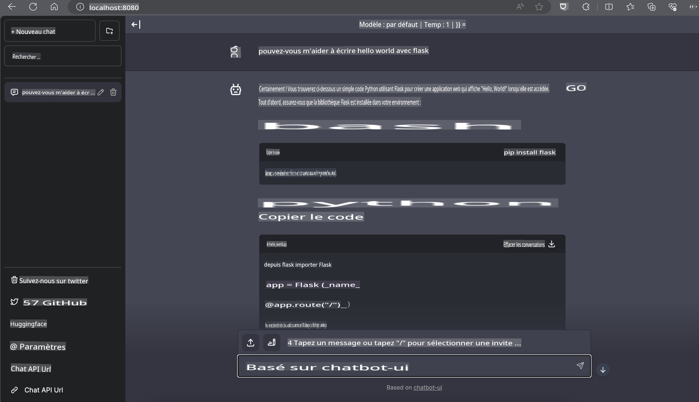

# **Inférence Phi-3 sur Nvidia Jetson**

Nvidia Jetson est une série de cartes de calcul embarquées de Nvidia. Les modèles Jetson TK1, TX1 et TX2 sont tous équipés d'un processeur Tegra (ou SoC) de Nvidia qui intègre une unité centrale de traitement (CPU) basée sur l'architecture ARM. Jetson est un système à faible consommation d'énergie conçu pour accélérer les applications d'apprentissage automatique. Nvidia Jetson est utilisé par les développeurs professionnels pour créer des produits d'IA révolutionnaires dans tous les secteurs, ainsi que par les étudiants et les passionnés pour apprendre l'IA de manière pratique et réaliser des projets étonnants. SLM est déployé dans des dispositifs périphériques tels que Jetson, ce qui permettra une meilleure mise en œuvre des scénarios d'application d'IA générative industrielle.

## Déploiement sur NVIDIA Jetson :
Les développeurs travaillant sur la robotique autonome et les dispositifs embarqués peuvent tirer parti de Phi-3 Mini. La taille relativement petite de Phi-3 en fait une solution idéale pour le déploiement en périphérie. Les paramètres ont été minutieusement ajustés pendant l'entraînement, garantissant une grande précision des réponses.

### Optimisation TensorRT-LLM :
La bibliothèque [TensorRT-LLM de NVIDIA](https://github.com/NVIDIA/TensorRT-LLM?WT.mc_id=aiml-138114-kinfeylo) optimise l'inférence des grands modèles de langage. Elle prend en charge la longue fenêtre contextuelle de Phi-3 Mini, améliorant à la fois le débit et la latence. Les optimisations incluent des techniques comme LongRoPE, FP8 et le batching en vol.

### Disponibilité et déploiement :
Les développeurs peuvent explorer Phi-3 Mini avec la fenêtre contextuelle 128K sur [NVIDIA's AI](https://www.nvidia.com/en-us/ai-data-science/generative-ai/). Il est emballé en tant que NIM de NVIDIA, un microservice avec une API standard pouvant être déployé n'importe où. De plus, les [implémentations TensorRT-LLM sur GitHub](https://github.com/NVIDIA/TensorRT-LLM).

## **1. Préparation**

a. Jetson Orin NX / Jetson NX

b. JetPack 5.1.2+
   
c. Cuda 11.8
   
d. Python 3.8+

## **2. Exécution de Phi-3 sur Jetson**

Nous pouvons choisir [Ollama](https://ollama.com) ou [LlamaEdge](https://llamaedge.com)

Si vous souhaitez utiliser gguf dans le cloud et les dispositifs périphériques en même temps, LlamaEdge peut être compris comme WasmEdge (WasmEdge est un runtime WebAssembly léger, performant et évolutif, adapté aux applications natives du cloud, en périphérie et décentralisées. Il prend en charge les applications serverless, les fonctions embarquées, les microservices, les contrats intelligents et les dispositifs IoT. Vous pouvez déployer le modèle quantitatif de gguf sur des dispositifs périphériques et dans le cloud via LlamaEdge.


Voici les étapes à suivre

1. Installer et télécharger les bibliothèques et fichiers nécessaires

```bash

curl -sSf https://raw.githubusercontent.com/WasmEdge/WasmEdge/master/utils/install.sh | bash -s -- --plugin wasi_nn-ggml

curl -LO https://github.com/LlamaEdge/LlamaEdge/releases/latest/download/llama-api-server.wasm

curl -LO https://github.com/LlamaEdge/chatbot-ui/releases/latest/download/chatbot-ui.tar.gz

tar xzf chatbot-ui.tar.gz

```

**Note**: llama-api-server.wasm et chatbot-ui doivent être dans le même répertoire

2. Exécuter les scripts dans le terminal

```bash

wasmedge --dir .:. --nn-preload default:GGML:AUTO:{Votre chemin gguf} llama-api-server.wasm -p phi-3-chat

```

Voici le résultat de l'exécution



***Exemple de code*** [Exemple de Notebook Phi-3 mini WASM](https://github.com/Azure-Samples/Phi-3MiniSamples/tree/main/wasm)

En résumé, Phi-3 Mini représente une avancée majeure dans la modélisation du langage, combinant efficacité, conscience contextuelle et expertise en optimisation de NVIDIA. Que vous construisiez des robots ou des applications en périphérie, Phi-3 Mini est un outil puissant à connaître.

