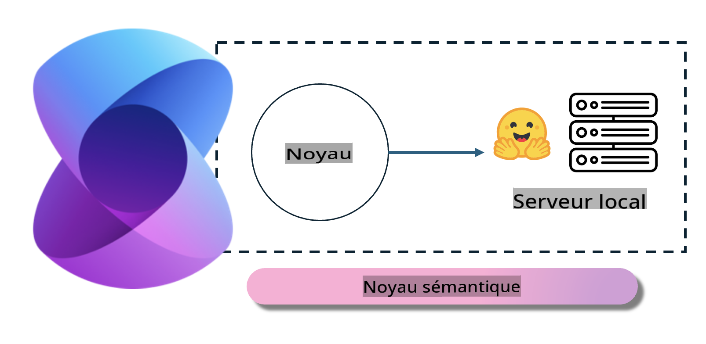

# **Inférence Phi-3 sur un Serveur Local**

Nous pouvons déployer Phi-3 sur un serveur local. Les utilisateurs peuvent choisir les solutions [Ollama](https://ollama.com) ou [LM Studio](https://llamaedge.com), ou bien écrire leur propre code. Vous pouvez connecter les services locaux de Phi-3 via [Semantic Kernel](https://github.com/microsoft/semantic-kernel?WT.mc_id=aiml-138114-kinfeylo) ou [Langchain](https://www.langchain.com/) pour créer des applications Copilot.

## **Utiliser Semantic Kernel pour accéder à Phi-3-mini**

Dans l'application Copilot, nous créons des applications via Semantic Kernel / LangChain. Ce type de cadre d'application est généralement compatible avec Azure OpenAI Service / OpenAI models, et peut également prendre en charge les modèles open source sur Hugging Face ainsi que les modèles locaux. Que faire si nous voulons utiliser Semantic Kernel pour accéder à Phi-3-mini ? En utilisant .NET comme exemple, nous pouvons le combiner avec le connecteur Hugging Face dans Semantic Kernel. Par défaut, il peut correspondre à l'identifiant du modèle sur Hugging Face (la première fois que vous l'utilisez, le modèle sera téléchargé depuis Hugging Face, ce qui prend du temps). Vous pouvez également vous connecter au service local créé. Comparé aux deux, nous recommandons d'utiliser ce dernier car il offre une plus grande autonomie, surtout dans les applications d'entreprise.

D'après l'image, accéder aux services locaux via Semantic Kernel permet de connecter facilement au serveur de modèle Phi-3-mini auto-construit. Voici le résultat de l'exécution.

***Code Exemple*** https://github.com/kinfey/Phi3MiniSamples/tree/main/semantickernel

Avertissement : La traduction a été effectuée à partir de l'original par un modèle d'IA et peut ne pas être parfaite. 
Veuillez examiner le résultat et apporter les corrections nécessaires.