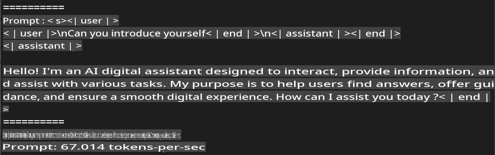
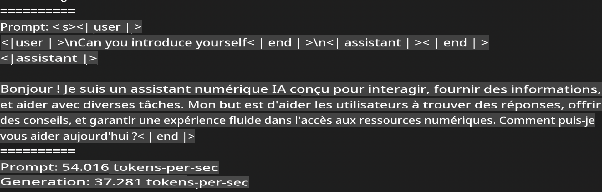
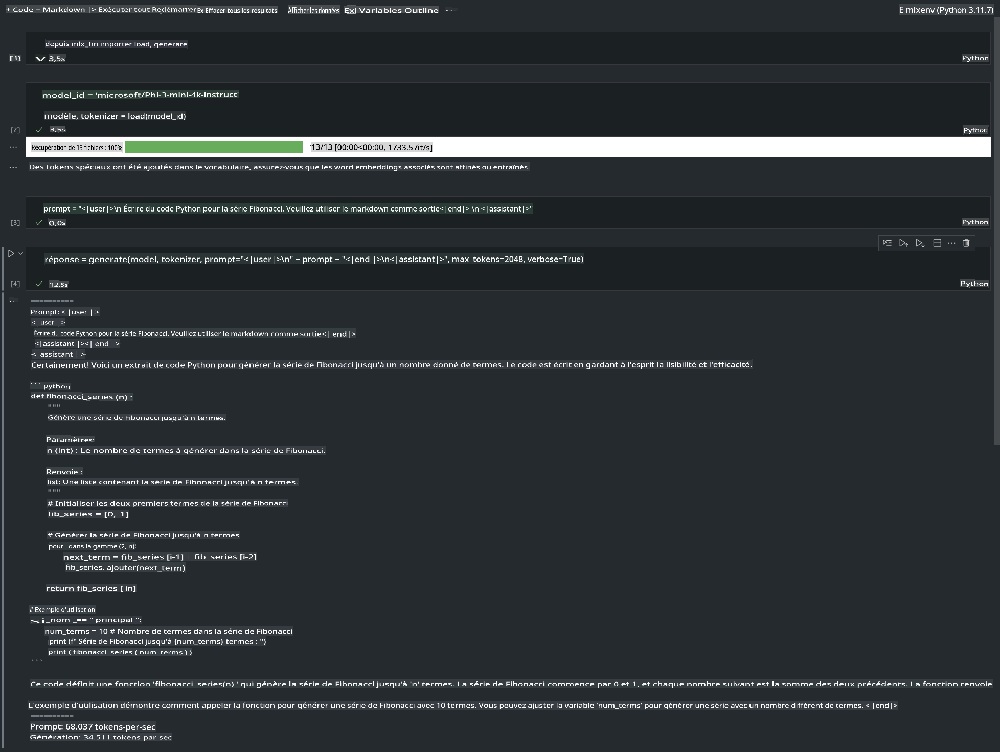

# **Inférence Phi-3 avec le Framework Apple MLX**

## **Qu'est-ce que le Framework MLX**

MLX est un framework de recherche en apprentissage automatique pour les puces Apple, développé par l'équipe de recherche en apprentissage automatique d'Apple.

MLX est conçu par des chercheurs en apprentissage automatique pour des chercheurs en apprentissage automatique. Le framework se veut convivial tout en restant efficace pour entraîner et déployer des modèles. La conception du framework est également simple sur le plan conceptuel. Nous souhaitons faciliter l'extension et l'amélioration de MLX afin de permettre une exploration rapide de nouvelles idées.

Les LLMs peuvent être accélérés sur les appareils Apple Silicon grâce à MLX, et les modèles peuvent être exécutés localement de manière très pratique.

## **Utilisation de MLX pour inférer Phi-3-mini**

### **1. Configurer votre environnement MLX**

1. Python 3.11.x
2. Installer la bibliothèque MLX

```bash
pip install mlx-lm
```

### **2. Exécution de Phi-3-mini dans le Terminal avec MLX**

```bash
python -m mlx_lm.generate --model microsoft/Phi-3-mini-4k-instruct --max-token 2048 --prompt  "<|user|>\nCan you introduce yourself<|end|>\n<|assistant|>"
```

Le résultat (mon environnement est Apple M1 Max, 64GB) est



### **3. Quantification de Phi-3-mini avec MLX dans le Terminal**

```bash
python -m mlx_lm.convert --hf-path microsoft/Phi-3-mini-4k-instruct
```

***Note：*** Le modèle peut être quantifié via mlx_lm.convert, et la quantification par défaut est INT4. Cet exemple quantifie Phi-3-mini en INT4.

Le modèle peut être quantifié via mlx_lm.convert, et la quantification par défaut est INT4. Cet exemple quantifie Phi-3-mini en INT4. Après la quantification, il sera stocké dans le répertoire par défaut ./mlx_model.

Nous pouvons tester le modèle quantifié avec MLX depuis le terminal

```bash
python -m mlx_lm.generate --model ./mlx_model/ --max-token 2048 --prompt  "<|user|>\nCan you introduce yourself<|end|>\n<|assistant|>"
```

Le résultat est



### **4. Exécution de Phi-3-mini avec MLX dans Jupyter Notebook**



***Note:*** Veuillez lire cet exemple [cliquez sur ce lien](../../code/03.Inference/MLX/MLX_DEMO.ipynb)

## **Ressources**

1. En savoir plus sur le Framework Apple MLX [https://ml-explore.github.io](https://ml-explore.github.io/mlx/build/html/index.html)

2. Dépôt GitHub Apple MLX [https://github.com/ml-explore](https://github.com/ml-explore)

Avertissement : La traduction a été réalisée à partir de l'original par un modèle d'IA et peut ne pas être parfaite. 
Veuillez vérifier le résultat et apporter les corrections nécessaires.