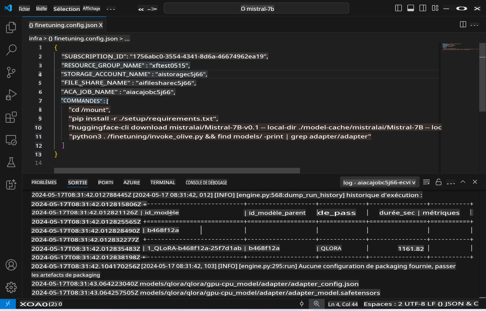
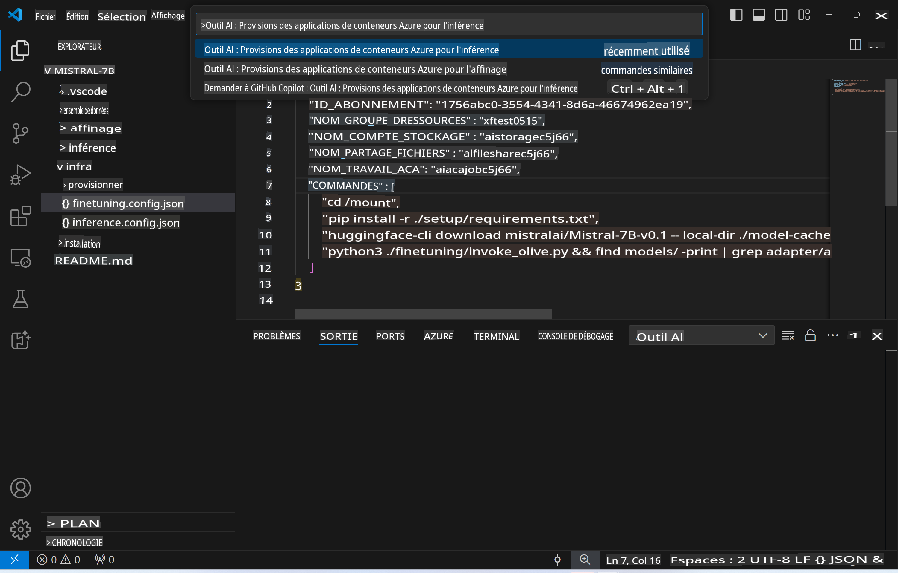
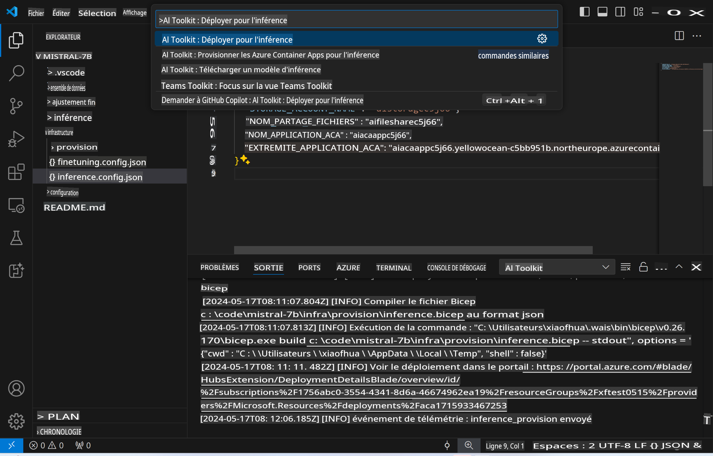
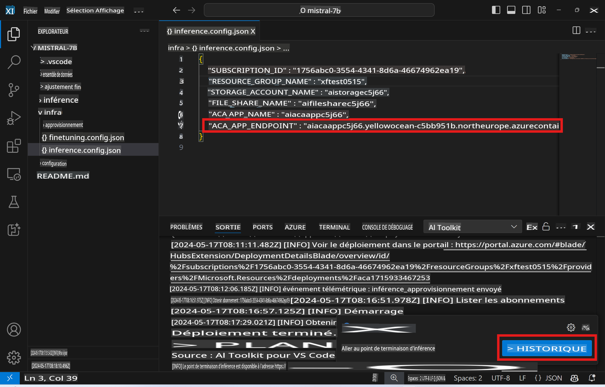

# Inférence à distance avec le modèle affiné

Après que les adaptateurs aient été entraînés dans l'environnement distant, utilisez une simple application Gradio pour interagir avec le modèle.



### Provisionner les ressources Azure
Vous devez configurer les ressources Azure pour l'inférence à distance en exécutant `AI Toolkit: Provision Azure Container Apps for inference` depuis la palette de commandes. Pendant cette configuration, vous serez invité à sélectionner votre abonnement Azure et votre groupe de ressources.  

   
Par défaut, l'abonnement et le groupe de ressources pour l'inférence doivent correspondre à ceux utilisés pour l'affinage. L'inférence utilisera le même environnement Azure Container App et accédera au modèle et à l'adaptateur de modèle stockés dans Azure Files, générés lors de l'étape d'affinage. 

## Utilisation de l'outil AI 

### Déploiement pour l'inférence  
Si vous souhaitez réviser le code d'inférence ou recharger le modèle d'inférence, veuillez exécuter la commande `AI Toolkit: Deploy for inference`. Cela synchronisera votre dernier code avec ACA et redémarrera la réplique.  



Après la réussite du déploiement, le modèle est maintenant prêt pour l'évaluation en utilisant cet endpoint.

### Accéder à l'API d'inférence

Vous pouvez accéder à l'API d'inférence en cliquant sur le bouton "*Aller à l'endpoint d'inférence*" affiché dans la notification VSCode. Alternativement, l'endpoint de l'API web peut être trouvé sous `ACA_APP_ENDPOINT` dans `./infra/inference.config.json` et dans le panneau de sortie.



> **Note :** L'endpoint d'inférence peut nécessiter quelques minutes pour devenir pleinement opérationnel.

## Composants d'inférence inclus dans le modèle
 
| Dossier | Contenu |
| ------ |--------- |
| `infra` | Contient toutes les configurations nécessaires pour les opérations à distance. |
| `infra/provision/inference.parameters.json` | Contient les paramètres pour les templates Bicep, utilisés pour provisionner les ressources Azure pour l'inférence. |
| `infra/provision/inference.bicep` | Contient les templates pour provisionner les ressources Azure pour l'inférence. |
| `infra/inference.config.json` | Le fichier de configuration, généré par la commande `AI Toolkit: Provision Azure Container Apps for inference`. Il est utilisé comme entrée pour d'autres palettes de commandes à distance. |

### Utilisation de l'outil AI pour configurer la provision des ressources Azure
Configurez l'[AI Toolkit](https://marketplace.visualstudio.com/items?itemName=ms-windows-ai-studio.windows-ai-studio)

Provisionner les Azure Container Apps pour l'inférence` command.

You can find configuration parameters in `./infra/provision/inference.parameters.json` file. Here are the details:
| Parameter | Description |
| --------- |------------ |
| `defaultCommands` | This is the commands to initiate a web API. |
| `maximumInstanceCount` | This parameter sets the maximum capacity of GPU instances. |
| `location` | This is the location where Azure resources are provisioned. The default value is the same as the chosen resource group's location. |
| `storageAccountName`, `fileShareName` `acaEnvironmentName`, `acaEnvironmentStorageName`, `acaAppName`,  `acaLogAnalyticsName` | These parameters are used to name the Azure resources for provision. By default, they will be same to the fine-tuning resource name. You can input a new, unused resource name to create your own custom-named resources, or you can input the name of an already existing Azure resource if you'd prefer to use that. For details, refer to the section [Using existing Azure Resources](../../../../md/03.Inference). |

### Using Existing Azure Resources

By default, the inference provision use the same Azure Container App Environment, Storage Account, Azure File Share, and Azure Log Analytics that were used for fine-tuning. A separate Azure Container App is created solely for the inference API. 

If you have customized the Azure resources during the fine-tuning step or want to use your own existing Azure resources for inference, specify their names in the `./infra/inference.parameters.json`. Ensuite, exécutez la commande `AI Toolkit: Provision Azure Container Apps for inference` depuis la palette de commandes. Cela met à jour toutes les ressources spécifiées et crée celles qui manquent.

Par exemple, si vous avez un environnement de conteneur Azure existant, votre fichier `./infra/finetuning.parameters.json` devrait ressembler à ceci :

```json
{
    "$schema": "https://schema.management.azure.com/schemas/2019-04-01/deploymentParameters.json#",
    "contentVersion": "1.0.0.0",
    "parameters": {
      ...
      "acaEnvironmentName": {
        "value": "<your-aca-env-name>"
      },
      "acaEnvironmentStorageName": {
        "value": null
      },
      ...
    }
  }
```

### Provision manuelle  
Si vous préférez configurer manuellement les ressources Azure, vous pouvez utiliser les fichiers Bicep fournis dans le fichier `./infra/provision` folders. If you have already set up and configured all the Azure resources without using the AI Toolkit command palette, you can simply enter the resource names in the `inference.config.json`.

Par exemple :

```json
{
  "SUBSCRIPTION_ID": "<your-subscription-id>",
  "RESOURCE_GROUP_NAME": "<your-resource-group-name>",
  "STORAGE_ACCOUNT_NAME": "<your-storage-account-name>",
  "FILE_SHARE_NAME": "<your-file-share-name>",
  "ACA_APP_NAME": "<your-aca-name>",
  "ACA_APP_ENDPOINT": "<your-aca-endpoint>"
}
```

**Avertissement** :  
Ce document a été traduit à l'aide de services de traduction automatique basés sur l'intelligence artificielle. Bien que nous nous efforcions d'assurer l'exactitude, veuillez noter que les traductions automatiques peuvent contenir des erreurs ou des inexactitudes. Le document original dans sa langue d'origine doit être considéré comme la source faisant autorité. Pour des informations critiques, il est recommandé de faire appel à une traduction humaine professionnelle. Nous ne sommes pas responsables des malentendus ou des interprétations erronées résultant de l'utilisation de cette traduction.