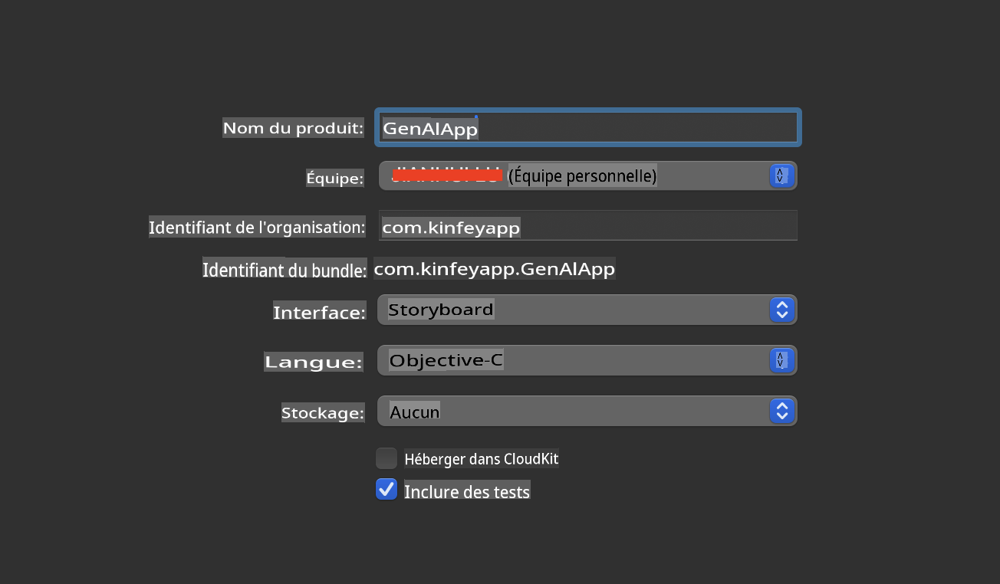
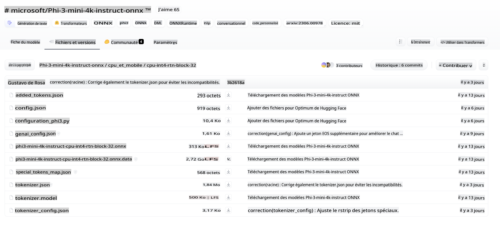
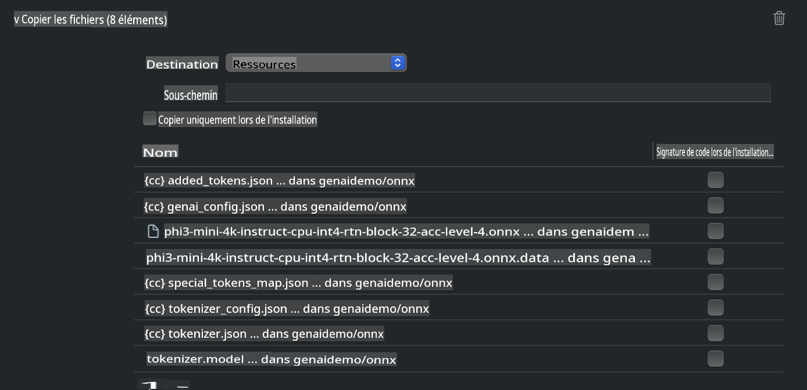
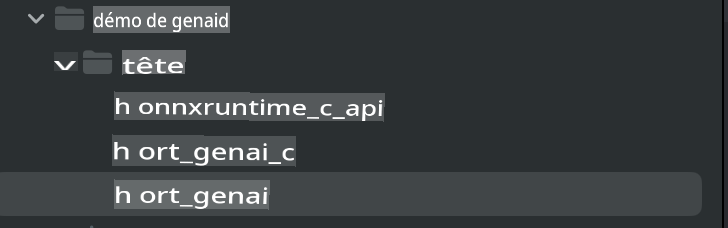
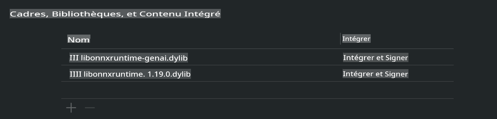
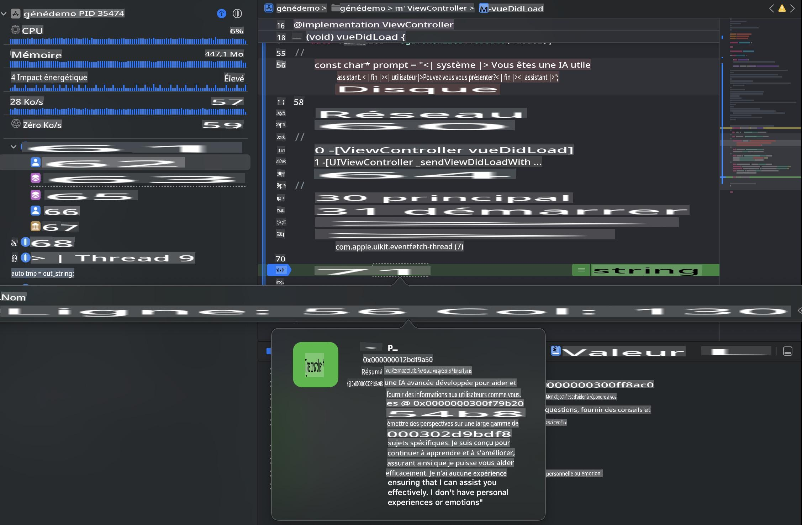

# **Inférence Phi-3 sur iOS**

Phi-3-mini est une nouvelle série de modèles de Microsoft qui permet le déploiement de grands modèles de langage (LLM) sur des appareils edge et des dispositifs IoT. Phi-3-mini est disponible sur les plateformes iOS, Android et les appareils Edge, permettant le déploiement de l'IA générative en BYOD (Bring Your Own Device). L'exemple suivant déploie Phi-3-mini sur iOS.

## **1. Préparation**

a. macOS 14+

b. Xcode 15+

c. SDK iOS 17.x (iPhone 14 A16 ou supérieur)

d. Installer Python 3.10+ (Conda est recommandé)

e. Installer la bibliothèque Python - python-flatbuffers

f. Installer CMake

### Semantic Kernel et Inférence

Semantic Kernel est un cadre d'application qui vous permet de créer des applications compatibles avec Azure OpenAI Service, les modèles OpenAI et même des modèles locaux. Accéder aux services locaux via Semantic Kernel permet de connecter facilement votre propre serveur de modèle Phi-3-mini.

### Appel des modèles quantifiés avec Ollama ou LlamaEdge

De nombreux utilisateurs préfèrent utiliser des modèles quantifiés pour exécuter des modèles localement. [Ollama](https://ollama.com) et [LlamaEdge](https://llamaedge.com) permettent aux utilisateurs individuels d'appeler différents modèles quantifiés :

**Ollama**  
Vous pouvez exécuter directement `ollama run phi3` ou le configurer hors ligne. Créez un fichier Modelfile avec le chemin vers votre fichier gguf. Exemple de code pour exécuter le modèle quantifié Phi-3-mini :

```
FROM {Add your gguf file path}
TEMPLATE \"\"\"<|user|> {{.Prompt}}<|end|> <|assistant|>\"\"\"
PARAMETER stop <|end|>
PARAMETER num_ctx 4096
```

**LlamaEdge**
Si vous souhaitez utiliser gguf à la fois dans le cloud et sur les appareils edge, LlamaEdge peut être votre choix.

## **2. Compilation de ONNX Runtime pour iOS**

```bash

git clone https://github.com/microsoft/onnxruntime.git

cd onnxruntime

./build.sh --build_shared_lib --ios --skip_tests --parallel --build_dir ./build_ios --ios --apple_sysroot iphoneos --osx_arch arm64 --apple_deploy_target 17.5 --cmake_generator Xcode --config Release

cd ../

```
 
***Remarque*** 

a. Avant de compiler, vous devez vous assurer que Xcode est correctement configuré et l'avoir défini dans le terminal.

```bash

sudo xcode-select -switch /Applications/Xcode.app/Contents/Developer 

```

b. ONNX Runtime doit être compilé en fonction des différentes plateformes. Pour iOS, vous pouvez compiler en fonction de arm64 / x86_64.

c. Il est recommandé d'utiliser directement le dernier SDK iOS pour la compilation. Bien sûr, vous pouvez également abaisser la version pour la compatibilité avec les SDK précédents.

## **3. Compilation de l'IA Générative avec ONNX Runtime pour iOS**

 ***Note:*** Comme l'IA générative avec ONNX Runtime est en aperçu, veuillez noter les changements.


```bash

git clone https://github.com/microsoft/onnxruntime-genai
 
cd onnxruntime-genai
 
mkdir ort
 
cd ort
 
mkdir include
 
mkdir lib
 
cd ../
 
cp ../onnxruntime/include/onnxruntime/core/session/onnxruntime_c_api.h ort/include
 
cp ../onnxruntime/build_ios/Release/Release-iphoneos/libonnxruntime*.dylib* ort/lib
 
export OPENCV_SKIP_XCODEBUILD_FORCE_TRYCOMPILE_DEBUG=1
 
python3 build.py --parallel --build_dir ./build_ios --ios --ios_sysroot iphoneos --ios_arch arm64 --ios_deployment_target 17.5 --cmake_generator Xcode --cmake_extra_defines CMAKE_XCODE_ATTRIBUTE_CODE_SIGNING_ALLOWED=NO

```

## **4. Créer une application dans Xcode**

J'ai choisi Objective-C comme méthode de développement d'application, car l'utilisation de l'API C++ de Generative AI avec ONNX Runtime est mieux compatible avec Objective-C. Bien sûr, vous pouvez également effectuer les appels nécessaires via le pontage Swift.



## **5. Copier le modèle quantifié INT4 ONNX dans le projet de l'application**

Nous devons importer le modèle de quantification INT4 au format ONNX, qui doit être téléchargé au préalable.



Après le téléchargement, vous devez l'ajouter au répertoire Resources du projet dans Xcode.



## **6. Ajouter l'API C++ dans les ViewControllers**

**Remarque**:

  a. Ajouter le fichier d'en-tête C++ correspondant au projet.

  

  b. Ajouter la dylib onnxruntime-genai dans Xcode.

  

  c. Utiliser directement le code des échantillons C pour les tests dans ces exemples. Vous pouvez également ajouter directement plus de fonctionnalités pour exécuter (comme ChatUI)..

  d. Parce que vous devez appeler du C++, veuillez changer ViewController.m en ViewController.mm.

```objc

    NSString *llmPath = [[NSBundle mainBundle] resourcePath];
    char const *modelPath = llmPath.cString;

    auto model =  OgaModel::Create(modelPath);

    auto tokenizer = OgaTokenizer::Create(*model);

    const char* prompt = "<|system|>You are a helpful AI assistant.<|end|><|user|>Can you introduce yourself?<|end|><|assistant|>";

    auto sequences = OgaSequences::Create();
    tokenizer->Encode(prompt, *sequences);

    auto params = OgaGeneratorParams::Create(*model);
    params->SetSearchOption("max_length", 100);
    params->SetInputSequences(*sequences);

    auto output_sequences = model->Generate(*params);
    const auto output_sequence_length = output_sequences->SequenceCount(0);
    const auto* output_sequence_data = output_sequences->SequenceData(0);
    auto out_string = tokenizer->Decode(output_sequence_data, output_sequence_length);
    
    auto tmp = out_string;

```

## **7. Les résultats de l'exécution**



**Codes d'exemple:** [https://github.com/Azure-Samples/Phi-3MiniSamples/tree/main/ios](https://github.com/Azure-Samples/Phi-3MiniSamples/tree/main/ios)

Avertissement : La traduction a été effectuée à partir de l'original par un modèle d'IA et peut ne pas être parfaite. 
Veuillez examiner le résultat et apporter les corrections nécessaires.