# Affiner Phi-3 avec Azure AI Studio

Explorons comment affiner le modèle de langage Phi-3 Mini de Microsoft en utilisant Azure AI Studio. L'affinage vous permet d'adapter Phi-3 Mini à des tâches spécifiques, le rendant encore plus puissant et conscient du contexte.

## Considérations

- **Capacités :** Quels modèles peuvent être affinés ? Que peut faire le modèle de base après affinage ?
- **Coût :** Quel est le modèle de tarification pour l'affinage ?
**Personnalisation :** Dans quelle mesure puis-je modifier le modèle de base – et de quelles manières ?
- **Commodité :** Comment se déroule réellement l'affinage – dois-je écrire du code personnalisé ? Dois-je apporter mes propres ressources de calcul ?
- **Sécurité :** Les modèles affinés sont connus pour présenter des risques de sécurité – existe-t-il des garde-fous pour protéger contre les dommages involontaires ?

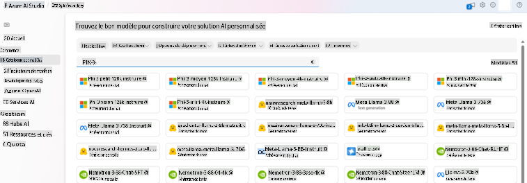

## Préparation à l'affinage

### Prérequis

> [!NOTE]
> Pour les modèles de la famille Phi-3, l'offre d'affinage en mode pay-as-you-go n'est disponible qu'avec des hubs créés dans les régions **East US 2**.

- Un abonnement Azure. Si vous n'avez pas d'abonnement Azure, créez un [compte Azure payant](https://azure.microsoft.com/pricing/purchase-options/pay-as-you-go) pour commencer.

- Un [projet AI Studio](https://ai.azure.com?WT.mc_id=aiml-138114-kinfeylo).
- Les contrôles d'accès basés sur les rôles Azure (Azure RBAC) sont utilisés pour accorder l'accès aux opérations dans Azure AI Studio. Pour effectuer les étapes de cet article, votre compte utilisateur doit être assigné au rôle __Azure AI Developer__ sur le groupe de ressources.

### Enregistrement du fournisseur d'abonnement

Vérifiez que l'abonnement est enregistré auprès du fournisseur de ressources `Microsoft.Network`.

1. Connectez-vous au [portail Azure](https://portal.azure.com).
1. Sélectionnez **Abonnements** dans le menu de gauche.
1. Sélectionnez l'abonnement que vous souhaitez utiliser.
1. Sélectionnez **Paramètres du projet AI** > **Fournisseurs de ressources** dans le menu de gauche.
1. Confirmez que **Microsoft.Network** figure dans la liste des fournisseurs de ressources. Sinon, ajoutez-le.

### Préparation des données

Préparez vos données d'entraînement et de validation pour affiner votre modèle. Vos ensembles de données d'entraînement et de validation doivent contenir des exemples d'entrée et de sortie montrant comment vous souhaitez que le modèle fonctionne.

Assurez-vous que tous vos exemples d'entraînement suivent le format attendu pour l'inférence. Pour affiner les modèles de manière efficace, assurez-vous d'avoir un ensemble de données équilibré et diversifié.

Cela implique de maintenir un équilibre des données, d'inclure divers scénarios et de raffiner périodiquement les données d'entraînement pour s'aligner sur les attentes du monde réel, ce qui conduit finalement à des réponses de modèle plus précises et équilibrées.

Différents types de modèles nécessitent un format différent de données d'entraînement.

### Chat Completion

Les données d'entraînement et de validation que vous utilisez **doivent** être formatées en tant que document JSON Lines (JSONL). Pour `Phi-3-mini-128k-instruct`, l'ensemble de données d'affinage doit être formaté dans le format conversationnel utilisé par l'API Chat completions.

### Exemple de format de fichier

```json
    {"messages": [{"role": "system", "content": "Vous êtes un agent de support client Xbox dont le principal objectif est d'aider les utilisateurs avec les problèmes qu'ils rencontrent avec leurs appareils Xbox. Vous êtes amical et concis. Vous ne fournissez que des réponses factuelles aux questions et ne fournissez pas de réponses non liées à Xbox."}, {"role": "user", "content": "La Xbox est-elle meilleure que la PlayStation ?"}, {"role": "assistant", "content": "Je suis désolé, mais je ne peux pas fournir d'opinions personnelles. Mon travail principal est de vous aider avec tout problème lié à votre appareil Xbox. Avez-vous des problèmes liés à Xbox que vous souhaitez aborder ?"}]}
    {"messages": [{"role": "system", "content": "Vous êtes un agent de support client Xbox dont le principal objectif est d'aider les utilisateurs avec les problèmes qu'ils rencontrent avec leurs appareils Xbox. Vous êtes amical et concis. Vous ne fournissez que des réponses factuelles aux questions et ne fournissez pas de réponses non liées à Xbox."}, {"role": "user", "content": "Puis-je jouer à des jeux PC sur ma Xbox ?"}, {"role": "assistant", "content": "Bien que les consoles Xbox ne prennent pas en charge nativement les jeux PC, elles peuvent jouer à une gamme de jeux Xbox, dont beaucoup sont également disponibles sur PC. Puis-je vous aider à trouver des jeux compatibles avec votre appareil Xbox ?"}]}
    {"messages": [{"role": "system", "content": "Vous êtes un agent de support client Xbox dont le principal objectif est d'aider les utilisateurs avec les problèmes qu'ils rencontrent avec leurs appareils Xbox. Vous êtes amical et concis. Vous ne fournissez que des réponses factuelles aux questions et ne fournissez pas de réponses non liées à Xbox."}, {"role": "user", "content": "J'ai du mal à connecter ma Xbox au Wi-Fi."}, {"role": "assistant", "content": "Pas de souci, passons en revue les paramètres réseau de votre Xbox. Pouvez-vous me dire ce qui se passe lorsque vous essayez de la connecter au Wi-Fi ?"}]}
```

Le type de fichier pris en charge est JSON Lines. Les fichiers sont téléchargés sur le magasin de données par défaut et mis à disposition dans votre projet.

## Affiner Phi-3 avec Azure AI Studio

Azure AI Studio vous permet de personnaliser de grands modèles de langage avec vos propres ensembles de données en utilisant un processus connu sous le nom d'affinage. L'affinage offre une valeur significative en permettant la personnalisation et l'optimisation pour des tâches et des applications spécifiques. Cela conduit à une meilleure performance, une efficacité des coûts, une latence réduite et des sorties personnalisées.

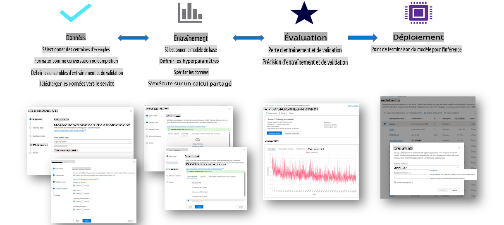

### Créer un Nouveau Projet

1. Connectez-vous à [Azure AI Studio](https://ai.azure.com).

1. Sélectionnez **+Nouveau projet** pour créer un nouveau projet dans Azure AI Studio.

    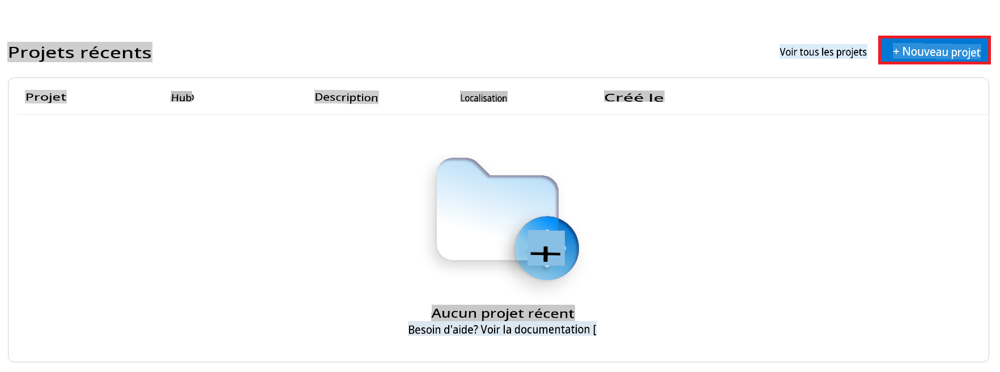

1. Effectuez les tâches suivantes :

    - Nom du **Hub du projet**. Il doit être une valeur unique.
    - Sélectionnez le **Hub** à utiliser (créez-en un nouveau si nécessaire).

    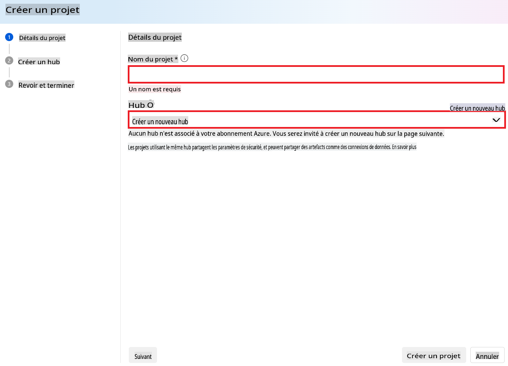

1. Effectuez les tâches suivantes pour créer un nouveau hub :

    - Entrez le **Nom du hub**. Il doit être une valeur unique.
    - Sélectionnez votre **Abonnement Azure**.
    - Sélectionnez le **Groupe de ressources** à utiliser (créez-en un nouveau si nécessaire).
    - Sélectionnez la **Localisation** que vous souhaitez utiliser.
    - Sélectionnez les **Services AI Azure** à connecter (créez-en un nouveau si nécessaire).
    - Sélectionnez **Connecter Azure AI Search** pour **Passer la connexion**.

    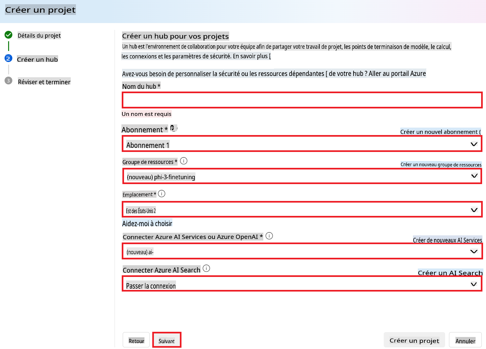

1. Sélectionnez **Suivant**.
1. Sélectionnez **Créer un projet**.

### Préparation des Données

Avant l'affinage, rassemblez ou créez un ensemble de données pertinent pour votre tâche, comme des instructions de chat, des paires de questions-réponses ou tout autre texte pertinent. Nettoyez et pré-traitez ces données en supprimant le bruit, en gérant les valeurs manquantes et en tokenisant le texte.

### Affiner les modèles Phi-3 dans Azure AI Studio

> [!NOTE]
> L'affinage des modèles Phi-3 est actuellement pris en charge dans les projets situés dans East US 2.

1. Sélectionnez **Catalogue de modèles** dans l'onglet de gauche.

1. Tapez *phi-3* dans la **barre de recherche** et sélectionnez le modèle phi-3 que vous souhaitez utiliser.

    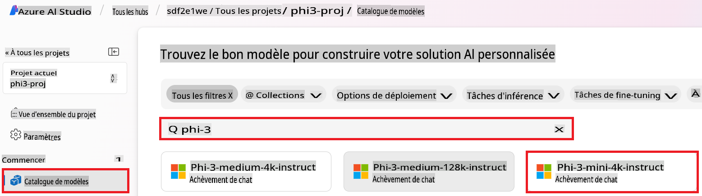

1. Sélectionnez **Affiner**.

    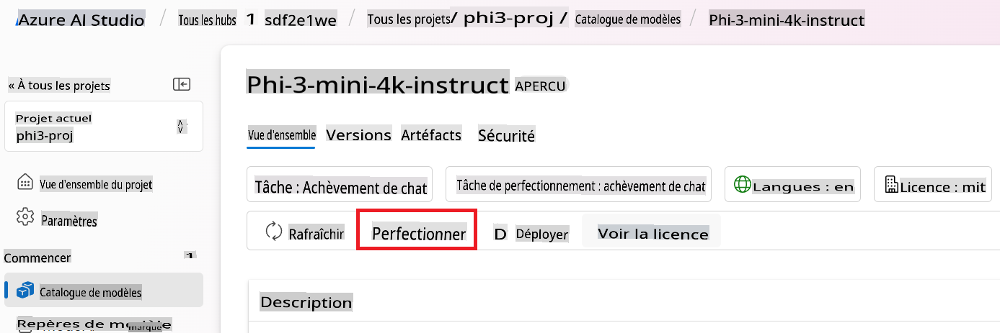

1. Entrez le **Nom du modèle affiné**.

    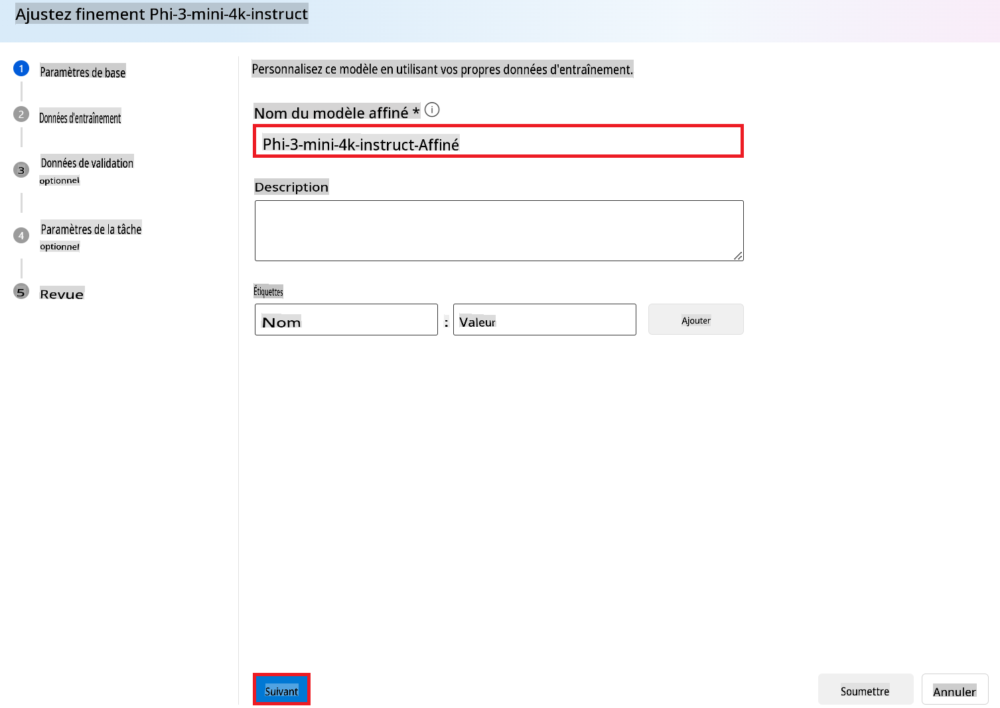

1. Sélectionnez **Suivant**.

1. Effectuez les tâches suivantes :

    - Sélectionnez le **type de tâche** en **Chat completion**.
    - Sélectionnez les **Données d'entraînement** que vous souhaitez utiliser. Vous pouvez les télécharger via les données d'Azure AI Studio ou depuis votre environnement local.

    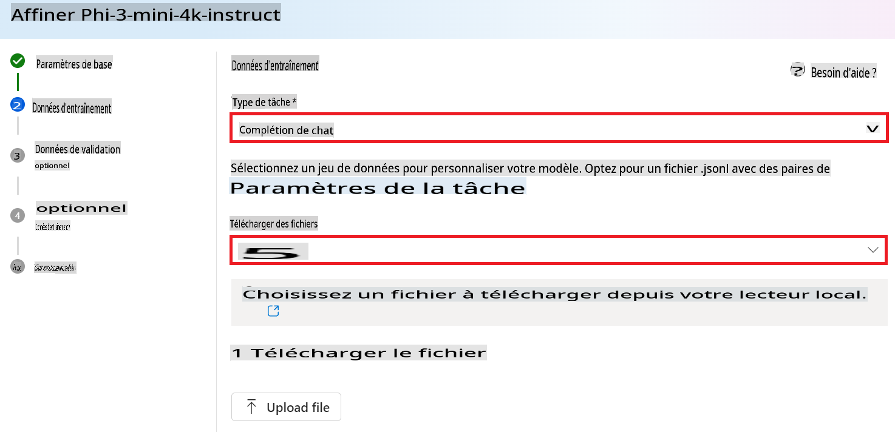

1. Sélectionnez **Suivant**.

1. Téléchargez les **Données de validation** que vous souhaitez utiliser. ou vous pouvez sélectionner **Division automatique des données d'entraînement**.

    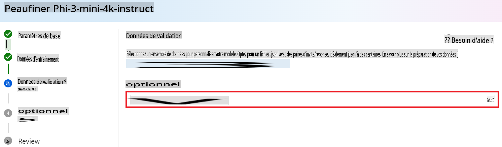

1. Sélectionnez **Suivant**.

1. Effectuez les tâches suivantes :

    - Sélectionnez le **multiplicateur de taille de lot** que vous souhaitez utiliser.
    - Sélectionnez le **taux d'apprentissage** que vous souhaitez utiliser.
    - Sélectionnez les **Époques** que vous souhaitez utiliser.

    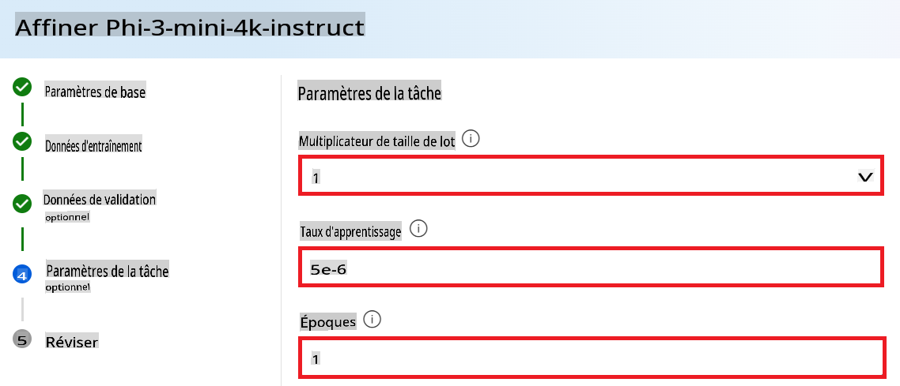

1. Sélectionnez **Soumettre** pour démarrer le processus d'affinage.

    

1. Une fois votre modèle affiné, le statut sera affiché comme **Terminé**, comme montré dans l'image ci-dessous. Vous pouvez maintenant déployer le modèle et l'utiliser dans votre propre application, dans le playground, ou dans le flux de prompt. Pour plus d'informations, consultez [Comment déployer la famille de petits modèles de langage Phi-3 avec Azure AI Studio](https://learn.microsoft.com/azure/ai-studio/how-to/deploy-models-phi-3?tabs=phi-3-5&pivots=programming-language-python).

    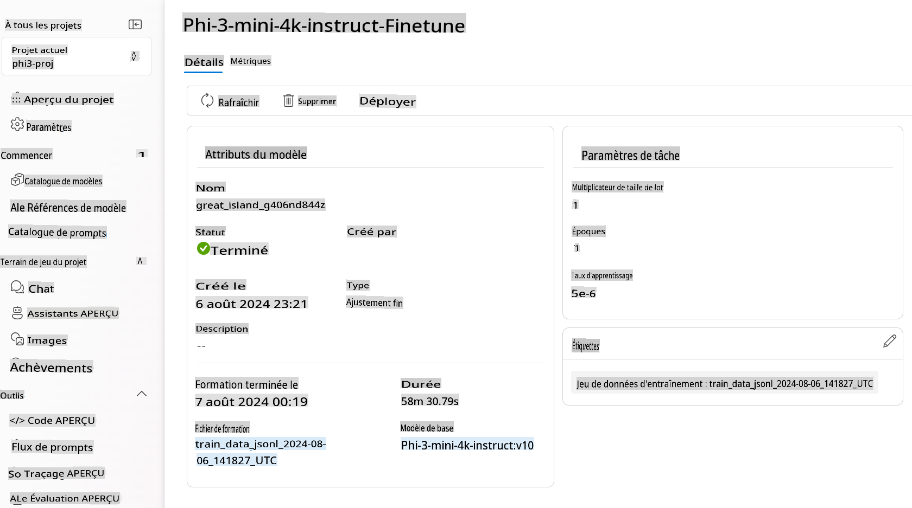

> [!NOTE]
> Pour des informations plus détaillées sur l'affinage de Phi-3, veuillez visiter [Affiner les modèles Phi-3 dans Azure AI Studio](https://learn.microsoft.com/azure/ai-studio/how-to/fine-tune-phi-3?tabs=phi-3-mini).

## Nettoyage de vos modèles affinés

Vous pouvez supprimer un modèle affiné de la liste des modèles d'affinage dans [Azure AI Studio](https://ai.azure.com) ou depuis la page des détails du modèle. Sélectionnez le modèle affiné à supprimer depuis la page d'affinage, puis sélectionnez le bouton Supprimer pour supprimer le modèle affiné.

> [!NOTE]
> Vous ne pouvez pas supprimer un modèle personnalisé s'il a un déploiement existant. Vous devez d'abord supprimer le déploiement de votre modèle avant de pouvoir supprimer votre modèle personnalisé.

## Coût et quotas

### Considérations sur le coût et les quotas pour les modèles Phi-3 affinés en tant que service

Les modèles Phi affinés en tant que service sont proposés par Microsoft et intégrés à Azure AI Studio pour être utilisés. Vous pouvez trouver la tarification lors du [déploiement](https://learn.microsoft.com/azure/ai-studio/how-to/deploy-models-phi-3?tabs=phi-3-5&pivots=programming-language-python) ou de l'affinage des modèles sous l'onglet Tarification et conditions de l'assistant de déploiement.

## Filtrage de contenu

Les modèles déployés en tant que service avec pay-as-you-go sont protégés par Azure AI Content Safety. Lorsqu'ils sont déployés sur des points de terminaison en temps réel, vous pouvez désactiver cette fonctionnalité. Avec Azure AI content safety activé, à la fois l'invite et la complétion passent par un ensemble de modèles de classification visant à détecter et prévenir la sortie de contenu nuisible. Le système de filtrage de contenu détecte et prend des mesures sur des catégories spécifiques de contenu potentiellement nuisible dans les invites d'entrée et les complétions de sortie. En savoir plus sur [Azure AI Content Safety](https://learn.microsoft.com/azure/ai-studio/concepts/content-filtering).

**Configuration de l'affinage**

Hyperparamètres : Définissez les hyperparamètres tels que le taux d'apprentissage, la taille de lot et le nombre d'époques d'entraînement.

**Fonction de perte**

Choisissez une fonction de perte appropriée pour votre tâche (par exemple, l'entropie croisée).

**Optimiseur**

Sélectionnez un optimiseur (par exemple, Adam) pour les mises à jour de gradient pendant l'entraînement.

**Processus d'affinage**

- Charger le modèle pré-entraîné : Chargez le point de contrôle Phi-3 Mini.
- Ajouter des couches personnalisées : Ajoutez des couches spécifiques à la tâche (par exemple, une tête de classification pour les instructions de chat).

**Entraîner le modèle**
Affinez le modèle en utilisant votre ensemble de données préparé. Surveillez les progrès de l'entraînement et ajustez les hyperparamètres si nécessaire.

**Évaluation et validation**

Ensemble de validation : Divisez vos données en ensembles d'entraînement et de validation.

**Évaluer les performances**

Utilisez des métriques telles que l'exactitude, le score F1 ou la perplexité pour évaluer les performances du modèle.

## Sauvegarder le modèle affiné

**Point de contrôle**
Enregistrez le point de contrôle du modèle affiné pour une utilisation future.

## Déploiement

- Déployez en tant que service Web : Déployez votre modèle affiné en tant que service web dans Azure AI Studio.
- Testez le point de terminaison : Envoyez des requêtes de test au point de terminaison déployé pour vérifier son bon fonctionnement.

## Itérer et améliorer

Itérer : Si les performances ne sont pas satisfaisantes, itérez en ajustant les hyperparamètres, en ajoutant plus de données ou en affinant pendant des époques supplémentaires.

## Surveiller et affiner

Surveillez en continu le comportement du modèle et affinez-le si nécessaire.

## Personnaliser et étendre

Tâches personnalisées : Phi-3 Mini peut être affiné pour diverses tâches au-delà des instructions de chat. Explorez d'autres cas d'utilisation !
Expérimentez : Essayez différentes architectures, combinaisons de couches et techniques pour améliorer les performances.

> [!NOTE]
> L'affinage est un processus itératif. Expérimentez, apprenez et adaptez votre modèle pour obtenir les meilleurs résultats pour votre tâche spécifique !

Avertissement : La traduction a été effectuée à partir de son texte original par un modèle d'IA et peut ne pas être parfaite. 
Veuillez examiner le résultat et apporter toutes les corrections nécessaires.