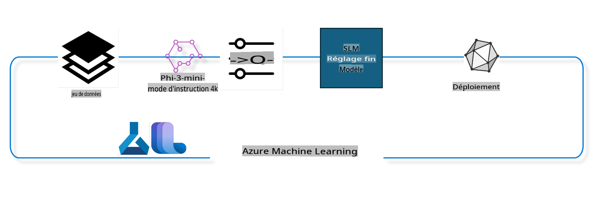

## Comment utiliser les composants de chat-completion du registre de système Azure ML pour affiner un modèle

Dans cet exemple, nous allons affiner le modèle Phi-3-mini-4k-instruct pour compléter une conversation entre deux personnes en utilisant le dataset ultrachat_200k.



Cet exemple vous montrera comment effectuer un affinement à l'aide du SDK Azure ML et de Python, puis déployer le modèle affiné sur un point de terminaison en ligne pour une inférence en temps réel.

### Données d'entraînement
Nous utiliserons le dataset ultrachat_200k. Il s'agit d'une version fortement filtrée du dataset UltraChat qui a été utilisée pour entraîner Zephyr-7B-β, un modèle de chat de pointe de 7 milliards de paramètres.

### Modèle
Nous utiliserons le modèle Phi-3-mini-4k-instruct pour montrer comment l'utilisateur peut affiner un modèle pour une tâche de chat-completion. Si vous avez ouvert ce notebook à partir d'une carte de modèle spécifique, n'oubliez pas de remplacer le nom du modèle spécifique.

### Tâches 
- Choisir un modèle à affiner.
- Choisir et explorer les données d'entraînement.
- Configurer le travail d'affinement.
- Exécuter le travail d'affinement.
- Examiner les métriques d'entraînement et d'évaluation.
- Enregistrer le modèle affiné.
- Déployer le modèle affiné pour une inférence en temps réel.
- Nettoyer les ressources.

## 1. Configuration des prérequis
- Installer les dépendances
- Se connecter à AzureML Workspace. En savoir plus sur la configuration de l'authentification SDK. Remplacez <WORKSPACE_NAME>, <RESOURCE_GROUP> et <SUBSCRIPTION_ID> ci-dessous.
- Se connecter au registre de système azureml
- Définir un nom d'expérience optionnel
- Vérifier ou créer un calcul.

Les exigences d'un nœud GPU unique peuvent avoir plusieurs cartes GPU. Par exemple, dans un nœud de Standard_NC24rs_v3, il y a 4 GPU NVIDIA V100, tandis que dans Standard_NC12s_v3, il y a 2 GPU NVIDIA V100. Consultez la documentation pour ces informations. Le nombre de cartes GPU par nœud est défini dans le paramètre gpus_per_node ci-dessous. Définir cette valeur correctement garantira l'utilisation de tous les GPU dans le nœud. Les SKU de calcul GPU recommandés peuvent être trouvés ici et ici.

### Bibliothèques Python

Installez les dépendances en exécutant la cellule ci-dessous. Ce n'est pas une étape optionnelle si vous exécutez dans un nouvel environnement.

```
pip install azure-ai-ml
pip install azure-identity
pip install datasets==2.9.0
pip install mlflow
pip install azureml-mlflow
```
### Interaction avec Azure ML 

Ce script Python est utilisé pour interagir avec le service Azure Machine Learning (Azure ML). Voici un aperçu de ce qu'il fait :

Il importe les modules nécessaires des packages azure.ai.ml, azure.identity et azure.ai.ml.entities. Il importe également le module time.

Il essaie de s'authentifier en utilisant DefaultAzureCredential(), ce qui fournit une expérience d'authentification simplifiée pour commencer rapidement à développer des applications exécutées dans le cloud Azure. Si cela échoue, il passe à InteractiveBrowserCredential(), qui fournit une invite de connexion interactive.

Il essaie ensuite de créer une instance MLClient en utilisant la méthode from_config, qui lit la configuration à partir du fichier de configuration par défaut (config.json). Si cela échoue, il crée une instance MLClient en fournissant manuellement le subscription_id, le resource_group_name et le workspace_name.

Il crée une autre instance MLClient, cette fois pour le registre Azure ML nommé "azureml". Ce registre est l'endroit où sont stockés les modèles, les pipelines d'affinement et les environnements.

Il définit le nom de l'expérience sur "chat_completion_Phi-3-mini-4k-instruct".

Il génère un horodatage unique en convertissant le temps actuel (en secondes depuis l'époque, en nombre à virgule flottante) en un entier puis en une chaîne. Cet horodatage peut être utilisé pour créer des noms et des versions uniques.

```
# Importer les modules nécessaires depuis Azure ML et Azure Identity
from azure.ai.ml import MLClient
from azure.identity import (
    DefaultAzureCredential,
    InteractiveBrowserCredential,
)
from azure.ai.ml.entities import AmlCompute
import time  # Importer le module time

# Essayer de s'authentifier en utilisant DefaultAzureCredential
try:
    credential = DefaultAzureCredential()
    credential.get_token("https://management.azure.com/.default")
except Exception as ex:  # Si DefaultAzureCredential échoue, utiliser InteractiveBrowserCredential
    credential = InteractiveBrowserCredential()

# Essayer de créer une instance MLClient en utilisant le fichier de configuration par défaut
try:
    workspace_ml_client = MLClient.from_config(credential=credential)
except:  # Si cela échoue, créer une instance MLClient en fournissant manuellement les détails
    workspace_ml_client = MLClient(
        credential,
        subscription_id="<SUBSCRIPTION_ID>",
        resource_group_name="<RESOURCE_GROUP>",
        workspace_name="<WORKSPACE_NAME>",
    )

# Créer une autre instance MLClient pour le registre Azure ML nommé "azureml"
# Ce registre est l'endroit où sont stockés les modèles, les pipelines d'affinement et les environnements
registry_ml_client = MLClient(credential, registry_name="azureml")

# Définir le nom de l'expérience
experiment_name = "chat_completion_Phi-3-mini-4k-instruct"

# Générer un horodatage unique qui peut être utilisé pour les noms et les versions qui doivent être uniques
timestamp = str(int(time.time()))
```
## 2. Choisir un modèle de base à affiner
Phi-3-mini-4k-instruct est un modèle léger de pointe de 3,8 milliards de paramètres, construit sur les datasets utilisés pour Phi-2. Le modèle appartient à la famille de modèles Phi-3, et la version Mini est disponible en deux variantes : 4K et 128K, qui est la longueur du contexte (en tokens) qu'il peut supporter. Nous devons affiner le modèle pour notre usage spécifique. Vous pouvez parcourir ces modèles dans le catalogue de modèles dans AzureML Studio, en filtrant par la tâche de chat-completion. Dans cet exemple, nous utilisons le modèle Phi-3-mini-4k-instruct. Si vous avez ouvert ce notebook pour un modèle différent, remplacez le nom et la version du modèle en conséquence.

Notez la propriété model id du modèle. Cela sera passé en entrée au travail d'affinement. C'est également disponible sous le champ Asset ID dans la page de détails du modèle dans AzureML Studio Model Catalog.

Ce script Python interagit avec le service Azure Machine Learning (Azure ML). Voici un aperçu de ce qu'il fait :

Il définit le model_name sur "Phi-3-mini-4k-instruct".

Il utilise la méthode get de la propriété models de l'objet registry_ml_client pour récupérer la dernière version du modèle avec le nom spécifié depuis le registre Azure ML. La méthode get est appelée avec deux arguments : le nom du modèle et un label spécifiant que la dernière version du modèle doit être récupérée.

Il imprime un message dans la console indiquant le nom, la version et l'id du modèle qui sera utilisé pour l'affinement. La méthode format de la chaîne est utilisée pour insérer le nom, la version et l'id du modèle dans le message. Le nom, la version et l'id du modèle sont accessibles en tant que propriétés de l'objet foundation_model.

```
# Définir le nom du modèle
model_name = "Phi-3-mini-4k-instruct"

# Obtenir la dernière version du modèle depuis le registre Azure ML
foundation_model = registry_ml_client.models.get(model_name, label="latest")

# Imprimer le nom, la version et l'id du modèle
# Cette information est utile pour le suivi et le débogage
print(
    "\n\nUsing model name: {0}, version: {1}, id: {2} for fine tuning".format(
        foundation_model.name, foundation_model.version, foundation_model.id
    )
)
```
## 3. Créer un calcul à utiliser avec le travail
Le travail d'affinement fonctionne UNIQUEMENT avec un calcul GPU. La taille du calcul dépend de la taille du modèle et, dans la plupart des cas, il devient difficile d'identifier le bon calcul pour le travail. Dans cette cellule, nous guidons l'utilisateur pour sélectionner le bon calcul pour le travail.

**NOTE1** Les calculs listés ci-dessous fonctionnent avec la configuration la plus optimisée. Toute modification de la configuration peut entraîner une erreur de mémoire Cuda Out Of Memory. Dans ce cas, essayez de passer à un calcul de taille supérieure.

**NOTE2** Lors de la sélection de la compute_cluster_size ci-dessous, assurez-vous que le calcul est disponible dans votre groupe de ressources. Si un calcul particulier n'est pas disponible, vous pouvez faire une demande pour obtenir l'accès aux ressources de calcul.

### Vérification du modèle pour le support d'affinement
Ce script Python interagit avec un modèle Azure Machine Learning (Azure ML). Voici un aperçu de ce qu'il fait :

Il importe le module ast, qui fournit des fonctions pour traiter les arbres de la grammaire syntaxique abstraite de Python.

Il vérifie si l'objet foundation_model (qui représente un modèle dans Azure ML) a une étiquette nommée finetune_compute_allow_list. Les étiquettes dans Azure ML sont des paires clé-valeur que vous pouvez créer et utiliser pour filtrer et trier les modèles.

Si l'étiquette finetune_compute_allow_list est présente, il utilise la fonction ast.literal_eval pour analyser en toute sécurité la valeur de l'étiquette (une chaîne) en une liste Python. Cette liste est ensuite attribuée à la variable computes_allow_list. Il imprime ensuite un message indiquant qu'un calcul doit être créé à partir de la liste.

Si l'étiquette finetune_compute_allow_list n'est pas présente, il définit computes_allow_list sur None et imprime un message indiquant que l'étiquette finetune_compute_allow_list ne fait pas partie des étiquettes du modèle.

En résumé, ce script vérifie une étiquette spécifique dans les métadonnées du modèle, convertit la valeur de l'étiquette en une liste si elle existe, et fournit un retour d'information à l'utilisateur en conséquence.

```
# Importer le module ast, qui fournit des fonctions pour traiter les arbres de la grammaire syntaxique abstraite de Python
import ast

# Vérifier si l'étiquette 'finetune_compute_allow_list' est présente dans les étiquettes du modèle
if "finetune_compute_allow_list" in foundation_model.tags:
    # Si l'étiquette est présente, utiliser ast.literal_eval pour analyser en toute sécurité la valeur de l'étiquette (une chaîne) en une liste Python
    computes_allow_list = ast.literal_eval(
        foundation_model.tags["finetune_compute_allow_list"]
    )  # convertir la chaîne en liste Python
    # Imprimer un message indiquant qu'un calcul doit être créé à partir de la liste
    print(f"Please create a compute from the above list - {computes_allow_list}")
else:
    # Si l'étiquette n'est pas présente, définir computes_allow_list sur None
    computes_allow_list = None
    # Imprimer un message indiquant que l'étiquette 'finetune_compute_allow_list' ne fait pas partie des étiquettes du modèle
    print("`finetune_compute_allow_list` is not part of model tags")
```
### Vérification de l'instance de calcul 

Ce script Python interagit avec le service Azure Machine Learning (Azure ML) et effectue plusieurs vérifications sur une instance de calcul. Voici un aperçu de ce qu'il fait :

Il essaie de récupérer l'instance de calcul avec le nom stocké dans compute_cluster depuis l'espace de travail Azure ML. Si l'état de provisionnement de l'instance de calcul est "failed", il lève une ValueError.

Il vérifie si computes_allow_list n'est pas None. Si ce n'est pas le cas, il convertit toutes les tailles de calcul de la liste en minuscules et vérifie si la taille de l'instance de calcul actuelle est dans la liste. Si ce n'est pas le cas, il lève une ValueError.

Si computes_allow_list est None, il vérifie si la taille de l'instance de calcul est dans une liste de tailles de VM GPU non prises en charge. Si c'est le cas, il lève une ValueError.

Il récupère une liste de toutes les tailles de calcul disponibles dans l'espace de travail. Il parcourt ensuite cette liste, et pour chaque taille de calcul, il vérifie si son nom correspond à la taille de l'instance de calcul actuelle. Si c'est le cas, il récupère le nombre de GPU pour cette taille de calcul et définit gpu_count_found sur True.

Si gpu_count_found est True, il imprime le nombre de GPU dans l'instance de calcul. Si gpu_count_found est False, il lève une ValueError.

En résumé, ce script effectue plusieurs vérifications sur une instance de calcul dans un espace de travail Azure ML, y compris la vérification de son état de provisionnement, sa taille par rapport à une liste blanche ou une liste noire, et le nombre de GPU qu'elle possède.
```
# Imprimer le message d'exception
print(e)
# Lever une ValueError si la taille du calcul n'est pas disponible dans l'espace de travail
raise ValueError(
    f"WARNING! Compute size {compute_cluster_size} not available in workspace"
)

# Récupérer l'instance de calcul depuis l'espace de travail Azure ML
compute = workspace_ml_client.compute.get(compute_cluster)
# Vérifier si l'état de provisionnement de l'instance de calcul est "failed"
if compute.provisioning_state.lower() == "failed":
    # Lever une ValueError si l'état de provisionnement est "failed"
    raise ValueError(
        f"Provisioning failed, Compute '{compute_cluster}' is in failed state. "
        f"please try creating a different compute"
    )

# Vérifier si computes_allow_list n'est pas None
if computes_allow_list is not None:
    # Convertir toutes les tailles de calcul de computes_allow_list en minuscules
    computes_allow_list_lower_case = [x.lower() for x in computes_allow_list]
    # Vérifier si la taille de l'instance de calcul est dans computes_allow_list_lower_case
    if compute.size.lower() not in computes_allow_list_lower_case:
        # Lever une ValueError si la taille de l'instance de calcul n'est pas dans computes_allow_list_lower_case
        raise ValueError(
            f"VM size {compute.size} is not in the allow-listed computes for finetuning"
        )
else:
    # Définir une liste de tailles de VM GPU non prises en charge
    unsupported_gpu_vm_list = [
        "standard_nc6",
        "standard_nc12",
        "standard_nc24",
        "standard_nc24r",
    ]
    # Vérifier si la taille de l'instance de calcul est dans unsupported_gpu_vm_list
    if compute.size.lower() in unsupported_gpu_vm_list:
        # Lever une ValueError si la taille de l'instance de calcul est dans unsupported_gpu_vm_list
        raise ValueError(
            f"VM size {compute.size} is currently not supported for finetuning"
        )

# Initialiser un drapeau pour vérifier si le nombre de GPU dans l'instance de calcul a été trouvé
gpu_count_found = False
# Récupérer une liste de toutes les tailles de calcul disponibles dans l'espace de travail
workspace_compute_sku_list = workspace_ml_client.compute.list_sizes()
available_sku_sizes = []
# Parcourir la liste des tailles de calcul disponibles
for compute_sku in workspace_compute_sku_list:
    available_sku_sizes.append(compute_sku.name)
    # Vérifier si le nom de la taille de calcul correspond à la taille de l'instance de calcul
    if compute_sku.name.lower() == compute.size.lower():
        # Si c'est le cas, récupérer le nombre de GPU pour cette taille de calcul et définir gpu_count_found sur True
        gpus_per_node = compute_sku.gpus
        gpu_count_found = True
# Si gpu_count_found est True, imprimer le nombre de GPU dans l'instance de calcul
if gpu_count_found:
    print(f"Number of GPU's in compute {compute.size}: {gpus_per_node}")
else:
    # Si gpu_count_found est False, lever une ValueError
    raise ValueError(
        f"Number of GPU's in compute {compute.size} not found. Available skus are: {available_sku_sizes}."
        f"This should not happen. Please check the selected compute cluster: {compute_cluster} and try again."
    )
```

## 4. Choisir le dataset pour affiner le modèle

Nous utilisons le dataset ultrachat_200k. Le dataset a quatre divisions, adaptées pour :

Supervised fine-tuning (sft).
Generation ranking (gen). Le nombre d'exemples par division est montré comme suit :
train_sft	test_sft	train_gen	test_gen
207865	23110	256032	28304
Les prochaines cellules montrent la préparation de base des données pour l'affinement :

Visualiser quelques lignes de données
Nous voulons que cet exemple s'exécute rapidement, donc nous sauvegardons les fichiers train_sft, test_sft contenant 5% des lignes déjà réduites. Cela signifie que le modèle affiné aura une précision plus faible, il ne doit donc pas être utilisé dans des situations réelles.
Le script download-dataset.py est utilisé pour télécharger le dataset ultrachat_200k et transformer le dataset en un format consommable par le composant de pipeline d'affinement. De plus, comme le dataset est grand, nous n'avons ici qu'une partie du dataset.

L'exécution du script ci-dessous ne télécharge que 5% des données. Cela peut être augmenté en changeant le paramètre dataset_split_pc au pourcentage désiré.

**Note:** Certains modèles de langue ont des codes de langue différents et donc les noms de colonnes dans le dataset doivent refléter cela.

Voici un exemple de l'apparence des données
Le dataset de chat-completion est stocké au format parquet avec chaque entrée utilisant le schéma suivant :

Ceci est un document JSON (JavaScript Object Notation), qui est un format d'échange de données populaire. Ce n'est pas un code exécutable, mais une manière de stocker et de transporter des données. Voici un aperçu de sa structure :

"prompt": Cette clé contient une valeur de chaîne qui représente une tâche ou une question posée à un assistant IA.

"messages": Cette clé contient un tableau d'objets. Chaque objet représente un message dans une conversation entre un utilisateur et un assistant IA. Chaque objet message a deux clés :

"content": Cette clé contient une valeur de chaîne qui représente le contenu du message.
"role": Cette clé contient une valeur de chaîne qui représente le rôle de l'entité qui a envoyé le message.
Il importe le module os, qui fournit un moyen portable d'utiliser les fonctionnalités dépendantes du système d'exploitation. Il utilise la fonction os.system pour exécuter le script download-dataset.py dans le shell avec des arguments de ligne de commande spécifiques. Les arguments spécifient le dataset à télécharger (HuggingFaceH4/ultrachat_200k), le répertoire où le télécharger (ultrachat_200k_dataset) et le pourcentage du dataset à diviser (5). La fonction os.system renvoie le statut de sortie de la commande qu'elle a exécutée; ce statut est stocké dans la variable exit_status. Il vérifie si exit_status n'est pas égal à 0. Dans les systèmes d'exploitation de type Unix, un statut de sortie de 0 indique généralement qu'une commande a réussi, tandis que tout autre nombre indique une erreur. Si exit_status n'est pas 0, il lève une Exception avec un message indiquant qu'il y a eu une erreur lors du téléchargement du dataset. En résumé, ce script exécute une commande pour télécharger un dataset en utilisant un script d'assistance, et il lève une exception si la commande échoue.

```
# Importer le module os, qui fournit un moyen d'utiliser les fonctionnalités dépendantes du système d'exploitation
import os

# Utiliser la fonction os.system pour exécuter le script download-dataset.py dans le shell avec des arguments de ligne de commande spécifiques
# Les arguments spécifient le dataset à télécharger (HuggingFaceH4/ultrachat_200k), le répertoire où le télécharger (ultrachat_200k_dataset) et le pourcentage du dataset à diviser (5)
# La fonction os.system renvoie le statut de sortie de la commande qu'elle a exécutée; ce statut est stocké dans la variable exit_status
exit_status = os.system(
    "python ./download-dataset.py --dataset HuggingFaceH4/ultrachat_200k --download_dir ultrachat_200k_dataset --dataset_split_pc 5"
)

# Vérifier si exit_status n'est pas égal à 0
# Dans les systèmes d'exploitation de type Unix, un statut de sortie de 0 indique généralement qu'une commande a réussi, tandis que tout autre nombre indique une erreur
# Si exit_status n'est pas 0, lever une Exception avec un message indiquant qu'il y a eu une erreur lors du téléchargement du dataset
if exit_status != 0:
    raise Exception("Erreur lors du téléchargement du dataset")
```
### Chargement des données dans un DataFrame
Ce script Python charge un fichier JSON Lines dans un DataFrame pandas et affiche les 5 premières lignes. Voici une explication de ce qu'il fait :

Il importe la bibliothèque pandas, qui est une bibliothèque puissante de manipulation et d'analyse de données.

Il définit la largeur maximale des colonnes pour les options d'affichage de pandas à 0. Cela signifie que le texte complet de chaque colonne sera affiché sans troncature lorsque le DataFrame sera imprimé.

Il utilise la fonction pd.read_json pour charger le fichier train_sft.jsonl depuis le répertoire ultrachat_200k_dataset dans un DataFrame. L'argument lines=True indique que le fichier est au format JSON Lines, où chaque ligne est un objet JSON distinct.

Il utilise la méthode head pour afficher les 5 premières lignes du DataFrame. Si le DataFrame a moins de 5 lignes, il les affichera toutes.

En résumé, ce script charge un fichier JSON Lines dans un DataFrame et affiche les 5 premières lignes avec le texte complet des colonnes.

```
# Importer la bibliothèque pandas, qui est une bibliothèque puissante de manipulation et d'analyse de données
import pandas as pd

# Définir la largeur maximale des colonnes pour les options d'affichage de pandas à 0
# Cela signifie que le texte complet de chaque colonne sera affiché sans troncature lorsque le DataFrame sera imprimé
pd.set_option("display.max_colwidth", 0)

# Utiliser la fonction pd.read_json pour charger le fichier train_sft.jsonl depuis le répertoire ultrachat_200k_dataset dans un DataFrame
# L'argument lines=True indique que le fichier est au format JSON Lines, où chaque ligne est un objet JSON distinct
df = pd.read_json("./ultrachat_200k_dataset/train_sft.jsonl", lines=True)

# Utiliser la méthode head pour afficher les 5 premières lignes du DataFrame
# Si le DataFrame a moins de 5 lignes, il les affichera toutes
df.head()
```
## 5. Soumettre le travail de fine tuning en utilisant le modèle et les données comme entrées
Créer le travail qui utilise le composant de pipeline chat-completion. En savoir plus sur tous les paramètres pris en charge pour le fine tuning.

### Définir les paramètres de fine tuning

Les paramètres de fine tuning peuvent être regroupés en 2 catégories - paramètres de formation, paramètres d'optimisation

Les paramètres de formation définissent les aspects de la formation tels que -

- L'optimiseur, le planificateur à utiliser
- La métrique à optimiser pour le fine tuning
- Le nombre d'étapes de formation et la taille des lots, etc.
- Les paramètres d'optimisation aident à optimiser la mémoire GPU et à utiliser efficacement les ressources de calcul.

Voici quelques-uns des paramètres qui appartiennent à cette catégorie. Les paramètres d'optimisation diffèrent pour chaque modèle et sont emballés avec le modèle pour gérer ces variations.

- Activer le deepspeed et LoRA
- Activer la formation en précision mixte
- Activer la formation multi-nœuds

**Note:** Le fine tuning supervisé peut entraîner une perte d'alignement ou un oubli catastrophique. Nous recommandons de vérifier ce problème et de lancer une étape d'alignement après avoir effectué le fine tuning.

### Paramètres de Fine Tuning

Ce script Python configure les paramètres pour le fine tuning d'un modèle d'apprentissage automatique. Voici une explication de ce qu'il fait :

Il configure les paramètres de formation par défaut tels que le nombre d'époques de formation, les tailles des lots pour la formation et l'évaluation, le taux d'apprentissage et le type de planificateur de taux d'apprentissage.

Il configure les paramètres d'optimisation par défaut tels que l'application de Layer-wise Relevance Propagation (LoRa) et DeepSpeed, et le niveau de DeepSpeed.

Il combine les paramètres de formation et d'optimisation en un seul dictionnaire appelé finetune_parameters.

Il vérifie si foundation_model a des paramètres par défaut spécifiques au modèle. Si c'est le cas, il imprime un message d'avertissement et met à jour le dictionnaire finetune_parameters avec ces paramètres par défaut spécifiques au modèle. La fonction ast.literal_eval est utilisée pour convertir les paramètres par défaut spécifiques au modèle d'une chaîne en un dictionnaire Python.

Il imprime l'ensemble final de paramètres de fine tuning qui seront utilisés pour l'exécution.

En résumé, ce script configure et affiche les paramètres pour le fine tuning d'un modèle d'apprentissage automatique, avec la possibilité de remplacer les paramètres par défaut par ceux spécifiques au modèle.

```
# Configurer les paramètres de formation par défaut tels que le nombre d'époques de formation, les tailles des lots pour la formation et l'évaluation, le taux d'apprentissage et le type de planificateur de taux d'apprentissage
training_parameters = dict(
    num_train_epochs=3,
    per_device_train_batch_size=1,
    per_device_eval_batch_size=1,
    learning_rate=5e-6,
    lr_scheduler_type="cosine",
)

# Configurer les paramètres d'optimisation par défaut tels que l'application de Layer-wise Relevance Propagation (LoRa) et DeepSpeed, et le niveau de DeepSpeed
optimization_parameters = dict(
    apply_lora="true",
    apply_deepspeed="true",
    deepspeed_stage=2,
)

# Combiner les paramètres de formation et d'optimisation en un seul dictionnaire appelé finetune_parameters
finetune_parameters = {**training_parameters, **optimization_parameters}

# Vérifier si foundation_model a des paramètres par défaut spécifiques au modèle
# Si c'est le cas, imprimer un message d'avertissement et mettre à jour le dictionnaire finetune_parameters avec ces paramètres par défaut spécifiques au modèle
# La fonction ast.literal_eval est utilisée pour convertir les paramètres par défaut spécifiques au modèle d'une chaîne en un dictionnaire Python
if "model_specific_defaults" in foundation_model.tags:
    print("Attention! Des paramètres par défaut spécifiques au modèle existent. Les paramètres par défaut pourraient être remplacés.")
    finetune_parameters.update(
        ast.literal_eval(  # convertir une chaîne en dict python
            foundation_model.tags["model_specific_defaults"]
        )
    )

# Imprimer l'ensemble final de paramètres de fine tuning qui seront utilisés pour l'exécution
print(
    f"Les paramètres de fine tuning suivants vont être définis pour l'exécution : {finetune_parameters}"
)
```

### Pipeline de formation
Ce script Python définit une fonction pour générer un nom d'affichage pour un pipeline de formation en apprentissage automatique, puis appelle cette fonction pour générer et imprimer le nom d'affichage. Voici une explication de ce qu'il fait :

La fonction get_pipeline_display_name est définie. Cette fonction génère un nom d'affichage basé sur divers paramètres liés au pipeline de formation.

À l'intérieur de la fonction, il calcule la taille totale du lot en multipliant la taille du lot par appareil, le nombre d'étapes d'accumulation de gradients, le nombre de GPU par nœud et le nombre de nœuds utilisés pour le fine tuning.

Il récupère divers autres paramètres tels que le type de planificateur de taux d'apprentissage, si DeepSpeed est appliqué, le niveau de DeepSpeed, si Layer-wise Relevance Propagation (LoRa) est appliqué, la limite du nombre de checkpoints de modèle à conserver et la longueur maximale de la séquence.

Il construit une chaîne qui inclut tous ces paramètres, séparés par des tirets. Si DeepSpeed ou LoRa est appliqué, la chaîne inclut "ds" suivi du niveau de DeepSpeed, ou "lora", respectivement. Sinon, elle inclut "nods" ou "nolora", respectivement.

La fonction renvoie cette chaîne, qui sert de nom d'affichage pour le pipeline de formation.

Après la définition de la fonction, elle est appelée pour générer le nom d'affichage, qui est ensuite imprimé.

En résumé, ce script génère un nom d'affichage pour un pipeline de formation en apprentissage automatique basé sur divers paramètres, puis imprime ce nom d'affichage.

```
# Définir une fonction pour générer un nom d'affichage pour le pipeline de formation
def get_pipeline_display_name():
    # Calculer la taille totale du lot en multipliant la taille du lot par appareil, le nombre d'étapes d'accumulation de gradients, le nombre de GPU par nœud et le nombre de nœuds utilisés pour le fine tuning
    batch_size = (
        int(finetune_parameters.get("per_device_train_batch_size", 1))
        * int(finetune_parameters.get("gradient_accumulation_steps", 1))
        * int(gpus_per_node)
        * int(finetune_parameters.get("num_nodes_finetune", 1))
    )
    # Récupérer le type de planificateur de taux d'apprentissage
    scheduler = finetune_parameters.get("lr_scheduler_type", "linear")
    # Récupérer si DeepSpeed est appliqué
    deepspeed = finetune_parameters.get("apply_deepspeed", "false")
    # Récupérer le niveau de DeepSpeed
    ds_stage = finetune_parameters.get("deepspeed_stage", "2")
    # Si DeepSpeed est appliqué, inclure "ds" suivi du niveau de DeepSpeed dans le nom d'affichage; sinon, inclure "nods"
    if deepspeed == "true":
        ds_string = f"ds{ds_stage}"
    else:
        ds_string = "nods"
    # Récupérer si Layer-wise Relevance Propagation (LoRa) est appliqué
    lora = finetune_parameters.get("apply_lora", "false")
    # Si LoRa est appliqué, inclure "lora" dans le nom d'affichage; sinon, inclure "nolora"
    if lora == "true":
        lora_string = "lora"
    else:
        lora_string = "nolora"
    # Récupérer la limite du nombre de checkpoints de modèle à conserver
    save_limit = finetune_parameters.get("save_total_limit", -1)
    # Récupérer la longueur maximale de la séquence
    seq_len = finetune_parameters.get("max_seq_length", -1)
    # Construire le nom d'affichage en concaténant tous ces paramètres, séparés par des tirets
    return (
        model_name
        + "-"
        + "ultrachat"
        + "-"
        + f"bs{batch_size}"
        + "-"
        + f"{scheduler}"
        + "-"
        + ds_string
        + "-"
        + lora_string
        + f"-save_limit{save_limit}"
        + f"-seqlen{seq_len}"
    )

# Appeler la fonction pour générer le nom d'affichage
pipeline_display_name = get_pipeline_display_name()
# Imprimer le nom d'affichage
print(f"Nom d'affichage utilisé pour l'exécution : {pipeline_display_name}")
```
### Configuration du Pipeline

Ce script Python définit et configure un pipeline d'apprentissage automatique en utilisant le SDK Azure Machine Learning. Voici une explication de ce qu'il fait :

1. Il importe les modules nécessaires du SDK Azure AI ML.

2. Il récupère un composant de pipeline nommé "chat_completion_pipeline" depuis le registre.

3. Il définit un travail de pipeline en utilisant le décorateur `@pipeline` et la fonction `create_pipeline`. Le nom du pipeline est défini comme `pipeline_display_name`.

4. À l'intérieur de la fonction `create_pipeline`, il initialise le composant de pipeline récupéré avec divers paramètres, y compris le chemin du modèle, les clusters de calcul pour différentes étapes, les divisions de dataset pour la formation et les tests, le nombre de GPU à utiliser pour le fine tuning, et d'autres paramètres de fine tuning.

5. Il mappe la sortie du travail de fine tuning à la sortie du travail de pipeline. Cela est fait pour que le modèle fine-tuné puisse être facilement enregistré, ce qui est nécessaire pour déployer le modèle sur un point de terminaison en ligne ou par lots.

6. Il crée une instance du pipeline en appelant la fonction `create_pipeline`.

7. Il définit le paramètre `force_rerun` du pipeline à `True`, ce qui signifie que les résultats mis en cache des travaux précédents ne seront pas utilisés.

8. Il définit le paramètre `continue_on_step_failure` du pipeline à `False`, ce qui signifie que le pipeline s'arrêtera si une étape échoue.

En résumé, ce script définit et configure un pipeline d'apprentissage automatique pour une tâche de complétion de chat en utilisant le SDK Azure Machine Learning.

```
# Importer les modules nécessaires du SDK Azure AI ML
from azure.ai.ml.dsl import pipeline
from azure.ai.ml import Input

# Récupérer le composant de pipeline nommé "chat_completion_pipeline" depuis le registre
pipeline_component_func = registry_ml_client.components.get(
    name="chat_completion_pipeline", label="latest"
)

# Définir le travail de pipeline en utilisant le décorateur @pipeline et la fonction create_pipeline
# Le nom du pipeline est défini comme pipeline_display_name
@pipeline(name=pipeline_display_name)
def create_pipeline():
    # Initialiser le composant de pipeline récupéré avec divers paramètres
    # Ceux-ci incluent le chemin du modèle, les clusters de calcul pour différentes étapes, les divisions de dataset pour la formation et les tests, le nombre de GPU à utiliser pour le fine tuning, et d'autres paramètres de fine tuning
    chat_completion_pipeline = pipeline_component_func(
        mlflow_model_path=foundation_model.id,
        compute_model_import=compute_cluster,
        compute_preprocess=compute_cluster,
        compute_finetune=compute_cluster,
        compute_model_evaluation=compute_cluster,
        # Mapper les divisions de dataset aux paramètres
        train_file_path=Input(
            type="uri_file", path="./ultrachat_200k_dataset/train_sft.jsonl"
        ),
        test_file_path=Input(
            type="uri_file", path="./ultrachat_200k_dataset/test_sft.jsonl"
        ),
        # Paramètres de formation
        number_of_gpu_to_use_finetuning=gpus_per_node,  # Définir au nombre de GPU disponibles dans le calcul
        **finetune_parameters
    )
    return {
        # Mapper la sortie du travail de fine tuning à la sortie du travail de pipeline
        # Cela est fait pour que nous puissions facilement enregistrer le modèle fine-tuné
        # L'enregistrement du modèle est nécessaire pour déployer le modèle sur un point de terminaison en ligne ou par lots
        "trained_model": chat_completion_pipeline.outputs.mlflow_model_folder
    }

# Créer une instance du pipeline en appelant la fonction create_pipeline
pipeline_object = create_pipeline()

# Ne pas utiliser les résultats mis en cache des travaux précédents
pipeline_object.settings.force_rerun = True

# Définir continuer en cas d'échec d'une étape à False
# Cela signifie que le pipeline s'arrêtera si une étape échoue
pipeline_object.settings.continue_on_step_failure = False
```
### Soumettre le Travail

Ce script Python soumet un travail de pipeline d'apprentissage automatique à un espace de travail Azure Machine Learning et attend que le travail soit terminé. Voici une explication de ce qu'il fait :

Il appelle la méthode create_or_update de l'objet jobs dans workspace_ml_client pour soumettre le travail de pipeline. Le pipeline à exécuter est spécifié par pipeline_object, et l'expérience sous laquelle le travail est exécuté est spécifiée par experiment_name.

Il appelle ensuite la méthode stream de l'objet jobs dans workspace_ml_client pour attendre que le travail de pipeline soit terminé. Le travail à attendre est spécifié par l'attribut name de l'objet pipeline_job.

En résumé, ce script soumet un travail de pipeline d'apprentissage automatique à un espace de travail Azure Machine Learning, puis attend que le travail soit terminé.

```
# Soumettre le travail de pipeline à l'espace de travail Azure Machine Learning
# Le pipeline à exécuter est spécifié par pipeline_object
# L'expérience sous laquelle le travail est exécuté est spécifiée par experiment_name
pipeline_job = workspace_ml_client.jobs.create_or_update(
    pipeline_object, experiment_name=experiment_name
)

# Attendre que le travail de pipeline soit terminé
# Le travail à attendre est spécifié par l'attribut name de l'objet pipeline_job
workspace_ml_client.jobs.stream(pipeline_job.name)
```

## 6. Enregistrer le modèle fine-tuné avec l'espace de travail
Nous allons enregistrer le modèle à partir de la sortie du travail de fine tuning. Cela permettra de suivre la lignée entre le modèle fine-tuné et le travail de fine tuning. Le travail de fine
```markdown
# Importer les modules nécessaires du SDK Azure AI ML
from azure.ai.ml.entities import Model
from azure.ai.ml.constants import AssetTypes

# Vérifiez si la sortie `trained_model` est disponible depuis le job de pipeline
print("outputs du job de pipeline : ", workspace_ml_client.jobs.get(pipeline_job.name).outputs)

# Construire un chemin vers le modèle entraîné en formatant une chaîne avec le nom du job de pipeline et le nom de la sortie ("trained_model")
model_path_from_job = "azureml://jobs/{0}/outputs/{1}".format(
    pipeline_job.name, "trained_model"
)

# Définir un nom pour le modèle ajusté en ajoutant "-ultrachat-200k" au nom du modèle original et en remplaçant les éventuels slashs par des tirets
finetuned_model_name = model_name + "-ultrachat-200k"
finetuned_model_name = finetuned_model_name.replace("/", "-")

print("chemin pour enregistrer le modèle : ", model_path_from_job)

# Préparez-vous à enregistrer le modèle en créant un objet Model avec divers paramètres
# Ceux-ci incluent le chemin vers le modèle, le type de modèle (modèle MLflow), le nom et la version du modèle, ainsi qu'une description du modèle
prepare_to_register_model = Model(
    path=model_path_from_job,
    type=AssetTypes.MLFLOW_MODEL,
    name=finetuned_model_name,
    version=timestamp,  # Utilisez le timestamp comme version pour éviter les conflits de version
    description=model_name + " modèle ajusté pour ultrachat 200k chat-completion",
)

print("préparation à l'enregistrement du modèle : \n", prepare_to_register_model)

# Enregistrez le modèle en appelant la méthode create_or_update de l'objet models dans le workspace_ml_client avec l'objet Model en argument
registered_model = workspace_ml_client.models.create_or_update(
    prepare_to_register_model
)

# Imprimer le modèle enregistré
print("modèle enregistré : \n", registered_model)
```


