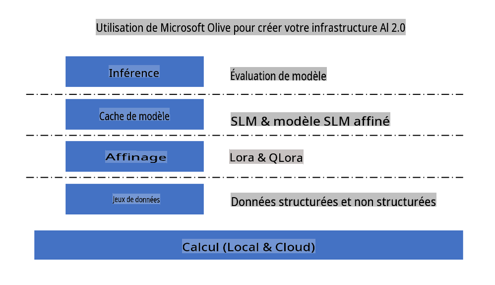
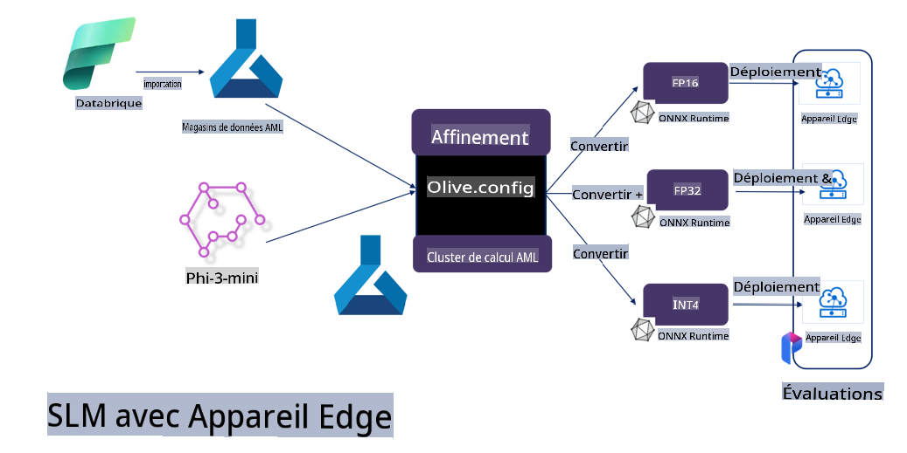

# **Affiner Phi-3 avec Microsoft Olive**

[Olive](https://github.com/microsoft/OLive?WT.mc_id=aiml-138114-kinfeylo) est un outil d'optimisation de modèle matériel facile à utiliser qui réunit des techniques de pointe dans la compression, l'optimisation et la compilation de modèles.

Il est conçu pour simplifier le processus d'optimisation des modèles d'apprentissage automatique, en garantissant qu'ils utilisent au mieux les architectures matérielles spécifiques.

Que vous travailliez sur des applications basées sur le cloud ou des appareils en périphérie, Olive vous permet d'optimiser vos modèles de manière simple et efficace.

## Fonctionnalités clés :
- Olive agrège et automatise les techniques d'optimisation pour les cibles matérielles souhaitées.
- Aucune technique d'optimisation unique ne convient à tous les scénarios, Olive permet donc l'extensibilité en permettant aux experts de l'industrie d'intégrer leurs innovations en matière d'optimisation.

## Réduire l'effort d'ingénierie :
- Les développeurs doivent souvent apprendre et utiliser plusieurs chaînes d'outils spécifiques aux fournisseurs de matériel pour préparer et optimiser les modèles entraînés pour le déploiement.
- Olive simplifie cette expérience en automatisant les techniques d'optimisation pour le matériel souhaité.

## Solution d'optimisation prête à l'emploi de bout en bout :

En composant et en ajustant des techniques intégrées, Olive offre une solution unifiée pour l'optimisation de bout en bout.
Il prend en compte des contraintes comme la précision et la latence tout en optimisant les modèles.


## Utiliser Microsoft Olive pour l'affinage

Microsoft Olive est un outil d'optimisation de modèle open source très facile à utiliser qui peut couvrir à la fois l'affinage et la référence dans le domaine de l'intelligence artificielle générative. Il ne nécessite qu'une simple configuration, combinée à l'utilisation de petits modèles de langage open source et d'environnements d'exécution associés (AzureML / GPU local, CPU, DirectML), vous pouvez compléter l'affinage ou la référence du modèle grâce à une optimisation automatique, et trouver le meilleur modèle à déployer sur le cloud ou sur des appareils en périphérie. Permettre aux entreprises de construire leurs propres modèles verticaux industriels sur site et dans le cloud.



## Affiner Phi-3 avec Microsoft Olive



## Exemple de code et exemple Olive pour Phi-3
Dans cet exemple, vous utiliserez Olive pour :

- Affiner un adaptateur LoRA pour classer des phrases en Tristesse, Joie, Peur, Surprise.
- Fusionner les poids de l'adaptateur dans le modèle de base.
- Optimiser et quantifier le modèle en int4.

[Exemple de code](../../code/04.Finetuning/olive-ort-example/README.md)


### Installer Microsoft Olive

L'installation de Microsoft Olive est très simple, et peut également être installée pour CPU, GPU, DirectML, et Azure ML

```bash
pip install olive-ai
```

Si vous souhaitez exécuter un modèle ONNX avec un CPU, vous pouvez utiliser

```bash
pip install olive-ai[cpu]
```

Si vous souhaitez exécuter un modèle ONNX avec un GPU, vous pouvez utiliser

```python
pip install olive-ai[gpu]
```

Si vous souhaitez utiliser Azure ML, utilisez

```python
pip install git+https://github.com/microsoft/Olive#egg=olive-ai[azureml]
```

**Remarque**
Exigence du système d'exploitation : Ubuntu 20.04 / 22.04 


### **Config.json de Microsoft Olive**

Après l'installation, vous pouvez configurer différents paramètres spécifiques au modèle via le fichier Config, y compris les données, le calcul, l'entraînement, le déploiement et la génération de modèles.

**1. Données**

Sur Microsoft Olive, l'entraînement sur des données locales et des données cloud peut être pris en charge, et peut être configuré dans les paramètres.

*Paramètres des données locales*

Vous pouvez simplement configurer le jeu de données qui doit être entraîné pour l'affinage, généralement au format json, et l'adapter avec le modèle de données. Cela doit être ajusté en fonction des exigences du modèle (par exemple, l'adapter au format requis par Microsoft Phi-3-mini. Si vous avez d'autres modèles, veuillez vous référer aux formats d'affinage requis par d'autres modèles pour le traitement)


```json

    "data_configs": [
        {
            "name": "dataset_default_train",
            "type": "HuggingfaceContainer",
            "load_dataset_config": {
                "params": {
                    "data_name": "json", 
                    "data_files":"dataset/dataset-classification.json",
                    "split": "train"
                }
            },
            "pre_process_data_config": {
                "params": {
                    "dataset_type": "corpus",
                    "text_cols": [
                            "phrase",
                            "tone"
                    ],
                    "text_template": "### Text: {phrase}\n### The tone is:\n{tone}",
                    "corpus_strategy": "join",
                    "source_max_len": 2048,
                    "pad_to_max_len": false,
                    "use_attention_mask": false
                }
            }
        }
    ],
```

**Paramètres de la source de données cloud**

En reliant le magasin de données d'Azure AI Studio/Azure Machine Learning Service pour lier les données dans le cloud, vous pouvez choisir d'introduire différentes sources de données à Azure AI Studio/Azure Machine Learning Service via Microsoft Fabric et Azure Data comme support pour l'affinage des données.

```json

    "data_configs": [
        {
            "name": "dataset_default_train",
            "type": "HuggingfaceContainer",
            "load_dataset_config": {
                "params": {
                    "data_name": "json", 
                    "data_files": {
                        "type": "azureml_datastore",
                        "config": {
                            "azureml_client": {
                                "subscription_id": "Your Azure Subscrition ID",
                                "resource_group": "Your Azure Resource Group",
                                "workspace_name": "Your Azure ML Workspaces name"
                            },
                            "datastore_name": "workspaceblobstore",
                            "relative_path": "Your train_data.json Azure ML Location"
                        }
                    },
                    "split": "train"
                }
            },
            "pre_process_data_config": {
                "params": {
                    "dataset_type": "corpus",
                    "text_cols": [
                            "Question",
                            "Best Answer"
                    ],
                    "text_template": "<|user|>\n{Question}<|end|>\n<|assistant|>\n{Best Answer}\n<|end|>",
                    "corpus_strategy": "join",
                    "source_max_len": 2048,
                    "pad_to_max_len": false,
                    "use_attention_mask": false
                }
            }
        }
    ],
    
```


**2. Configuration de calcul**

Si vous avez besoin d'être local, vous pouvez directement utiliser les ressources de données locales. Vous devez utiliser les ressources d'Azure AI Studio / Azure Machine Learning Service. Vous devez configurer les paramètres Azure pertinents, le nom de la puissance de calcul, etc.


```json

    "systems": {
        "aml": {
            "type": "AzureML",
            "config": {
                "accelerators": ["gpu"],
                "hf_token": true,
                "aml_compute": "Your Azure AI Studio / Azure Machine Learning Service Compute Name",
                "aml_docker_config": {
                    "base_image": "Your Azure AI Studio / Azure Machine Learning Service docker",
                    "conda_file_path": "conda.yaml"
                }
            }
        },
        "azure_arc": {
            "type": "AzureML",
            "config": {
                "accelerators": ["gpu"],
                "aml_compute": "Your Azure AI Studio / Azure Machine Learning Service Compute Name",
                "aml_docker_config": {
                    "base_image": "Your Azure AI Studio / Azure Machine Learning Service docker",
                    "conda_file_path": "conda.yaml"
                }
            }
        }
    },
```

***Remarque***

Parce qu'il est exécuté via un conteneur sur Azure AI Studio/Azure Machine Learning Service, l'environnement requis doit être configuré. Cela est configuré dans l'environnement conda.yaml.


```yaml

name: project_environment
channels:
  - defaults
dependencies:
  - python=3.8.13
  - pip=22.3.1
  - pip:
      - einops
      - accelerate
      - azure-keyvault-secrets
      - azure-identity
      - bitsandbytes
      - datasets
      - huggingface_hub
      - peft
      - scipy
      - sentencepiece
      - torch>=2.2.0
      - transformers
      - git+https://github.com/microsoft/Olive@jiapli/mlflow_loading_fix#egg=olive-ai[gpu]
      - --extra-index-url https://aiinfra.pkgs.visualstudio.com/PublicPackages/_packaging/ORT-Nightly/pypi/simple/ 
      - ort-nightly-gpu==1.18.0.dev20240307004
      - --extra-index-url https://aiinfra.pkgs.visualstudio.com/PublicPackages/_packaging/onnxruntime-genai/pypi/simple/
      - onnxruntime-genai-cuda

    

```


**3. Choisissez votre SLM**

Vous pouvez utiliser le modèle directement depuis Hugging face, ou vous pouvez le combiner directement avec le catalogue de modèles d'Azure AI Studio / Azure Machine Learning pour sélectionner le modèle à utiliser. Dans l'exemple de code ci-dessous, nous utiliserons Microsoft Phi-3-mini comme exemple.

Si vous avez le modèle localement, vous pouvez utiliser cette méthode


```json

    "input_model":{
        "type": "PyTorchModel",
        "config": {
            "hf_config": {
                "model_name": "model-cache/microsoft/phi-3-mini",
                "task": "text-generation",
                "model_loading_args": {
                    "trust_remote_code": true
                }
            }
        }
    },
```

Si vous souhaitez utiliser un modèle d'Azure AI Studio / Azure Machine Learning Service, vous pouvez utiliser cette méthode


```json

    "input_model":{
        "type": "PyTorchModel",
        "config": {
            "model_path": {
                "type": "azureml_registry_model",
                "config": {
                    "name": "microsoft/Phi-3-mini-4k-instruct",
                    "registry_name": "azureml-msr",
                    "version": "11"
                }
            },
             "model_file_format": "PyTorch.MLflow",
             "hf_config": {
                "model_name": "microsoft/Phi-3-mini-4k-instruct",
                "task": "text-generation",
                "from_pretrained_args": {
                    "trust_remote_code": true
                }
            }
        }
    },
```

**Remarque :**
Nous devons nous intégrer à Azure AI Studio / Azure Machine Learning Service, donc lors de la configuration du modèle, veuillez vous référer au numéro de version et à la nomenclature associée.

Tous les modèles sur Azure doivent être configurés sur PyTorch.MLflow

Vous devez avoir un compte Hugging face et lier la clé à la valeur clé d'Azure AI Studio / Azure Machine Learning

**4. Algorithme**

Microsoft Olive encapsule très bien les algorithmes d'affinage Lora et QLora. Tout ce que vous devez configurer sont quelques paramètres pertinents. Ici, je prends QLora comme exemple.


```json
        "lora": {
            "type": "LoRA",
            "config": {
                "target_modules": [
                    "o_proj",
                    "qkv_proj"
                ],
                "double_quant": true,
                "lora_r": 64,
                "lora_alpha": 64,
                "lora_dropout": 0.1,
                "train_data_config": "dataset_default_train",
                "eval_dataset_size": 0.3,
                "training_args": {
                    "seed": 0,
                    "data_seed": 42,
                    "per_device_train_batch_size": 1,
                    "per_device_eval_batch_size": 1,
                    "gradient_accumulation_steps": 4,
                    "gradient_checkpointing": false,
                    "learning_rate": 0.0001,
                    "num_train_epochs": 3,
                    "max_steps": 10,
                    "logging_steps": 10,
                    "evaluation_strategy": "steps",
                    "eval_steps": 187,
                    "group_by_length": true,
                    "adam_beta2": 0.999,
                    "max_grad_norm": 0.3
                }
            }
        },
```


Si vous souhaitez une conversion de quantification, la branche principale de Microsoft Olive prend déjà en charge la méthode onnxruntime-genai. Vous pouvez la configurer selon vos besoins :

1. Fusionner les poids de l'adaptateur dans le modèle de base
2. Convertir le modèle en modèle onnx avec la précision requise par ModelBuilder

comme convertir en quantifié INT4


```json

        "merge_adapter_weights": {
            "type": "MergeAdapterWeights"
        },
        "builder": {
            "type": "ModelBuilder",
            "config": {
                "precision": "int4"
            }
        }
```

**Remarque** 
- Si vous utilisez QLoRA, la conversion de quantification d'ONNXRuntime-genai n'est pas encore prise en charge.


- Il convient de noter ici que vous pouvez configurer les étapes ci-dessus selon vos propres besoins. Il n'est pas nécessaire de configurer complètement ces étapes ci-dessus. En fonction de vos besoins, vous pouvez directement utiliser les étapes de l'algorithme sans affinage. Enfin, vous devez configurer les moteurs pertinents


```json

    "engine": {
        "log_severity_level": 0,
        "host": "aml",
        "target": "aml",
        "search_strategy": false,
        "execution_providers": ["CUDAExecutionProvider"],
        "cache_dir": "../model-cache/models/phi3-finetuned/cache",
        "output_dir" : "../model-cache/models/phi3-finetuned"
    }
```


**5. Affinage terminé**

Sur la ligne de commande, exécutez dans le répertoire de olive-config.json

```bash
olive run --config olive-config.json  
```

Avertissement : La traduction a été réalisée à partir de l'original par un modèle d'IA et peut ne pas être parfaite. 
Veuillez examiner le résultat et apporter les corrections nécessaires.