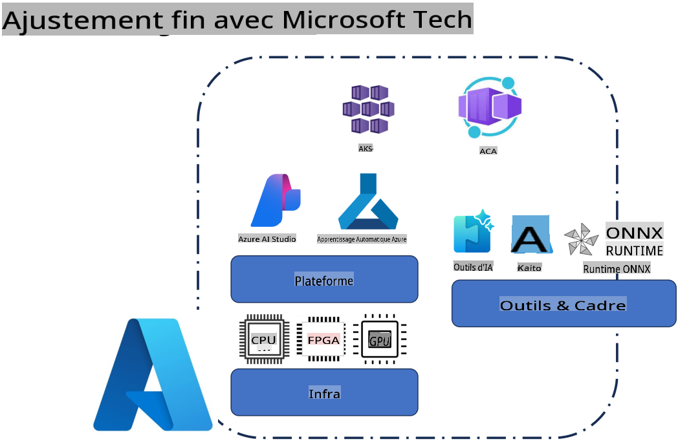
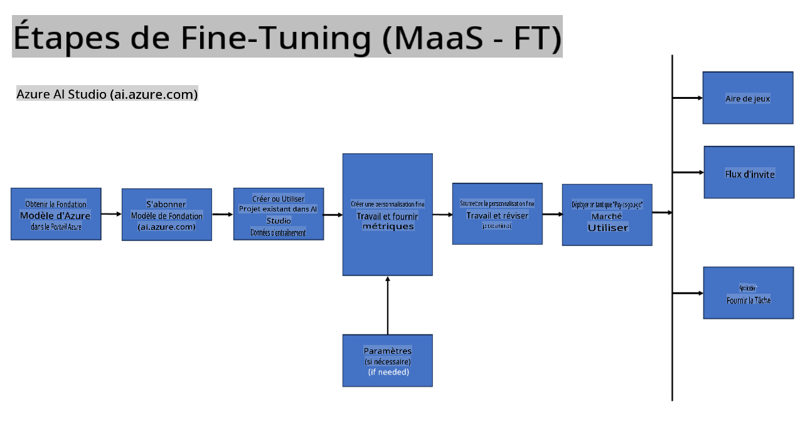
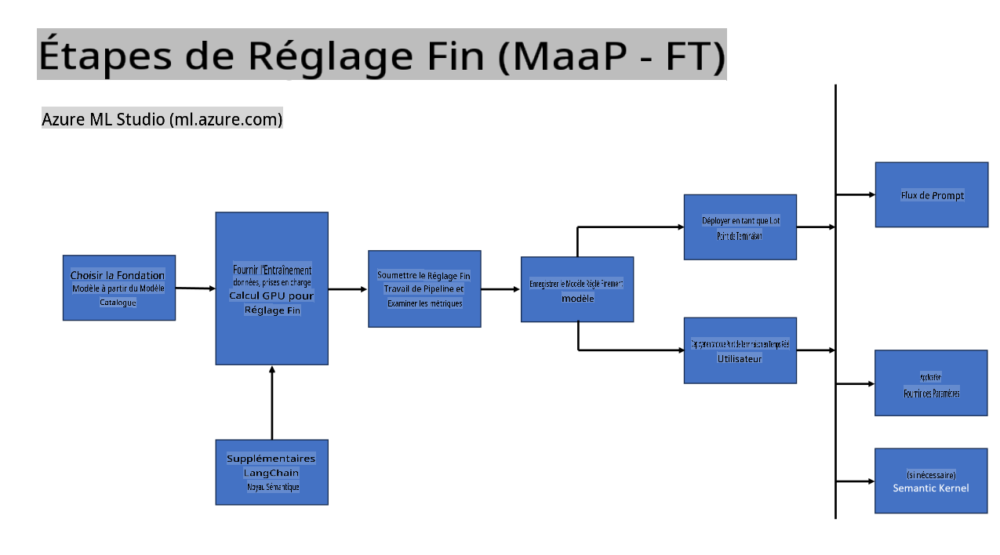
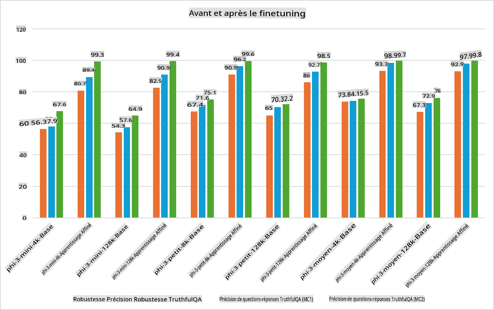

## Scénarios de Fine Tuning

**Plateforme** Cela inclut diverses technologies telles que Azure AI Studio, Azure Machine Learning, AI Tools, Kaito, et ONNX Runtime.

**Infrastructure** Cela inclut le CPU et le FPGA, qui sont essentiels pour le processus de fine-tuning. Voici les icônes pour chacune de ces technologies.

**Outils & Framework** Cela inclut ONNX Runtime et ONNX Runtime. Voici les icônes pour chacune de ces technologies.
[Insérez les icônes pour ONNX Runtime et ONNX Runtime]

Le processus de fine-tuning avec les technologies Microsoft implique divers composants et outils. En comprenant et en utilisant ces technologies, nous pouvons affiner efficacement nos applications et créer de meilleures solutions.

## Modèle en tant que Service

Affinez le modèle en utilisant le fine-tuning hébergé, sans avoir besoin de créer et gérer le calcul.

Le fine-tuning sans serveur est disponible pour les modèles Phi-3-mini et Phi-3-medium, permettant aux développeurs de personnaliser rapidement et facilement les modèles pour les scénarios cloud et edge sans avoir à organiser le calcul. Nous avons également annoncé que, Phi-3-small, est désormais disponible via notre offre Models-as-a-Service, permettant aux développeurs de commencer rapidement et facilement le développement de l'IA sans avoir à gérer l'infrastructure sous-jacente.

[Exemple de Fine Tuning](https://github.com/microsoft/Phi-3CookBook/blob/main/md/04.Fine-tuning/FineTuning_AIStudio.md)
## Modèle en tant que Plateforme

Les utilisateurs gèrent leur propre calcul afin d'affiner leurs modèles.

[Exemple de Fine Tuning](https://github.com/Azure/azureml-examples/blob/main/sdk/python/foundation-models/system/finetune/chat-completion/chat-completion.ipynb)

## Scénarios de Fine Tuning

| | | | | | | |
|-|-|-|-|-|-|-|
|Scénario|LoRA|QLoRA|PEFT|DeepSpeed|ZeRO|DORA|
|Adapter des LLMs pré-entraînés à des tâches ou domaines spécifiques|Oui|Oui|Oui|Oui|Oui|Oui|
|Fine-tuning pour des tâches NLP telles que la classification de texte, la reconnaissance d'entités nommées et la traduction automatique|Oui|Oui|Oui|Oui|Oui|Oui|
|Fine-tuning pour des tâches de QA|Oui|Oui|Oui|Oui|Oui|Oui|
|Fine-tuning pour générer des réponses humaines dans les chatbots|Oui|Oui|Oui|Oui|Oui|Oui|
|Fine-tuning pour générer de la musique, de l'art ou d'autres formes de créativité|Oui|Oui|Oui|Oui|Oui|Oui|
|Réduire les coûts computationnels et financiers|Oui|Oui|Non|Oui|Oui|Non|
|Réduire l'utilisation de la mémoire|Non|Oui|Non|Oui|Oui|Oui|
|Utiliser moins de paramètres pour un fine-tuning efficace|Non|Oui|Oui|Non|Non|Oui|
|Forme de parallélisme de données efficace en mémoire qui donne accès à la mémoire GPU agrégée de tous les appareils GPU disponibles|Non|Non|Non|Oui|Oui|Oui|

## Exemples de Performance de Fine Tuning

