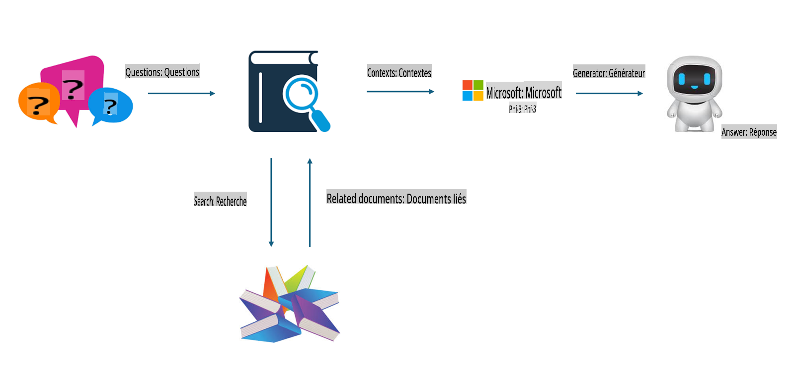

## Ajustement fin vs RAG

## Génération augmentée par la récupération

RAG est la récupération de données + la génération de texte. Les données structurées et non structurées de l'entreprise sont stockées dans la base de données vectorielle. Lors de la recherche de contenu pertinent, le résumé et le contenu pertinents sont trouvés pour former un contexte, et la capacité de complétion de texte de LLM/SLM est combinée pour générer du contenu.

## Processus RAG

## Ajustement fin
L'ajustement fin repose sur l'amélioration d'un certain modèle. Il n'est pas nécessaire de commencer par l'algorithme du modèle, mais les données doivent être continuellement accumulées. Si vous souhaitez une terminologie et une expression linguistique plus précises dans les applications industrielles, l'ajustement fin est votre meilleur choix. Mais si vos données changent fréquemment, l'ajustement fin peut devenir compliqué.

## Comment choisir
Si notre réponse nécessite l'introduction de données externes, RAG est le meilleur choix.

Si vous avez besoin de produire des connaissances industrielles stables et précises, l'ajustement fin sera un bon choix. RAG privilégie le contenu pertinent mais peut ne pas toujours capter les nuances spécialisées.

L'ajustement fin nécessite un ensemble de données de haute qualité, et s'il ne s'agit que d'un petit ensemble de données, cela ne fera pas une grande différence. RAG est plus flexible.
L'ajustement fin est une boîte noire, une métaphysique, et il est difficile de comprendre le mécanisme interne. Mais RAG peut faciliter la recherche de la source des données, permettant ainsi d'ajuster efficacement les hallucinations ou les erreurs de contenu et de fournir une meilleure transparence.

Avertissement : La traduction a été réalisée à partir de l'original par un modèle d'IA et peut ne pas être parfaite. 
Veuillez examiner le résultat et apporter les corrections nécessaires.