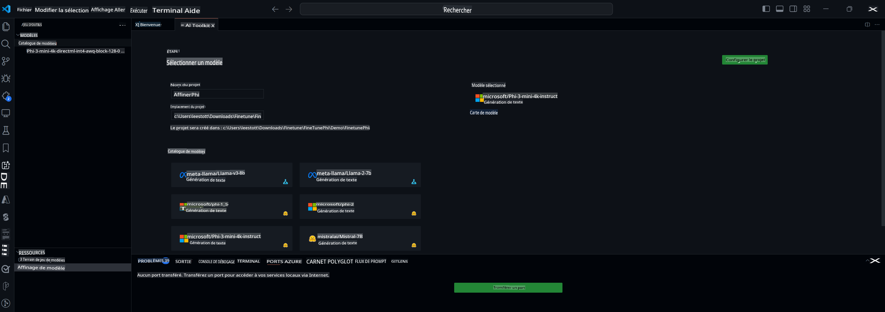

## Bienvenue à AI Toolkit pour VS Code

[AI Toolkit pour VS Code](https://github.com/microsoft/vscode-ai-toolkit/tree/main) réunit divers modèles du catalogue Azure AI Studio et d'autres catalogues comme Hugging Face. Le toolkit simplifie les tâches de développement courantes pour créer des applications IA avec des outils et modèles d'IA générative grâce à :
- Démarrage avec la découverte de modèles et un terrain de jeu.
- Ajustement fin et inférence des modèles en utilisant des ressources informatiques locales.
- Ajustement fin et inférence à distance en utilisant les ressources Azure.

[Installer AI Toolkit pour VSCode](https://marketplace.visualstudio.com/items?itemName=ms-windows-ai-studio.windows-ai-studio)



**[Aperçu Privé]** Provisionnement en un clic pour Azure Container Apps afin d'exécuter l'ajustement fin et l'inférence des modèles dans le cloud.

Passons maintenant au développement de votre application IA :

- [Développement Local](../../../../md/04.Fine-tuning)
    - [Préparations](../../../../md/04.Fine-tuning)
    - [Activer Conda](../../../../md/04.Fine-tuning)
    - [Ajustement fin du modèle de base uniquement](../../../../md/04.Fine-tuning)
    - [Ajustement fin et inférence du modèle](../../../../md/04.Fine-tuning)
- [**[Aperçu Privé]** Développement à Distance](../../../../md/04.Fine-tuning)
    - [Prérequis](../../../../md/04.Fine-tuning)
    - [Configuration d'un Projet de Développement à Distance](../../../../md/04.Fine-tuning)
    - [Provisionner des Ressources Azure](../../../../md/04.Fine-tuning)
    - [[Optionnel] Ajouter un Jeton Huggingface au Secret de l'Azure Container App](../../../../md/04.Fine-tuning)
    - [Exécuter l'Ajustement Fin](../../../../md/04.Fine-tuning)
    - [Provisionner un Point de Terminaison d'Inférence](../../../../md/04.Fine-tuning)
    - [Déployer le Point de Terminaison d'Inférence](../../../../md/04.Fine-tuning)
    - [Utilisation Avancée](../../../../md/04.Fine-tuning)

## Développement Local
### Préparations

1. Assurez-vous que le pilote NVIDIA est installé sur l'hôte.
2. Exécutez `huggingface-cli login` si vous utilisez HF pour l'utilisation de jeux de données.
3. Explications des paramètres clés de `Olive` pour tout ce qui modifie l'utilisation de la mémoire.

### Activer Conda
Puisque nous utilisons un environnement WSL et qu'il est partagé, vous devez activer manuellement l'environnement conda. Après cette étape, vous pouvez exécuter l'ajustement fin ou l'inférence.

```bash
conda activate [conda-env-name] 
```

### Ajustement fin du modèle de base uniquement
Pour simplement essayer le modèle de base sans ajustement fin, vous pouvez exécuter cette commande après avoir activé conda.

```bash
cd inference

# L'interface du navigateur Web permet d'ajuster quelques paramètres comme la longueur maximale des nouveaux tokens, la température, etc.
# L'utilisateur doit ouvrir manuellement le lien (par exemple http://0.0.0.0:7860) dans un navigateur après que gradio ait initié les connexions.
python gradio_chat.py --baseonly
```

### Ajustement fin et inférence du modèle

Une fois l'espace de travail ouvert dans un conteneur de développement, ouvrez un terminal (le chemin par défaut est la racine du projet), puis exécutez la commande ci-dessous pour ajuster un LLM sur le jeu de données sélectionné.

```bash
python finetuning/invoke_olive.py 
```

Les points de contrôle et le modèle final seront sauvegardés dans le dossier `models`.

Ensuite, exécutez l'inférence avec le modèle ajusté via des chats dans une `console`, un `navigateur web` ou un `prompt flow`.

```bash
cd inference

# Interface console.
python console_chat.py

# L'interface du navigateur Web permet d'ajuster quelques paramètres comme la longueur maximale des nouveaux tokens, la température, etc.
# L'utilisateur doit ouvrir manuellement le lien (par exemple http://127.0.0.1:7860) dans un navigateur après que gradio ait initié les connexions.
python gradio_chat.py
```

Pour utiliser `prompt flow` dans VS Code, veuillez vous référer à ce [Démarrage Rapide](https://microsoft.github.io/promptflow/how-to-guides/quick-start.html).

### Ajustement fin du modèle

Ensuite, téléchargez le modèle suivant en fonction de la disponibilité d'un GPU sur votre appareil.

Pour initier la session d'ajustement fin local en utilisant QLoRA, sélectionnez un modèle que vous souhaitez ajuster à partir de notre catalogue.
| Plateforme(s) | GPU disponible | Nom du modèle | Taille (GB) |
|---------|---------|--------|--------|
| Windows | Oui | Phi-3-mini-4k-**directml**-int4-awq-block-128-onnx | 2.13GB |
| Linux | Oui | Phi-3-mini-4k-**cuda**-int4-onnx | 2.30GB |
| Windows<br>Linux | Non | Phi-3-mini-4k-**cpu**-int4-rtn-block-32-acc-level-4-onnx | 2.72GB |

**_Remarque_** Vous n'avez pas besoin d'un compte Azure pour télécharger les modèles.

Le modèle Phi3-mini (int4) fait environ 2GB-3GB. En fonction de la vitesse de votre réseau, le téléchargement peut prendre quelques minutes.

Commencez par sélectionner un nom de projet et un emplacement.
Ensuite, sélectionnez un modèle à partir du catalogue de modèles. Vous serez invité à télécharger le modèle de projet. Vous pouvez ensuite cliquer sur "Configurer le Projet" pour ajuster divers paramètres.

### Microsoft Olive 

Nous utilisons [Olive](https://microsoft.github.io/Olive/overview/olive.html) pour exécuter l'ajustement fin QLoRA sur un modèle PyTorch de notre catalogue. Tous les paramètres sont préréglés avec les valeurs par défaut pour optimiser l'exécution du processus d'ajustement fin localement avec une utilisation optimisée de la mémoire, mais ils peuvent être ajustés pour votre scénario.

### Exemples et Ressources d'Ajustement Fin

- [Guide de Démarrage pour l'Ajustement Fin](https://learn.microsoft.com/windows/ai/toolkit/toolkit-fine-tune)
- [Ajustement Fin avec un Jeu de Données HuggingFace](https://github.com/microsoft/vscode-ai-toolkit/blob/main/walkthrough-hf-dataset.md)
- [Ajustement Fin avec un Jeu de Données Simple](https://github.com/microsoft/vscode-ai-toolkit/blob/main/walkthrough-simple-dataset.md)


## **[Aperçu Privé]** Développement à Distance
### Prérequis
1. Pour exécuter l'ajustement fin du modèle dans votre environnement Azure Container App distant, assurez-vous que votre abonnement dispose de suffisamment de capacité GPU. Soumettez un [ticket de support](https://azure.microsoft.com/support/create-ticket/) pour demander la capacité requise pour votre application. [Obtenez Plus d'Infos sur la Capacité GPU](https://learn.microsoft.com/azure/container-apps/workload-profiles-overview)
2. Si vous utilisez un jeu de données privé sur HuggingFace, assurez-vous d'avoir un [compte HuggingFace](https://huggingface.co/) et [générez un jeton d'accès](https://huggingface.co/docs/hub/security-tokens)
3. Activez la fonctionnalité d'Ajustement Fin et d'Inférence à Distance dans AI Toolkit pour VS Code
   1. Ouvrez les Paramètres de VS Code en sélectionnant *Fichier -> Préférences -> Paramètres*.
   2. Naviguez vers *Extensions* et sélectionnez *AI Toolkit*.
   3. Sélectionnez l'option *"Activer l'Ajustement Fin et l'Inférence à Distance"*.
   4. Rechargez VS Code pour que cela prenne effet.

- [Ajustement Fin à Distance](https://github.com/microsoft/vscode-ai-toolkit/blob/main/remote-finetuning.md)

### Configuration d'un Projet de Développement à Distance
1. Exécutez la palette de commandes `AI Toolkit: Focus on Resource View`.
2. Naviguez vers *Model Fine-tuning* pour accéder au catalogue de modèles. Donnez un nom à votre projet et sélectionnez son emplacement sur votre machine. Ensuite, cliquez sur le bouton *"Configurer le Projet"*.
3. Configuration du Projet
    1. Évitez d'activer l'option *"Ajuster finement localement"*.
    2. Les paramètres de configuration d'Olive apparaîtront avec des valeurs par défaut préréglées. Veuillez ajuster et remplir ces configurations selon vos besoins.
    3. Passez à *Générer le Projet*. Cette étape utilise WSL et implique la configuration d'un nouvel environnement Conda, en préparation des futures mises à jour qui incluent des conteneurs de développement.
4. Cliquez sur *"Relancer la Fenêtre dans l'Espace de Travail"* pour ouvrir votre projet de développement à distance.

> **Remarque:** Le projet fonctionne actuellement soit localement, soit à distance dans AI Toolkit pour VS Code. Si vous choisissez *"Ajuster finement localement"* lors de la création du projet, il fonctionnera exclusivement dans WSL sans capacités de développement à distance. En revanche, si vous ne cochez pas *"Ajuster finement localement"*, le projet sera limité à l'environnement Azure Container App distant.

### Provisionner des Ressources Azure
Pour commencer, vous devez provisionner les ressources Azure pour l'ajustement fin à distance. Faites-le en exécutant `AI Toolkit: Provision Azure Container Apps job for fine-tuning` depuis la palette de commandes.

Surveillez la progression du provisionnement via le lien affiché dans le canal de sortie.

### [Optionnel] Ajouter un Jeton Huggingface au Secret de l'Azure Container App
Si vous utilisez un jeu de données privé HuggingFace, définissez votre jeton HuggingFace comme variable d'environnement pour éviter la nécessité de se connecter manuellement au Hugging Face Hub.
Vous pouvez le faire en utilisant la commande `AI Toolkit: Add Azure Container Apps Job secret for fine-tuning`. Avec cette commande, vous pouvez définir le nom du secret comme [`HF_TOKEN`](https://huggingface.co/docs/huggingface_hub/package_reference/environment_variables#hftoken) et utiliser votre jeton Hugging Face comme valeur secrète.

### Exécuter l'Ajustement Fin
Pour démarrer le travail d'ajustement fin à distance, exécutez la commande `AI Toolkit: Run fine-tuning`.

Pour voir les journaux système et console, vous pouvez visiter le portail Azure en utilisant le lien dans le panneau de sortie (plus d'étapes sur [Voir et Interroger les Journaux sur Azure](https://aka.ms/ai-toolkit/remote-provision#view-and-query-logs-on-azure)). Ou, vous pouvez voir les journaux de console directement dans le panneau de sortie de VSCode en exécutant la commande `AI Toolkit: Show the running fine-tuning job streaming logs`.
> **Remarque:** Le travail peut être mis en file d'attente en raison de ressources insuffisantes. Si le journal ne s'affiche pas, exécutez la commande `AI Toolkit: Show the running fine-tuning job streaming logs`, attendez un moment, puis exécutez à nouveau la commande pour vous reconnecter au journal en streaming.

Pendant ce processus, QLoRA sera utilisé pour l'ajustement fin, et créera des adaptateurs LoRA pour que le modèle les utilise pendant l'inférence.
Les résultats de l'ajustement fin seront stockés dans les fichiers Azure.

### Provisionner un Point de Terminaison d'Inférence
Après que les adaptateurs soient entraînés dans l'environnement distant, utilisez une application Gradio simple pour interagir avec le modèle.
Similaire au processus d'ajustement fin, vous devez configurer les ressources Azure pour l'inférence à distance en exécutant `AI Toolkit: Provision Azure Container Apps for inference` depuis la palette de commandes.

Par défaut, l'abonnement et le groupe de ressources pour l'inférence devraient correspondre à ceux utilisés pour l'ajustement fin. L'inférence utilisera le même environnement Azure Container App et accédera au modèle et à l'adaptateur de modèle stockés dans les fichiers Azure, qui ont été générés lors de l'étape d'ajustement fin.

### Déployer le Point de Terminaison d'Inférence
Si vous souhaitez réviser le code d'inférence ou recharger le modèle d'inférence, veuillez exécuter la commande `AI Toolkit: Deploy for inference`. Cela synchronisera votre code le plus récent avec Azure Container App et redémarrera la réplique.

Une fois le déploiement terminé avec succès, vous pouvez accéder à l'API d'inférence en cliquant sur le bouton "*Aller au Point de Terminaison d'Inférence*" affiché dans la notification VSCode. Ou, le point de terminaison de l'API Web peut être trouvé sous `ACA_APP_ENDPOINT` dans `./infra/inference.config.json` et dans le panneau de sortie. Vous êtes maintenant prêt à évaluer le modèle en utilisant ce point de terminaison.

### Utilisation Avancée
Pour plus d'informations sur le développement à distance avec AI Toolkit, référez-vous à la documentation [Ajustement Fin des modèles à distance](https://aka.ms/ai-toolkit/remote-provision) et [Inférence avec le modèle ajusté](https://aka.ms/ai-toolkit/remote-inference).

Avertissement : La traduction a été réalisée à partir de l'original par un modèle d'IA et peut ne pas être parfaite. 
Veuillez examiner le résultat et apporter les corrections nécessaires.