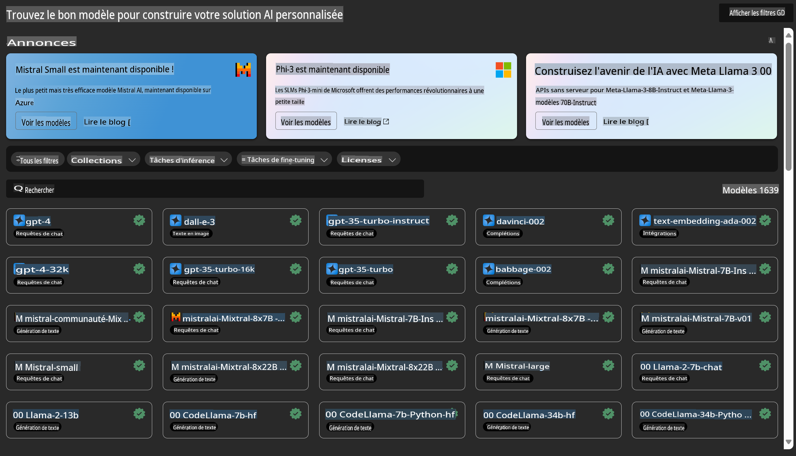
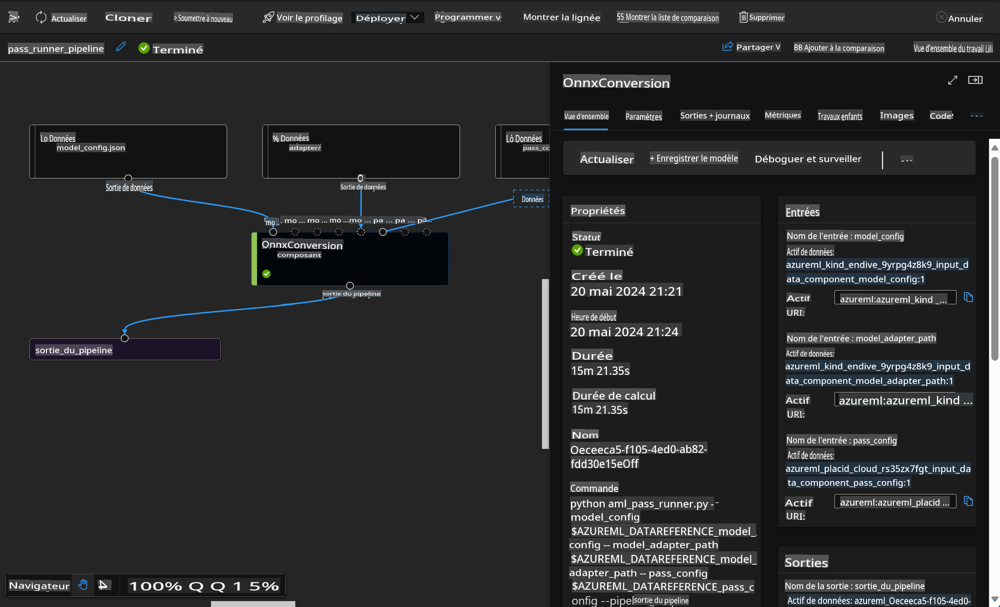

# **Présentation du Service Azure Machine Learning**

[Azure Machine Learning](https://ml.azure.com?WT.mc_id=aiml-138114-kinfeylo) est un service cloud pour accélérer et gérer le cycle de vie des projets de machine learning (ML).

Les professionnels du ML, les data scientists et les ingénieurs peuvent l'utiliser dans leurs workflows quotidiens pour :

- Entraîner et déployer des modèles.
- Gérer les opérations de machine learning (MLOps).
- Vous pouvez créer un modèle dans Azure Machine Learning ou utiliser un modèle construit à partir d'une plateforme open-source, comme PyTorch, TensorFlow ou scikit-learn.
- Les outils MLOps vous aident à surveiller, réentraîner et redéployer les modèles.

## Pour qui est Azure Machine Learning ?

**Data Scientists et Ingénieurs ML**

Ils peuvent utiliser des outils pour accélérer et automatiser leurs workflows quotidiens.
Azure ML offre des fonctionnalités pour l'équité, l'explicabilité, le suivi et l'auditabilité.
Développeurs d'applications :
Ils peuvent intégrer des modèles dans des applications ou des services de manière transparente.

**Développeurs de plateformes**

Ils ont accès à un ensemble robuste d'outils soutenus par des APIs durables d'Azure Resource Manager.
Ces outils permettent de construire des outils ML avancés.

**Entreprises**

En travaillant dans le cloud Microsoft Azure, les entreprises bénéficient de la sécurité familière et du contrôle d'accès basé sur les rôles.
Configurez des projets pour contrôler l'accès aux données protégées et aux opérations spécifiques.

## Productivité pour toute l'équipe
Les projets ML nécessitent souvent une équipe avec un ensemble de compétences variées pour construire et maintenir.

Azure ML fournit des outils qui vous permettent de :
- Collaborer avec votre équipe via des notebooks partagés, des ressources de calcul, des calculs sans serveur, des données et des environnements.
- Développer des modèles avec équité, explicabilité, suivi et auditabilité pour répondre aux exigences de traçabilité et de conformité.
- Déployer des modèles ML rapidement et facilement à grande échelle, et les gérer et les gouverner efficacement avec MLOps.
- Exécuter des charges de travail de machine learning partout avec une gouvernance, une sécurité et une conformité intégrées.

## Outils de plateforme compatibles

N'importe qui dans une équipe ML peut utiliser ses outils préférés pour accomplir le travail.
Que vous réalisiez des expériences rapides, des ajustements d'hyperparamètres, que vous construisiez des pipelines ou que vous gériez des inférences, vous pouvez utiliser des interfaces familières, notamment :
- Azure Machine Learning Studio
- Python SDK (v2)
- Azure CLI (v2)
- Azure Resource Manager REST APIs

Au fur et à mesure que vous affinez les modèles et collaborez tout au long du cycle de développement, vous pouvez partager et trouver des actifs, des ressources et des métriques dans l'interface utilisateur de Azure Machine Learning studio.

## **LLM/SLM dans Azure ML**

Azure ML a ajouté de nombreuses fonctions liées à LLM/SLM, combinant LLMOps et SLMOps pour créer une plateforme technologique d'intelligence artificielle générative à l'échelle de l'entreprise.

### **Catalogue de Modèles**

Les utilisateurs d'entreprise peuvent déployer différents modèles en fonction de différents scénarios d'affaires via le Catalogue de Modèles, et fournir des services en tant que Model as Service pour que les développeurs ou utilisateurs d'entreprise puissent y accéder.

Le Catalogue de Modèles dans Azure Machine Learning studio est le centre pour découvrir et utiliser une large gamme de modèles qui vous permettent de construire des applications d'IA générative. Le catalogue de modèles propose des centaines de modèles de fournisseurs de modèles tels que le service Azure OpenAI, Mistral, Meta, Cohere, Nvidia, Hugging Face, y compris des modèles entraînés par Microsoft. Les modèles provenant de fournisseurs autres que Microsoft sont des Produits Non-Microsoft, tels que définis dans les Termes de Produit de Microsoft, et sont soumis aux conditions fournies avec le modèle.

### **Pipeline de Job**

Le cœur d'un pipeline de machine learning est de diviser une tâche de machine learning complète en un workflow en plusieurs étapes. Chaque étape est un composant gérable qui peut être développé, optimisé, configuré et automatisé individuellement. Les étapes sont connectées par des interfaces bien définies. Le service de pipeline Azure Machine Learning orchestre automatiquement toutes les dépendances entre les étapes du pipeline.

Lors du fine-tuning de SLM / LLM, nous pouvons gérer nos données, processus de formation et de génération via Pipeline.

### **Flux de Prompt**

Avantages de l'utilisation du flux de prompt Azure Machine Learning
Le flux de prompt Azure Machine Learning offre une gamme d'avantages qui aident les utilisateurs à passer de l'idéation à l'expérimentation et, finalement, à des applications prêtes pour la production basées sur LLM :

**Agilité de l'ingénierie de prompt**

Expérience de rédaction interactive : le flux de prompt Azure Machine Learning offre une représentation visuelle de la structure du flux, permettant aux utilisateurs de comprendre et de naviguer facilement dans leurs projets. Il offre également une expérience de codage semblable à celle d'un notebook pour un développement et un débogage efficaces des flux.
Variantes pour l'ajustement de prompt : les utilisateurs peuvent créer et comparer plusieurs variantes de prompt, facilitant un processus de raffinement itératif.

Évaluation : les flux d'évaluation intégrés permettent aux utilisateurs d'évaluer la qualité et l'efficacité de leurs prompts et flux.

Ressources complètes : le flux de prompt Azure Machine Learning comprend une bibliothèque d'outils intégrés, d'exemples et de modèles qui servent de point de départ pour le développement, inspirant la créativité et accélérant le processus.

**Préparation des entreprises pour les applications basées sur LLM**

Collaboration : le flux de prompt Azure Machine Learning prend en charge la collaboration en équipe, permettant à plusieurs utilisateurs de travailler ensemble sur des projets d'ingénierie de prompt, de partager des connaissances et de maintenir le contrôle des versions.

Plateforme tout-en-un : le flux de prompt Azure Machine Learning rationalise l'ensemble du processus d'ingénierie de prompt, du développement et de l'évaluation au déploiement et à la surveillance. Les utilisateurs peuvent déployer sans effort leurs flux en tant que points de terminaison Azure Machine Learning et surveiller leurs performances en temps réel, garantissant une opération optimale et une amélioration continue.

Solutions de préparation d'entreprise Azure Machine Learning : le flux de prompt tire parti des solutions robustes de préparation d'entreprise d'Azure Machine Learning, fournissant une base sécurisée, évolutive et fiable pour le développement, l'expérimentation et le déploiement des flux.

Avec le flux de prompt Azure Machine Learning, les utilisateurs peuvent libérer leur agilité en ingénierie de prompt, collaborer efficacement et tirer parti de solutions de qualité entreprise pour un développement et un déploiement réussis d'applications basées sur LLM.

En combinant la puissance de calcul, les données et les différents composants d'Azure ML, les développeurs d'entreprise peuvent facilement construire leurs propres applications d'intelligence artificielle.

Avertissement : La traduction a été effectuée à partir de l'original par un modèle d'IA et peut ne pas être parfaite. 
Veuillez examiner le résultat et apporter les corrections nécessaires.