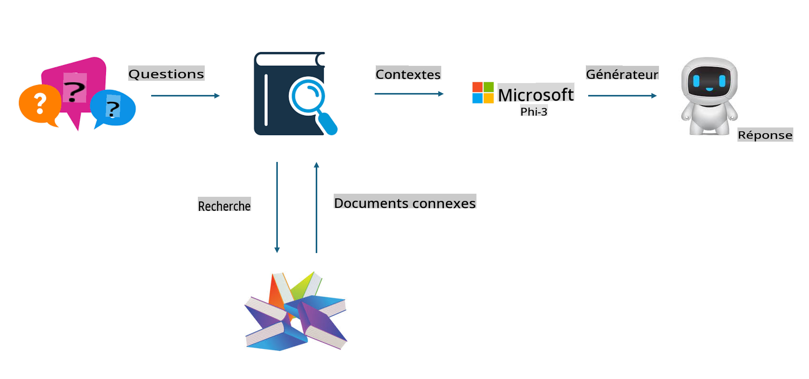
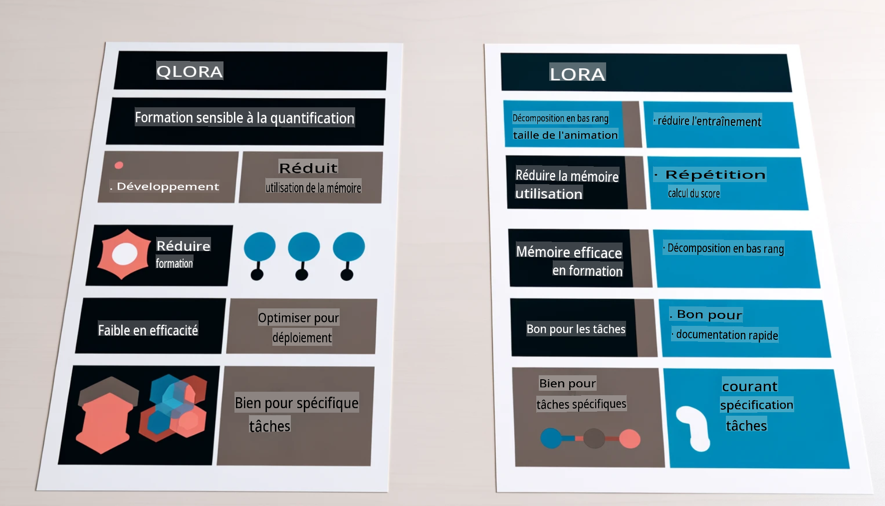

# **Faire de Phi-3 un expert de l'industrie**

Pour intégrer le modèle Phi-3 dans une industrie, il est nécessaire d'ajouter des données métiers spécifiques au modèle Phi-3. Nous avons deux options différentes : la première est RAG (Retrieval Augmented Generation) et la seconde est le Fine Tuning.

## **RAG vs Fine-Tuning**

### **Retrieval Augmented Generation**

RAG combine la récupération de données et la génération de texte. Les données structurées et non structurées de l'entreprise sont stockées dans une base de données vectorielle. Lors de la recherche de contenu pertinent, le résumé et le contenu correspondant sont trouvés pour former un contexte, et la capacité de complétion de texte de LLM/SLM est combinée pour générer du contenu.

### **Fine-tuning**

Le Fine-tuning se base sur l'amélioration d'un modèle existant. Il n'est pas nécessaire de partir de l'algorithme du modèle, mais les données doivent être continuellement accumulées. Si vous souhaitez une terminologie et une expression linguistique plus précises dans les applications industrielles, le Fine-tuning est votre meilleur choix. Cependant, si vos données changent fréquemment, le Fine-tuning peut devenir complexe.

### **Comment choisir**

1. Si notre réponse nécessite l'introduction de données externes, RAG est le meilleur choix.

2. Si vous avez besoin de produire des connaissances industrielles stables et précises, le Fine-tuning sera une bonne option. RAG privilégie le contenu pertinent mais peut ne pas toujours saisir les nuances spécialisées.

3. Le Fine-tuning nécessite un ensemble de données de haute qualité, et s'il s'agit seulement d'un petit ensemble de données, cela ne fera pas une grande différence. RAG est plus flexible.

4. Le Fine-tuning est une boîte noire, une métaphysique, et il est difficile de comprendre le mécanisme interne. Mais RAG peut faciliter la recherche de la source des données, permettant ainsi d'ajuster efficacement les hallucinations ou les erreurs de contenu et de fournir une meilleure transparence.

### **Scénarios**

1. Les industries verticales nécessitant un vocabulaire et des expressions spécifiques, ***Fine-tuning*** sera le meilleur choix.

2. Les systèmes de questions-réponses, impliquant la synthèse de différents points de connaissance, ***RAG*** sera le meilleur choix.

3. La combinaison de flux de travail automatisés ***RAG + Fine-tuning*** est le meilleur choix.

## **Comment utiliser RAG**

Une base de données vectorielle est une collection de données stockées sous forme mathématique. Les bases de données vectorielles facilitent la mémorisation des entrées précédentes par les modèles de machine learning, permettant d'utiliser le machine learning pour des cas d'utilisation tels que la recherche, les recommandations et la génération de texte. Les données peuvent être identifiées en fonction de métriques de similarité plutôt que de correspondances exactes, permettant aux modèles informatiques de comprendre le contexte des données.

La base de données vectorielle est la clé pour réaliser RAG. Nous pouvons convertir les données en stockage vectoriel via des modèles vectoriels tels que text-embedding-3, jina-ai-embedding, etc.

En savoir plus sur la création d'une application RAG [https://github.com/microsoft/Phi-3CookBook](https://github.com/microsoft/Phi-3CookBook?WT.mc_id=aiml-138114-kinfeylo)

## **Comment utiliser le Fine-tuning**

Les algorithmes couramment utilisés dans le Fine-tuning sont Lora et QLora. Comment choisir ?
- [En savoir plus avec cet exemple de notebook](../../../../code/04.Finetuning/Phi_3_Inference_Finetuning.ipynb)
- [Exemple de script de FineTuning en Python](../../../../code/04.Finetuning/FineTrainingScript.py)

### **Lora et QLora**

LoRA (Low-Rank Adaptation) et QLoRA (Quantized Low-Rank Adaptation) sont deux techniques utilisées pour affiner les grands modèles de langage (LLMs) en utilisant le Fine Tuning Efficace en Paramètres (PEFT). Les techniques PEFT sont conçues pour entraîner les modèles plus efficacement que les méthodes traditionnelles. LoRA est une technique de fine-tuning autonome qui réduit l'empreinte mémoire en appliquant une approximation de faible rang à la matrice de mise à jour des poids. Elle offre des temps d'entraînement rapides et maintient des performances proches des méthodes de fine-tuning traditionnelles.

QLoRA est une version étendue de LoRA qui intègre des techniques de quantification pour réduire encore plus l'utilisation de la mémoire. QLoRA quantifie la précision des paramètres de poids dans le LLM pré-entraîné à une précision de 4 bits, ce qui est plus efficace en termes de mémoire que LoRA. Cependant, l'entraînement QLoRA est environ 30% plus lent que l'entraînement LoRA en raison des étapes supplémentaires de quantification et de déquantification.

QLoRA utilise LoRA comme accessoire pour corriger les erreurs introduites lors des erreurs de quantification. QLoRA permet d'affiner des modèles massifs avec des milliards de paramètres sur des GPU relativement petits et largement disponibles. Par exemple, QLoRA peut affiner un modèle de 70B paramètres nécessitant 36 GPU avec seulement 2.

Avertissement : La traduction a été réalisée à partir de l'original par un modèle d'IA et peut ne pas être parfaite. 
Veuillez examiner le résultat et apporter les corrections nécessaires.