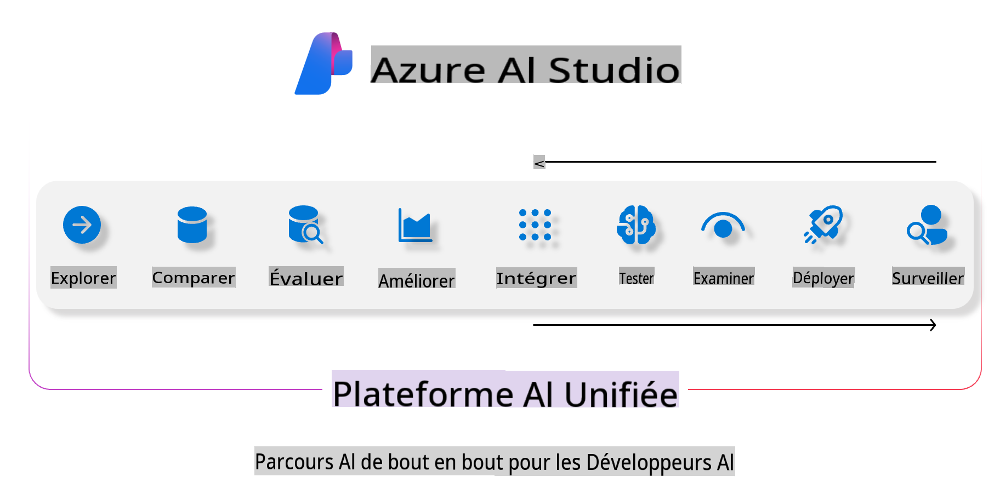
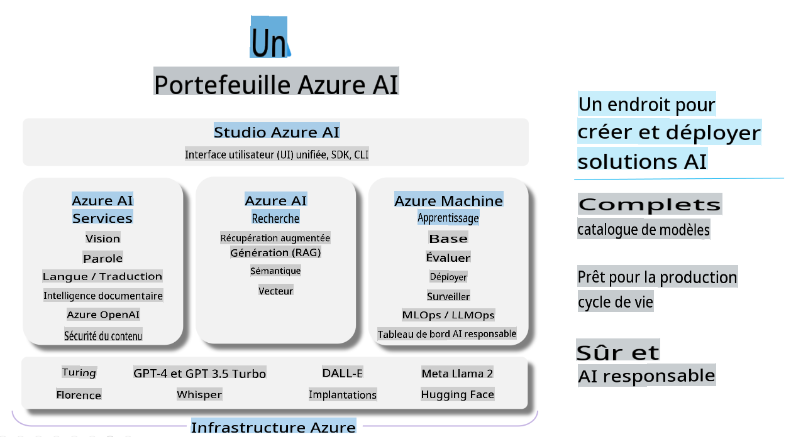

# **Utilisation d'Azure AI Studio pour l'évaluation**

Comment évaluer votre application d'IA générative en utilisant [Azure AI Studio](https://ai.azure.com?WT.mc_id=aiml-138114-kinfeylo). Que vous évaluiez des conversations à tour unique ou à tours multiples, Azure AI Studio propose des outils pour évaluer les performances et la sécurité du modèle.

## Comment évaluer des applications d'IA générative avec Azure AI Studio
Pour des instructions plus détaillées, consultez la [Documentation Azure AI Studio](https://learn.microsoft.com/azure/ai-studio/how-to/evaluate-generative-ai-app?WT.mc_id=aiml-138114-kinfeylo)

Voici les étapes pour commencer :

## Évaluation des modèles d'IA générative dans Azure AI Studio

**Prérequis**

- Un jeu de données de test au format CSV ou JSON.
- Un modèle d'IA générative déployé (tel que les modèles Phi-3, GPT 3.5, GPT 4, ou Davinci).
- Un environnement d'exécution avec une instance de calcul pour exécuter l'évaluation.

## Métriques d'évaluation intégrées

Azure AI Studio vous permet d'évaluer à la fois des conversations à tour unique et des conversations complexes à tours multiples.
Pour les scénarios de génération augmentée par récupération (RAG), où le modèle est basé sur des données spécifiques, vous pouvez évaluer les performances en utilisant des métriques d'évaluation intégrées.
De plus, vous pouvez évaluer des scénarios généraux de questions-réponses à tour unique (non-RAG).

## Création d'une exécution d'évaluation

Depuis l'interface utilisateur d'Azure AI Studio, accédez à la page Évaluer ou à la page Flux de demande.
Suivez l'assistant de création d'évaluation pour configurer une exécution d'évaluation. Donnez un nom optionnel à votre évaluation.
Sélectionnez le scénario qui correspond aux objectifs de votre application.
Choisissez une ou plusieurs métriques d'évaluation pour évaluer la sortie du modèle.

## Flux d'évaluation personnalisé (optionnel)

Pour plus de flexibilité, vous pouvez établir un flux d'évaluation personnalisé. Personnalisez le processus d'évaluation en fonction de vos besoins spécifiques.

## Visualisation des résultats

Après avoir exécuté l'évaluation, enregistrez, visualisez et analysez des métriques d'évaluation détaillées dans Azure AI Studio. Obtenez des insights sur les capacités et les limites de votre application.

**Note** Azure AI Studio est actuellement en préversion publique, donc utilisez-le à des fins d'expérimentation et de développement. Pour les charges de travail en production, envisagez d'autres options. Explorez la [documentation officielle d'AI Studio](https://learn.microsoft.com/azure/ai-studio/?WT.mc_id=aiml-138114-kinfeylo) pour plus de détails et des instructions étape par étape.

Avertissement : La traduction a été effectuée à partir de l'original par un modèle d'IA et peut ne pas être parfaite. 
Veuillez examiner le résultat et apporter les corrections nécessaires.