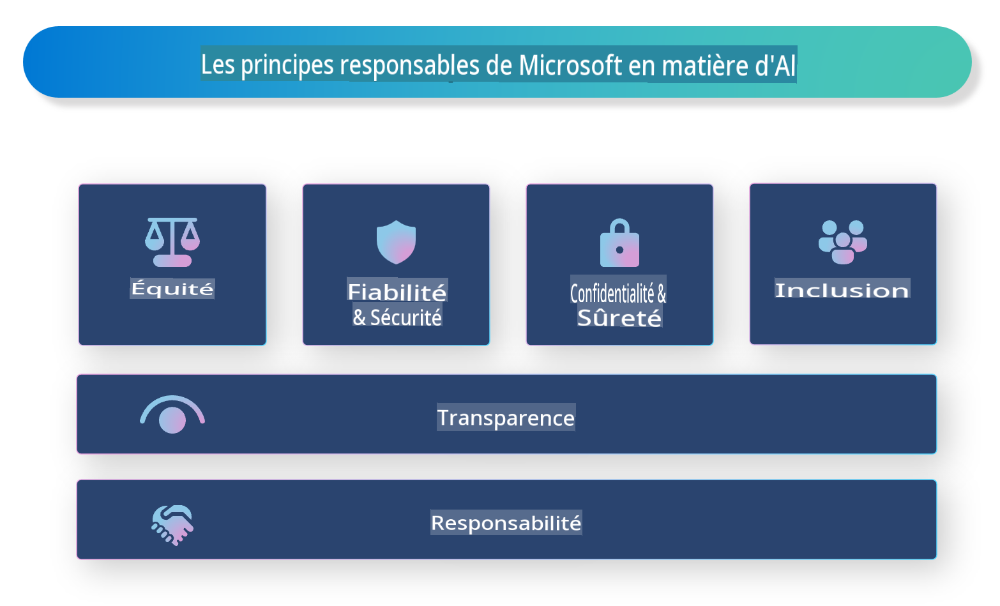

# **Introduction à l'IA Responsable**

[Microsoft Responsible AI](https://www.microsoft.com/ai/responsible-ai?WT.mc_id=aiml-138114-kinfeylo) est une initiative qui vise à aider les développeurs et les organisations à créer des systèmes d'IA transparents, fiables et responsables. L'initiative fournit des conseils et des ressources pour développer des solutions d'IA responsables alignées sur des principes éthiques, tels que la confidentialité, l'équité et la transparence. Nous explorerons également certains des défis et des meilleures pratiques associés à la création de systèmes d'IA responsables.

## Vue d'ensemble de Microsoft Responsible AI 

**Principes éthiques** 

Microsoft Responsible AI est guidé par un ensemble de principes éthiques, tels que la confidentialité, l'équité, la transparence, la responsabilité et la sécurité. Ces principes sont conçus pour garantir que les systèmes d'IA sont développés de manière éthique et responsable.

**IA transparente**

Microsoft Responsible AI met l'accent sur l'importance de la transparence dans les systèmes d'IA. Cela inclut de fournir des explications claires sur le fonctionnement des modèles d'IA, ainsi que de s'assurer que les sources de données et les algorithmes sont accessibles au public.

**IA responsable** 

[Microsoft Responsible AI](https://www.microsoft.com/ai/responsible-ai?WT.mc_id=aiml-138114-kinfeylo) promeut le développement de systèmes d'IA responsables, capables de fournir des informations sur la manière dont les modèles d'IA prennent des décisions. Cela peut aider les utilisateurs à comprendre et à faire confiance aux résultats des systèmes d'IA.

**Inclusivité** 

Les systèmes d'IA doivent être conçus pour bénéficier à tout le monde. Microsoft vise à créer une IA inclusive qui prend en compte des perspectives diverses et évite les biais ou la discrimination.

**Fiabilité et sécurité**

Assurer la fiabilité et la sécurité des systèmes d'IA est crucial. Microsoft se concentre sur la construction de modèles robustes qui fonctionnent de manière cohérente et évitent les résultats nuisibles.

**Équité dans l'IA** 

Microsoft Responsible AI reconnaît que les systèmes d'IA peuvent perpétuer des biais s'ils sont entraînés sur des données ou des algorithmes biaisés. L'initiative fournit des conseils pour développer des systèmes d'IA équitables qui ne discriminent pas en fonction de facteurs tels que la race, le genre ou l'âge.

**Confidentialité et sécurité** 

Microsoft Responsible AI souligne l'importance de protéger la confidentialité des utilisateurs et la sécurité des données dans les systèmes d'IA. Cela inclut la mise en œuvre d'un chiffrement fort des données et des contrôles d'accès, ainsi que l'audit régulier des systèmes d'IA pour détecter les vulnérabilités.

**Responsabilité et responsabilité** 

Microsoft Responsible AI promeut la responsabilité et la responsabilité dans le développement et le déploiement de l'IA. Cela inclut de s'assurer que les développeurs et les organisations sont conscients des risques potentiels associés aux systèmes d'IA et prennent des mesures pour atténuer ces risques.

## Meilleures pratiques pour construire des systèmes d'IA responsables

**Développer des modèles d'IA en utilisant des ensembles de données diversifiés** 

Pour éviter les biais dans les systèmes d'IA, il est important d'utiliser des ensembles de données diversifiés qui représentent une gamme de perspectives et d'expériences.

**Utiliser des techniques d'IA explicable** 

Les techniques d'IA explicable peuvent aider les utilisateurs à comprendre comment les modèles d'IA prennent des décisions, ce qui peut augmenter la confiance dans le système.

**Auditer régulièrement les systèmes d'IA pour détecter les vulnérabilités** 

Les audits réguliers des systèmes d'IA peuvent aider à identifier les risques et les vulnérabilités potentiels qui doivent être traités.

**Mettre en œuvre un chiffrement fort des données et des contrôles d'accès** 

Le chiffrement des données et les contrôles d'accès peuvent aider à protéger la confidentialité et la sécurité des utilisateurs dans les systèmes d'IA.

**Suivre des principes éthiques dans le développement de l'IA** 

Suivre des principes éthiques, tels que l'équité, la transparence et la responsabilité, peut aider à construire la confiance dans les systèmes d'IA et garantir qu'ils sont développés de manière responsable.

## Utiliser AI Studio pour une IA Responsable 

[Azure AI Studio](https://ai.azure.com?WT.mc_id=aiml-138114-kinfeylo) est une plateforme puissante qui permet aux développeurs et aux organisations de créer rapidement des applications intelligentes, de pointe, prêtes pour le marché et responsables. Voici quelques fonctionnalités clés et capacités d'Azure AI Studio :

**APIs et modèles prêts à l'emploi** 

Azure AI Studio fournit des APIs et des modèles pré-construits et personnalisables. Ceux-ci couvrent une large gamme de tâches d'IA, y compris l'IA générative, le traitement du langage naturel pour les conversations, la recherche, la surveillance, la traduction, la parole, la vision et la prise de décision.

**Prompt Flow** 

Le flux de prompts dans Azure AI Studio vous permet de créer des expériences d'IA conversationnelle. Il vous permet de concevoir et de gérer des flux conversationnels, facilitant ainsi la création de chatbots, d'assistants virtuels et d'autres applications interactives.

**Generation Augmentée par Récupération (RAG)** 

RAG est une technique qui combine des approches basées sur la récupération et la génération. Elle améliore la qualité des réponses générées en s'appuyant à la fois sur des connaissances préexistantes (récupération) et sur la génération créative (génération).

**Évaluation et surveillance des métriques pour l'IA générative** 

Azure AI Studio fournit des outils pour évaluer et surveiller les modèles d'IA générative. Vous pouvez évaluer leur performance, leur équité et d'autres métriques importantes pour garantir un déploiement responsable. De plus, si vous avez créé un tableau de bord, vous pouvez utiliser l'interface utilisateur sans code dans Azure Machine Learning Studio pour personnaliser et générer un tableau de bord d'IA Responsable et une fiche d'évaluation associée basée sur les bibliothèques Python du [Repsonsible AI Toolbox](https://responsibleaitoolbox.ai/?WT.mc_id=aiml-138114-kinfeylo). Cette fiche d'évaluation vous aide à partager des informations clés liées à l'équité, à l'importance des caractéristiques et à d'autres considérations de déploiement responsable avec des parties prenantes techniques et non techniques.

Pour utiliser AI Studio avec une IA responsable, vous pouvez suivre ces meilleures pratiques :

**Définir le problème et les objectifs de votre système d'IA**

Avant de commencer le processus de développement, il est important de définir clairement le problème ou l'objectif que votre système d'IA vise à résoudre. Cela vous aidera à identifier les données, les algorithmes et les ressources nécessaires pour construire un modèle efficace.

**Collecter et prétraiter les données pertinentes** 

La qualité et la quantité des données utilisées pour entraîner un système d'IA peuvent avoir un impact significatif sur ses performances. Par conséquent, il est important de collecter des données pertinentes, de les nettoyer, de les prétraiter et de s'assurer qu'elles sont représentatives de la population ou du problème que vous essayez de résoudre.

**Choisir une évaluation appropriée** 

Il existe divers algorithmes d'évaluation disponibles. Il est important de choisir l'algorithme le plus approprié en fonction de vos données et de votre problème.

**Évaluer et interpréter le modèle** 

Une fois que vous avez construit un modèle d'IA, il est important d'évaluer ses performances en utilisant des métriques appropriées et d'interpréter les résultats de manière transparente. Cela vous aidera à identifier les biais ou les limitations du modèle et à apporter des améliorations si nécessaire.

**Assurer la transparence et l'explicabilité** 

Les systèmes d'IA doivent être transparents et explicables afin que les utilisateurs puissent comprendre comment ils fonctionnent et comment les décisions sont prises. Cela est particulièrement important pour les applications ayant des impacts significatifs sur la vie humaine, telles que les soins de santé, les finances et les systèmes juridiques.

**Surveiller et mettre à jour le modèle** 

Les systèmes d'IA doivent être continuellement surveillés et mis à jour pour garantir qu'ils restent précis et efficaces au fil du temps. Cela nécessite une maintenance continue, des tests et une ré-formation du modèle.

En conclusion, Microsoft Responsible AI est une initiative qui vise à aider les développeurs et les organisations à créer des systèmes d'IA transparents, fiables et responsables. N'oubliez pas que la mise en œuvre d'une IA responsable est cruciale, et Azure AI Studio vise à la rendre pratique pour les organisations. En suivant des principes éthiques et des meilleures pratiques, nous pouvons garantir que les systèmes d'IA sont développés et déployés de manière responsable, au bénéfice de l'ensemble de la société.

Avertissement : La traduction a été effectuée à partir de l'original par un modèle d'IA et peut ne pas être parfaite. Veuillez examiner le résultat et apporter les corrections nécessaires.