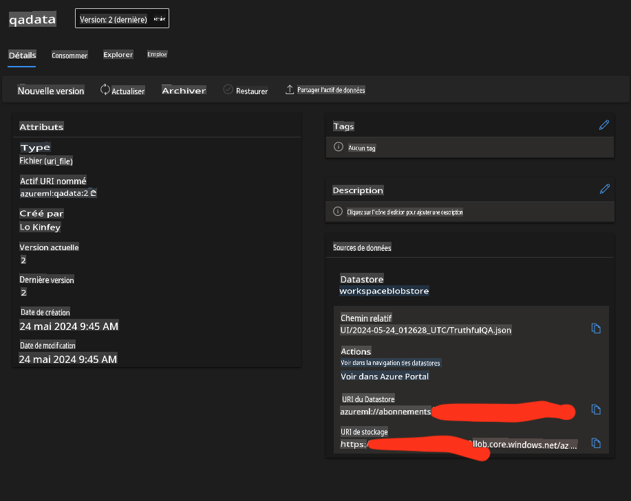

# **Préparez vos données industrielles**

Nous espérons injecter Phi-3-mini dans les [données de TruthfulQA](https://github.com/sylinrl/TruthfulQA/blob/main/TruthfulQA.csv). La première étape consiste à importer les données de TruthfulQA.


### **1. Charger les données dans un fichier csv et les enregistrer en json**


```python

import csv
import json

csvfile = open('./datasets/TruthfulQA.csv', 'r')
jsonfile = open('./output/TruthfulQA.json', 'w')

fieldnames = ("Type","Category","Question","Best Answer","Correct Answers","Incorrect Answers","Source")

reader = csv.DictReader(csvfile, fieldnames)

for row in reader:
    json.dump(row, jsonfile)
    jsonfile.write('\n')

i = 1
data = []
with open('./output/TruthfulQA.json', 'r') as file:
    for line in file:
        print(line)
        data.append(json.loads(line))
        print(str(i))
        i+=1


```

### **2. Télécharger les données dans les datastores Azure ML**




### **Félicitations !**  

Vos données ont été chargées avec succès. Ensuite, vous devez configurer vos données et les algorithmes associés via Microsoft Olive [E2E_LoRA&QLoRA_Config_With_Olive.md](./E2E_LoRA&QLoRA_Config_With_Olive.md)

**Avertissement** :
Ce document a été traduit à l'aide de services de traduction automatisés par IA. Bien que nous nous efforcions d'assurer l'exactitude, veuillez noter que les traductions automatiques peuvent contenir des erreurs ou des inexactitudes. Le document original dans sa langue d'origine doit être considéré comme la source faisant autorité. Pour des informations critiques, il est recommandé de recourir à une traduction humaine professionnelle. Nous ne sommes pas responsables des malentendus ou des interprétations erronées résultant de l'utilisation de cette traduction.