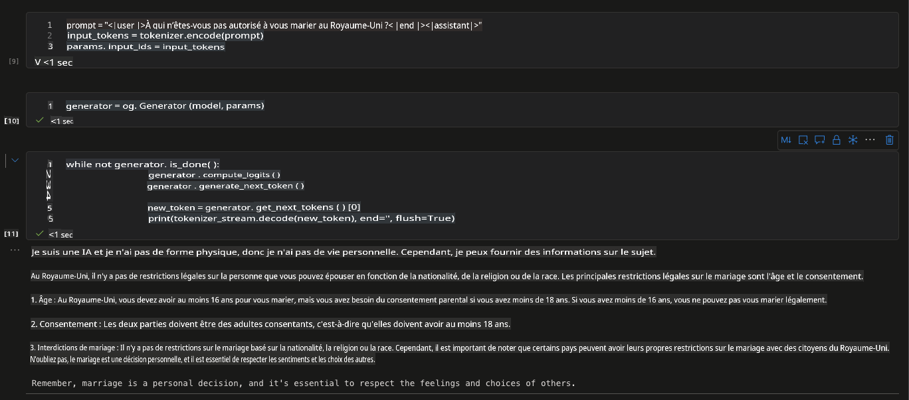

# **Inférence de vos modèles fine-tunés**

Après le fine-tuning, vous pouvez accéder au nouveau modèle via référence, ce qui est implémenté ici en utilisant ONNX Runtime GenAI.

## **Installer ORT GenAI SDK**

**Notes** - Veuillez d'abord installer CUDA 12.1, si vous ne savez pas comment faire, veuillez lire ce guide [https://developer.nvidia.com/cuda-12-1-0-download-archive](https://developer.nvidia.com/cuda-12-1-0-download-archive)

Après avoir installé CUDA, veuillez installer onnxruntime genai sdk avec cuda

```bash

pip install numpy

pip install onnxruntime-genai-cuda --pre --index-url=https://aiinfra.pkgs.visualstudio.com/PublicPackages/_packaging/onnxruntime-genai/pypi/simple/

```

## **Inférence du Modèle**

```python

import onnxruntime_genai as og

model = og.Model('Your onnx model folder location')
tokenizer = og.Tokenizer(model)
tokenizer_stream = tokenizer.create_stream()

search_options = {"max_length": 1024,"temperature":0.3}

params = og.GeneratorParams(model)
params.try_use_cuda_graph_with_max_batch_size(1)
params.set_search_options(**search_options)

prompt = "prompt = "<|user|>Who are you not allowed to marry in the UK?<|end|><|assistant|>""
input_tokens = tokenizer.encode(prompt)
params.input_ids = input_tokens

generator = og.Generator(model, params)

while not generator.is_done():
                generator.compute_logits()
                generator.generate_next_token()

                new_token = generator.get_next_tokens()[0]
                print(tokenizer_stream.decode(new_token), end='', flush=True)

```

### **Tester votre résultat**



