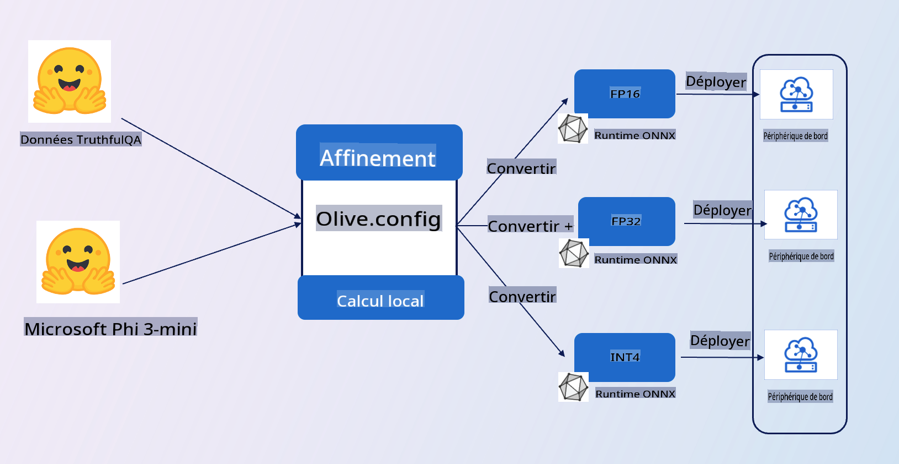

# **Présentation de l'exemple E2E**

Cet exemple importe les données de [TruthfulQA](https://github.com/sylinrl/TruthfulQA/blob/main/TruthfulQA.csv) pour affiner le modèle Phi-3-mini. Voici l'architecture

## **Présentation**

Nous espérons utiliser l'ensemble de données de [TruthfulQA](https://github.com/sylinrl/TruthfulQA/blob/main/TruthfulQA.csv) pour que Phi-3-mini réponde à nos questions de manière plus professionnelle. C'est votre premier projet E2E utilisant Phi-3-mini

### **Exigences**

1. Python 3.10+
2. CUDA 12.1
3. Linux / WSL
4. Azure ML
5. Azure Compute A100

### **Connaissances**

1. [En savoir plus sur Phi-3](../01.Introduce/Phi3Family.md)
2. [Apprendre à utiliser Microsoft Olive pour l'affinage](../04.Fine-tuning/FineTuning_MicrosoftOlive.md)
3. [En savoir plus sur ONNX Runtime pour l'IA générative](https://github.com/microsoft/onnxruntime-genai)

**Avertissement**:
Ce document a été traduit en utilisant des services de traduction automatisée par intelligence artificielle. Bien que nous nous efforcions d'assurer l'exactitude, veuillez noter que les traductions automatisées peuvent contenir des erreurs ou des inexactitudes. Le document original dans sa langue d'origine doit être considéré comme la source faisant autorité. Pour des informations critiques, une traduction humaine professionnelle est recommandée. Nous ne sommes pas responsables des malentendus ou des interprétations erronées résultant de l'utilisation de cette traduction.