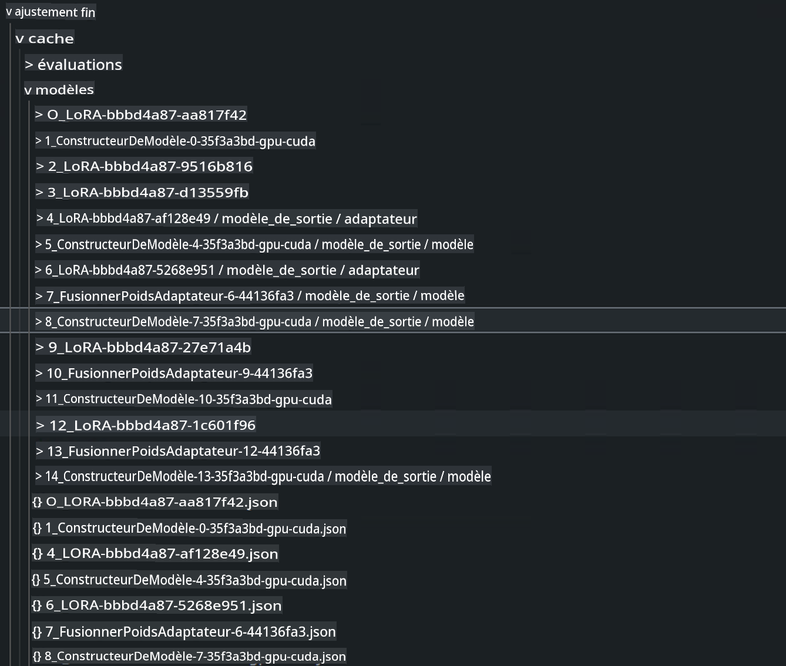
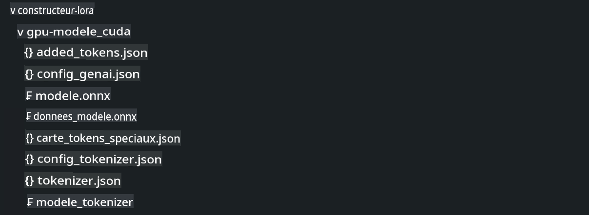

# **Utilisez Microsoft Olive pour architecturer vos projets**

Si une entreprise souhaite avoir son propre modèle vertical industriel, elle doit commencer par les données, le réglage fin et le déploiement. Dans le contenu précédent, nous avons introduit le contenu de Microsoft Olive, et nous complétons maintenant une introduction plus détaillée basée sur le travail de E2E.

## **Architecture**

Nous pouvons nous référer aux projets générés par AI Toolkit pour VS Code pour structurer nos projets, y compris les données, les modèles, les formats affinés et les inférences, comme par exemple :

```txt

｜-- Your Phi-3-mini E2E Proj
    ｜-- datasets
    ｜-- fine-tuning
    ｜-- inferences
    ｜-- model-cache
    ｜-- gen-model
    ｜-- setup
     

```

- **datasets**

    Les données peuvent être stockées dans des fichiers csv, json et autres. Dans cet exemple, il s'agit des données json exportées. [dataset](./E2E_Datasets.md) 

    ***Note*** Nous pouvons ignorer les paramètres pertinents ici car les données ont déjà été téléchargées sur Azure ML (si elles sont locales, nous pouvons télécharger les données ici)

- **fine-tuning**
    
    Spécifiez les algorithmes de réglage fin QLoRA et LoRA, et les paramètres associés.

- **inferences**

    L'inférence est le modèle après réglage fin. Il peut s'agir d'une référence à la couche d'adaptateur affinée, d'une référence au modèle intégré avec l'adaptateur après réglage fin, ou il peut s'agir d'un modèle quantifié ONNX Runtime.

- **model-cache**

    Modèles téléchargés via Hugging face CLI, ici c'est le modèle Phi-3-Mini (en utilisant Azure ML, nous pouvons ignorer ce contenu, si vous souhaitez opérer localement, veuillez exécuter le script suivant pour obtenir le modèle phi-3)


```bash

huggingface-cli login

# input your key from Hugging Face Portal

huggingface-cli download microsoft/Phi-3-mini-4k-instruct --local-dir Your Phi-3-mini location

```

- **gen-model**

Le modèle enregistré après l'opération comprend le modèle d'adaptateur affiné, le modèle d'adaptateur affiné intégré et le modèle quantitatif exécuté par ONNX Runtime.

- **setup**

Environnement d'installation requis, veuillez exécuter ceci pour configurer votre environnement Olive


```bash

pip install -r requirements.txt

```

## **Configuration de Microsoft Olive**

Si vous souhaitez en savoir plus sur la configuration de Microsoft Olive, veuillez visiter [Fine Tuning with Microsoft Olive](../04.Fine-tuning/FineTuning_MicrosoftOlive.md)

***Note*** Pour rester à jour, installez Microsoft Olive en utilisant


```bash

pip install git+https://github.com/microsoft/Olive

```

## **Exécution de Microsoft Olive dans Azure ML**

**LoRA**

Cet exemple utilise le calcul en cloud, les ensembles de données en cloud, ajoutez olive.config dans le dossier de réglage fin


```json

{
    "azureml_client": {
        "subscription_id": "Your Azure Subscription ID",
        "resource_group": "Your Azure Resource Group",
        "workspace_name": "Your Azure ML Worksapce",
        "keyvault_name":  "Your Azure Key Valuts"
    },
    "input_model":{
        "type": "PyTorchModel",
        "config": {
            "hf_config": {
                "model_name": "microsoft/Phi-3-mini-4k-instruct",
                "task": "text-generation",
                "from_pretrained_args": {
                    "trust_remote_code": true
                }
            }
        }
    },
    "systems": {
        "aml": {
            "type": "AzureML",
            "config": {
                "accelerators": [
                    {
                        "device": "gpu",
                        "execution_providers": [
                            "CUDAExecutionProvider"
                        ]
                    }
                ],
                "hf_token": true,
                "aml_compute": "Your Azure ML Compute Cluster",
                "aml_docker_config": {
                    "base_image": "mcr.microsoft.com/azureml/openmpi4.1.0-cuda11.8-cudnn8-ubuntu22.04",
                    "conda_file_path": "conda.yaml"
                }
            }
        },
        "azure_arc": {
            "type": "AzureML",
            "config": {
                "accelerators": [
                    {
                        "device": "gpu",
                        "execution_providers": [
                            "CUDAExecutionProvider"
                        ]
                    }
                ],
                "aml_compute": "Your Azure ML Compute",
                "aml_docker_config": {
                    "base_image": "mcr.microsoft.com/azureml/openmpi4.1.0-cuda11.8-cudnn8-ubuntu22.04",
                    "conda_file_path": "conda.yaml"
                }
            }
        }
    },
    "data_configs": [
        {
            "name": "dataset_default_train",
            "type": "HuggingfaceContainer",
            "load_dataset_config": {
                "params": {
                    "data_name": "json", 
                    "data_files": {
                        "type": "azureml_datastore",
                        "config": {
                            "azureml_client": {
                                "subscription_id": "Your Azure Subscrition ID",
                                "resource_group": "Your Azure Resource Group",
                                "workspace_name": "Your Azure ML Workspaces name"
                            },
                            "datastore_name": "workspaceblobstore",
                            "relative_path": "Your train_data.json Azure ML Location"
                        }
                    },
                    "split": "train"
                }
            },
            "pre_process_data_config": {
                "params": {
                    "dataset_type": "corpus",
                    "text_cols": [
                            "Question",
                            "Best Answer"
                    ],
                    "text_template": "<|user|>\n{Question}<|end|>\n<|assistant|>\n{Best Answer}\n<|end|>",
                    "corpus_strategy": "join",
                    "source_max_len": 2048,
                    "pad_to_max_len": false,
                    "use_attention_mask": false
                }
            }
        }
    ],
    "passes": {
        "lora": {
            "type": "LoRA",
            "config": {
                "target_modules": [
                    "o_proj",
                    "qkv_proj"
                ],
                "double_quant": true,
                "lora_r": 64,
                "lora_alpha": 64,
                "lora_dropout": 0.1,
                "train_data_config": "dataset_default_train",
                "eval_dataset_size": 0.1,
                "training_args": {
                    "seed": 0,
                    "data_seed": 42,
                    "per_device_train_batch_size": 1,
                    "per_device_eval_batch_size": 1,
                    "gradient_accumulation_steps": 4,
                    "gradient_checkpointing": false,
                    "learning_rate": 0.0001,
                    "num_train_epochs": 1000,
                    "max_steps": 100,
                    "logging_steps": 100,
                    "evaluation_strategy": "steps",
                    "eval_steps": 187,
                    "group_by_length": true,
                    "adam_beta2": 0.999,
                    "max_grad_norm": 0.3
                }
            }
        },
        "merge_adapter_weights": {
            "type": "MergeAdapterWeights"
        },
        "builder": {
            "type": "ModelBuilder",
            "config": {
                "precision": "int4"
            }
        }
    },
    "engine": {
        "log_severity_level": 0,
        "host": "aml",
        "target": "aml",
        "search_strategy": false,
        "cache_dir": "cache",
        "output_dir" : "../model-cache/models/phi3-finetuned"
    }
}


```


**QLoRA**


```json

{
    "azureml_client": {
        "subscription_id": "Your Azure Subscription ID",
        "resource_group": "Your Azure Resource Group",
        "workspace_name": "Your Azure ML Worksapce",
        "keyvault_name":  "Your Azure Key Valuts"
    },
    "input_model":{
        "type": "PyTorchModel",
        "config": {
            "hf_config": {
                "model_name": "microsoft/Phi-3-mini-4k-instruct",
                "task": "text-generation",
                "from_pretrained_args": {
                    "trust_remote_code": true
                }
            }
        }
    },
    "systems": {
        "aml": {
            "type": "AzureML",
            "config": {
                "accelerators": [
                    {
                        "device": "gpu",
                        "execution_providers": [
                            "CUDAExecutionProvider"
                        ]
                    }
                ],
                "hf_token": true,
                "aml_compute": "Your Azure ML Compute Cluster",
                "aml_docker_config": {
                    "base_image": "mcr.microsoft.com/azureml/openmpi4.1.0-cuda11.8-cudnn8-ubuntu22.04",
                    "conda_file_path": "conda.yaml"
                }
            }
        },
        "azure_arc": {
            "type": "AzureML",
            "config": {
                "accelerators": [
                    {
                        "device": "gpu",
                        "execution_providers": [
                            "CUDAExecutionProvider"
                        ]
                    }
                ],
                "aml_compute": "Your Azure ML Compute",
                "aml_docker_config": {
                    "base_image": "mcr.microsoft.com/azureml/openmpi4.1.0-cuda11.8-cudnn8-ubuntu22.04",
                    "conda_file_path": "conda.yaml"
                }
            }
        }
    },
    "data_configs": [
        {
            "name": "dataset_default_train",
            "type": "HuggingfaceContainer",
            "load_dataset_config": {
                "params": {
                    "data_name": "json", 
                    "data_files": {
                        "type": "azureml_datastore",
                        "config": {
                            "azureml_client": {
                                "subscription_id": "Your Azure Subscrition ID",
                                "resource_group": "Your Azure Resource Group",
                                "workspace_name": "Your Azure ML Workspaces name"
                            },
                            "datastore_name": "workspaceblobstore",
                            "relative_path": "Your train_data.json Azure ML Location"
                        }
                    },
                    "split": "train"
                }
            },
            "pre_process_data_config": {
                "params": {
                    "dataset_type": "corpus",
                    "text_cols": [
                            "Question",
                            "Best Answer"
                    ],
                    "text_template": "<|user|>\n{Question}<|end|>\n<|assistant|>\n{Best Answer}\n<|end|>",
                    "corpus_strategy": "join",
                    "source_max_len": 2048,
                    "pad_to_max_len": false,
                    "use_attention_mask": false
                }
            }
        }
    ],
    "passes": {
        "qlora": {
            "type": "QLoRA",
            "config": {
                "compute_dtype": "bfloat16",
                "quant_type": "nf4",
                "double_quant": true,
                "lora_r": 64,
                "lora_alpha": 64,
                "lora_dropout": 0.1,
                "train_data_config": "dataset_default_train",
                "eval_dataset_size": 0.3,
                "training_args": {
                    "seed": 0,
                    "data_seed": 42,
                    "per_device_train_batch_size": 1,
                    "per_device_eval_batch_size": 1,
                    "gradient_accumulation_steps": 4,
                    "gradient_checkpointing": false,
                    "learning_rate": 0.0001,
                    "num_train_epochs": 3,
                    "max_steps": 10,
                    "logging_steps": 10,
                    "evaluation_strategy": "steps",
                    "eval_steps": 187,
                    "group_by_length": true,
                    "adam_beta2": 0.999,
                    "max_grad_norm": 0.3
                }
            }
        },
        "merge_adapter_weights": {
            "type": "MergeAdapterWeights"
        }
    },
    "engine": {
        "log_severity_level": 0,
        "host": "aml",
        "target": "aml",
        "search_strategy": false,
        "cache_dir": "cache",
        "output_dir" : "../model-cache/models/phi3-finetuned"
    }
}


```

***Remarque*** 

- Si vous utilisez QLoRA, la conversion de quantification d'ONNXRuntime-genai n'est pas encore supportée.

- Il convient de souligner ici que vous pouvez configurer les étapes ci-dessus selon vos propres besoins. Il n'est pas nécessaire de configurer complètement les étapes ci-dessus. Selon vos besoins, vous pouvez directement utiliser les étapes de l'algorithme sans réglage fin. Enfin, vous devez configurer les moteurs pertinents.

### **Exécution de Microsoft Olive**

Après avoir terminé Microsoft Olive, vous devez exécuter cette commande dans le terminal 


```bash

olive run --config olive-config.json  

```

***Remarque*** 

1. Lorsque Microsoft Olive est exécuté, chaque étape peut être placée dans le cache. Nous pouvons consulter les résultats des étapes pertinentes en visualisant le répertoire de réglage fin.



2. Nous fournissons ici à la fois LoRA et QLoRA, et vous pouvez les configurer selon vos besoins.

3. L'environnement d'exécution recommandé est WSL / Ubuntu 22.04+.

4. Pourquoi choisir ORT ? Parce que ORT peut être déployé sur des dispositifs périphériques, l'inférence est mise en œuvre dans l'environnement ORT.



**Avertissement** :
Ce document a été traduit à l'aide de services de traduction automatisés basés sur l'IA. Bien que nous nous efforcions d'assurer l'exactitude, veuillez noter que les traductions automatisées peuvent contenir des erreurs ou des inexactitudes. Le document original dans sa langue d'origine doit être considéré comme la source faisant autorité. Pour des informations critiques, une traduction humaine professionnelle est recommandée. Nous ne sommes pas responsables des malentendus ou des interprétations erronées résultant de l'utilisation de cette traduction.