# Affiner et Intégrer des modèles Phi-3 personnalisés avec Prompt Flow dans Azure AI Foundry

Cet exemple de bout en bout (E2E) est basé sur le guide "[Fine-Tune and Integrate Custom Phi-3 Models with Prompt Flow in Azure AI Foundry](https://techcommunity.microsoft.com/t5/educator-developer-blog/fine-tune-and-integrate-custom-phi-3-models-with-prompt-flow-in/ba-p/4191726?WT.mc_id=aiml-137032-kinfeylo)" de la communauté technique de Microsoft. Il présente les processus d'affinement, de déploiement et d'intégration de modèles Phi-3 personnalisés avec Prompt Flow dans Azure AI Foundry.
Contrairement à l'exemple E2E, "[Fine-Tune and Integrate Custom Phi-3 Models with Prompt Flow](./E2E_Phi-3-FineTuning_PromptFlow_Integration.md)", qui impliquait l'exécution de code localement, ce tutoriel se concentre entièrement sur l'affinement et l'intégration de votre modèle dans Azure AI / ML Studio.

## Vue d'ensemble

Dans cet exemple E2E, vous apprendrez à affiner le modèle Phi-3 et à l'intégrer avec Prompt Flow dans Azure AI Foundry. En tirant parti d'Azure AI / ML Studio, vous établirez un flux de travail pour déployer et utiliser des modèles d'IA personnalisés. Cet exemple E2E est divisé en trois scénarios :

**Scénario 1 : Configurer les ressources Azure et se préparer à l'affinement**

**Scénario 2 : Affiner le modèle Phi-3 et le déployer dans Azure Machine Learning Studio**

**Scénario 3 : Intégrer avec Prompt Flow et discuter avec votre modèle personnalisé dans Azure AI Foundry**

Voici un aperçu de cet exemple E2E.

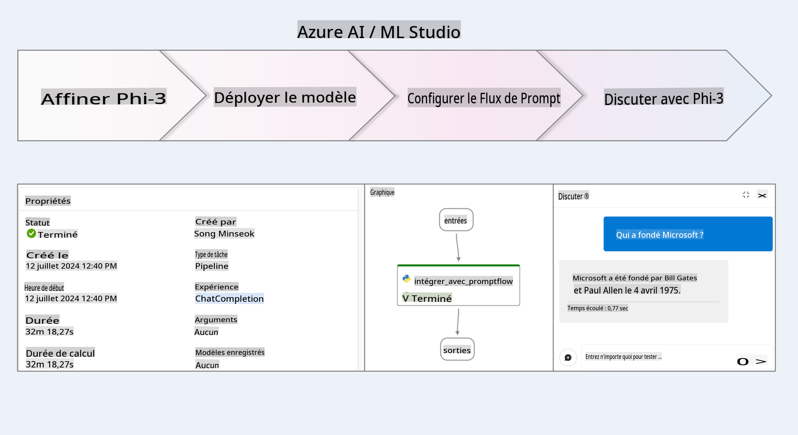

### Table des matières

1. **[Scénario 1 : Configurer les ressources Azure et se préparer à l'affinement](../../../../md/06.E2ESamples)**
    - [Créer un espace de travail Azure Machine Learning](../../../../md/06.E2ESamples)
    - [Demander des quotas GPU dans l'abonnement Azure](../../../../md/06.E2ESamples)
    - [Ajouter une affectation de rôle](../../../../md/06.E2ESamples)
    - [Configurer le projet](../../../../md/06.E2ESamples)
    - [Préparer le jeu de données pour l'affinement](../../../../md/06.E2ESamples)

1. **[Scénario 2 : Affiner le modèle Phi-3 et le déployer dans Azure Machine Learning Studio](../../../../md/06.E2ESamples)**
    - [Affiner le modèle Phi-3](../../../../md/06.E2ESamples)
    - [Déployer le modèle Phi-3 affiné](../../../../md/06.E2ESamples)

1. **[Scénario 3 : Intégrer avec Prompt Flow et discuter avec votre modèle personnalisé dans Azure AI Foundry](../../../../md/06.E2ESamples)**
    - [Intégrer le modèle Phi-3 personnalisé avec Prompt Flow](../../../../md/06.E2ESamples)
    - [Discuter avec votre modèle Phi-3 personnalisé](../../../../md/06.E2ESamples)

## Scénario 1 : Configurer les ressources Azure et se préparer à l'affinement

### Créer un espace de travail Azure Machine Learning

1. Tapez *azure machine learning* dans la **barre de recherche** en haut de la page du portail et sélectionnez **Azure Machine Learning** parmi les options qui apparaissent.

    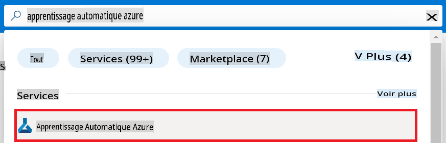

2. Sélectionnez **+ Créer** dans le menu de navigation.

3. Sélectionnez **Nouvel espace de travail** dans le menu de navigation.

    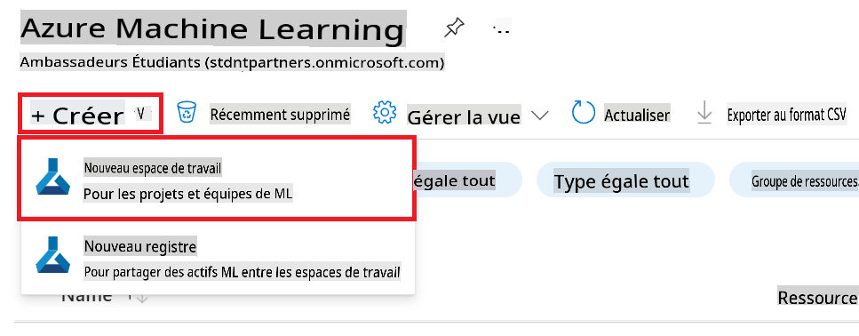

4. Effectuez les tâches suivantes :

    - Sélectionnez votre **Abonnement** Azure.
    - Sélectionnez le **Groupe de ressources** à utiliser (créez-en un nouveau si nécessaire).
    - Entrez le **Nom de l'espace de travail**. Il doit être unique.
    - Sélectionnez la **Région** que vous souhaitez utiliser.
    - Sélectionnez le **Compte de stockage** à utiliser (créez-en un nouveau si nécessaire).
    - Sélectionnez le **Key vault** à utiliser (créez-en un nouveau si nécessaire).
    - Sélectionnez les **Application insights** à utiliser (créez-en un nouveau si nécessaire).
    - Sélectionnez le **Registre de conteneurs** à utiliser (créez-en un nouveau si nécessaire).

    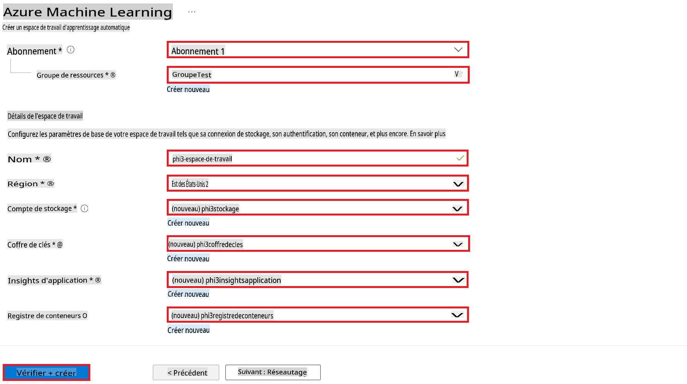

5. Sélectionnez **Vérifier + Créer**.

6. Sélectionnez **Créer**.

### Demander des quotas GPU dans l'abonnement Azure

Dans ce tutoriel, vous apprendrez à affiner et déployer un modèle Phi-3 en utilisant des GPU. Pour l'affinement, vous utiliserez le GPU *Standard_NC24ads_A100_v4*, qui nécessite une demande de quota. Pour le déploiement, vous utiliserez le GPU *Standard_NC6s_v3*, qui nécessite également une demande de quota.

> [!NOTE]
>
> Seuls les abonnements Pay-As-You-Go (le type d'abonnement standard) sont éligibles pour l'allocation de GPU ; les abonnements avantage ne sont actuellement pas pris en charge.
>

1. Visitez [Azure ML Studio](https://ml.azure.com/home?wt.mc_id=studentamb_279723).

1. Effectuez les tâches suivantes pour demander un quota *Standard NCADSA100v4 Family* :

    - Sélectionnez **Quota** dans l'onglet de gauche.
    - Sélectionnez la **famille de machines virtuelles** à utiliser. Par exemple, sélectionnez **Standard NCADSA100v4 Family Cluster Dedicated vCPUs**, qui inclut le GPU *Standard_NC24ads_A100_v4*.
    - Sélectionnez **Demander un quota** dans le menu de navigation.

        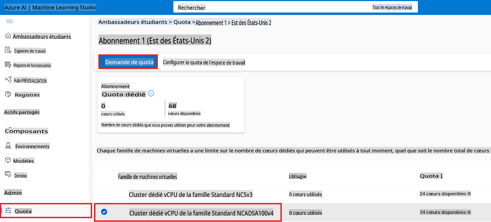

    - Dans la page de demande de quota, entrez la **Nouvelle limite de cœurs** que vous souhaitez utiliser. Par exemple, 24.
    - Dans la page de demande de quota, sélectionnez **Soumettre** pour demander le quota GPU.

1. Effectuez les tâches suivantes pour demander un quota *Standard NCSv3 Family* :

    - Sélectionnez **Quota** dans l'onglet de gauche.
    - Sélectionnez la **famille de machines virtuelles** à utiliser. Par exemple, sélectionnez **Standard NCSv3 Family Cluster Dedicated vCPUs**, qui inclut le GPU *Standard_NC6s_v3*.
    - Sélectionnez **Demander un quota** dans le menu de navigation.
    - Dans la page de demande de quota, entrez la **Nouvelle limite de cœurs** que vous souhaitez utiliser. Par exemple, 24.
    - Dans la page de demande de quota, sélectionnez **Soumettre** pour demander le quota GPU.

### Ajouter une affectation de rôle

Pour affiner et déployer vos modèles, vous devez d'abord créer une identité managée assignée par l'utilisateur (UAI) et lui attribuer les autorisations appropriées. Cette UAI sera utilisée pour l'authentification pendant le déploiement.

#### Créer une identité managée assignée par l'utilisateur (UAI)

1. Tapez *managed identities* dans la **barre de recherche** en haut de la page du portail et sélectionnez **Identités managées** parmi les options qui apparaissent.

    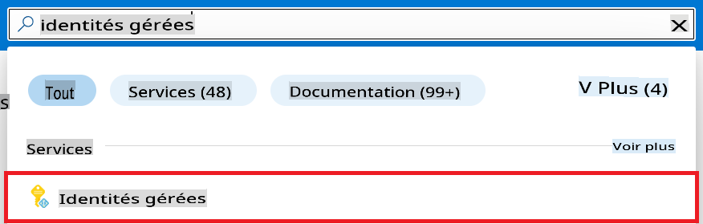

1. Sélectionnez **+ Créer**.

    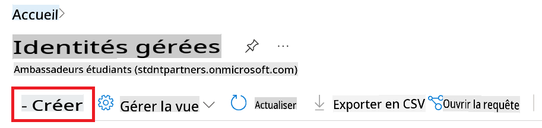

1. Effectuez les tâches suivantes :

    - Sélectionnez votre **Abonnement** Azure.
    - Sélectionnez le **Groupe de ressources** à utiliser (créez-en un nouveau si nécessaire).
    - Sélectionnez la **Région** que vous souhaitez utiliser.
    - Entrez le **Nom**. Il doit être unique.

    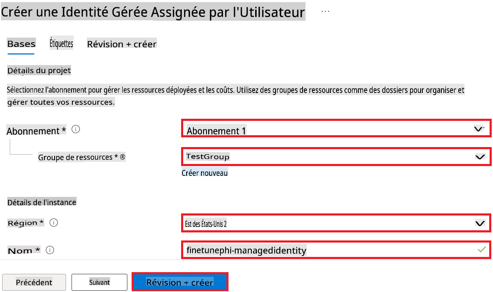

1. Sélectionnez **Vérifier + créer**.

1. Sélectionnez **+ Créer**.

#### Ajouter une affectation de rôle de contributeur à l'identité managée

1. Accédez à la ressource d'identité managée que vous avez créée.

1. Sélectionnez **Affectations de rôle Azure** dans l'onglet de gauche.

1. Sélectionnez **+ Ajouter une affectation de rôle** dans le menu de navigation.

1. Dans la page Ajouter une affectation de rôle, effectuez les tâches suivantes :
    - Sélectionnez la **Portée** pour **Groupe de ressources**.
    - Sélectionnez votre **Abonnement** Azure.
    - Sélectionnez le **Groupe de ressources** à utiliser.
    - Sélectionnez le **Rôle** pour **Contributeur**.

    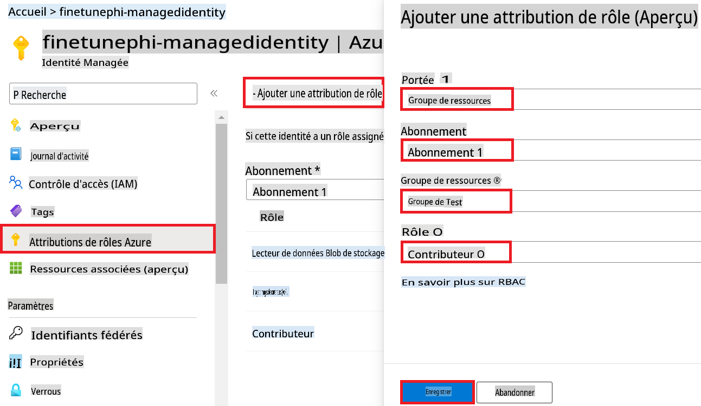

1. Sélectionnez **Enregistrer**.

#### Ajouter une affectation de rôle de lecteur de données de blob de stockage à l'identité managée

1. Tapez *storage accounts* dans la **barre de recherche** en haut de la page du portail et sélectionnez **Comptes de stockage** parmi les options qui apparaissent.

    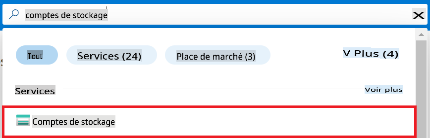

1. Sélectionnez le compte de stockage associé à l'espace de travail Azure Machine Learning que vous avez créé. Par exemple, *finetunephistorage*.

1. Effectuez les tâches suivantes pour accéder à la page Ajouter une affectation de rôle :

    - Accédez au compte de stockage Azure que vous avez créé.
    - Sélectionnez **Contrôle d'accès (IAM)** dans l'onglet de gauche.
    - Sélectionnez **+ Ajouter** dans le menu de navigation.
    - Sélectionnez **Ajouter une affectation de rôle** dans le menu de navigation.

    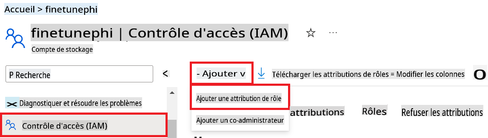

1. Dans la page Ajouter une affectation de rôle, effectuez les tâches suivantes :

    - Dans la page Rôle, tapez *Storage Blob Data Reader* dans la **barre de recherche** et sélectionnez **Storage Blob Data Reader** parmi les options qui apparaissent.
    - Dans la page Rôle, sélectionnez **Suivant**.
    - Dans la page Membres, sélectionnez **Attribuer l'accès à** **Identité managée**.
    - Dans la page Membres, sélectionnez **+ Sélectionner les membres**.
    - Dans la page Sélectionner les identités managées, sélectionnez votre **Abonnement** Azure.
    - Dans la page Sélectionner les identités managées, sélectionnez l'**Identité managée** pour **Manage Identity**.
    - Dans la page Sélectionner les identités managées, sélectionnez l'identité managée que vous avez créée. Par exemple, *finetunephi-managedidentity*.
    - Dans la page Sélectionner les identités managées, sélectionnez **Sélectionner**.

    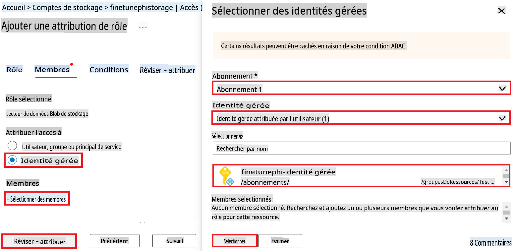

1. Sélectionnez **Vérifier + attribuer**.

#### Ajouter une affectation de rôle AcrPull à l'identité managée

1. Tapez *container registries* dans la **barre de recherche** en haut de la page du portail et sélectionnez **Registres de conteneurs** parmi les options qui apparaissent.

    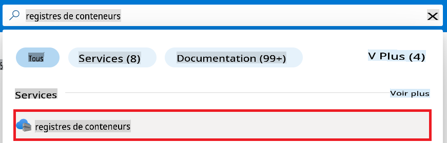

1. Sélectionnez le registre de conteneurs associé à l'espace de travail Azure Machine Learning. Par exemple, *finetunephicontainerregistry*

1. Effectuez les tâches suivantes pour accéder à la page Ajouter une affectation de rôle :

    - Sélectionnez **Contrôle d'accès (IAM)** dans l'onglet de gauche.
    - Sélectionnez **+ Ajouter** dans le menu de navigation.
    - Sélectionnez **Ajouter une affectation de rôle** dans le menu de navigation.

1. Dans la page Ajouter une affectation de rôle, effectuez les tâches suivantes :

    - Dans la page Rôle, tapez *AcrPull* dans la **barre de recherche** et sélectionnez **AcrPull** parmi les options qui apparaissent.
    - Dans la page Rôle, sélectionnez **Suivant**.
    - Dans la page Membres, sélectionnez **Attribuer l'accès à** **Identité managée**.
    - Dans la page Membres, sélectionnez **+ Sélectionner les membres**.
    - Dans la page Sélectionner les identités managées, sélectionnez votre **Abonnement** Azure.
    - Dans la page Sélectionner les identités managées, sélectionnez l'**Identité managée** pour **Manage Identity**.
    - Dans la page Sélectionner les identités managées, sélectionnez l'identité managée que vous avez créée. Par exemple, *finetunephi-managedidentity*.
    - Dans la page Sélectionner les identités managées, sélectionnez **Sélectionner**.
    - Sélectionnez **Vérifier + attribuer**.

### Configurer le projet

Pour télécharger les jeux de données nécessaires à l'affinement, vous allez configurer un environnement local.

Dans cet exercice, vous allez :

- Créer un dossier pour travailler dedans.
- Créer un environnement virtuel.
- Installer les packages requis.
- Créer un fichier *download_dataset.py* pour télécharger le jeu de données.

#### Créer un dossier pour travailler dedans

1. Ouvrez une fenêtre de terminal et tapez la commande suivante pour créer un dossier nommé *finetune-phi* dans le chemin par défaut.

    ```console
    mkdir finetune-phi
    ```

2. Tapez la commande suivante dans votre terminal pour naviguer vers le dossier *finetune-phi* que vous avez créé.

    ```console
    cd finetune-phi
    ```

#### Créer un environnement virtuel

1. Tapez la commande suivante dans votre terminal pour créer un environnement virtuel nommé *.venv*.

    ```console
    python -m venv .venv
    ```

2. Tapez la commande suivante dans votre terminal pour activer l'environnement virtuel.

    ```console
    .venv\Scripts\activate.bat
    ```

> [!NOTE]
> Si cela a fonctionné, vous devriez voir *(.venv)* avant l'invite de commande.

#### Installer les packages requis

1. Tapez les commandes suivantes dans votre terminal pour installer les packages requis.

    ```console
    pip install datasets==2.19.1
    ```

#### Créer `download_dataset.py`

> [!NOTE]
> Structure complète des dossiers :
>
> ```text
> └── YourUserName
> .    └── finetune-phi
> .        └── download_dataset.py
> ```

1. Ouvrez **Visual Studio Code**.

1. Sélectionnez **Fichier** dans la barre de menu.

1. Sélectionnez **Ouvrir le dossier**.

1. Sélectionnez le dossier *finetune-phi* que vous avez créé, qui se trouve à *C:\Users\yourUserName\finetune-phi*.

    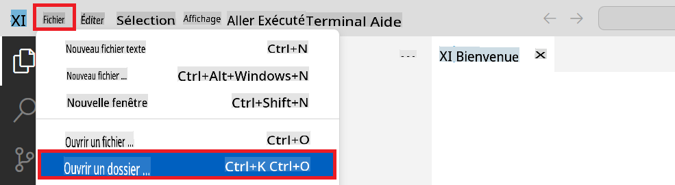

1. Dans le volet de gauche de Visual Studio Code, cliquez avec le bouton droit et sélectionnez **Nouveau fichier** pour créer un nouveau fichier nommé *download_dataset.py*.

    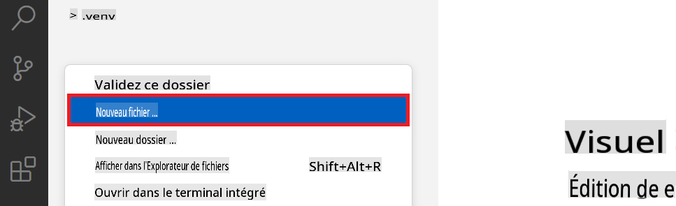

### Préparer le jeu de données pour l'affinement

Dans cet exercice, vous allez exécuter le fichier *download_dataset.py* pour télécharger les jeux de données *ultrachat_200k* dans votre environnement local. Vous utiliserez ensuite ces jeux de données pour affiner le modèle Phi-3 dans Azure Machine Learning.

Dans cet exercice, vous allez :

- Ajouter du code au fichier *download_dataset.py* pour télécharger les jeux de données.
- Exécuter le fichier *download_dataset.py* pour télécharger les jeux de données dans votre environnement local.

#### Télécharger votre jeu de données en utilisant *download_dataset.py*

1. Ouvrez le fichier *download_dataset.py* dans Visual Studio Code.

1. Ajoutez le code suivant dans le fichier *download_dataset.py*.

    ```python
    import json
    import os
    from datasets import load_dataset

    def load_and_split_dataset(dataset_name, config_name, split_ratio):
        """
        Load and split a dataset.
        """
        # Load the dataset with the specified name, configuration, and split ratio
        dataset = load_dataset(dataset_name, config_name, split=split_ratio)
        print(f"Original dataset size: {len(dataset)}")
        
        # Split the dataset into train and test sets (80% train, 20% test)
        split_dataset = dataset.train_test_split(test_size=0.2)
        print(f"Train dataset size: {len(split_dataset['train'])}")
        print(f"Test dataset size: {len(split_dataset['test'])}")
        
        return split_dataset

    def save_dataset_to_jsonl(dataset, filepath):
        """
        Save a dataset to a JSONL file.
        """
        # Create the directory if it does not exist
        os.makedirs(os.path.dirname(filepath), exist_ok=True)
        
        # Open the file in write mode
        with open(filepath, 'w', encoding='utf-8') as f:
            # Iterate over each record in the dataset
            for record in dataset:
                # Dump the record as a JSON object and write it to the file
                json.dump(record, f)
                # Write a newline character to separate records
                f.write('\n')
        
        print(f"Dataset saved to {filepath}")

    def main():
        """
        Main function to load, split, and save the dataset.
        """
        # Load and split the ULTRACHAT_200k dataset with a specific configuration and split ratio
        dataset = load_and_split_dataset("HuggingFaceH4/ultrachat_200k", 'default', 'train_sft[:1%]')
        
        # Extract the train and test datasets from the split
        train_dataset = dataset['train']
        test_dataset = dataset['test']

        # Save the train dataset to a JSONL file
        save_dataset_to_jsonl(train_dataset, "data/train_data.jsonl")
        
        # Save the test dataset to a separate JSONL file
        save_dataset_to_jsonl(test_dataset, "data/test_data.jsonl")

    if __name__ == "__main__":
        main()

    ```

1. Tapez la commande suivante dans votre terminal pour exécuter le script et télécharger le jeu de données dans votre environnement local.

    ```console
    python download_dataset.py
    ```

1. Vérifiez que les jeux de données ont été enregistrés avec succès dans votre répertoire local *finetune-phi/data*.

> [!NOTE]
>
> #### Remarque sur la taille du jeu de données et le temps d'affinement
>
> Dans ce tutoriel, vous utilisez seulement 1% du jeu de données (`split='train[:1%]'`). Cela réduit considérablement la quantité de données, accélérant à la fois les processus de téléchargement et d'affinement. Vous pouvez ajuster le pourcentage pour trouver le bon équilibre entre le temps de formation et les performances du modèle. Utiliser un sous-ensemble plus petit du jeu de données réduit le temps nécessaire à l'affinement, rendant le processus plus gérable pour un tutoriel.

## Scénario 2 : Affiner le modèle Phi-3 et le
1. Visitez [Azure ML Studio](https://ml.azure.com/home?wt.mc_id=studentamb_279723).

1. Sélectionnez **Compute** dans l'onglet à gauche.

1. Sélectionnez **Compute clusters** dans le menu de navigation.

1. Sélectionnez **+ New**.

    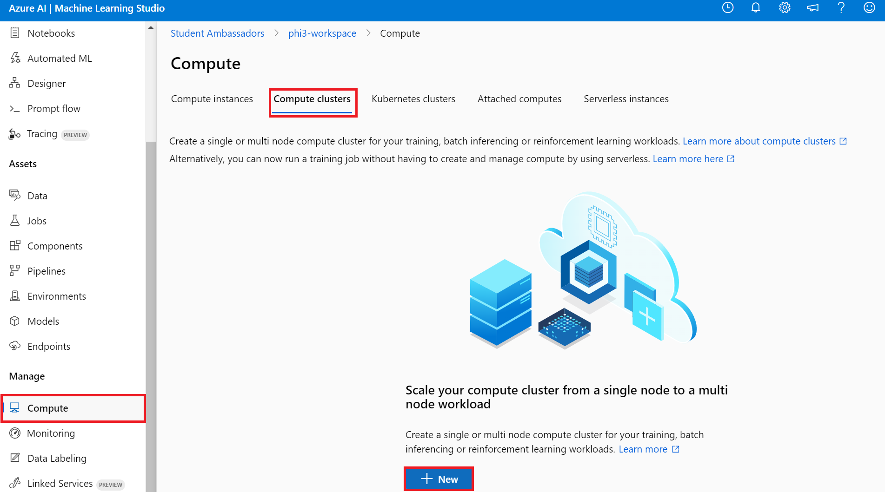

1. Effectuez les tâches suivantes :

    - Sélectionnez la **Region** que vous souhaitez utiliser.
    - Sélectionnez le **Virtual machine tier** sur **Dedicated**.
    - Sélectionnez le **Virtual machine type** sur **GPU**.
    - Sélectionnez le filtre **Virtual machine size** sur **Select from all options**.
    - Sélectionnez la **Virtual machine size** sur **Standard_NC24ads_A100_v4**.

    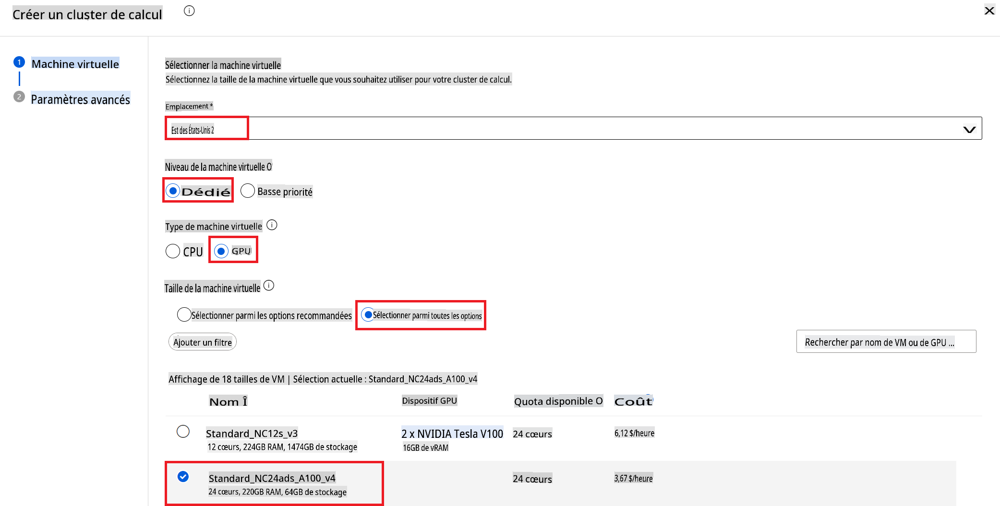

1. Sélectionnez **Next**.

1. Effectuez les tâches suivantes :

    - Entrez le **Compute name**. Il doit être une valeur unique.
    - Sélectionnez le **Minimum number of nodes** sur **0**.
    - Sélectionnez le **Maximum number of nodes** sur **1**.
    - Sélectionnez les **Idle seconds before scale down** sur **120**.

    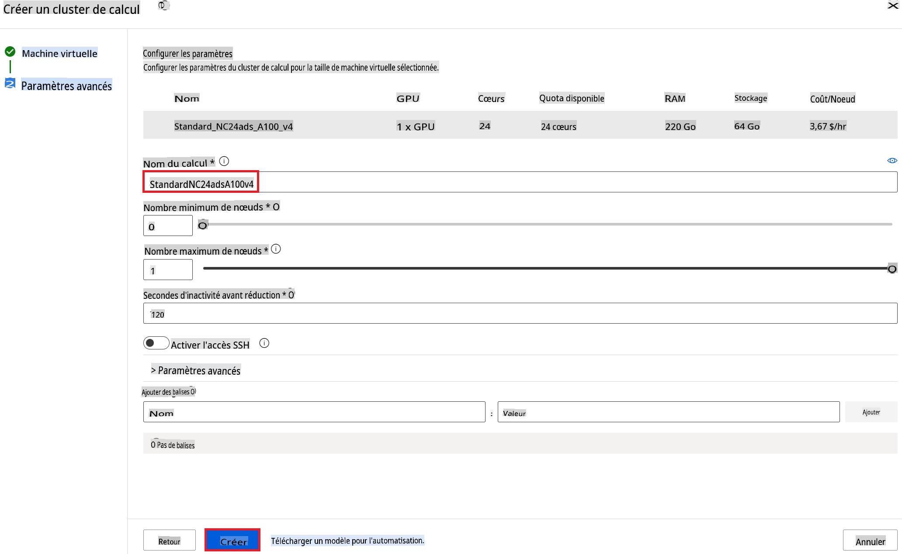

1. Sélectionnez **Create**.

#### Affiner le modèle Phi-3

1. Visitez [Azure ML Studio](https://ml.azure.com/home?wt.mc_id=studentamb_279723).

1. Sélectionnez l'espace de travail Azure Machine Learning que vous avez créé.

    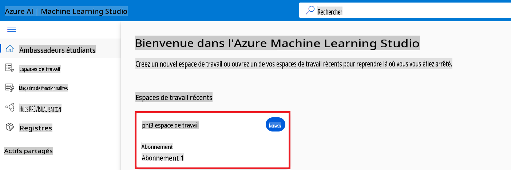

1. Effectuez les tâches suivantes :

    - Sélectionnez **Model catalog** dans l'onglet à gauche.
    - Tapez *phi-3-mini-4k* dans la **barre de recherche** et sélectionnez **Phi-3-mini-4k-instruct** parmi les options qui apparaissent.

    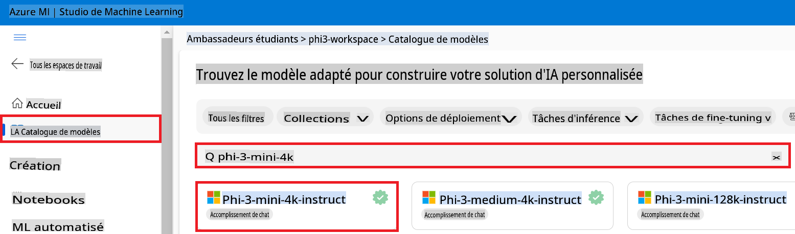

1. Sélectionnez **Fine-tune** dans le menu de navigation.

    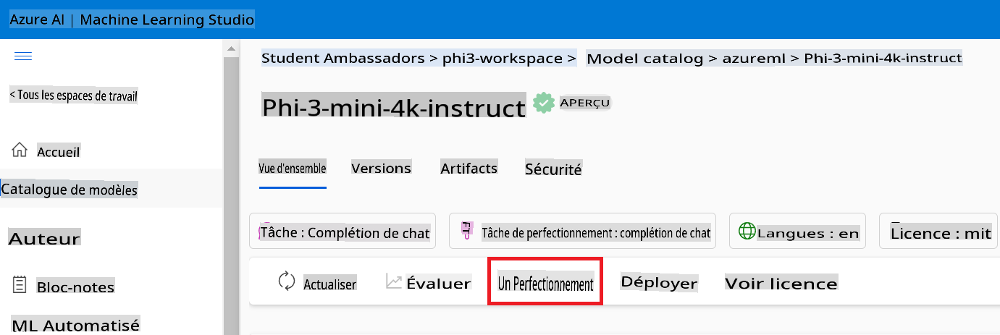

1. Effectuez les tâches suivantes :

    - Sélectionnez **Select task type** sur **Chat completion**.
    - Sélectionnez **+ Select data** pour télécharger les **Training data**.
    - Sélectionnez le type de téléchargement des données de validation sur **Provide different validation data**.
    - Sélectionnez **+ Select data** pour télécharger les **Validation data**.

    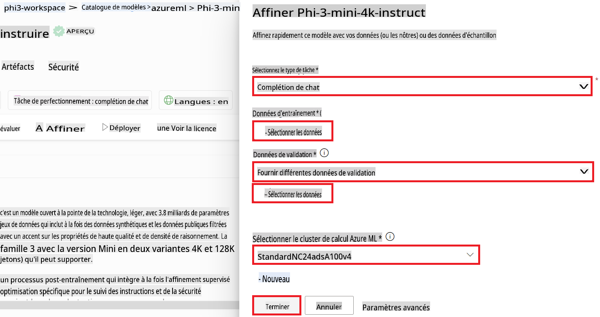

    > [!TIP]
    >
    > Vous pouvez sélectionner **Advanced settings** pour personnaliser des configurations telles que **learning_rate** et **lr_scheduler_type** pour optimiser le processus de fine-tuning selon vos besoins spécifiques.

1. Sélectionnez **Finish**.

1. Dans cet exercice, vous avez affiné avec succès le modèle Phi-3 en utilisant Azure Machine Learning. Veuillez noter que le processus de fine-tuning peut prendre un temps considérable. Après avoir lancé le job de fine-tuning, vous devez attendre qu'il se termine. Vous pouvez surveiller le statut du job de fine-tuning en naviguant vers l'onglet Jobs sur le côté gauche de votre espace de travail Azure Machine Learning. Dans la prochaine série, vous allez déployer le modèle affiné et l'intégrer avec Prompt flow.

    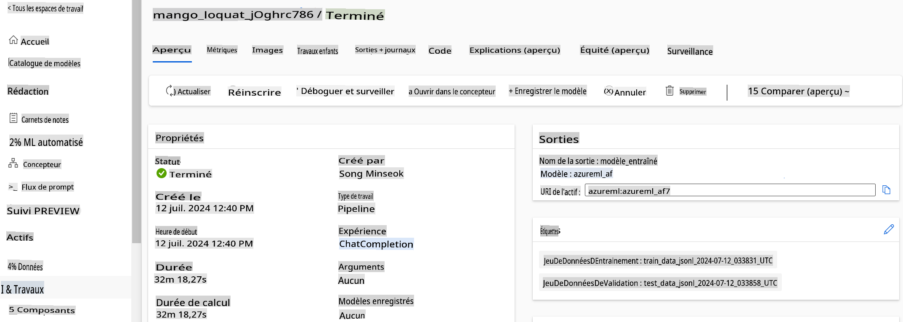

### Déployer le modèle Phi-3 affiné

Pour intégrer le modèle Phi-3 affiné avec Prompt flow, vous devez déployer le modèle pour le rendre accessible pour l'inférence en temps réel. Ce processus implique l'enregistrement du modèle, la création d'un endpoint en ligne et le déploiement du modèle.

Dans cet exercice, vous allez :

- Enregistrer le modèle affiné dans l'espace de travail Azure Machine Learning.
- Créer un endpoint en ligne.
- Déployer le modèle Phi-3 affiné enregistré.

#### Enregistrer le modèle affiné

1. Visitez [Azure ML Studio](https://ml.azure.com/home?wt.mc_id=studentamb_279723).

1. Sélectionnez l'espace de travail Azure Machine Learning que vous avez créé.

    

1. Sélectionnez **Models** dans l'onglet à gauche.
1. Sélectionnez **+ Register**.
1. Sélectionnez **From a job output**.

    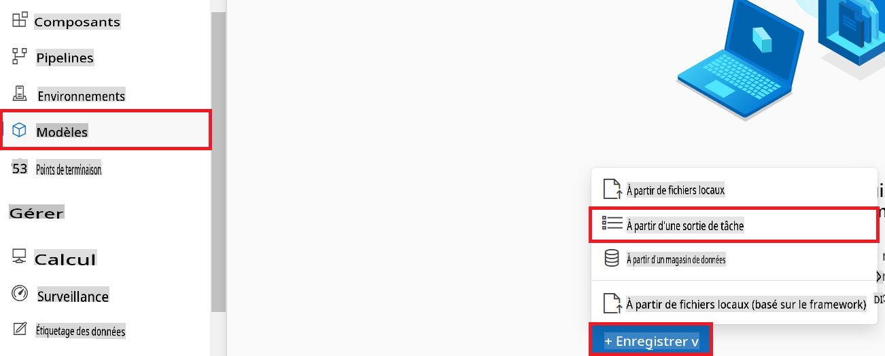

1. Sélectionnez le job que vous avez créé.

    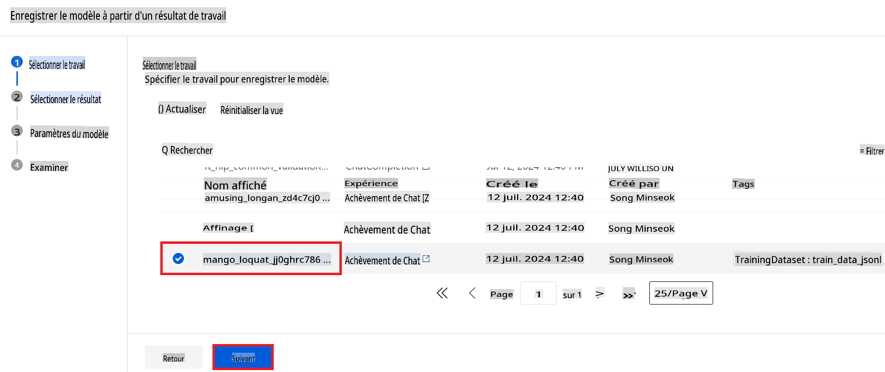

1. Sélectionnez **Next**.

1. Sélectionnez **Model type** sur **MLflow**.

1. Assurez-vous que **Job output** est sélectionné; il devrait être automatiquement sélectionné.

    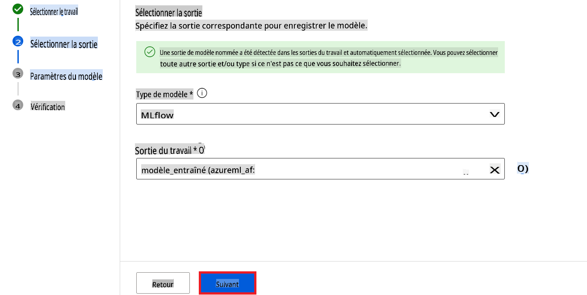

1. Sélectionnez **Next**.

1. Sélectionnez **Register**.

    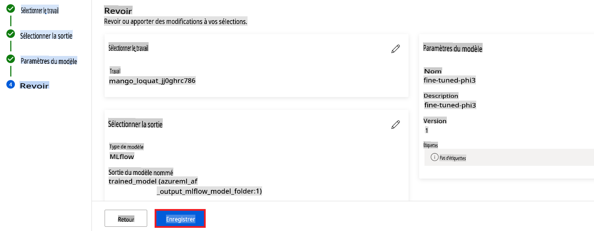

1. Vous pouvez voir votre modèle enregistré en naviguant vers le menu **Models** dans l'onglet à gauche.

    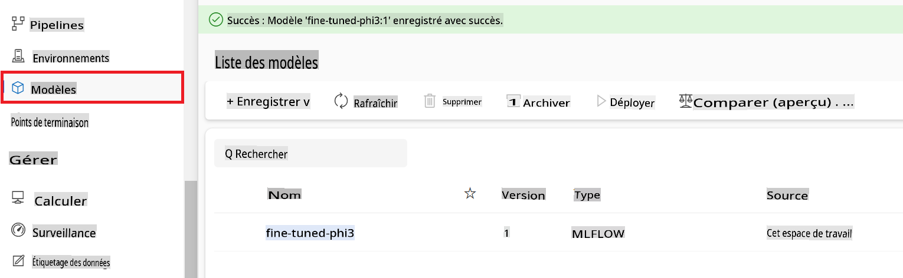

#### Déployer le modèle affiné

1. Naviguez vers l'espace de travail Azure Machine Learning que vous avez créé.

1. Sélectionnez **Endpoints** dans l'onglet à gauche.

1. Sélectionnez **Real-time endpoints** dans le menu de navigation.

    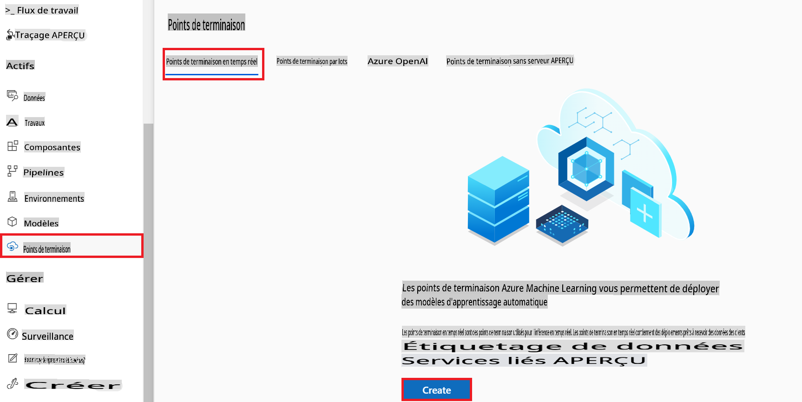

1. Sélectionnez **Create**.

1. sélectionnez le modèle enregistré que vous avez créé.

    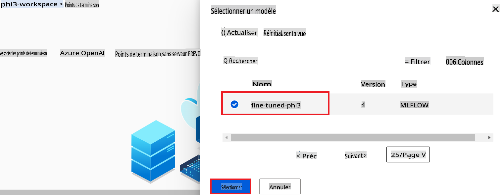

1. Sélectionnez **Select**.

1. Effectuez les tâches suivantes :

    - Sélectionnez **Virtual machine** sur *Standard_NC6s_v3*.
    - Sélectionnez le **Instance count** que vous souhaitez utiliser. Par exemple, *1*.
    - Sélectionnez **Endpoint** sur **New** pour créer un endpoint.
    - Entrez le **Endpoint name**. Il doit être une valeur unique.
    - Entrez le **Deployment name**. Il doit être une valeur unique.

    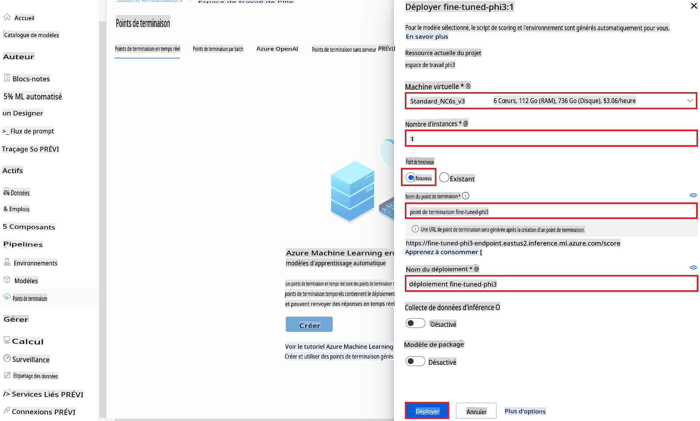

1. Sélectionnez **Deploy**.

> [!WARNING]
> Pour éviter des frais supplémentaires sur votre compte, assurez-vous de supprimer le endpoint créé dans l'espace de travail Azure Machine Learning.
>

#### Vérifiez le statut du déploiement dans l'espace de travail Azure Machine Learning

1. Naviguez vers l'espace de travail Azure Machine Learning que vous avez créé.

1. Sélectionnez **Endpoints** dans l'onglet à gauche.

1. Sélectionnez le endpoint que vous avez créé.

    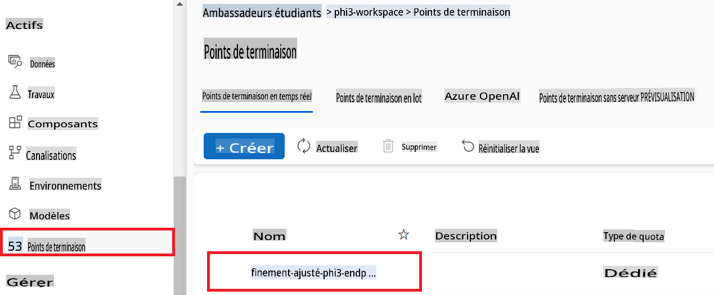

1. Sur cette page, vous pouvez gérer les endpoints pendant le processus de déploiement.

> [!NOTE]
> Une fois le déploiement terminé, assurez-vous que **Live traffic** est réglé sur **100%**. Si ce n'est pas le cas, sélectionnez **Update traffic** pour ajuster les paramètres de trafic. Notez que vous ne pouvez pas tester le modèle si le trafic est réglé sur 0%.
>
> 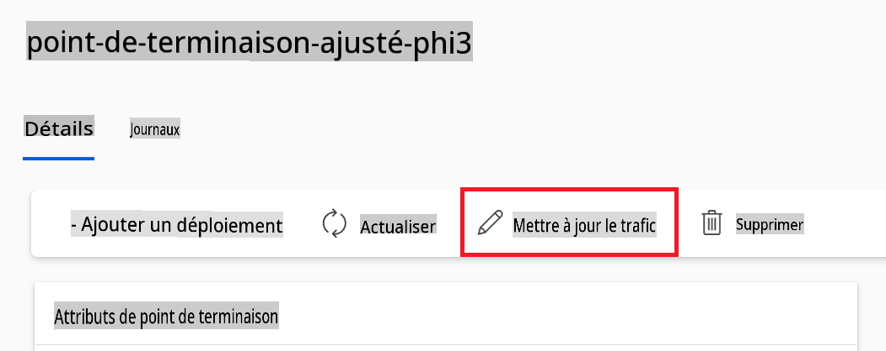
>

## Scénario 3 : Intégrer avec Prompt flow et discuter avec votre modèle personnalisé dans Azure AI Foundry

### Intégrer le modèle personnalisé Phi-3 avec Prompt flow

Après avoir déployé avec succès votre modèle affiné, vous pouvez maintenant l'intégrer avec Prompt Flow pour utiliser votre modèle dans des applications en temps réel, permettant une variété de tâches interactives avec votre modèle personnalisé Phi-3.

Dans cet exercice, vous allez :

- Créer un Hub Azure AI Foundry.
- Créer un projet Azure AI Foundry.
- Créer un Prompt flow.
- Ajouter une connexion personnalisée pour le modèle Phi-3 affiné.
- Configurer Prompt flow pour discuter avec votre modèle personnalisé Phi-3.

> [!NOTE]
> Vous pouvez également intégrer avec Promptflow en utilisant Azure ML Studio. Le même processus d'intégration peut être appliqué à Azure ML Studio.

#### Créer un Hub Azure AI Foundry

Vous devez créer un Hub avant de créer le Projet. Un Hub agit comme un groupe de ressources, vous permettant d'organiser et de gérer plusieurs projets au sein d'Azure AI Foundry.

1. Visitez [Azure AI Foundry](https://ai.azure.com/?WT.mc_id=aiml-137032-kinfeylo).

1. Sélectionnez **All hubs** dans l'onglet à gauche.

1. Sélectionnez **+ New hub** dans le menu de navigation.

    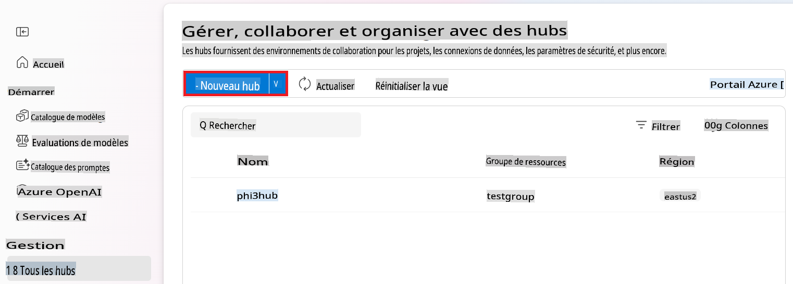

1. Effectuez les tâches suivantes :

    - Entrez le **Hub name**. Il doit être une valeur unique.
    - Sélectionnez votre **Subscription** Azure.
    - Sélectionnez le **Resource group** à utiliser (créez-en un nouveau si nécessaire).
    - Sélectionnez la **Location** que vous souhaitez utiliser.
    - Sélectionnez le **Connect Azure AI Services** à utiliser (créez-en un nouveau si nécessaire).
    - Sélectionnez **Connect Azure AI Search** sur **Skip connecting**.

    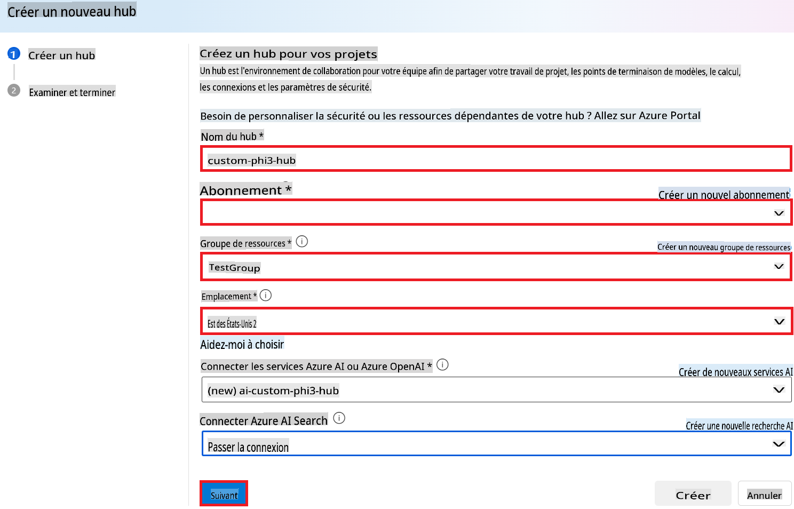

1. Sélectionnez **Next**.

#### Créer un projet Azure AI Foundry

1. Dans le Hub que vous avez créé, sélectionnez **All projects** dans l'onglet à gauche.

1. Sélectionnez **+ New project** dans le menu de navigation.

    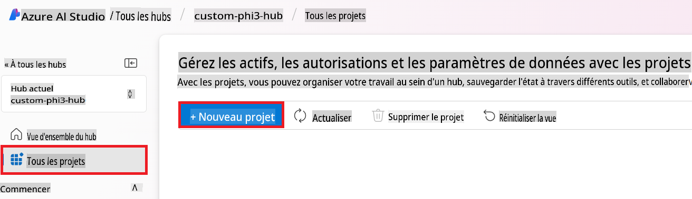

1. Entrez le **Project name**. Il doit être une valeur unique.

    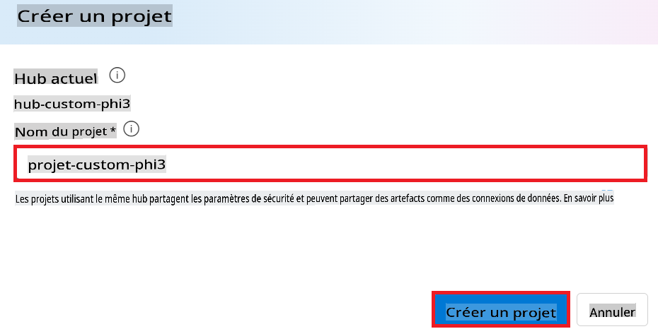

1. Sélectionnez **Create a project**.

#### Ajouter une connexion personnalisée pour le modèle Phi-3 affiné

Pour intégrer votre modèle personnalisé Phi-3 avec Prompt flow, vous devez enregistrer l'endpoint et la clé du modèle dans une connexion personnalisée. Cette configuration garantit l'accès à votre modèle personnalisé Phi-3 dans Prompt flow.

#### Définir la clé API et l'URI de l'endpoint du modèle Phi-3 affiné

1. Visitez [Azure ML Studio](https://ml.azure.com/home?WT.mc_id=aiml-137032-kinfeylo).

1. Naviguez vers l'espace de travail Azure Machine Learning que vous avez créé.

1. Sélectionnez **Endpoints** dans l'onglet à gauche.

    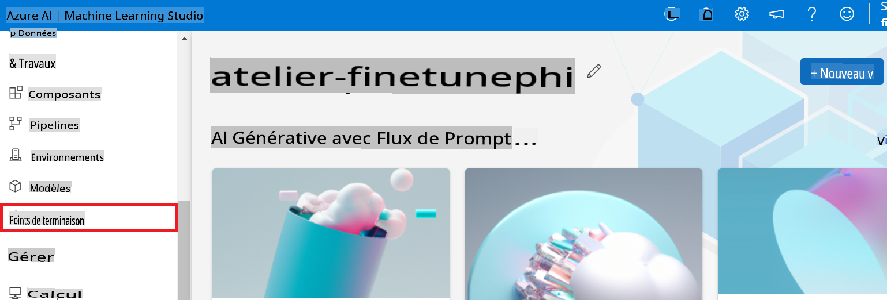

1. Sélectionnez l'endpoint que vous avez créé.

    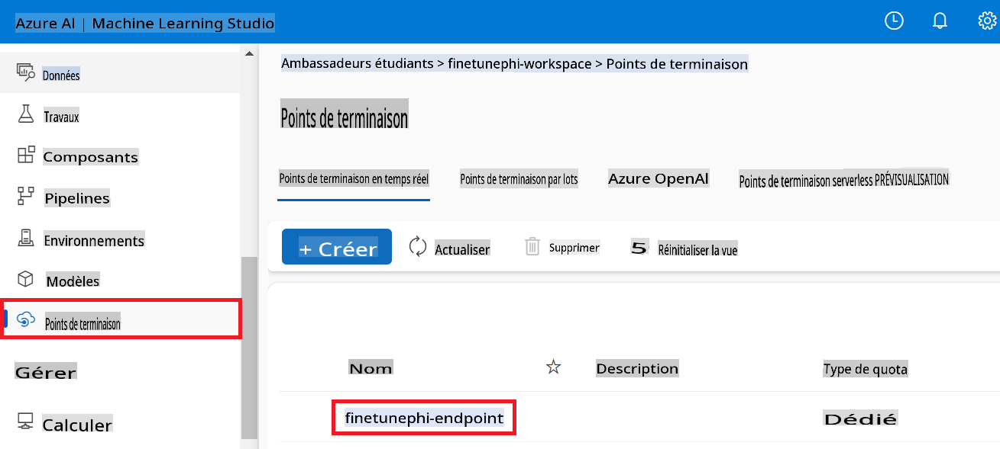

1. Sélectionnez **Consume** dans le menu de navigation.

1. Copiez votre **REST endpoint** et **Primary key**.
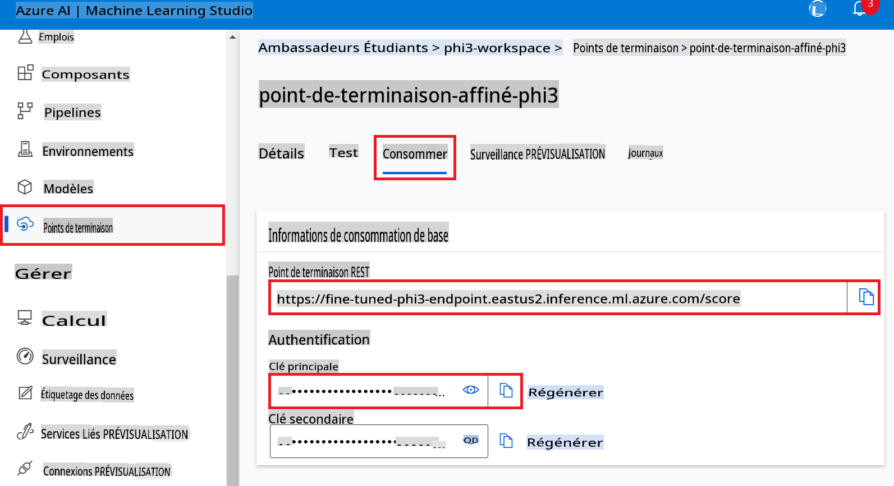

#### Ajouter la connexion personnalisée

1. Visitez [Azure AI Foundry](https://ai.azure.com/?WT.mc_id=aiml-137032-kinfeylo).

1. Accédez au projet Azure AI Foundry que vous avez créé.

1. Dans le projet que vous avez créé, sélectionnez **Paramètres** dans l'onglet de gauche.

1. Sélectionnez **+ Nouvelle connexion**.

    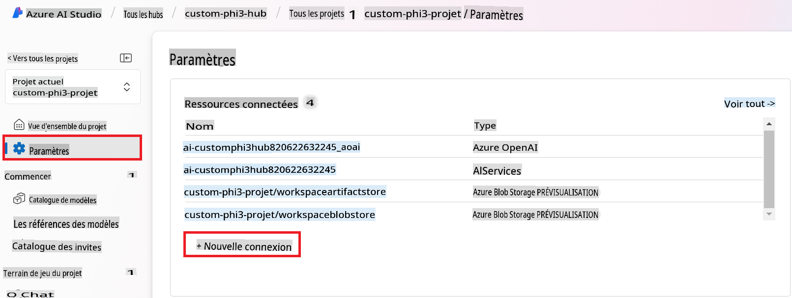

1. Sélectionnez **Clés personnalisées** dans le menu de navigation.

    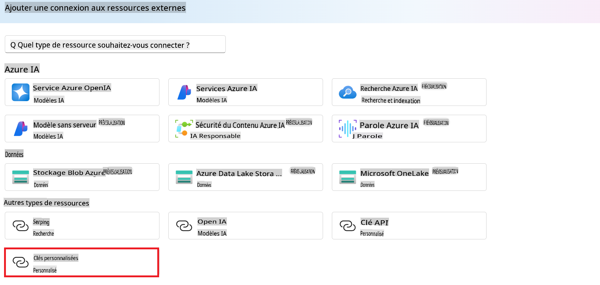

1. Effectuez les tâches suivantes :

    - Sélectionnez **+ Ajouter des paires clé-valeur**.
    - Pour le nom de la clé, entrez **endpoint** et collez le point de terminaison que vous avez copié depuis Azure ML Studio dans le champ de valeur.
    - Sélectionnez **+ Ajouter des paires clé-valeur** à nouveau.
    - Pour le nom de la clé, entrez **key** et collez la clé que vous avez copiée depuis Azure ML Studio dans le champ de valeur.
    - Après avoir ajouté les clés, sélectionnez **est secret** pour empêcher l'exposition de la clé.

    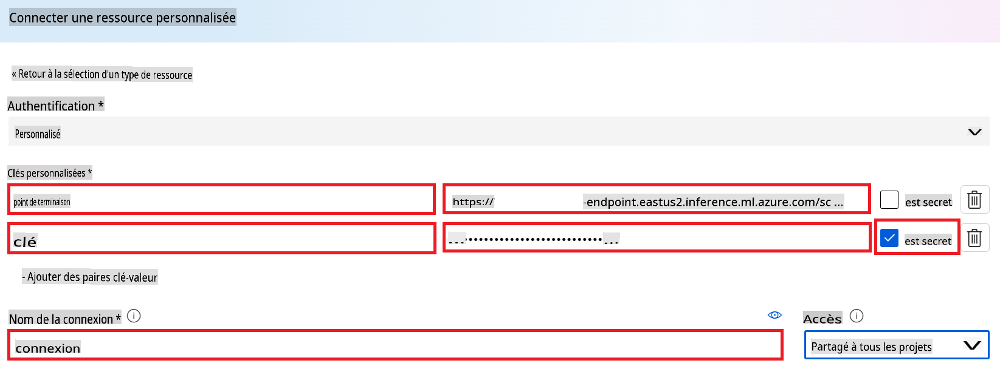

1. Sélectionnez **Ajouter la connexion**.

#### Créer un flux de requêtes

Vous avez ajouté une connexion personnalisée dans Azure AI Foundry. Maintenant, créons un flux de requêtes en suivant les étapes suivantes. Ensuite, vous connecterez ce flux de requêtes à la connexion personnalisée afin de pouvoir utiliser le modèle affiné dans le flux de requêtes.

1. Accédez au projet Azure AI Foundry que vous avez créé.

1. Sélectionnez **Flux de requêtes** dans l'onglet de gauche.

1. Sélectionnez **+ Créer** dans le menu de navigation.

    

1. Sélectionnez **Flux de chat** dans le menu de navigation.

    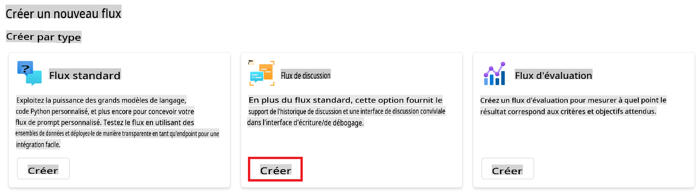

1. Entrez **Nom du dossier** à utiliser.

    

1. Sélectionnez **Créer**.

#### Configurer le flux de requêtes pour discuter avec votre modèle personnalisé Phi-3

Vous devez intégrer le modèle affiné Phi-3 dans un flux de requêtes. Cependant, le flux de requêtes existant fourni n'est pas conçu à cet effet. Par conséquent, vous devez redessiner le flux de requêtes pour permettre l'intégration du modèle personnalisé.

1. Dans le flux de requêtes, effectuez les tâches suivantes pour reconstruire le flux existant :

    - Sélectionnez **Mode fichier brut**.
    - Supprimez tout le code existant dans le fichier *flow.dag.yml*.
    - Ajoutez le code suivant au fichier *flow.dag.yml*.

        ```yml
        inputs:
          input_data:
            type: string
            default: "Who founded Microsoft?"

        outputs:
          answer:
            type: string
            reference: ${integrate_with_promptflow.output}

        nodes:
        - name: integrate_with_promptflow
          type: python
          source:
            type: code
            path: integrate_with_promptflow.py
          inputs:
            input_data: ${inputs.input_data}
        ```

    - Sélectionnez **Enregistrer**.

    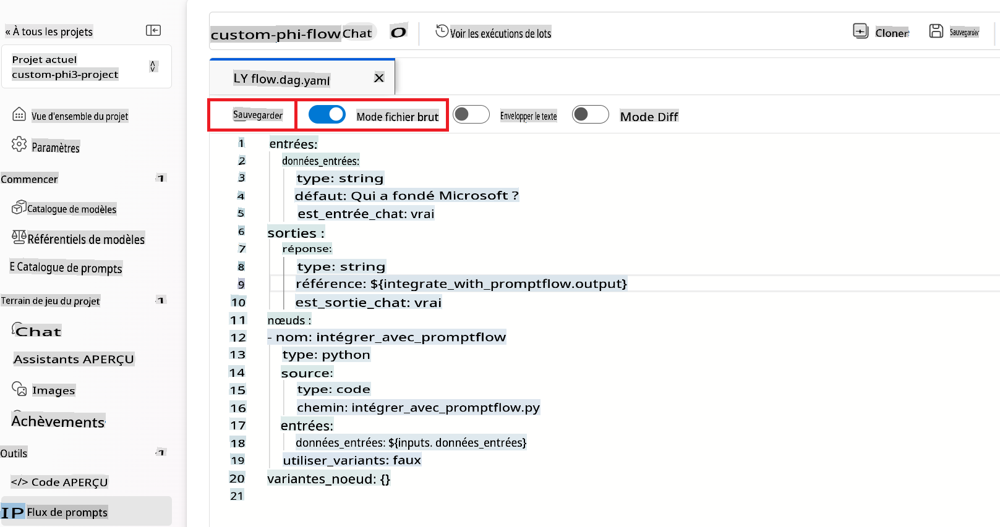

1. Ajoutez le code suivant au fichier *integrate_with_promptflow.py* pour utiliser le modèle personnalisé Phi-3 dans le flux de requêtes.

    ```python
    import logging
    import requests
    from promptflow import tool
    from promptflow.connections import CustomConnection

    # Logging setup
    logging.basicConfig(
        format="%(asctime)s - %(levelname)s - %(name)s - %(message)s",
        datefmt="%Y-%m-%d %H:%M:%S",
        level=logging.DEBUG
    )
    logger = logging.getLogger(__name__)

    def query_phi3_model(input_data: str, connection: CustomConnection) -> str:
        """
        Send a request to the Phi-3 model endpoint with the given input data using Custom Connection.
        """

        # "connection" is the name of the Custom Connection, "endpoint", "key" are the keys in the Custom Connection
        endpoint_url = connection.endpoint
        api_key = connection.key

        headers = {
            "Content-Type": "application/json",
            "Authorization": f"Bearer {api_key}"
        }
        data = {
            "input_data": {
                "input_string": [
                    {"role": "user", "content": input_data}
                ],
                "parameters": {
                    "temperature": 0.7,
                    "max_new_tokens": 128
                }
            }
        }
        try:
            response = requests.post(endpoint_url, json=data, headers=headers)
            response.raise_for_status()
            
            # Log the full JSON response
            logger.debug(f"Full JSON response: {response.json()}")

            result = response.json()["output"]
            logger.info("Successfully received response from Azure ML Endpoint.")
            return result
        except requests.exceptions.RequestException as e:
            logger.error(f"Error querying Azure ML Endpoint: {e}")
            raise

    @tool
    def my_python_tool(input_data: str, connection: CustomConnection) -> str:
        """
        Tool function to process input data and query the Phi-3 model.
        """
        return query_phi3_model(input_data, connection)

    ```

    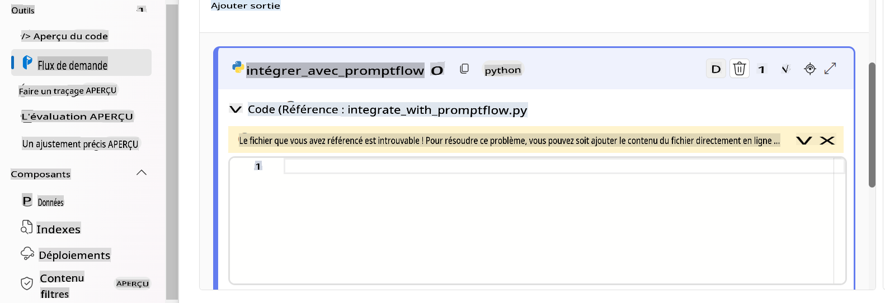

> [!NOTE]
> Pour des informations plus détaillées sur l'utilisation du flux de requêtes dans Azure AI Foundry, vous pouvez consulter [Flux de requêtes dans Azure AI Foundry](https://learn.microsoft.com/azure/ai-studio/how-to/prompt-flow).

1. Sélectionnez **Entrée de chat**, **Sortie de chat** pour activer la discussion avec votre modèle.

    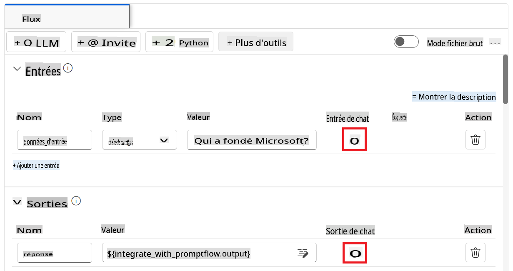

1. Vous êtes maintenant prêt à discuter avec votre modèle personnalisé Phi-3. Dans le prochain exercice, vous apprendrez comment démarrer le flux de requêtes et l'utiliser pour discuter avec votre modèle Phi-3 affiné.

> [!NOTE]
>
> Le flux reconstruit devrait ressembler à l'image ci-dessous :
>
> 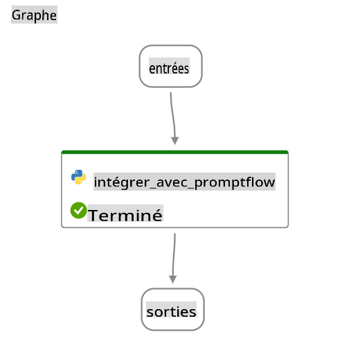
>

### Discuter avec votre modèle personnalisé Phi-3

Maintenant que vous avez affiné et intégré votre modèle personnalisé Phi-3 avec le flux de requêtes, vous êtes prêt à commencer à interagir avec lui. Cet exercice vous guidera à travers le processus de configuration et de lancement d'une discussion avec votre modèle en utilisant le flux de requêtes. En suivant ces étapes, vous pourrez pleinement exploiter les capacités de votre modèle Phi-3 affiné pour diverses tâches et conversations.

- Discutez avec votre modèle personnalisé Phi-3 en utilisant le flux de requêtes.

#### Démarrer le flux de requêtes

1. Sélectionnez **Démarrer les sessions de calcul** pour démarrer le flux de requêtes.

    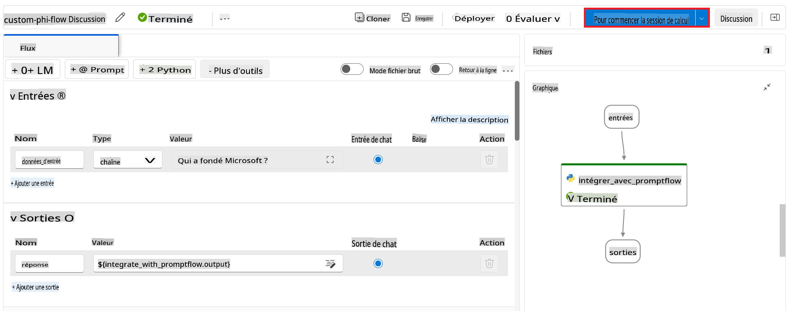

1. Sélectionnez **Valider et analyser l'entrée** pour renouveler les paramètres.

    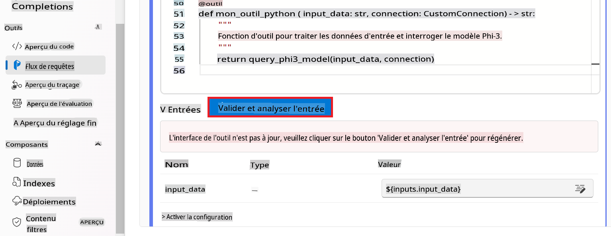

1. Sélectionnez la **Valeur** de la **connexion** à la connexion personnalisée que vous avez créée. Par exemple, *connection*.

    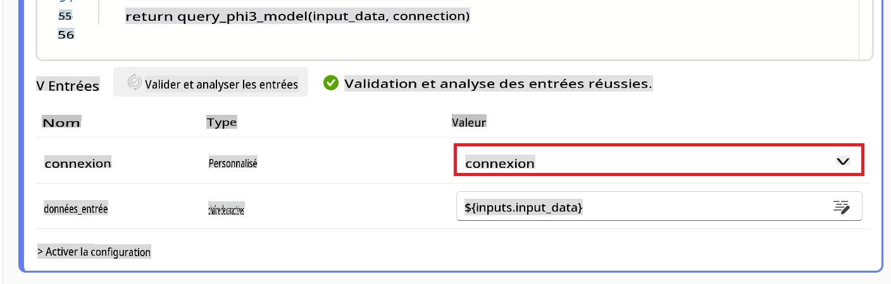

#### Discuter avec votre modèle personnalisé

1. Sélectionnez **Chat**.

    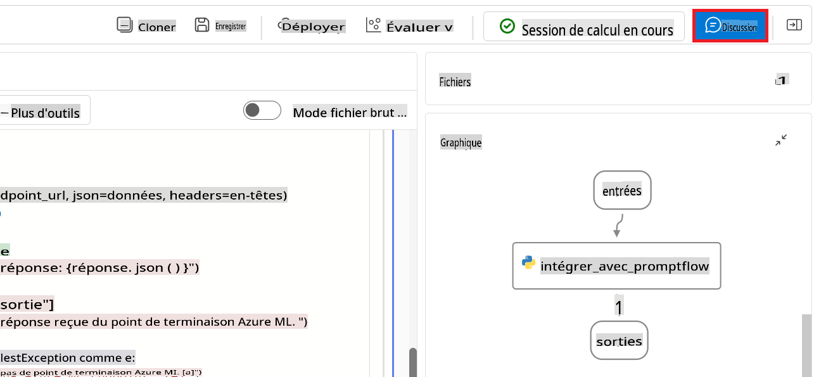

1. Voici un exemple des résultats : Maintenant, vous pouvez discuter avec votre modèle personnalisé Phi-3. Il est recommandé de poser des questions basées sur les données utilisées pour l'affinage.

    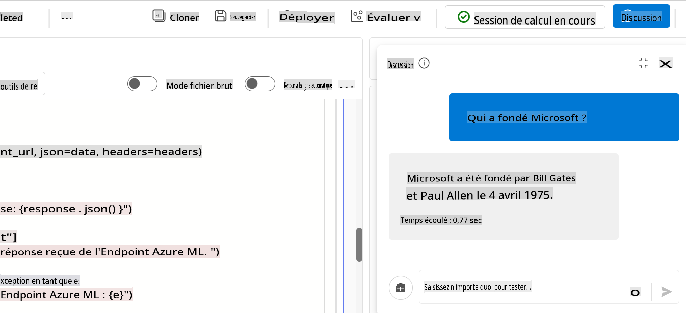

**Avertissement**:
Ce document a été traduit à l'aide de services de traduction automatisée basés sur l'IA. Bien que nous nous efforcions d'assurer l'exactitude, veuillez noter que les traductions automatisées peuvent contenir des erreurs ou des inexactitudes. Le document original dans sa langue d'origine doit être considéré comme la source faisant autorité. Pour des informations critiques, une traduction humaine professionnelle est recommandée. Nous ne sommes pas responsables des malentendus ou des interprétations erronées résultant de l'utilisation de cette traduction.