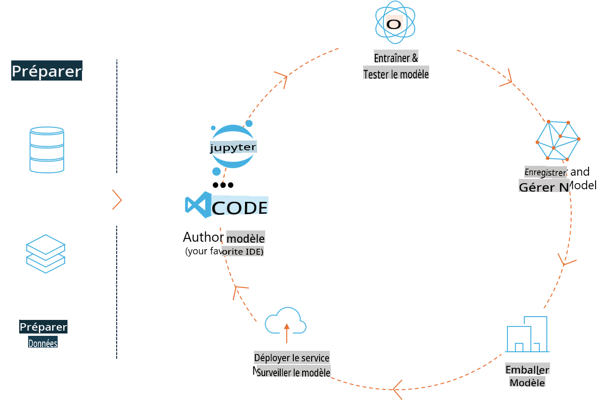
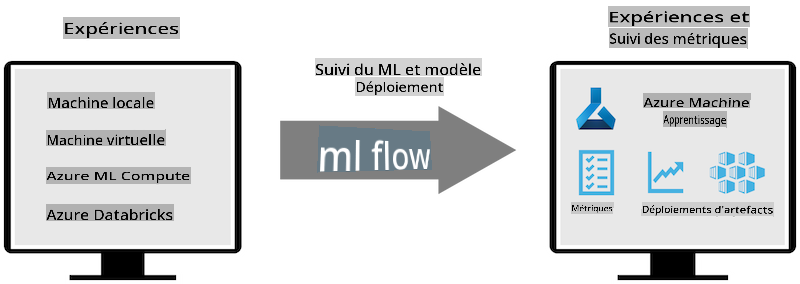
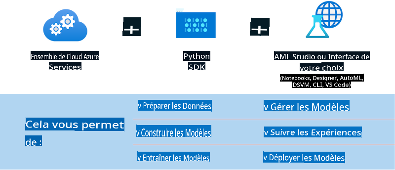

# MLflow

[MLflow](https://mlflow.org/) est une plateforme open-source conçue pour gérer le cycle de vie complet de l'apprentissage automatique.



MLFlow est utilisé pour gérer le cycle de vie de l'IA, incluant l'expérimentation, la reproductibilité, le déploiement et un registre central de modèles. MLFlow offre actuellement quatre composants.

- **MLflow Tracking:** Enregistrez et interrogez des expériences, du code, des configurations de données et des résultats.
- **MLflow Projects:** Emballez le code de science des données dans un format permettant de reproduire les exécutions sur n'importe quelle plateforme.
- **Mlflow Models:** Déployez des modèles de machine learning dans divers environnements de service.
- **Model Registry:** Stockez, annotez et gérez les modèles dans un référentiel central.

Il inclut des fonctionnalités pour suivre les expériences, emballer le code dans des exécutions reproductibles, et partager et déployer des modèles. MLFlow est intégré à Databricks et prend en charge une variété de bibliothèques ML, ce qui le rend indépendant des bibliothèques. Il peut être utilisé avec n'importe quelle bibliothèque de machine learning et dans n'importe quel langage de programmation, car il fournit une API REST et une CLI pour plus de commodité.



Les principales fonctionnalités de MLFlow incluent :

- **Suivi des expériences:** Enregistrez et comparez les paramètres et les résultats.
- **Gestion des modèles:** Déployez des modèles sur diverses plateformes de service et d'inférence.
- **Registre des modèles:** Gérez collaborativement le cycle de vie des modèles MLflow, y compris le versionnage et les annotations.
- **Projets:** Emballez le code ML pour le partage ou l'utilisation en production.

MLFlow prend également en charge la boucle MLOps, qui inclut la préparation des données, l'enregistrement et la gestion des modèles, l'emballage des modèles pour l'exécution, le déploiement des services et la surveillance des modèles. Il vise à simplifier le passage d'un prototype à un flux de travail de production, en particulier dans les environnements cloud et edge.

## Scénario E2E - Créer un wrapper et utiliser Phi-3 comme modèle MLFlow

Dans cet exemple E2E, nous allons démontrer deux approches différentes pour créer un wrapper autour du petit modèle de langage Phi-3 (SLM) et l'exécuter ensuite comme un modèle MLFlow soit localement, soit dans le cloud, par exemple, dans un espace de travail Azure Machine Learning.



| Projet | Description | Emplacement |
| ------------ | ----------- | -------- |
| Pipeline de Transformateur | Le Pipeline de Transformateur est l'option la plus simple pour créer un wrapper si vous souhaitez utiliser un modèle HuggingFace avec la saveur expérimentale des transformateurs de MLFlow. | [**TransformerPipeline.ipynb**](../../../../code/06.E2E/E2E_Phi-3-MLflow_TransformerPipeline.ipynb) |
| Wrapper Python Personnalisé | Au moment de la rédaction, le pipeline de transformateur ne prenait pas en charge la génération de wrapper MLFlow pour les modèles HuggingFace au format ONNX, même avec le package Python optimum expérimental. Pour les cas comme celui-ci, vous pouvez créer votre propre wrapper Python personnalisé pour le mode MLFlow | [**CustomPythonWrapper.ipynb**](../../../../code/06.E2E/E2E_Phi-3-MLflow_CustomPythonWrapper.ipynb) |

## Projet : Pipeline de Transformateur

1. Vous aurez besoin des packages Python pertinents de MLFlow et HuggingFace :

    ``` Python
    import mlflow
    import transformers
    ```

2. Ensuite, vous devez initier un pipeline de transformateur en vous référant au modèle cible Phi-3 dans le registre HuggingFace. Comme indiqué sur la carte du modèle _Phi-3-mini-4k-instruct_, sa tâche est de type “Text Generation” :

    ``` Python
    pipeline = transformers.pipeline(
        task = "text-generation",
        model = "microsoft/Phi-3-mini-4k-instruct"
    )
    ```

3. Vous pouvez maintenant enregistrer le pipeline de transformateur de votre modèle Phi-3 au format MLFlow et fournir des détails supplémentaires tels que le chemin des artefacts cibles, les paramètres spécifiques de configuration du modèle et le type d'API d'inférence :

    ``` Python
    model_info = mlflow.transformers.log_model(
        transformers_model = pipeline,
        artifact_path = "phi3-mlflow-model",
        model_config = model_config,
        task = "llm/v1/chat"
    )
    ```

## Projet : Wrapper Python Personnalisé

1. Nous pouvons utiliser ici l'[API generate() de ONNX Runtime de Microsoft](https://github.com/microsoft/onnxruntime-genai) pour l'inférence du modèle ONNX et l'encodage/décodage des tokens. Vous devez choisir le package _onnxruntime_genai_ pour votre calcul cible, avec l'exemple ci-dessous ciblant le CPU :

    ``` Python
    import mlflow
    from mlflow.models import infer_signature
    import onnxruntime_genai as og
    ```

1. Notre classe personnalisée implémente deux méthodes : _load_context()_ pour initialiser le **modèle ONNX** de Phi-3 Mini 4K Instruct, **les paramètres du générateur** et **le tokenizer** ; et _predict()_ pour générer des tokens de sortie pour l'invite fournie :

    ``` Python
    class Phi3Model(mlflow.pyfunc.PythonModel):
        def load_context(self, context):
            # Récupération du modèle à partir des artefacts
            model_path = context.artifacts["phi3-mini-onnx"]
            model_options = {
                 "max_length": 300,
                 "temperature": 0.2,         
            }
        
            # Définition du modèle
            self.phi3_model = og.Model(model_path)
            self.params = og.GeneratorParams(self.phi3_model)
            self.params.set_search_options(**model_options)
            
            # Définition du tokenizer
            self.tokenizer = og.Tokenizer(self.phi3_model)
    
        def predict(self, context, model_input):
            # Récupération de l'invite à partir de l'entrée
            prompt = model_input["prompt"][0]
            self.params.input_ids = self.tokenizer.encode(prompt)
    
            # Génération de la réponse du modèle
            response = self.phi3_model.generate(self.params)
    
            return self.tokenizer.decode(response[0][len(self.params.input_ids):])
    ```

1. Vous pouvez maintenant utiliser la fonction _mlflow.pyfunc.log_model()_ pour générer un wrapper Python personnalisé (au format pickle) pour le modèle Phi-3, ainsi que le modèle ONNX original et les dépendances nécessaires :

    ``` Python
    model_info = mlflow.pyfunc.log_model(
        artifact_path = artifact_path,
        python_model = Phi3Model(),
        artifacts = {
            "phi3-mini-onnx": "cpu_and_mobile/cpu-int4-rtn-block-32-acc-level-4",
        },
        input_example = input_example,
        signature = infer_signature(input_example, ["Run"]),
        extra_pip_requirements = ["torch", "onnxruntime_genai", "numpy"],
    )
    ```

## Signatures des modèles MLFlow générés

1. À l'étape 3 du projet Pipeline de Transformateur ci-dessus, nous avons défini la tâche du modèle MLFlow sur “_llm/v1/chat_”. Cette instruction génère un wrapper API du modèle, compatible avec l'API Chat d'OpenAI comme montré ci-dessous :

    ``` Python
    {inputs: 
      ['messages': Array({content: string (required), name: string (optional), role: string (required)}) (required), 'temperature': double (optional), 'max_tokens': long (optional), 'stop': Array(string) (optional), 'n': long (optional), 'stream': boolean (optional)],
    outputs: 
      ['id': string (required), 'object': string (required), 'created': long (required), 'model': string (required), 'choices': Array({finish_reason: string (required), index: long (required), message: {content: string (required), name: string (optional), role: string (required)} (required)}) (required), 'usage': {completion_tokens: long (required), prompt_tokens: long (required), total_tokens: long (required)} (required)],
    params: 
      None}
    ```

1. En conséquence, vous pouvez soumettre votre invite dans le format suivant :

    ``` Python
    messages = [{"role": "user", "content": "Quelle est la capitale de l'Espagne?"}]
    ```

1. Ensuite, utilisez le post-traitement compatible avec l'API OpenAI, par exemple, _response[0][‘choices’][0][‘message’][‘content’]_, pour embellir votre sortie de cette manière :

    ``` JSON
    Question: Quelle est la capitale de l'Espagne?
    
    Réponse: La capitale de l'Espagne est Madrid. C'est la plus grande ville d'Espagne et elle sert de centre politique, économique et culturel du pays. Madrid est située au centre de la péninsule ibérique et est connue pour son riche patrimoine historique, artistique et architectural, incluant le Palais Royal, le Musée du Prado et la Plaza Mayor.
    
    Utilisation: {'prompt_tokens': 11, 'completion_tokens': 73, 'total_tokens': 84}
    ```

1. À l'étape 3 du projet Wrapper Python Personnalisé ci-dessus, nous permettons au package MLFlow de générer la signature du modèle à partir d'un exemple d'entrée donné. La signature de notre wrapper MLFlow ressemblera à ceci :

    ``` Python
    {inputs: 
      ['prompt': string (required)],
    outputs: 
      [string (required)],
    params: 
      None}
    ```

1. Ainsi, notre invite devra contenir la clé de dictionnaire "prompt", comme ceci :

    ``` Python
    {"prompt": "<|system|>Vous êtes un comédien de stand-up.<|end|><|user|>Raconte-moi une blague sur l'atome<|end|><|assistant|>",}
    ```

1. La sortie du modèle sera alors fournie au format chaîne de caractères :

    ``` JSON
    D'accord, voici une petite blague sur les atomes pour vous !
    
    Pourquoi les électrons ne jouent-ils jamais à cache-cache avec les protons ?
    
    Parce que bonne chance pour les trouver quand ils partagent toujours leurs électrons !
    
    Rappelez-vous, tout cela est pour s'amuser, et nous faisons juste un peu d'humour à l'échelle atomique !
    ```

Avertissement : La traduction a été réalisée à partir de l'original par un modèle d'IA et peut ne pas être parfaite. 
Veuillez examiner le résultat et apporter les corrections nécessaires.