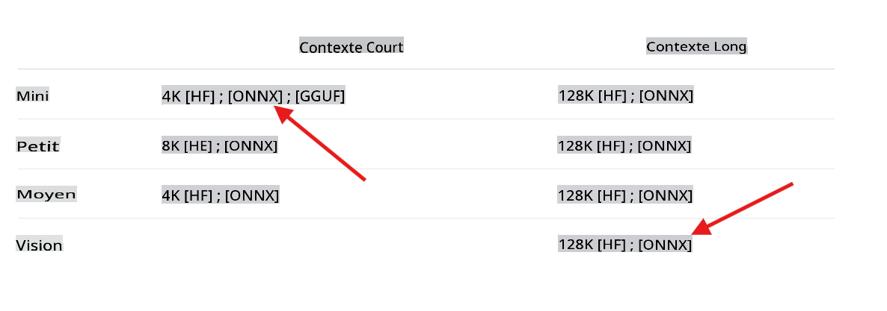

## Bienvenue dans les laboratoires Phi-3 utilisant C#

Il y a une sélection de laboratoires qui montrent comment intégrer les différentes versions puissantes des modèles Phi-3 dans un environnement .NET.

## Prérequis
Avant d'exécuter l'exemple, assurez-vous d'avoir installé les éléments suivants :

**.NET 8 :** Assurez-vous d'avoir la [dernière version de .NET](https://dotnet.microsoft.com/download/dotnet/8.0?WT.mc_id=aiml-137032-kinfeylo) installée sur votre machine.

**(Optionnel) Visual Studio ou Visual Studio Code :** Vous aurez besoin d'un IDE ou d'un éditeur de code capable d'exécuter des projets .NET. [Visual Studio](https://visualstudio.microsoft.com/) ou [Visual Studio Code](https://code.visualstudio.com?WT.mc_id=aiml-137032-kinfeylo) sont recommandés.

**Utiliser git** pour cloner localement l'une des versions disponibles de Phi-3 depuis [Hugging Face](https://huggingface.co).

**Télécharger le modèle phi3-mini-4k-instruct-onnx** sur votre machine locale :

### naviguer vers le dossier pour stocker les modèles
```bash
cd c:\phi3\models
```
### ajouter le support pour lfs
```bash
git lfs install 
```
### cloner et télécharger le modèle mini 4K instruct
```bash
git clone https://huggingface.co/microsoft/Phi-3-mini-4k-instruct-onnx
```

### cloner et télécharger le modèle vision 128K
```
git clone https://huggingface.co/microsoft/Phi-3-vision-128k-instruct-onnx-cpu
```
**Important :** Les démos actuelles sont conçues pour utiliser les versions ONNX du modèle. Les étapes précédentes clonent les modèles suivants.



## À propos des laboratoires

La solution principale contient plusieurs laboratoires exemples qui démontrent les capacités des modèles Phi-3 en utilisant C#.

| Projet | Description | Emplacement |
| ------------ | ----------- | -------- |
| LabsPhi301    | C'est un projet exemple qui utilise un modèle phi3 local pour poser une question. Le projet charge un modèle ONNX Phi-3 local en utilisant les bibliothèques `Microsoft.ML.OnnxRuntime`. | .\src\LabsPhi301\ |
| LabsPhi302    | C'est un projet exemple qui implémente un chat Console utilisant Semantic Kernel. | .\src\LabsPhi302\ |
| LabsPhi303 | C'est un projet exemple qui utilise un modèle de vision phi3 local pour analyser des images. Le projet charge un modèle ONNX Phi-3 Vision local en utilisant les bibliothèques `Microsoft.ML.OnnxRuntime`. | .\src\LabsPhi303\ |
| LabsPhi304 | C'est un projet exemple qui utilise un modèle de vision phi3 local pour analyser des images. Le projet charge un modèle ONNX Phi-3 Vision local en utilisant les bibliothèques `Microsoft.ML.OnnxRuntime`. Le projet présente également un menu avec différentes options pour interagir avec l'utilisateur. | .\src\LabsPhi304\ |
| LabsPhi305 | C'est un projet exemple qui utilise le modèle Phi-3 hébergé sur ollama pour répondre à une question.  |**coming soon**|
| LabsPhi306 | C'est un projet exemple qui implémente un chat Console utilisant Semantic Kernel. |**coming soon**|
| LabsPhi307  | C'est un projet exemple qui implémente un RAG en utilisant des embeddings locaux et Semantic Kernel. |**coming soon**|

## Comment exécuter les projets

Pour exécuter les projets, suivez ces étapes :
1. Clonez le dépôt sur votre machine locale.

1. Ouvrez un terminal et naviguez vers le projet souhaité. Par exemple, exécutons `LabsPhi301`.
    ```bash
    cd .\src\LabsPhi301\
    ```

1. Exécutez le projet avec la commande
    ```bash
    dotnet run
    ```

1. Le projet exemple demande une entrée utilisateur et répond en utilisant le mode local. 

    La démo en cours d'exécution est similaire à celle-ci :

    

    ***Note :** il y a une faute de frappe dans la 1ère question, Phi-3 est assez intelligent pour donner la bonne réponse !*

1. Le projet `LabsPhi304` demande à l'utilisateur de sélectionner différentes options, puis traite la demande. Par exemple, analyser une image locale.

    La démo en cours d'exécution est similaire à celle-ci :

    

Avertissement : La traduction a été réalisée à partir de l'original par un modèle d'IA et peut ne pas être parfaite. Veuillez examiner le résultat et apporter les corrections nécessaires.