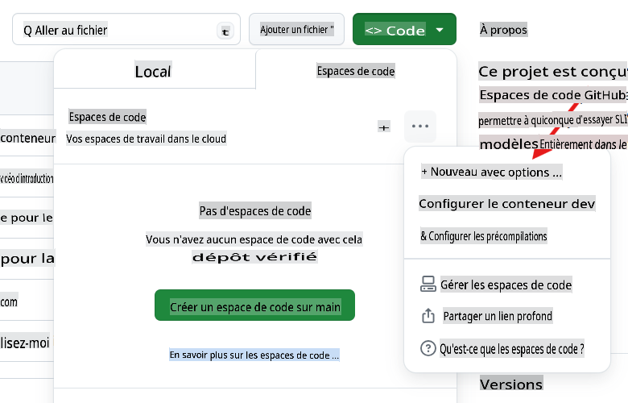
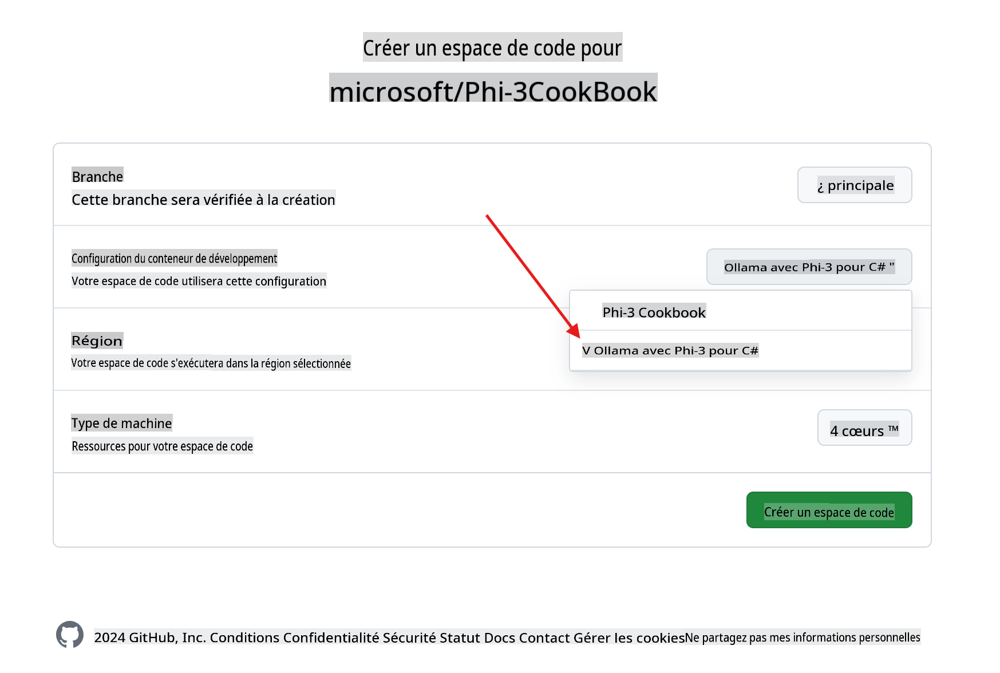
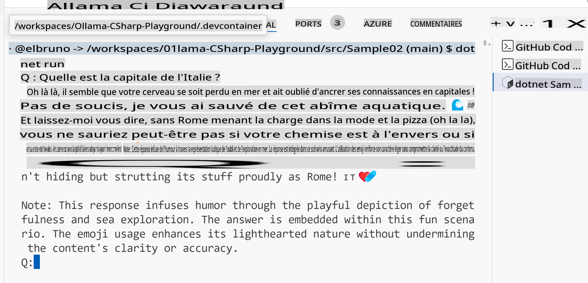

# Aire de jeu C# Ollama

Ce laboratoire est conçu pour tester Phi-3 avec des exemples en C# directement dans GitHub Codespaces, offrant une manière simple pour tout le monde d'essayer des SLMs (modèles de langage de petite taille) entièrement dans le navigateur.

## Comment créer l'espace de code C# + Ollama + Phi-3

1. Créez un nouveau Codespace en utilisant le bouton `Code` en haut du dépôt. Sélectionnez [+ Nouveau avec options ...]


1. Depuis la page des options, sélectionnez la configuration nommée `Ollama with Phi-3 for C#`



1. Une fois que le Codespace est chargé, il devrait avoir [ollama](https://ollama.com/) pré-installé, le dernier modèle Phi-3 téléchargé, et [.NET 8](https://dotnet.microsoft.com/download) installé.

1. (Optionnel) En utilisant le terminal du Codespace, demandez à Ollama d'exécuter le modèle [phi3](https://ollama.com/library/phi3) :

    ```shell
    ollama run phi3
    ```

4. Vous pouvez envoyer un message à ce modèle depuis l'invite de commande.

    ```shell
    >>> Write a joke about kittens
    ```

5. Après plusieurs secondes, vous devriez voir une réponse en flux provenant du modèle.

    

1. Pour en savoir plus sur les différentes techniques utilisées avec les modèles de langage, consultez les projets d'exemple dans `.\src` folder:

| Project | Description |
|---------|-------------|
| Sample01  | This is a sample project that uses a the Phi-3 hosted in ollama model to answer a question.  |
| Sample02  | This is a sample project that implement a Console chat using Semantic Kernel. |
| [Sample03](./src/Sample03/readme.md)  | This is a sample project that implement a RAG using local embeddings and Semantic Kernel. Check the details of the local RAG [here](./src/Sample03/readme.md) |

## How to run a sample

1. Open a terminal and navigate to the desired project. In example, let's run `Sample02`, le chat console.

    ```bash
    cd .\src\Sample02\
    ```

1. Exécutez le projet avec la commande

    ```bash
    dotnet run
    ```

1. Le projet `Sample02` définit un message système personnalisé :

    ```csharp
    var history = new ChatHistory();
    history.AddSystemMessage("You are a useful chatbot. If you don't know an answer, say 'I don't know!'. Always reply in a funny ways. Use emojis if possible.");

    ```

1. Ainsi, lorsque l'utilisateur pose une question, comme `Quelle est la capitale de l'Italie?`, le chat répond en utilisant le mode local.
   
    La sortie est similaire à celle-ci :

    

## Tutoriels Vidéo

Si vous voulez en savoir plus sur l'utilisation des Codespaces avec Ollama dans un dépôt GitHub, consultez la vidéo de 3 minutes suivante :

[](https://youtu.be/HmKpHErUEHM)

**Avertissement**:
Ce document a été traduit à l'aide de services de traduction automatisés basés sur l'IA. Bien que nous nous efforcions d'assurer l'exactitude, veuillez noter que les traductions automatisées peuvent contenir des erreurs ou des inexactitudes. Le document original dans sa langue d'origine doit être considéré comme la source faisant autorité. Pour des informations critiques, il est recommandé de faire appel à une traduction humaine professionnelle. Nous ne sommes pas responsables des malentendus ou des interprétations erronées résultant de l'utilisation de cette traduction.