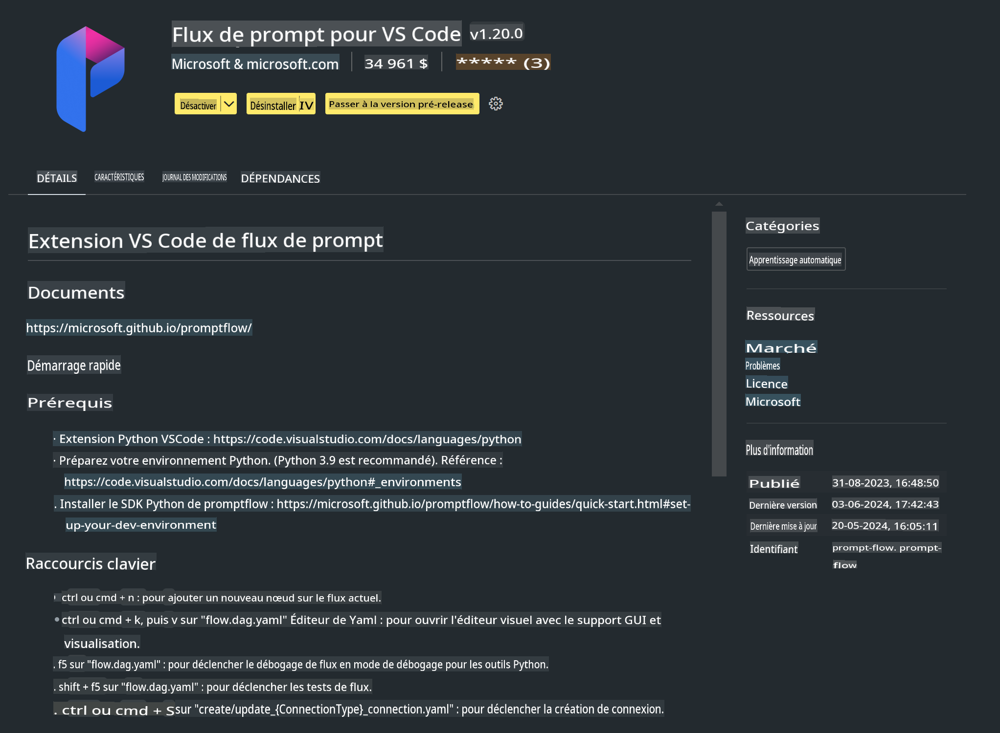

# **Lab 0 - Installation**

Lorsque nous entrons dans le Lab, nous devons configurer l'environnement approprié :

### **1. Python 3.11+**

Il est recommandé d'utiliser miniforge pour configurer votre environnement Python.

Pour configurer miniforge, veuillez vous référer à [https://github.com/conda-forge/miniforge](https://github.com/conda-forge/miniforge)

Après avoir configuré miniforge, exécutez la commande suivante dans Power Shell

```bash

conda create -n pyenv python==3.11.8 -y

conda activate pyenv

```

### **2. Installer Prompt flow SDK**

Dans le Lab 1, nous utilisons Prompt flow, vous devez donc configurer le SDK Prompt flow.

```bash

pip install promptflow --upgrade

```

Vous pouvez vérifier le SDK promptflow avec cette commande

```bash

pf --version

```

### **3. Installer l'extension Visual Studio Code Prompt flow**



### **4. Bibliothèque d'accélération Intel NPU**

Les processeurs de nouvelle génération d'Intel supportent le NPU. Si vous souhaitez utiliser le NPU pour exécuter des LLMs / SLMs localement, vous pouvez utiliser ***Intel NPU Acceleration Library***. Pour en savoir plus, vous pouvez lire [https://github.com/microsoft/Phi-3CookBook/blob/main/md/03.Inference/AIPC_Inference.md](https://github.com/microsoft/Phi-3CookBook/blob/main/md/03.Inference/AIPC_Inference.md).

Installez Intel NPU Acceleration Library dans bash

```bash

pip install intel-npu-acceleration-library

```

***Note***: Veuillez noter que cette bibliothèque supporte transformers ***4.40.2***, veuillez confirmer la version.

### **5. Autres bibliothèques Python**

Créez requirements.txt et ajoutez ce contenu

```txt

notebook
numpy 
scipy 
scikit-learn 
matplotlib 
pandas 
pillow 
graphviz

```

### **6. Installer NVM**

Installez nvm dans Powershell

```bash

winget install -e --id CoreyButler.NVMforWindows

```

Installez nodejs 18.20

```bash

nvm install 18.20.0

nvm use 18.20.0

```

### **7. Installer le support de développement Visual Studio Code**

```bash

npm install --global yo generator-code

```

Félicitations ! Vous avez configuré le SDK avec succès. Ensuite, passez aux étapes pratiques.

Avertissement : La traduction a été réalisée à partir de l'original par un modèle d'IA et peut ne pas être parfaite. 
Veuillez examiner le résultat et apporter les corrections nécessaires.